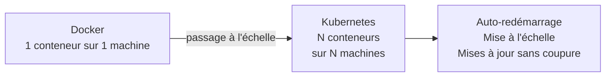
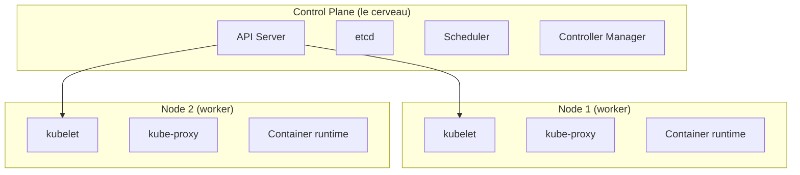
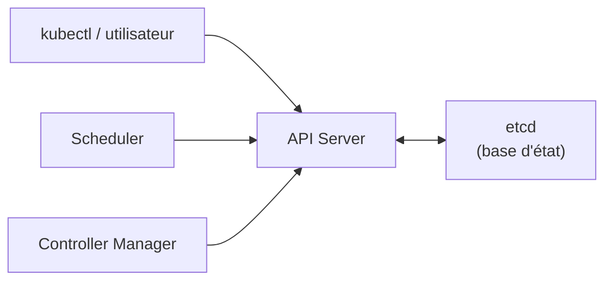
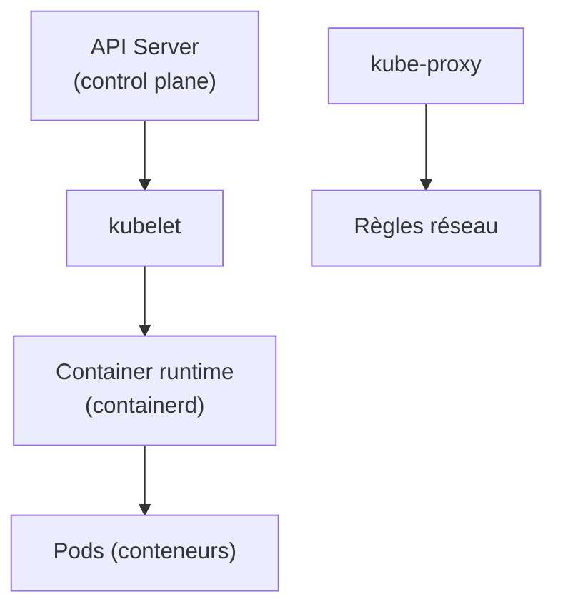
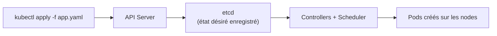
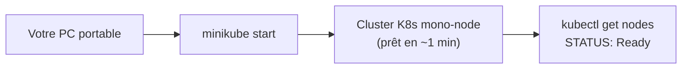
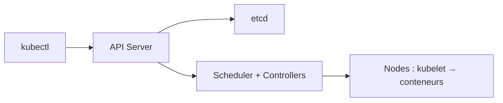

<a id="top"></a>

# 01 — Architecture de Kubernetes

## Table des matières

| # | Section |
|---|---|
| 1 | [Pourquoi Kubernetes ?](#section-1) |
| 2 | [Vue d'ensemble : control plane et nodes](#section-2) |
| 3 | [Le control plane en détail](#section-3) |
| 4 | [Les nodes (workers) en détail](#section-4) |
| 5 | [kubectl : l'outil de pilotage](#section-5) |
| 6 | [Un cluster local : minikube et kind](#section-6) |
| 7 | [Quiz — Architecture de Kubernetes](#section-7) |
| 8 | [Pratique — Démarrer un cluster local](#section-8) |
| 9 | [Synthèse](#section-9) |

---

<a id="section-1"></a>

<details>
<summary>1 — Pourquoi Kubernetes ?</summary>

<br/>

Docker permet d'empaqueter une application dans un **conteneur**. Mais en production, un seul conteneur ne suffit pas : il faut en lancer **plusieurs répliques**, les **redémarrer** quand ils plantent, les **répartir** sur plusieurs machines, et **mettre à jour** sans coupure. Faire tout cela à la main est impossible à grande échelle.

**Kubernetes** (souvent abrégé **K8s** — « K », 8 lettres, « s ») est un **orchestrateur de conteneurs** : il automatise le déploiement, la mise à l'échelle et la résilience des applications conteneurisées.



| Problème en production | Réponse de Kubernetes |
|---|---|
| Un conteneur plante | Le redémarre automatiquement (self-healing) |
| Trop de trafic | Augmente le nombre de répliques (scaling) |
| Une machine tombe | Replanifie les conteneurs ailleurs |
| Nouvelle version à livrer | Rolling update sans interruption |
| Trouver les conteneurs entre eux | Découverte de services intégrée |

> _Analogie : Docker fabrique les boîtes (conteneurs) ; Kubernetes est le **chef d'orchestre** qui décide combien de boîtes ouvrir, où les poser, et que faire quand l'une se casse._

</details>

<p align="right"><a href="#top">↑ Retour en haut</a></p>

---

<a id="section-2"></a>

<details>
<summary>2 — Vue d'ensemble : control plane et nodes</summary>

<br/>

Un **cluster** Kubernetes se divise en deux grandes parties :

- le **control plane** (plan de contrôle) : le « cerveau » qui décide ;
- les **nodes** (nœuds de travail) : les « bras » qui exécutent réellement les conteneurs.



| Partie | Rôle | Composants principaux |
|---|---|---|
| **Control plane** | Décide *quoi* faire et *où* | API server, etcd, scheduler, controller-manager |
| **Nodes** | Exécutent les conteneurs | kubelet, kube-proxy, container runtime |

> _Le control plane ne lance jamais lui-même vos conteneurs : il donne les ordres. Ce sont les nodes qui font le travail concret._

</details>

<p align="right"><a href="#top">↑ Retour en haut</a></p>

---

<a id="section-3"></a>

<details>
<summary>3 — Le control plane en détail</summary>

<br/>

Le control plane regroupe quatre composants clés.



| Composant | Rôle |
|---|---|
| **API server** (`kube-apiserver`) | Porte d'entrée du cluster. Toutes les commandes passent par lui (REST). |
| **etcd** | Base de données clé-valeur qui stocke **l'état complet** du cluster. |
| **Scheduler** (`kube-scheduler`) | Décide **sur quel node** placer chaque nouveau Pod. |
| **Controller Manager** | Boucle de réconciliation : compare l'état désiré et l'état réel, agit pour les faire coïncider. |

**🔧 Mini-exercice —** Écris la commande qui affiche les informations générales du cluster (adresses du control plane et des services principaux).

<details>
<summary>✅ Voir une solution</summary>

```bash
kubectl cluster-info
```

</details>

Le principe central de Kubernetes est la **boucle de réconciliation** : vous déclarez un **état désiré** (ex. « 3 répliques »), et les controllers travaillent en continu pour que l'**état réel** corresponde.

```bash
# Toute commande kubectl parle à l'API server
kubectl get nodes
kubectl cluster-info
```

> _etcd est le « cœur » du cluster : si vous le perdez sans sauvegarde, vous perdez tout l'état. En production, on le sauvegarde régulièrement._

</details>

<p align="right"><a href="#top">↑ Retour en haut</a></p>

---

<a id="section-4"></a>

<details>
<summary>4 — Les nodes (workers) en détail</summary>

<br/>

Un **node** est une machine (physique ou virtuelle) qui fait tourner vos conteneurs. Chaque node embarque trois composants.



| Composant | Rôle |
|---|---|
| **kubelet** | Agent sur chaque node ; reçoit les ordres de l'API server et **démarre/surveille les Pods**. |
| **kube-proxy** | Gère les **règles réseau** pour router le trafic vers les bons Pods. |
| **Container runtime** | Logiciel qui **exécute réellement** les conteneurs (containerd, CRI-O). |

```bash
# Lister les nodes du cluster et leur état
kubectl get nodes -o wide

# Détailler un node précis
kubectl describe node minikube
```

**🔧 Mini-exercice —** Écris la commande qui liste les nodes du cluster avec leurs informations détaillées (IP interne, version, OS).

<details>
<summary>✅ Voir une solution</summary>

```bash
kubectl get nodes -o wide
```

</details>

> _Le kubelet est le « contremaître » de chaque machine : il ne décide pas du plan, mais il s'assure que les Pods qu'on lui a confiés tournent bien._

</details>

<p align="right"><a href="#top">↑ Retour en haut</a></p>

---

<a id="section-5"></a>

<details>
<summary>5 — kubectl : l'outil de pilotage</summary>

<br/>

**kubectl** (prononcé « cube-control » ou « cube-cuttle ») est l'outil en ligne de commande pour piloter un cluster. Il traduit vos commandes en appels REST vers l'API server.



| Commande | Effet |
|---|---|
| `kubectl get <ressource>` | Liste des ressources (pods, nodes, services…) |
| `kubectl describe <ressource> <nom>` | Détails et événements d'une ressource |
| `kubectl apply -f fichier.yaml` | Applique un manifeste (création/mise à jour) |
| `kubectl delete -f fichier.yaml` | Supprime les ressources du manifeste |
| `kubectl logs <pod>` | Affiche les logs d'un Pod |

```bash
# Vérifier la version du client et du cluster
kubectl version --short

# Voir le contexte courant (quel cluster on pilote)
kubectl config current-context
```

**🔧 Mini-exercice —** Écris la commande qui affiche les détails et les événements du node `minikube`.

<details>
<summary>✅ Voir une solution</summary>

```bash
kubectl describe node minikube
```

</details>

> _kubectl est **déclaratif** avec `apply` : vous décrivez l'état souhaité dans un fichier YAML, et Kubernetes se charge d'y arriver. C'est plus robuste que des commandes impératives une à une._

</details>

<p align="right"><a href="#top">↑ Retour en haut</a></p>

---

<a id="section-6"></a>

<details>
<summary>6 — Un cluster local : minikube et kind</summary>

<br/>

Pour apprendre, pas besoin de louer plusieurs serveurs : on installe un **cluster local** sur sa propre machine.

| Outil | Principe | Idéal pour |
|---|---|---|
| **minikube** | Lance un cluster mono-node dans une VM ou un conteneur | Débutants, démos |
| **kind** | *Kubernetes IN Docker* — chaque node est un conteneur Docker | Tests CI, multi-nodes léger |

```bash
# minikube : démarrer un cluster local
minikube start

# Vérifier que le node est prêt
kubectl get nodes

# Arrêter / supprimer le cluster
minikube stop
minikube delete
```

```bash
# kind : créer un cluster dans Docker
kind create cluster --name demo

# Lister les clusters kind
kind get clusters
```

**🔧 Mini-exercice —** Écris les deux commandes qui arrêtent puis suppriment complètement un cluster minikube local.

<details>
<summary>✅ Voir une solution</summary>

```bash
minikube stop
minikube delete
```

</details>



> _Un cluster local se comporte exactement comme un vrai cluster de production : les manifestes YAML que vous écrivez ici fonctionneront aussi sur le cloud (EKS, GKE, AKS)._

</details>

<p align="right"><a href="#top">↑ Retour en haut</a></p>

---

<a id="section-7"></a>

<details>
<summary>7 — Quiz — Architecture de Kubernetes</summary>

<br/>

**Question 1 :** Quel composant stocke l'état complet du cluster ?

a) kubelet

b) etcd

c) kube-proxy

d) scheduler

<details>
<summary>💡 Voir la solution</summary>

✅ **Réponse : b)** — `etcd` est la base de données clé-valeur qui conserve tout l'état du cluster. La perdre sans sauvegarde revient à perdre le cluster.

</details>

---

**Question 2 :** Quel composant décide sur quel node placer un nouveau Pod ?

a) Le scheduler

b) Le kubelet

c) etcd

d) kube-proxy

<details>
<summary>💡 Voir la solution</summary>

✅ **Réponse : a)** — Le `scheduler` choisit le node le plus adapté pour chaque nouveau Pod (ressources disponibles, contraintes…).

</details>

---

**Question 3 :** Où s'exécutent réellement les conteneurs ?

a) Dans le control plane

b) Dans etcd

c) Sur les nodes (workers)

d) Dans kubectl

<details>
<summary>💡 Voir la solution</summary>

✅ **Réponse : c)** — Le control plane décide, mais les conteneurs tournent sur les **nodes**, via le container runtime piloté par le kubelet.

</details>

---

**Question 4 :** À quoi sert kubectl ?

a) À exécuter les conteneurs directement

b) À piloter le cluster en envoyant des commandes à l'API server

c) À remplacer etcd

d) À stocker l'état du cluster

<details>
<summary>💡 Voir la solution</summary>

✅ **Réponse : b)** — `kubectl` traduit vos commandes en appels REST vers l'**API server**, la porte d'entrée du cluster.

</details>

---

**Question 5 :** Quel outil lance un cluster Kubernetes local en quelques minutes ?

a) `git init`

b) `docker build`

c) `minikube start`

d) `kubectl logs`

<details>
<summary>💡 Voir la solution</summary>

✅ **Réponse : c)** — `minikube start` (ou `kind create cluster`) crée un cluster local pour apprendre et tester.

</details>

</details>

<p align="right"><a href="#top">↑ Retour en haut</a></p>

---

<a id="section-8"></a>

<details>
<summary>8 — Pratique — Démarrer un cluster local</summary>

<br/>

### Consigne

Démarrez un cluster Kubernetes local avec minikube, vérifiez que le node est prêt, puis explorez les composants du control plane.

---

### Correction — Commandes attendues

```bash
# 1. Démarrer le cluster local
minikube start

# 2. Vérifier que le node est prêt
kubectl get nodes

# 3. Voir les informations générales du cluster
kubectl cluster-info

# 4. Lister les Pods système du control plane
kubectl get pods -n kube-system

# 5. Détailler le node
kubectl describe node minikube
```

**Résultat attendu (étape 2) :**

```
NAME       STATUS   ROLES           AGE   VERSION
minikube   Ready    control-plane   90s   v1.30.0
```

**Résultat attendu (étape 4, extrait) :**

```
NAME                               READY   STATUS    RESTARTS   AGE
etcd-minikube                      1/1     Running   0          85s
kube-apiserver-minikube            1/1     Running   0          85s
kube-scheduler-minikube            1/1     Running   0          85s
kube-controller-manager-minikube   1/1     Running   0          85s
```

> _Le statut `Ready` du node et les Pods `Running` dans `kube-system` confirment que votre control plane fonctionne et que le cluster est prêt à recevoir vos applications._

</details>

<p align="right"><a href="#top">↑ Retour en haut</a></p>

---

<a id="section-9"></a>

<details>
<summary>9 — Synthèse</summary>

<br/>

#### Points à retenir

1. **Kubernetes (K8s)** orchestre les conteneurs : mise à l'échelle, auto-réparation, mises à jour sans coupure.
2. Un cluster = **control plane** (cerveau) + **nodes** (bras).
3. **Control plane** : API server (entrée), etcd (état), scheduler (placement), controller-manager (réconciliation).
4. **Nodes** : kubelet (agent), kube-proxy (réseau), container runtime (exécution).
5. **kubectl** pilote le cluster via l'API server ; **minikube/kind** créent un cluster local.



#### La suite

Leçon **02 — Les Pods** : la plus petite unité déployable de Kubernetes, son manifeste YAML et son cycle de vie.

</details>

<p align="right"><a href="#top">↑ Retour en haut</a></p>

---

<p align="center">
  <em>Tous droits réservés. Toute reproduction, diffusion, utilisation ou adaptation de ce cours, en tout ou en partie, est strictement interdite sans l'autorisation écrite préalable de Dr. Haythem REHOUMA.</em>
</p>

<p align="center">
  <strong>Cours créé par Dr. Haythem REHOUMA — Développement et déploiement de solutions de données</strong>
</p>
