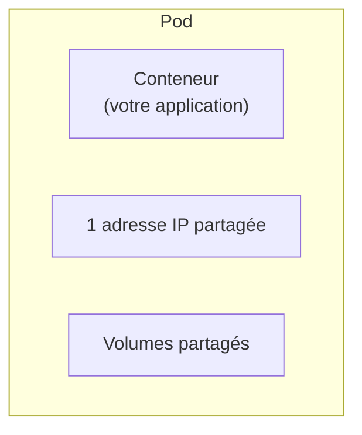
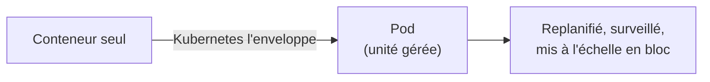
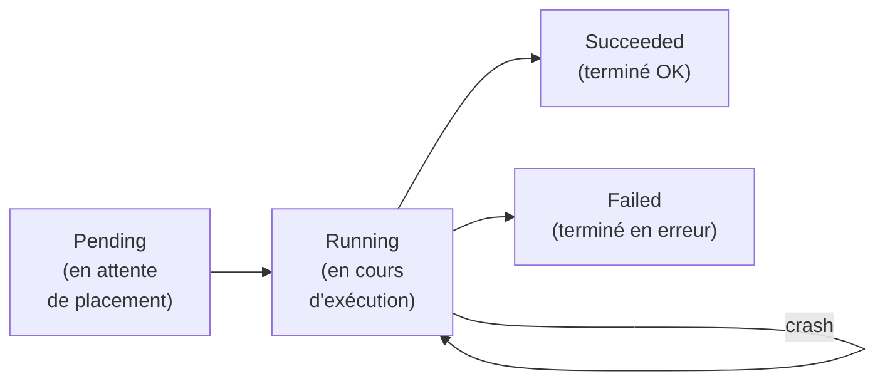
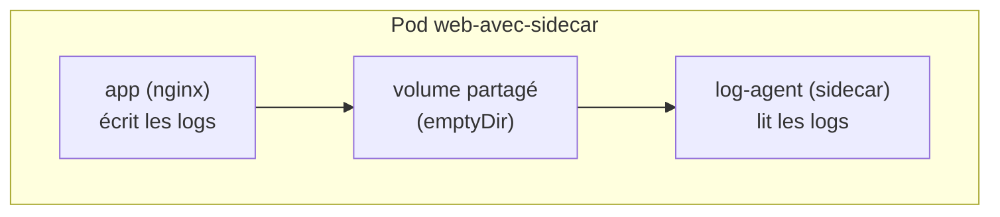
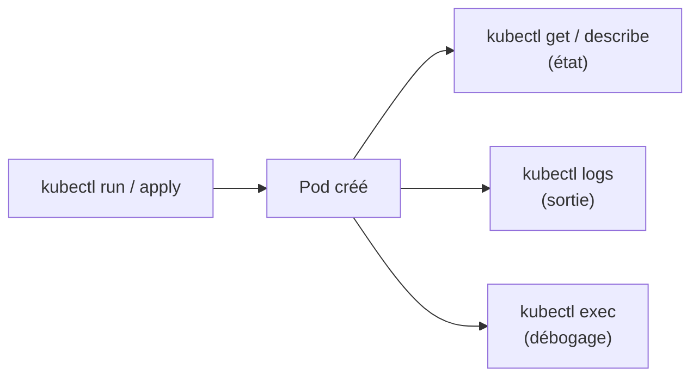
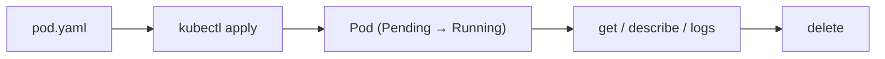

<a id="top"></a>

# 02 — Les Pods

## Table des matières

| # | Section |
|---|---|
| 1 | [Qu'est-ce qu'un Pod ?](#section-1) |
| 2 | [Pourquoi le Pod et non le conteneur ?](#section-2) |
| 3 | [Le manifeste YAML d'un Pod](#section-3) |
| 4 | [Le cycle de vie d'un Pod](#section-4) |
| 5 | [Les Pods multi-conteneurs](#section-5) |
| 6 | [Piloter les Pods avec kubectl](#section-6) |
| 7 | [Quiz — Les Pods](#section-7) |
| 8 | [Pratique — Créer et inspecter un Pod](#section-8) |
| 9 | [Synthèse](#section-9) |

---

<a id="section-1"></a>

<details>
<summary>1 — Qu'est-ce qu'un Pod ?</summary>

<br/>

Le **Pod** est la **plus petite unité déployable** de Kubernetes. On ne déploie jamais un conteneur directement : on déploie un Pod, qui **enveloppe** un (ou plusieurs) conteneur(s).



Tous les conteneurs d'un même Pod partagent :

| Ressource partagée | Conséquence |
|---|---|
| **Une adresse IP** | Les conteneurs se parlent via `localhost` |
| **L'espace réseau** | Mêmes ports visibles entre eux |
| **Les volumes** | Fichiers accessibles par tous les conteneurs du Pod |

> _Analogie : un Pod est comme un **appartement partagé**. Les colocataires (conteneurs) ont la même adresse postale (IP), la même cuisine (volumes), et se parlent directement de pièce à pièce (localhost)._

</details>

<p align="right"><a href="#top">↑ Retour en haut</a></p>

---

<a id="section-2"></a>

<details>
<summary>2 — Pourquoi le Pod et non le conteneur ?</summary>

<br/>

Kubernetes ne gère pas les conteneurs un par un, mais des **Pods**, pour une raison simple : certains conteneurs doivent **vivre ensemble** (mémoire, réseau, fichiers communs).



| Sans Pod | Avec Pod |
|---|---|
| Conteneurs isolés, réseau séparé | Réseau et volumes partagés |
| Difficile de coupler des processus liés | Couplage naturel dans un même Pod |
| Pas d'unité standard à orchestrer | Une unité unique à planifier |

> _Un Pod est **éphémère** : s'il meurt, Kubernetes n'essaie pas de le ressusciter à l'identique — il en crée un nouveau (avec une nouvelle IP). C'est pourquoi on utilise rarement des Pods seuls en production (voir leçon 03)._

</details>

<p align="right"><a href="#top">↑ Retour en haut</a></p>

---

<a id="section-3"></a>

<details>
<summary>3 — Le manifeste YAML d'un Pod</summary>

<br/>

On décrit un Pod dans un fichier **YAML** déclaratif. Voici un Pod exécutant un serveur web Nginx :

```yaml
apiVersion: v1
kind: Pod
metadata:
  name: mon-nginx
  labels:
    app: web
spec:
  containers:
    - name: nginx
      image: nginx:1.27
      ports:
        - containerPort: 80
```

| Champ | Rôle |
|---|---|
| `apiVersion` | Version de l'API Kubernetes (`v1` pour les Pods) |
| `kind` | Type de ressource (`Pod`) |
| `metadata.name` | Nom unique du Pod |
| `metadata.labels` | Étiquettes (clé/valeur) pour sélectionner le Pod plus tard |
| `spec.containers` | Liste des conteneurs et leurs images |
| `containerPort` | Port exposé par le conteneur |

```bash
# Appliquer le manifeste
kubectl apply -f pod.yaml

# Vérifier la création
kubectl get pods
```

**🔧 Mini-exercice —** Modifie le manifeste ci-dessus pour que le conteneur Nginx utilise l'image `nginx:1.25` au lieu de `nginx:1.27`.

<details>
<summary>✅ Voir une solution</summary>

```yaml
spec:
  containers:
    - name: nginx
      image: nginx:1.25
      ports:
        - containerPort: 80
```

</details>

> _Les **labels** (`app: web`) sont essentiels : ce sont eux que les Deployments et Services utiliseront pour retrouver leurs Pods (leçons 03 et 04)._

</details>

<p align="right"><a href="#top">↑ Retour en haut</a></p>

---

<a id="section-4"></a>

<details>
<summary>4 — Le cycle de vie d'un Pod</summary>

<br/>

Un Pod passe par plusieurs **phases** entre sa création et sa fin.



| Phase | Signification |
|---|---|
| **Pending** | Accepté par le cluster, en attente d'un node / d'une image |
| **Running** | Le Pod est placé et au moins un conteneur tourne |
| **Succeeded** | Tous les conteneurs se sont terminés avec succès |
| **Failed** | Au moins un conteneur s'est terminé en erreur |
| **Unknown** | L'état du Pod n'a pas pu être obtenu |

```bash
# Voir la phase et les redémarrages
kubectl get pod mon-nginx

# Inspecter les événements (utile si Pending bloqué)
kubectl describe pod mon-nginx
```

**🔧 Mini-exercice —** Écris la commande qui affiche uniquement la phase d'un Pod nommé `mon-nginx` ainsi que son nombre de redémarrages.

<details>
<summary>✅ Voir une solution</summary>

```bash
kubectl get pod mon-nginx
```

La colonne `STATUS` donne la phase (ex. `Running`) et `RESTARTS` le nombre de redémarrages.

</details>

> _Si un Pod reste en **Pending**, `kubectl describe` révèle presque toujours la cause dans la section Events : image introuvable, ressources insuffisantes, etc._

</details>

<p align="right"><a href="#top">↑ Retour en haut</a></p>

---

<a id="section-5"></a>

<details>
<summary>5 — Les Pods multi-conteneurs</summary>

<br/>

Un Pod peut contenir **plusieurs conteneurs** qui collaborent étroitement. Le motif le plus connu est le **sidecar** : un conteneur secondaire qui assiste le conteneur principal.

```yaml
apiVersion: v1
kind: Pod
metadata:
  name: web-avec-sidecar
spec:
  containers:
    - name: app
      image: nginx:1.27
      ports:
        - containerPort: 80
    - name: log-agent
      image: busybox:1.36
      command: ["sh", "-c", "tail -f /var/log/nginx/access.log"]
      volumeMounts:
        - name: logs
          mountPath: /var/log/nginx
  volumes:
    - name: logs
      emptyDir: {}
```



| Motif | Rôle du conteneur secondaire |
|---|---|
| **Sidecar** | Ajoute une fonction (logs, proxy, sync) au conteneur principal |
| **Init container** | Tâche de préparation qui s'exécute *avant* le conteneur principal |

**🔧 Mini-exercice —** Le Pod `web-avec-sidecar` ci-dessus contient deux conteneurs. Écris la commande qui affiche les logs du conteneur `log-agent` (et non du conteneur principal).

<details>
<summary>✅ Voir une solution</summary>

```bash
kubectl logs web-avec-sidecar -c log-agent
```

L'option `-c` sélectionne le conteneur ciblé dans un Pod multi-conteneurs.

</details>

> _Règle d'or : un Pod multi-conteneurs ne se justifie que si les conteneurs sont **fortement couplés** (volume/réseau partagés). Sinon, mettez-les dans des Pods séparés._

</details>

<p align="right"><a href="#top">↑ Retour en haut</a></p>

---

<a id="section-6"></a>

<details>
<summary>6 — Piloter les Pods avec kubectl</summary>

<br/>

Quelques commandes incontournables pour le quotidien.

```bash
# Créer un Pod rapidement (mode impératif)
kubectl run mon-nginx --image=nginx:1.27 --port=80

# Lister les Pods (avec node et IP)
kubectl get pods -o wide

# Détails complets + événements
kubectl describe pod mon-nginx

# Voir les logs du conteneur
kubectl logs mon-nginx

# Ouvrir un shell dans le conteneur
kubectl exec -it mon-nginx -- /bin/sh

# Supprimer un Pod
kubectl delete pod mon-nginx
```

| Commande | Quand l'utiliser |
|---|---|
| `kubectl run` | Test rapide d'une image |
| `kubectl get pods` | Vue d'ensemble de l'état |
| `kubectl describe` | Diagnostiquer un Pod qui ne démarre pas |
| `kubectl logs` | Lire la sortie de l'application |
| `kubectl exec -it` | Déboguer en entrant dans le conteneur |

**🔧 Mini-exercice —** Écris la commande qui ouvre un shell interactif `/bin/sh` à l'intérieur du Pod `mon-nginx` pour le déboguer.

<details>
<summary>✅ Voir une solution</summary>

```bash
kubectl exec -it mon-nginx -- /bin/sh
```

</details>



> _Pour le débogage, le trio gagnant est : `get` (état rapide) → `describe` (événements) → `logs` (erreurs applicatives)._

</details>

<p align="right"><a href="#top">↑ Retour en haut</a></p>

---

<a id="section-7"></a>

<details>
<summary>7 — Quiz — Les Pods</summary>

<br/>

**Question 1 :** Quelle est la plus petite unité déployable de Kubernetes ?

a) Le conteneur

b) Le Pod

c) Le node

d) Le cluster

<details>
<summary>💡 Voir la solution</summary>

✅ **Réponse : b)** — Le **Pod** est la plus petite unité déployable ; il enveloppe un ou plusieurs conteneurs.

</details>

---

**Question 2 :** Que partagent les conteneurs d'un même Pod ?

a) Rien

b) Une IP, l'espace réseau et les volumes

c) Le même disque dur physique uniquement

d) Le même nom

<details>
<summary>💡 Voir la solution</summary>

✅ **Réponse : b)** — Les conteneurs d'un Pod partagent une **adresse IP**, l'**espace réseau** (localhost) et des **volumes**.

</details>

---

**Question 3 :** Que signifie la phase `Pending` ?

a) Le Pod est terminé avec succès

b) Le Pod tourne normalement

c) Le Pod est accepté mais pas encore placé/démarré

d) Le Pod a été supprimé

<details>
<summary>💡 Voir la solution</summary>

✅ **Réponse : c)** — `Pending` indique que le Pod attend un node, une image ou des ressources. `kubectl describe` en donne la raison.

</details>

---

**Question 4 :** Quelle commande affiche les logs d'un Pod ?

a) `kubectl get pods`

b) `kubectl logs <pod>`

c) `kubectl run <pod>`

d) `kubectl delete <pod>`

<details>
<summary>💡 Voir la solution</summary>

✅ **Réponse : b)** — `kubectl logs <pod>` affiche la sortie du conteneur, idéale pour diagnostiquer les erreurs applicatives.

</details>

---

**Question 5 :** Quand un Pod multi-conteneurs est-il justifié ?

a) Toujours, c'est obligatoire

b) Jamais

c) Quand les conteneurs sont fortement couplés (volume/réseau partagés)

d) Pour gagner de la place sur le disque

<details>
<summary>💡 Voir la solution</summary>

✅ **Réponse : c)** — On regroupe des conteneurs dans un même Pod uniquement s'ils sont **fortement couplés** (motif sidecar, par exemple).

</details>

</details>

<p align="right"><a href="#top">↑ Retour en haut</a></p>

---

<a id="section-8"></a>

<details>
<summary>8 — Pratique — Créer et inspecter un Pod</summary>

<br/>

### Consigne

Créez un Pod Nginx à partir d'un manifeste YAML, vérifiez son état, lisez ses logs, puis supprimez-le proprement.

---

### Correction — Manifeste et commandes attendus

Fichier `pod.yaml` :

```yaml
apiVersion: v1
kind: Pod
metadata:
  name: tp-nginx
  labels:
    app: web
spec:
  containers:
    - name: nginx
      image: nginx:1.27
      ports:
        - containerPort: 80
```

Commandes :

```bash
# 1. Créer le Pod
kubectl apply -f pod.yaml

# 2. Vérifier l'état
kubectl get pods

# 3. Détails et événements
kubectl describe pod tp-nginx

# 4. Lire les logs
kubectl logs tp-nginx

# 5. Supprimer
kubectl delete -f pod.yaml
```

**Résultat attendu (étape 2) :**

```
NAME       READY   STATUS    RESTARTS   AGE
tp-nginx   1/1     Running   0          12s
```

> _Le `1/1` signifie « 1 conteneur prêt sur 1 attendu ». Si vous voyez `0/1` avec `STATUS: ImagePullBackOff`, c'est que l'image n'a pas pu être téléchargée — vérifiez son nom._

</details>

<p align="right"><a href="#top">↑ Retour en haut</a></p>

---

<a id="section-9"></a>

<details>
<summary>9 — Synthèse</summary>

<br/>

#### Points à retenir

1. Le **Pod** est la plus petite unité déployable ; il enveloppe un ou plusieurs conteneurs.
2. Les conteneurs d'un Pod partagent **IP, réseau et volumes** (communication via `localhost`).
3. Le manifeste YAML décrit le Pod (`apiVersion`, `kind`, `metadata`, `spec`) ; les **labels** servent à le retrouver.
4. Cycle de vie : **Pending → Running → Succeeded/Failed** ; les Pods sont **éphémères**.
5. **kubectl** : `run`, `get`, `describe`, `logs`, `exec`, `delete` pour piloter et déboguer.



#### La suite

Leçon **03 — Les Deployments** : gérer des répliques de Pods, les mettre à l'échelle et les mettre à jour sans coupure.

</details>

<p align="right"><a href="#top">↑ Retour en haut</a></p>

---

<p align="center">
  <em>Tous droits réservés. Toute reproduction, diffusion, utilisation ou adaptation de ce cours, en tout ou en partie, est strictement interdite sans l'autorisation écrite préalable de Dr. Haythem REHOUMA.</em>
</p>

<p align="center">
  <strong>Cours créé par Dr. Haythem REHOUMA — Développement et déploiement de solutions de données</strong>
</p>
