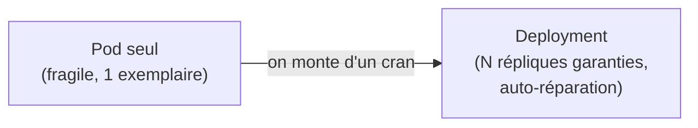
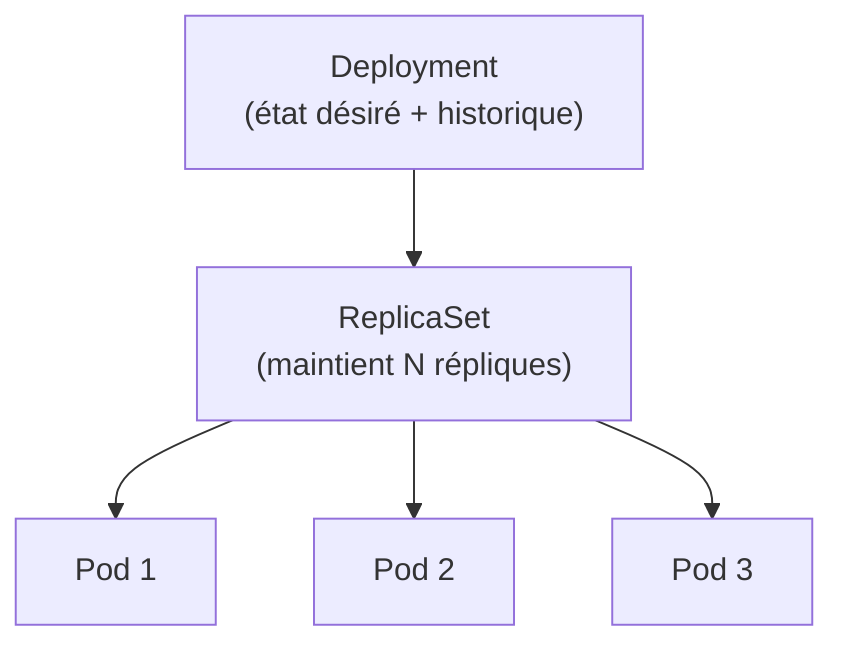
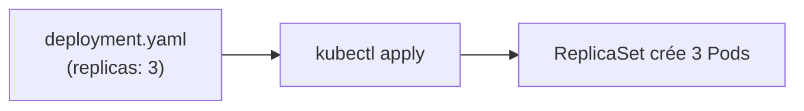
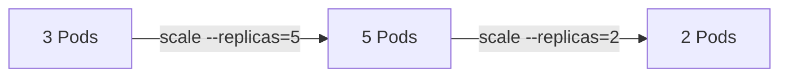
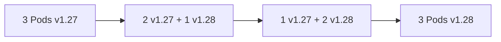
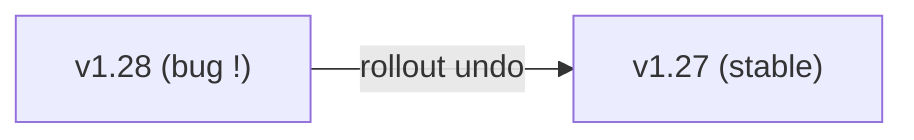
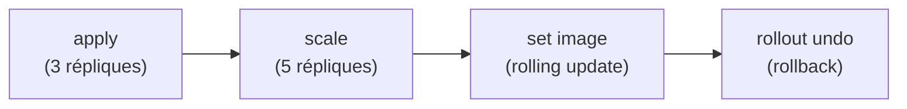

<a id="top"></a>

# 03 — Les Deployments

## Table des matières

| # | Section |
|---|---|
| 1 | [Pourquoi un Deployment ?](#section-1) |
| 2 | [Deployment, ReplicaSet et Pods](#section-2) |
| 3 | [Le manifeste YAML d'un Deployment](#section-3) |
| 4 | [Mettre à l'échelle (scaling)](#section-4) |
| 5 | [Les mises à jour progressives (rolling updates)](#section-5) |
| 6 | [Revenir en arrière (rollback)](#section-6) |
| 7 | [Quiz — Les Deployments](#section-7) |
| 8 | [Pratique — Déployer, scaler, mettre à jour](#section-8) |
| 9 | [Synthèse](#section-9) |

---

<a id="section-1"></a>

<details>
<summary>1 — Pourquoi un Deployment ?</summary>

<br/>

Un Pod seul est **fragile** : s'il meurt, il n'est pas recréé, et il n'existe qu'en un seul exemplaire. En production, on veut **plusieurs répliques** maintenues en permanence et recréées automatiquement. C'est le rôle du **Deployment**.



| Pod seul | Deployment |
|---|---|
| Pas recréé s'il meurt | Recréé automatiquement |
| Un seul exemplaire | N répliques maintenues |
| Pas de mise à jour gérée | Rolling updates intégrées |
| Pas de retour arrière | Rollback en une commande |

> _Le Deployment est l'objet que vous utiliserez **par défaut** pour faire tourner une application sans état (stateless) sur Kubernetes._

</details>

<p align="right"><a href="#top">↑ Retour en haut</a></p>

---

<a id="section-2"></a>

<details>
<summary>2 — Deployment, ReplicaSet et Pods</summary>

<br/>

Le Deployment ne gère pas les Pods directement : il pilote un **ReplicaSet**, qui lui maintient le bon nombre de Pods.



| Objet | Responsabilité |
|---|---|
| **Deployment** | Décrit l'état désiré et gère les mises à jour / rollbacks |
| **ReplicaSet** | Garantit qu'il y a **exactement N** Pods identiques |
| **Pod** | Exécute réellement les conteneurs |

À chaque mise à jour d'image, le Deployment crée un **nouveau ReplicaSet** et fait migrer les Pods de l'ancien vers le nouveau — c'est ce qui rend le rollback possible.

```bash
# Voir la chaîne Deployment → ReplicaSet → Pods
kubectl get deployments
kubectl get replicasets
kubectl get pods
```

**🔧 Mini-exercice —** Écris la commande qui liste les ReplicaSets du namespace courant pour vérifier celui créé par ton Deployment.

<details>
<summary>✅ Voir une solution</summary>

```bash
kubectl get replicasets
```

(`kubectl get rs` est l'abréviation équivalente.)

</details>

> _Vous n'écrivez quasiment jamais de ReplicaSet à la main : c'est le Deployment qui les crée et les gère pour vous._

</details>

<p align="right"><a href="#top">↑ Retour en haut</a></p>

---

<a id="section-3"></a>

<details>
<summary>3 — Le manifeste YAML d'un Deployment</summary>

<br/>

```yaml
apiVersion: apps/v1
kind: Deployment
metadata:
  name: web-deploy
spec:
  replicas: 3
  selector:
    matchLabels:
      app: web
  template:
    metadata:
      labels:
        app: web
    spec:
      containers:
        - name: nginx
          image: nginx:1.27
          ports:
            - containerPort: 80
```

| Champ | Rôle |
|---|---|
| `apiVersion: apps/v1` | API des Deployments |
| `spec.replicas` | Nombre de Pods souhaités |
| `spec.selector.matchLabels` | Quels Pods ce Deployment gère |
| `spec.template` | Le **modèle de Pod** à reproduire |
| `template.metadata.labels` | Labels appliqués à chaque Pod (doivent matcher le selector) |

```bash
# Appliquer le Deployment
kubectl apply -f deployment.yaml

# Suivre le déploiement
kubectl rollout status deployment/web-deploy
```

**🔧 Mini-exercice —** Dans le manifeste ci-dessus, modifie le champ qui fixe le nombre de répliques pour en demander **4** au lieu de 3.

<details>
<summary>✅ Voir une solution</summary>

```yaml
spec:
  replicas: 4
```

</details>



> _⚠️ Le `selector.matchLabels` **doit** correspondre aux `template.labels`, sinon le Deployment refuse de gérer ses propres Pods. C'est l'erreur de débutant la plus fréquente._

</details>

<p align="right"><a href="#top">↑ Retour en haut</a></p>

---

<a id="section-4"></a>

<details>
<summary>4 — Mettre à l'échelle (scaling)</summary>

<br/>

Augmenter ou diminuer le nombre de répliques se fait en une commande, ou en modifiant le YAML.

```bash
# Scaler à 5 répliques (impératif)
kubectl scale deployment web-deploy --replicas=5

# Vérifier
kubectl get pods -l app=web
```



| Approche | Commande | Avantage |
|---|---|---|
| **Impérative** | `kubectl scale ... --replicas=5` | Rapide, ponctuel |
| **Déclarative** | Modifier `replicas:` puis `kubectl apply` | Traçable dans Git |

Pour une mise à l'échelle **automatique** selon la charge CPU, on utilise un HPA (HorizontalPodAutoscaler) :

```bash
# Auto-scaling entre 2 et 10 Pods selon le CPU
kubectl autoscale deployment web-deploy --min=2 --max=10 --cpu-percent=70
```

**🔧 Mini-exercice —** Écris la commande impérative qui augmente le nombre de répliques du Deployment `web-deploy` à **3**.

<details>
<summary>✅ Voir une solution</summary>

```bash
kubectl scale deployment web-deploy --replicas=3
```

</details>

> _En contexte GitOps, préférez la méthode **déclarative** : modifier le YAML et le committer garde l'historique et évite la dérive entre Git et le cluster._

</details>

<p align="right"><a href="#top">↑ Retour en haut</a></p>

---

<a id="section-5"></a>

<details>
<summary>5 — Les mises à jour progressives (rolling updates)</summary>

<br/>

Changer la version de l'image déclenche une **rolling update** : Kubernetes remplace les Pods **progressivement**, sans coupure de service.



```bash
# Mettre à jour l'image
kubectl set image deployment/web-deploy nginx=nginx:1.28

# Suivre la progression
kubectl rollout status deployment/web-deploy
```

| Paramètre (`strategy`) | Effet |
|---|---|
| `maxUnavailable` | Combien de Pods peuvent être indisponibles pendant la MAJ |
| `maxSurge` | Combien de Pods en plus on peut créer temporairement |

```yaml
spec:
  strategy:
    type: RollingUpdate
    rollingUpdate:
      maxUnavailable: 1
      maxSurge: 1
```

> _Pendant une rolling update, l'ancienne et la nouvelle version coexistent quelques instants. Assurez-vous que votre application sait gérer cette transition (compatibilité des versions)._

</details>

<p align="right"><a href="#top">↑ Retour en haut</a></p>

---

<a id="section-6"></a>

<details>
<summary>6 — Revenir en arrière (rollback)</summary>

<br/>

Si une nouvelle version pose problème, on **revient à la précédente** en une commande, grâce à l'historique des ReplicaSets.

```bash
# Voir l'historique des révisions
kubectl rollout history deployment/web-deploy

# Revenir à la révision précédente
kubectl rollout undo deployment/web-deploy

# Revenir à une révision précise
kubectl rollout undo deployment/web-deploy --to-revision=2
```

**🔧 Mini-exercice —** Écris la commande qui affiche l'historique des révisions du Deployment `web-deploy`.

<details>
<summary>✅ Voir une solution</summary>

```bash
kubectl rollout history deployment/web-deploy
```

</details>



| Commande | Effet |
|---|---|
| `rollout history` | Liste des révisions |
| `rollout undo` | Revient à la révision précédente |
| `rollout undo --to-revision=N` | Revient à une révision donnée |
| `rollout status` | État de la transition en cours |

> _Le rollback est quasi instantané car l'ancien ReplicaSet existe encore (scalé à 0). Kubernetes le re-scale simplement à la place du nouveau._

</details>

<p align="right"><a href="#top">↑ Retour en haut</a></p>

---

<a id="section-7"></a>

<details>
<summary>7 — Quiz — Les Deployments</summary>

<br/>

**Question 1 :** Que gère directement un Deployment ?

a) Les Pods un par un

b) Un ReplicaSet

c) Les nodes

d) etcd

<details>
<summary>💡 Voir la solution</summary>

✅ **Réponse : b)** — Le Deployment pilote un **ReplicaSet**, qui lui maintient le bon nombre de Pods.

</details>

---

**Question 2 :** Quelle commande passe un Deployment à 5 répliques ?

a) `kubectl get pods --replicas=5`

b) `kubectl scale deployment web-deploy --replicas=5`

c) `kubectl run web-deploy --replicas=5`

d) `kubectl logs web-deploy=5`

<details>
<summary>💡 Voir la solution</summary>

✅ **Réponse : b)** — `kubectl scale deployment <nom> --replicas=5` ajuste le nombre de répliques.

</details>

---

**Question 3 :** Qu'est-ce qu'une rolling update ?

a) Une suppression de tous les Pods d'un coup

b) Un remplacement progressif des Pods sans coupure

c) Un redémarrage du cluster

d) Une sauvegarde d'etcd

<details>
<summary>💡 Voir la solution</summary>

✅ **Réponse : b)** — La rolling update remplace les Pods **progressivement**, garantissant la continuité de service.

</details>

---

**Question 4 :** Comment revenir à la version précédente d'un Deployment ?

a) `kubectl delete deployment`

b) `kubectl rollout undo deployment/web-deploy`

c) `kubectl get rollback`

d) `kubectl scale --replicas=0`

<details>
<summary>💡 Voir la solution</summary>

✅ **Réponse : b)** — `kubectl rollout undo` revient à la révision précédente grâce à l'historique des ReplicaSets.

</details>

---

**Question 5 :** Que doit respecter le `selector.matchLabels` d'un Deployment ?

a) Rien de particulier

b) Il doit correspondre aux labels du `template`

c) Il doit être vide

d) Il doit être différent des labels des Pods

<details>
<summary>💡 Voir la solution</summary>

✅ **Réponse : b)** — Le `selector` doit **matcher** les labels du `template`, sinon le Deployment ne reconnaît pas ses Pods.

</details>

</details>

<p align="right"><a href="#top">↑ Retour en haut</a></p>

---

<a id="section-8"></a>

<details>
<summary>8 — Pratique — Déployer, scaler, mettre à jour</summary>

<br/>

### Consigne

Créez un Deployment Nginx avec 3 répliques, scalez-le à 5, mettez à jour son image, puis effectuez un rollback.

---

### Correction — Manifeste et commandes attendus

Fichier `deployment.yaml` :

```yaml
apiVersion: apps/v1
kind: Deployment
metadata:
  name: web-deploy
spec:
  replicas: 3
  selector:
    matchLabels:
      app: web
  template:
    metadata:
      labels:
        app: web
    spec:
      containers:
        - name: nginx
          image: nginx:1.27
          ports:
            - containerPort: 80
```

Commandes :

```bash
# 1. Créer le Deployment
kubectl apply -f deployment.yaml

# 2. Vérifier les 3 Pods
kubectl get pods -l app=web

# 3. Scaler à 5
kubectl scale deployment web-deploy --replicas=5

# 4. Mettre à jour l'image
kubectl set image deployment/web-deploy nginx=nginx:1.28
kubectl rollout status deployment/web-deploy

# 5. Rollback
kubectl rollout undo deployment/web-deploy
```

**Résultat attendu (étape 2) :**

```
NAME                          READY   STATUS    RESTARTS   AGE
web-deploy-7c9f8b5d4-2xk9p    1/1     Running   0          15s
web-deploy-7c9f8b5d4-8mq2r    1/1     Running   0          15s
web-deploy-7c9f8b5d4-h4n7t    1/1     Running   0          15s
```

> _Après l'étape 3, vous devez compter **5** Pods. Après le rollback (étape 5), l'image revient à `nginx:1.27` — vérifiez avec `kubectl describe deployment web-deploy | grep Image`._

</details>

<p align="right"><a href="#top">↑ Retour en haut</a></p>

---

<a id="section-9"></a>

<details>
<summary>9 — Synthèse</summary>

<br/>

#### Points à retenir

1. Le **Deployment** maintient N répliques d'un Pod et les recrée automatiquement.
2. Chaîne de gestion : **Deployment → ReplicaSet → Pods**.
3. `selector.matchLabels` doit **correspondre** aux labels du `template`.
4. **Scaling** : `kubectl scale --replicas=N` (ou modifier le YAML).
5. **Rolling update** (`set image`) sans coupure, **rollback** (`rollout undo`) en une commande.



#### La suite

Leçon **04 — Les Services** : exposer vos Deployments et permettre la découverte de services entre Pods.

</details>

<p align="right"><a href="#top">↑ Retour en haut</a></p>

---

<p align="center">
  <em>Tous droits réservés. Toute reproduction, diffusion, utilisation ou adaptation de ce cours, en tout ou en partie, est strictement interdite sans l'autorisation écrite préalable de Dr. Haythem REHOUMA.</em>
</p>

<p align="center">
  <strong>Cours créé par Dr. Haythem REHOUMA — Développement et déploiement de solutions de données</strong>
</p>
