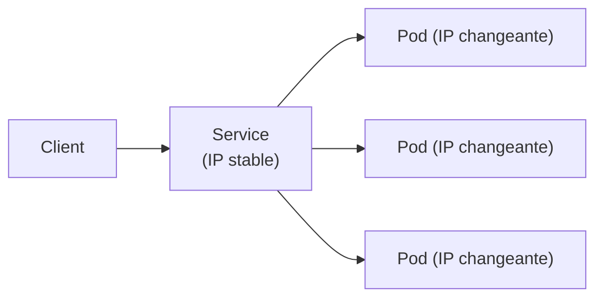
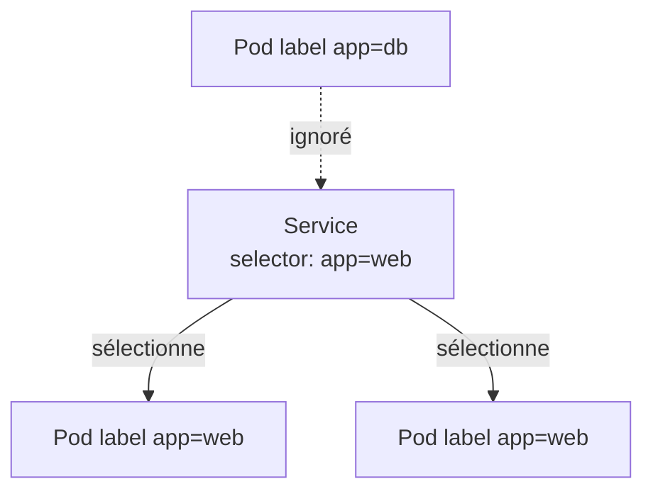
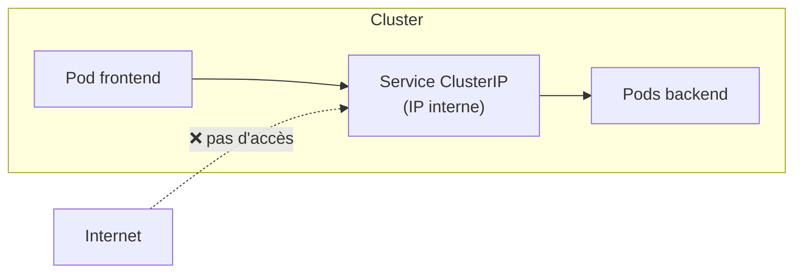
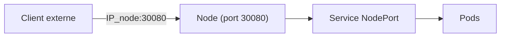
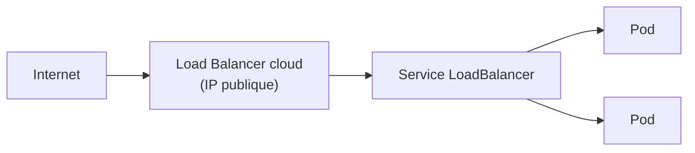
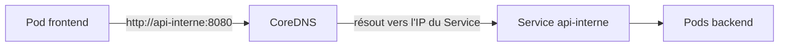
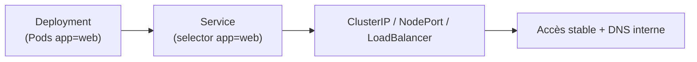

<a id="top"></a>

# 04 — Les Services

## Table des matières

| # | Section |
|---|---|
| 1 | [Pourquoi un Service ?](#section-1) |
| 2 | [Labels et sélecteurs : le lien Service–Pods](#section-2) |
| 3 | [Le type ClusterIP](#section-3) |
| 4 | [Le type NodePort](#section-4) |
| 5 | [Le type LoadBalancer](#section-5) |
| 6 | [La découverte de services (DNS interne)](#section-6) |
| 7 | [Quiz — Les Services](#section-7) |
| 8 | [Pratique — Exposer un Deployment](#section-8) |
| 9 | [Synthèse](#section-9) |

---

<a id="section-1"></a>

<details>
<summary>1 — Pourquoi un Service ?</summary>

<br/>

Les Pods sont **éphémères** : ils meurent, sont recréés, et changent d'**adresse IP** à chaque fois. Impossible donc de pointer une application vers l'IP d'un Pod. Le **Service** résout ce problème en fournissant une **adresse stable** qui répartit le trafic vers les bons Pods.



| Sans Service | Avec Service |
|---|---|
| IP des Pods changeante | IP/nom stable et durable |
| Pas de répartition de charge | Load balancing intégré |
| Couplage fragile entre composants | Découplage propre |

> _Analogie : un Service est un **standard téléphonique**. Vous appelez toujours le même numéro (l'IP du Service), et le standard vous bascule vers un agent disponible (un Pod), peu importe lequel._

</details>

<p align="right"><a href="#top">↑ Retour en haut</a></p>

---

<a id="section-2"></a>

<details>
<summary>2 — Labels et sélecteurs : le lien Service–Pods</summary>

<br/>

Un Service ne connaît pas les Pods par leur IP : il les retrouve grâce à leurs **labels** via un **selector**.



```yaml
apiVersion: v1
kind: Service
metadata:
  name: web-service
spec:
  selector:
    app: web        # cible tous les Pods portant le label app=web
  ports:
    - port: 80
      targetPort: 80
```

| Champ | Rôle |
|---|---|
| `selector.app: web` | Le Service route vers tous les Pods labellisés `app=web` |
| `port` | Port exposé par le Service |
| `targetPort` | Port du conteneur dans le Pod |

**🔧 Mini-exercice —** Écris la commande qui liste tous les Pods portant le label `app=web` (ceux que ciblerait ce Service).

<details>
<summary>✅ Voir une solution</summary>

```bash
kubectl get pods -l app=web
```

</details>

> _C'est le couple **label/selector** qui fait toute la magie de Kubernetes : Deployments, Services et autres objets se relient par étiquettes, jamais par IP fixe._

</details>

<p align="right"><a href="#top">↑ Retour en haut</a></p>

---

<a id="section-3"></a>

<details>
<summary>3 — Le type ClusterIP</summary>

<br/>

**ClusterIP** est le type **par défaut**. Il crée une IP **interne au cluster** : le Service n'est joignable que par les autres Pods, pas depuis l'extérieur. Idéal pour la communication **entre microservices**.



```yaml
apiVersion: v1
kind: Service
metadata:
  name: api-interne
spec:
  type: ClusterIP
  selector:
    app: api
  ports:
    - port: 8080
      targetPort: 8080
```

```bash
kubectl apply -f service-clusterip.yaml
kubectl get service api-interne
```

**🔧 Mini-exercice —** Écris la commande qui affiche les détails du Service `api-interne`, dont son type et sa CLUSTER-IP.

<details>
<summary>✅ Voir une solution</summary>

```bash
kubectl get service api-interne
```

(`kubectl describe service api-interne` donne une vue encore plus complète, avec les endpoints.)

</details>

> _Utilisez ClusterIP pour tout ce qui ne doit **pas** être exposé au public : bases de données, API internes, files de messages._

</details>

<p align="right"><a href="#top">↑ Retour en haut</a></p>

---

<a id="section-4"></a>

<details>
<summary>4 — Le type NodePort</summary>

<br/>

**NodePort** ouvre un **port fixe** (entre 30000 et 32767) sur **chaque node**. On peut alors atteindre le Service depuis l'extérieur via `IP_du_node:NodePort`. Pratique pour le développement et les démos.



```yaml
apiVersion: v1
kind: Service
metadata:
  name: web-nodeport
spec:
  type: NodePort
  selector:
    app: web
  ports:
    - port: 80
      targetPort: 80
      nodePort: 30080
```

| Port | Signification |
|---|---|
| `nodePort: 30080` | Port ouvert sur chaque node (externe) |
| `port: 80` | Port du Service (interne au cluster) |
| `targetPort: 80` | Port du conteneur |

**🔧 Mini-exercice —** Dans le manifeste NodePort ci-dessus, change le port exposé sur les nodes pour utiliser `31000` au lieu de `30080`.

<details>
<summary>✅ Voir une solution</summary>

```yaml
  ports:
    - port: 80
      targetPort: 80
      nodePort: 31000
```

</details>

```bash
kubectl apply -f service-nodeport.yaml
# Avec minikube, ouvrir le service dans le navigateur
minikube service web-nodeport
```

> _NodePort est simple mais peu élégant en production (ports élevés, exposition de chaque node). On lui préfère LoadBalancer ou un Ingress dans le cloud._

</details>

<p align="right"><a href="#top">↑ Retour en haut</a></p>

---

<a id="section-5"></a>

<details>
<summary>5 — Le type LoadBalancer</summary>

<br/>

**LoadBalancer** demande au fournisseur cloud (AWS, GCP, Azure) de provisionner un **équilibreur de charge externe** avec une **IP publique**. C'est la méthode standard pour exposer un service au public en production.



```yaml
apiVersion: v1
kind: Service
metadata:
  name: web-public
spec:
  type: LoadBalancer
  selector:
    app: web
  ports:
    - port: 80
      targetPort: 80
```

| Type | Accès | Usage typique |
|---|---|---|
| **ClusterIP** | Interne seulement | Communication entre Pods |
| **NodePort** | `IP_node:port` | Dev, démos |
| **LoadBalancer** | IP publique | Production cloud |

```bash
kubectl apply -f service-lb.yaml
# L'EXTERNAL-IP apparaît une fois le LB provisionné
kubectl get service web-public
```

> _En local (minikube), `LoadBalancer` reste en `<pending>` faute de cloud. Utilisez `minikube tunnel` pour simuler l'attribution d'une IP externe._

</details>

<p align="right"><a href="#top">↑ Retour en haut</a></p>

---

<a id="section-6"></a>

<details>
<summary>6 — La découverte de services (DNS interne)</summary>

<br/>

Kubernetes embarque un **DNS interne** (CoreDNS) : chaque Service obtient un **nom de domaine** que les Pods peuvent utiliser à la place d'une IP.



Format du nom DNS d'un Service :

```
<nom-service>.<namespace>.svc.cluster.local
```

| Forme du nom | Quand l'utiliser |
|---|---|
| `api-interne` | Même namespace |
| `api-interne.prod` | Namespace différent (`prod`) |
| `api-interne.prod.svc.cluster.local` | Nom complet (FQDN) |

```bash
# Depuis un Pod, tester la résolution DNS
kubectl exec -it frontend-pod -- nslookup api-interne

# Ou tester l'appel HTTP interne
kubectl exec -it frontend-pod -- curl http://api-interne:8080
```

**🔧 Mini-exercice —** Écris le nom DNS complet (FQDN) du Service `api-interne` situé dans le namespace `prod`.

<details>
<summary>✅ Voir une solution</summary>

```
api-interne.prod.svc.cluster.local
```

</details>

> _Grâce au DNS interne, vos applications se parlent par **nom** (`http://api-interne`) et non par IP. C'est la base d'une architecture microservices propre et découplée._

</details>

<p align="right"><a href="#top">↑ Retour en haut</a></p>

---

<a id="section-7"></a>

<details>
<summary>7 — Quiz — Les Services</summary>

<br/>

**Question 1 :** Pourquoi a-t-on besoin d'un Service ?

a) Pour compiler les conteneurs

b) Parce que l'IP des Pods change et qu'il faut une adresse stable

c) Pour sauvegarder etcd

d) Pour supprimer les Pods

<details>
<summary>💡 Voir la solution</summary>

✅ **Réponse : b)** — Les Pods sont éphémères et changent d'IP ; le Service fournit une **adresse stable** et répartit le trafic.

</details>

---

**Question 2 :** Comment un Service retrouve-t-il ses Pods ?

a) Par leur adresse IP fixe

b) Par leur nom de fichier

c) Par les labels via un selector

d) Par leur date de création

<details>
<summary>💡 Voir la solution</summary>

✅ **Réponse : c)** — Le Service cible les Pods dont les **labels** correspondent à son `selector`.

</details>

---

**Question 3 :** Quel type de Service n'est accessible que depuis l'intérieur du cluster ?

a) NodePort

b) LoadBalancer

c) ClusterIP

d) Ingress

<details>
<summary>💡 Voir la solution</summary>

✅ **Réponse : c)** — `ClusterIP` (type par défaut) n'expose le Service qu'**en interne**, entre Pods.

</details>

---

**Question 4 :** Quel type de Service provisionne une IP publique via le cloud ?

a) ClusterIP

b) NodePort

c) LoadBalancer

d) Headless

<details>
<summary>💡 Voir la solution</summary>

✅ **Réponse : c)** — `LoadBalancer` demande au fournisseur cloud un équilibreur de charge avec **IP publique**.

</details>

---

**Question 5 :** Comment un Pod appelle-t-il un Service du même namespace ?

a) Par l'IP exacte du Pod cible

b) Par le nom du Service (ex. `http://api-interne`)

c) Par le hash du conteneur

d) Ce n'est pas possible

<details>
<summary>💡 Voir la solution</summary>

✅ **Réponse : b)** — Grâce au **DNS interne** (CoreDNS), un Pod appelle le Service par son **nom** (ex. `http://api-interne:8080`).

</details>

</details>

<p align="right"><a href="#top">↑ Retour en haut</a></p>

---

<a id="section-8"></a>

<details>
<summary>8 — Pratique — Exposer un Deployment</summary>

<br/>

### Consigne

À partir d'un Deployment Nginx (label `app=web`), créez un Service NodePort qui l'expose sur le port 30080, puis testez l'accès.

---

### Correction — Manifeste et commandes attendus

Fichier `service.yaml` :

```yaml
apiVersion: v1
kind: Service
metadata:
  name: web-service
spec:
  type: NodePort
  selector:
    app: web
  ports:
    - port: 80
      targetPort: 80
      nodePort: 30080
```

Commandes :

```bash
# 1. (Pré-requis) le Deployment de la leçon 03 doit exister
kubectl get pods -l app=web

# 2. Créer le Service
kubectl apply -f service.yaml

# 3. Vérifier le Service et ses endpoints
kubectl get service web-service
kubectl get endpoints web-service

# 4. Tester l'accès (minikube)
minikube service web-service --url

# 5. Vérifier la résolution DNS interne depuis un Pod
kubectl exec -it deploy/web-deploy -- curl -s http://web-service
```

**Résultat attendu (étape 3) :**

```
NAME          TYPE       CLUSTER-IP      EXTERNAL-IP   PORT(S)        AGE
web-service   NodePort   10.96.120.45    <none>        80:30080/TCP   8s
```

> _Vérifiez que `kubectl get endpoints web-service` liste bien les IP des Pods : si la liste est vide, c'est que le `selector` du Service ne correspond pas aux labels des Pods._

</details>

<p align="right"><a href="#top">↑ Retour en haut</a></p>

---

<a id="section-9"></a>

<details>
<summary>9 — Synthèse</summary>

<br/>

#### Points à retenir

1. Le **Service** fournit une **adresse stable** devant des Pods éphémères et répartit la charge.
2. Le lien Service–Pods se fait par **labels / selector**, jamais par IP fixe.
3. **ClusterIP** (interne), **NodePort** (`IP_node:port`), **LoadBalancer** (IP publique cloud).
4. Le **DNS interne** (CoreDNS) permet d'appeler un Service par son **nom**.
5. `kubectl get endpoints` vérifie que le Service a bien trouvé ses Pods.



#### La suite

Module suivant : aller plus loin avec la configuration (ConfigMaps, Secrets), le stockage persistant et l'exposition HTTP via Ingress.

</details>

<p align="right"><a href="#top">↑ Retour en haut</a></p>

---

<p align="center">
  <em>Tous droits réservés. Toute reproduction, diffusion, utilisation ou adaptation de ce cours, en tout ou en partie, est strictement interdite sans l'autorisation écrite préalable de Dr. Haythem REHOUMA.</em>
</p>

<p align="center">
  <strong>Cours créé par Dr. Haythem REHOUMA — Développement et déploiement de solutions de données</strong>
</p>
