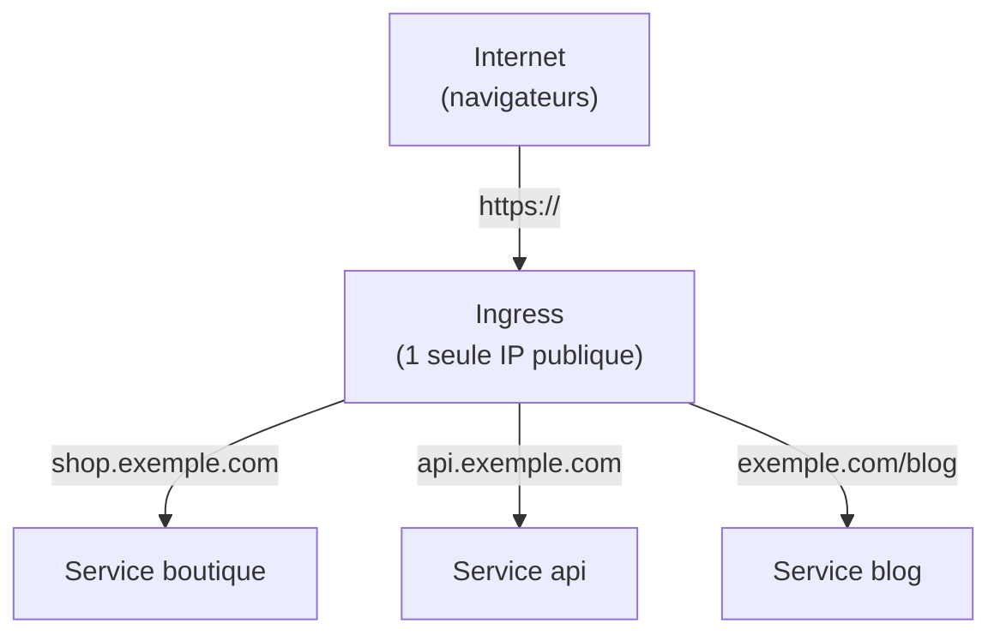
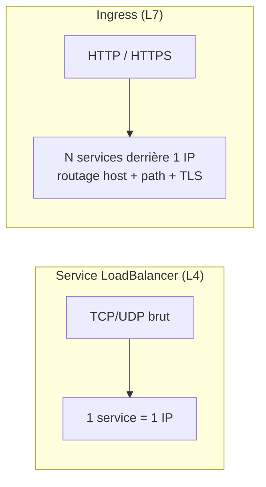
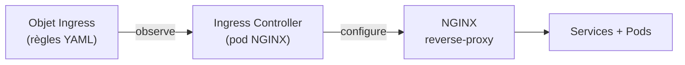
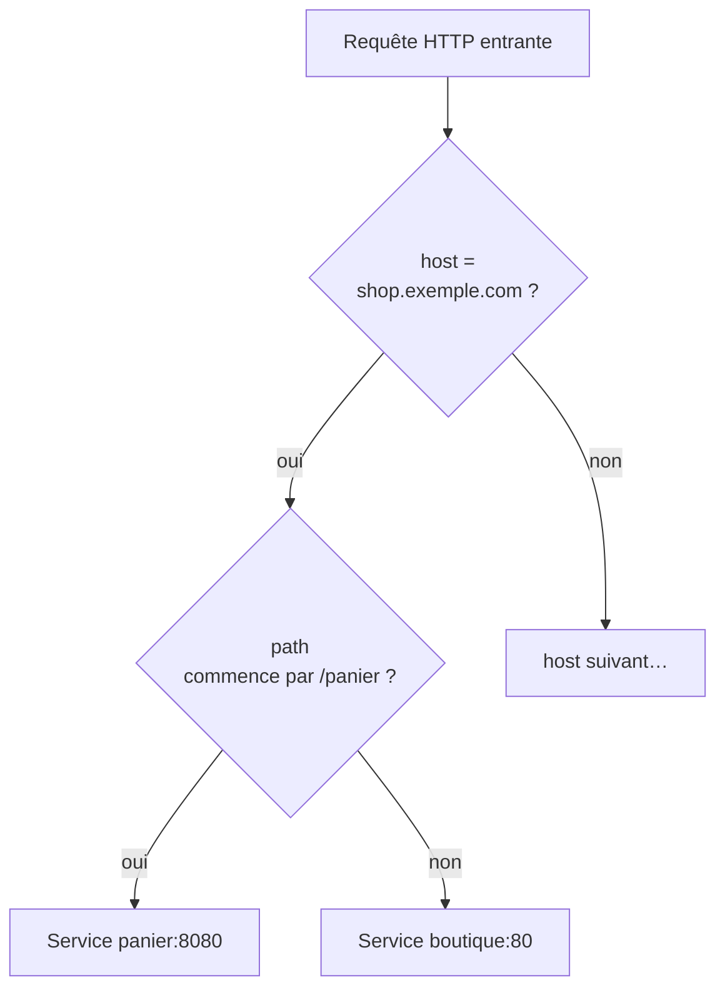
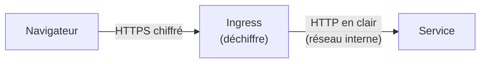
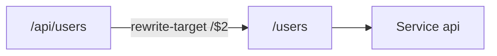
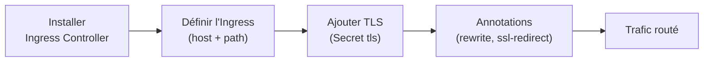

<a id="top"></a>

# 01 — Ingress et routage HTTP (L7)

## Table des matières

| # | Section |
|---|---|
| 1 | [Le problème : exposer plusieurs services](#section-1) |
| 2 | [Ingress vs Service LoadBalancer](#section-2) |
| 3 | [L'Ingress Controller (nginx-ingress)](#section-3) |
| 4 | [Règles de routage : host et path](#section-4) |
| 5 | [Terminaison TLS / HTTPS](#section-5) |
| 6 | [Annotations et réécriture d'URL](#section-6) |
| 7 | [Quiz — Ingress](#section-7) |
| 8 | [Pratique — Router deux applications](#section-8) |
| 9 | [Synthèse](#section-9) |

---

<a id="section-1"></a>

<details>
<summary>1 — Le problème : exposer plusieurs services</summary>

<br/>

Dans un cluster, chaque application est exposée par un **Service**. Mais comment publier **dix sites web** sur le même cluster sans louer dix adresses IP publiques (et dix LoadBalancers facturés à part) ?

La réponse est l'**Ingress** : un point d'entrée HTTP/HTTPS **unique** qui répartit le trafic vers le bon Service selon le **nom de domaine** et le **chemin** de l'URL.



| Sans Ingress | Avec Ingress |
|---|---|
| 1 LoadBalancer **par** service | 1 LoadBalancer **pour tout** |
| Plusieurs IP publiques à gérer | Une seule IP / un seul DNS |
| Pas de routage par URL | Routage par host **et** par path |
| TLS configuré N fois | TLS centralisé |

> _Ingress travaille à la **couche 7 (HTTP)** : il « lit » l'URL et les en-têtes. Un Service LoadBalancer, lui, travaille à la couche 4 (TCP/UDP) et ne comprend pas le contenu HTTP._

</details>

<p align="right"><a href="#top">↑ Retour en haut</a></p>

---

<a id="section-2"></a>

<details>
<summary>2 — Ingress vs Service LoadBalancer</summary>

<br/>

Il est facile de confondre ces deux objets. Voici la différence essentielle.



| Critère | Service `LoadBalancer` | Ingress |
|---|---|---|
| Couche OSI | 4 (TCP/UDP) | 7 (HTTP/HTTPS) |
| Routage par URL | ❌ Non | ✅ host + path |
| Terminaison TLS | ❌ (ou côté pod) | ✅ centralisée |
| Adresses IP | 1 par service | 1 partagée |
| Coût cloud | élevé (N LB) | faible (1 LB) |
| Cas d'usage | TCP non-HTTP (BD, jeux) | sites et API web |

> _Règle pratique : si votre trafic est du **HTTP/HTTPS**, utilisez un **Ingress**. Réservez le Service `LoadBalancer` aux protocoles non-HTTP (PostgreSQL, MQTT, gRPC brut, etc.)._

L'Ingress n'est qu'une **règle déclarative**. Pour qu'il fonctionne, il faut un programme qui lit ces règles et applique réellement le routage : l'**Ingress Controller**.

</details>

<p align="right"><a href="#top">↑ Retour en haut</a></p>

---

<a id="section-3"></a>

<details>
<summary>3 — L'Ingress Controller (nginx-ingress)</summary>

<br/>

Un objet `Ingress` seul **ne fait rien** : c'est juste une configuration. Il faut un **Ingress Controller** — un pod qui surveille les objets `Ingress` et configure un reverse-proxy (souvent **NGINX**) en conséquence.



Installation rapide de l'Ingress Controller NGINX :

```bash
# Installer le contrôleur ingress-nginx (manifeste officiel)
kubectl apply -f https://raw.githubusercontent.com/kubernetes/ingress-nginx/main/deploy/static/provider/cloud/deploy.yaml

# Vérifier que le contrôleur tourne dans son namespace
kubectl get pods -n ingress-nginx

# Récupérer l'IP publique attribuée au contrôleur
kubectl get svc -n ingress-nginx ingress-nginx-controller
```

| Contrôleur | Particularité |
|---|---|
| **ingress-nginx** | Le plus répandu, basé sur NGINX |
| **Traefik** | Léger, configuration dynamique |
| **HAProxy** | Très performant |
| **AWS ALB Controller** | Crée un Application Load Balancer AWS |

> _On peut installer **plusieurs** contrôleurs dans un cluster. Chaque Ingress précise lequel utiliser via le champ `ingressClassName` (ex. `nginx`)._

**🔧 Mini-exercice —** Vérifie que le contrôleur ingress-nginx tourne et récupère l'IP publique de son Service.

<details>
<summary>✅ Voir une solution</summary>

```bash
kubectl get pods -n ingress-nginx
kubectl get svc -n ingress-nginx ingress-nginx-controller
```

</details>

</details>

<p align="right"><a href="#top">↑ Retour en haut</a></p>

---

<a id="section-4"></a>

<details>
<summary>4 — Règles de routage : host et path</summary>

<br/>

Les règles d'un Ingress se lisent de gauche à droite : **quel domaine** (`host`), **quel chemin** (`path`), vers **quel service**.



Exemple complet de manifeste Ingress avec routage par host et par path :

```yaml
apiVersion: networking.k8s.io/v1
kind: Ingress
metadata:
  name: ingress-exemple
spec:
  ingressClassName: nginx
  rules:
    - host: shop.exemple.com
      http:
        paths:
          - path: /panier
            pathType: Prefix
            backend:
              service:
                name: panier-svc
                port:
                  number: 8080
          - path: /
            pathType: Prefix
            backend:
              service:
                name: boutique-svc
                port:
                  number: 80
    - host: api.exemple.com
      http:
        paths:
          - path: /
            pathType: Prefix
            backend:
              service:
                name: api-svc
                port:
                  number: 3000
```

| `pathType` | Comportement |
|---|---|
| `Prefix` | Correspond si l'URL **commence** par le chemin (le plus courant) |
| `Exact` | Correspond uniquement au chemin **exact** |
| `ImplementationSpecific` | Délégué au contrôleur |

```bash
# Lister les ingress et voir hosts + adresse
kubectl get ingress

# Détailler les règles d'un ingress
kubectl describe ingress ingress-exemple
```

> _L'ordre compte peu : NGINX choisit la règle la plus **spécifique**. `/panier` l'emporte sur `/` car son préfixe est plus long._

**🔧 Mini-exercice —** Écris la règle d'un path `/api` de type `Prefix` qui pointe vers le Service `api-svc` sur le port `3000`.

<details>
<summary>✅ Voir une solution</summary>

```yaml
- path: /api
  pathType: Prefix
  backend:
    service:
      name: api-svc
      port:
        number: 3000
```

</details>

</details>

<p align="right"><a href="#top">↑ Retour en haut</a></p>

---

<a id="section-5"></a>

<details>
<summary>5 — Terminaison TLS / HTTPS</summary>

<br/>

L'Ingress peut gérer le **HTTPS** de façon centralisée : il déchiffre le trafic (terminaison TLS) puis le transmet en clair aux services internes. Le certificat est stocké dans un **Secret** de type `tls`.



Créer le Secret TLS à partir d'un certificat et d'une clé :

```bash
kubectl create secret tls exemple-tls \
  --cert=exemple.com.crt \
  --key=exemple.com.key
```

Référencer ce Secret dans l'Ingress :

```yaml
apiVersion: networking.k8s.io/v1
kind: Ingress
metadata:
  name: ingress-tls
spec:
  ingressClassName: nginx
  tls:
    - hosts:
        - shop.exemple.com
      secretName: exemple-tls
  rules:
    - host: shop.exemple.com
      http:
        paths:
          - path: /
            pathType: Prefix
            backend:
              service:
                name: boutique-svc
                port:
                  number: 80
```

| Élément | Rôle |
|---|---|
| `tls.hosts` | Domaines couverts par le certificat |
| `tls.secretName` | Secret contenant `tls.crt` + `tls.key` |
| **cert-manager** | Add-on qui génère/renouvelle des certificats Let's Encrypt automatiquement |

> _En production, on n'écrit pas les certificats à la main : on installe **cert-manager** qui obtient et **renouvelle** automatiquement des certificats Let's Encrypt gratuits._

**🔧 Mini-exercice —** Crée un Secret TLS nommé `monsite-tls` à partir des fichiers `monsite.crt` et `monsite.key`.

<details>
<summary>✅ Voir une solution</summary>

```bash
kubectl create secret tls monsite-tls \
  --cert=monsite.crt \
  --key=monsite.key
```

</details>

</details>

<p align="right"><a href="#top">↑ Retour en haut</a></p>

---

<a id="section-6"></a>

<details>
<summary>6 — Annotations et réécriture d'URL</summary>

<br/>

Les **annotations** permettent d'activer des comportements spécifiques au contrôleur NGINX : réécriture de chemin, redirection HTTPS forcée, limites de débit, etc.

```yaml
apiVersion: networking.k8s.io/v1
kind: Ingress
metadata:
  name: ingress-rewrite
  annotations:
    nginx.ingress.kubernetes.io/rewrite-target: /$2
    nginx.ingress.kubernetes.io/ssl-redirect: "true"
spec:
  ingressClassName: nginx
  rules:
    - host: exemple.com
      http:
        paths:
          - path: /api(/|$)(.*)
            pathType: ImplementationSpecific
            backend:
              service:
                name: api-svc
                port:
                  number: 3000
```

| Annotation | Effet |
|---|---|
| `rewrite-target` | Réécrit le chemin avant de l'envoyer au service |
| `ssl-redirect: "true"` | Force la redirection HTTP → HTTPS |
| `proxy-body-size` | Taille max du corps des requêtes |
| `limit-rps` | Limite le nombre de requêtes par seconde |



> _Les annotations sont **propres à chaque contrôleur**. Une annotation `nginx.ingress.kubernetes.io/...` ne fonctionnera pas avec Traefik. Vérifiez toujours la documentation de votre contrôleur._

**🔧 Mini-exercice —** Ajoute l'annotation qui force la redirection automatique de HTTP vers HTTPS sur un Ingress nginx.

<details>
<summary>✅ Voir une solution</summary>

```yaml
metadata:
  annotations:
    nginx.ingress.kubernetes.io/ssl-redirect: "true"
```

</details>

</details>

<p align="right"><a href="#top">↑ Retour en haut</a></p>

---

<a id="section-7"></a>

<details>
<summary>7 — Quiz — Ingress</summary>

<br/>

**Question 1 :** À quelle couche OSI travaille un Ingress ?

a) Couche 3 (IP)

b) Couche 4 (TCP/UDP)

c) Couche 7 (HTTP/HTTPS)

d) Couche 2 (Ethernet)

<details>
<summary>💡 Voir la solution</summary>

✅ **Réponse : c)** — L'Ingress lit l'URL et les en-têtes HTTP : il opère à la couche applicative (L7), contrairement au Service LoadBalancer qui est en L4.

</details>

---

**Question 2 :** Que se passe-t-il si on crée un objet `Ingress` sans Ingress Controller ?

a) Le trafic est routé quand même

b) Rien : l'Ingress est une simple configuration sans effet

c) Le cluster plante

d) Kubernetes installe automatiquement NGINX

<details>
<summary>💡 Voir la solution</summary>

✅ **Réponse : b)** — Un Ingress n'est qu'une règle déclarative. Sans contrôleur pour l'appliquer, aucun routage ne se produit.

</details>

---

**Question 3 :** Quel `pathType` correspond si l'URL **commence** par le chemin indiqué ?

a) `Exact`

b) `Prefix`

c) `StartsWith`

d) `Glob`

<details>
<summary>💡 Voir la solution</summary>

✅ **Réponse : b)** — `Prefix` correspond à tout chemin qui commence par la valeur. `Exact` exige une correspondance stricte.

</details>

---

**Question 4 :** Où est stocké le certificat utilisé par la terminaison TLS d'un Ingress ?

a) Dans un ConfigMap

b) Dans un Secret de type `tls`

c) Dans le YAML de l'Ingress en clair

d) Dans un volume PersistentVolume

<details>
<summary>💡 Voir la solution</summary>

✅ **Réponse : b)** — Le certificat (`tls.crt`) et la clé (`tls.key`) sont placés dans un Secret de type `tls`, référencé via `tls.secretName`.

</details>

---

**Question 5 :** Quel est l'avantage principal d'un Ingress par rapport à plusieurs Services LoadBalancer ?

a) Il est plus rapide en TCP

b) Il permet d'exposer N services derrière une seule IP avec routage par URL

c) Il chiffre les disques

d) Il remplace les Pods

<details>
<summary>💡 Voir la solution</summary>

✅ **Réponse : b)** — Un seul point d'entrée (donc un seul LoadBalancer/IP) dessert plusieurs services selon le host et le path, ce qui réduit fortement les coûts cloud.

</details>

</details>

<p align="right"><a href="#top">↑ Retour en haut</a></p>

---

<a id="section-8"></a>

<details>
<summary>8 — Pratique — Router deux applications</summary>

<br/>

### Consigne

Vous avez deux déploiements exposés par deux Services : `web-svc` (port 80) et `api-svc` (port 3000). Créez un Ingress NGINX qui route :
- `monsite.local/` → `web-svc`
- `monsite.local/api` → `api-svc`

Puis vérifiez le routage avec `curl`.

---

### Correction — Manifeste et commandes attendus

```yaml
# ingress-pratique.yaml
apiVersion: networking.k8s.io/v1
kind: Ingress
metadata:
  name: ingress-pratique
  annotations:
    nginx.ingress.kubernetes.io/rewrite-target: /
spec:
  ingressClassName: nginx
  rules:
    - host: monsite.local
      http:
        paths:
          - path: /api
            pathType: Prefix
            backend:
              service:
                name: api-svc
                port:
                  number: 3000
          - path: /
            pathType: Prefix
            backend:
              service:
                name: web-svc
                port:
                  number: 80
```

```bash
# 1. Appliquer l'ingress
kubectl apply -f ingress-pratique.yaml

# 2. Récupérer l'IP du contrôleur
kubectl get svc -n ingress-nginx ingress-nginx-controller

# 3. Simuler le DNS local (remplacer <IP>)
echo "<IP> monsite.local" | sudo tee -a /etc/hosts

# 4. Tester les deux routes
curl http://monsite.local/        # doit atteindre web-svc
curl http://monsite.local/api     # doit atteindre api-svc
```

**Résultat attendu :**

```
$ kubectl get ingress
NAME               CLASS   HOSTS           ADDRESS         PORTS   AGE
ingress-pratique   nginx   monsite.local   192.168.49.2    80      30s

$ curl http://monsite.local/
<h1>Bienvenue sur le site web</h1>

$ curl http://monsite.local/api
{"message":"API en ligne"}
```

> _Si `ADDRESS` reste vide quelques secondes, c'est normal : le contrôleur doit d'abord traiter le nouvel Ingress. Relancez `kubectl get ingress` après 10-20 s._

</details>

<p align="right"><a href="#top">↑ Retour en haut</a></p>

---

<a id="section-9"></a>

<details>
<summary>9 — Synthèse</summary>

<br/>

#### Points à retenir

1. L'**Ingress** route le trafic **HTTP/HTTPS (L7)** vers plusieurs services derrière **une seule IP**.
2. Un Ingress seul ne fait rien : il faut un **Ingress Controller** (ex. ingress-nginx) pour l'appliquer.
3. Le routage se fait par **host** et par **path** (`pathType: Prefix` le plus courant).
4. Le **TLS** se centralise dans l'Ingress via un **Secret `tls`** ; cert-manager automatise les certificats.
5. Les **annotations** activent réécriture d'URL, redirection HTTPS, limites de débit (spécifiques au contrôleur).



#### La suite

Leçon **02 — ConfigMaps** : externaliser la configuration des applications hors de l'image conteneur.

</details>

<p align="right"><a href="#top">↑ Retour en haut</a></p>

---

<p align="center">
  <em>Tous droits réservés. Toute reproduction, diffusion, utilisation ou adaptation de ce cours, en tout ou en partie, est strictement interdite sans l'autorisation écrite préalable de Dr. Haythem REHOUMA.</em>
</p>

<p align="center">
  <strong>Cours créé par Dr. Haythem REHOUMA — Développement et déploiement de solutions de données</strong>
</p>
