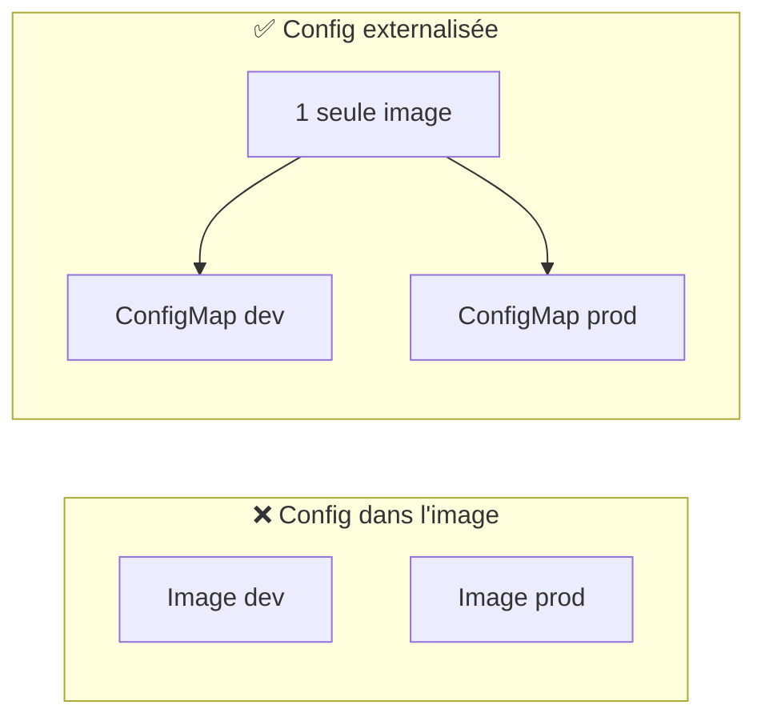
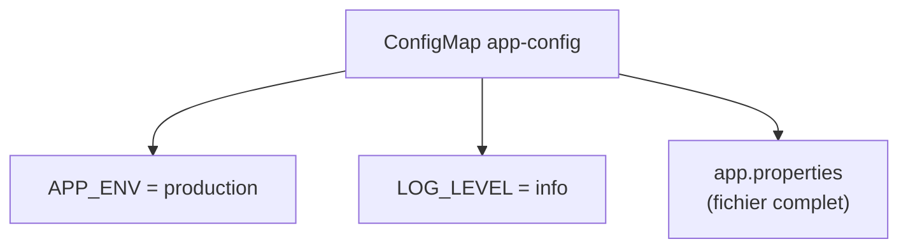
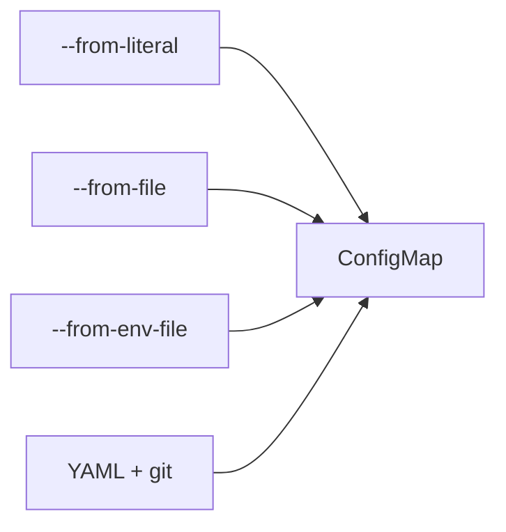
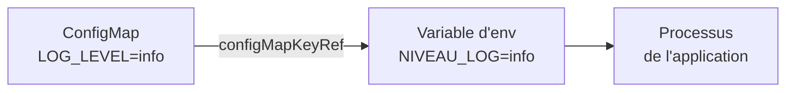
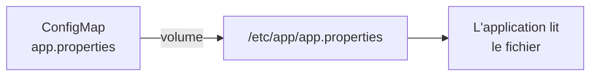
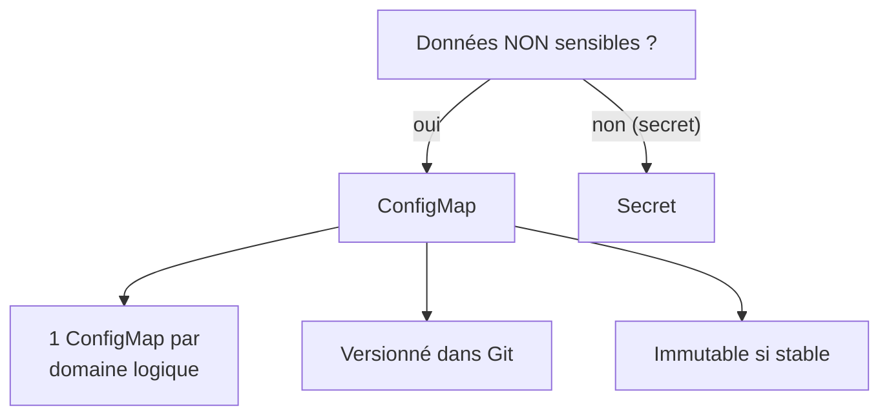
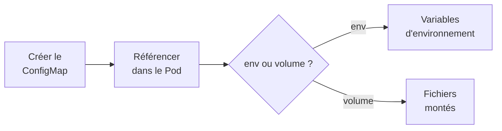

<a id="top"></a>

# 02 — ConfigMaps : configuration externalisée

## Table des matières

| # | Section |
|---|---|
| 1 | [Pourquoi externaliser la configuration](#section-1) |
| 2 | [Anatomie d'un ConfigMap](#section-2) |
| 3 | [Créer un ConfigMap](#section-3) |
| 4 | [Consommer via variables d'environnement](#section-4) |
| 5 | [Consommer via volumes montés](#section-5) |
| 6 | [Bonnes pratiques](#section-6) |
| 7 | [Quiz — ConfigMaps](#section-7) |
| 8 | [Pratique — Configurer une application](#section-8) |
| 9 | [Synthèse](#section-9) |

---

<a id="section-1"></a>

<details>
<summary>1 — Pourquoi externaliser la configuration</summary>

<br/>

Une **mauvaise** pratique très répandue : coder en dur l'URL d'une base de données, un niveau de log ou un nom d'environnement **dans l'image Docker**. Résultat : il faut reconstruire l'image à chaque changement de config, et la même image ne peut pas servir en dev, test et production.

Le principe **« Build once, run anywhere »** (12-factor app) impose de **séparer le code de la configuration**. Dans Kubernetes, c'est le rôle du **ConfigMap**.



| Avec config dans l'image | Avec ConfigMap |
|---|---|
| 1 image par environnement | 1 image, N configs |
| Rebuild à chaque changement | Modifier le ConfigMap suffit |
| Secrets/config mélangés au code | Séparation nette |

> _Le ConfigMap stocke des données **non sensibles** (URL, ports, drapeaux). Pour les mots de passe et clés, on utilise un **Secret** (leçon 03)._

</details>

<p align="right"><a href="#top">↑ Retour en haut</a></p>

---

<a id="section-2"></a>

<details>
<summary>2 — Anatomie d'un ConfigMap</summary>

<br/>

Un ConfigMap est un objet Kubernetes qui contient une série de paires **clé/valeur** sous le champ `data`. Les valeurs peuvent être de simples chaînes ou des **fichiers entiers**.

```yaml
apiVersion: v1
kind: ConfigMap
metadata:
  name: app-config
data:
  # Paires clé/valeur simples
  APP_ENV: "production"
  LOG_LEVEL: "info"
  DB_HOST: "postgres.default.svc.cluster.local"
  # Une valeur peut être un fichier complet
  app.properties: |
    server.port=8080
    cache.enabled=true
    cache.ttl=3600
```



| Champ | Rôle |
|---|---|
| `metadata.name` | Nom du ConfigMap (référencé par les pods) |
| `data` | Valeurs textuelles UTF-8 (clé/valeur) |
| `binaryData` | Valeurs binaires encodées en base64 |

> _Un ConfigMap est **lié à un namespace**. Un pod ne peut consommer qu'un ConfigMap du **même namespace** que lui._

</details>

<p align="right"><a href="#top">↑ Retour en haut</a></p>

---

<a id="section-3"></a>

<details>
<summary>3 — Créer un ConfigMap</summary>

<br/>

Trois méthodes courantes, du plus rapide au plus reproductible.

```bash
# 1. Depuis des valeurs en ligne (--from-literal)
kubectl create configmap app-config \
  --from-literal=APP_ENV=production \
  --from-literal=LOG_LEVEL=info

# 2. Depuis un fichier (la clé = nom du fichier)
kubectl create configmap app-config \
  --from-file=app.properties

# 3. Depuis un fichier .env (chaque ligne = une clé)
kubectl create configmap app-config \
  --from-env-file=config.env
```

La méthode **recommandée en production** reste le manifeste YAML versionné dans Git :

```bash
# Appliquer un ConfigMap déclaré en YAML
kubectl apply -f app-config.yaml

# Inspecter le résultat
kubectl get configmap app-config -o yaml
kubectl describe configmap app-config
```



> _Préférez le **YAML versionné** au `kubectl create` impératif : la config devient traçable, relisible en revue de code et reproductible (GitOps)._

**🔧 Mini-exercice —** Crée un ConfigMap `cache-config` à partir d'un littéral `CACHE_TTL=3600`.

<details>
<summary>✅ Voir une solution</summary>

```bash
kubectl create configmap cache-config \
  --from-literal=CACHE_TTL=3600
```

</details>

</details>

<p align="right"><a href="#top">↑ Retour en haut</a></p>

---

<a id="section-4"></a>

<details>
<summary>4 — Consommer via variables d'environnement</summary>

<br/>

La façon la plus simple d'injecter un ConfigMap : transformer ses clés en **variables d'environnement** du conteneur.

```yaml
apiVersion: v1
kind: Pod
metadata:
  name: app-pod
spec:
  containers:
    - name: app
      image: mon-app:1.0
      # Importer TOUTES les clés comme variables d'env
      envFrom:
        - configMapRef:
            name: app-config
      # OU importer une clé précise sous un autre nom
      env:
        - name: NIVEAU_LOG
          valueFrom:
            configMapKeyRef:
              name: app-config
              key: LOG_LEVEL
```



| Méthode | Usage |
|---|---|
| `envFrom.configMapRef` | Importe **toutes** les clés en une fois |
| `env.valueFrom.configMapKeyRef` | Importe **une** clé, renommage possible |

```bash
# Vérifier les variables d'env vues par le conteneur
kubectl exec app-pod -- env | grep LOG
```

> _⚠️ Les variables d'environnement sont lues **au démarrage** du conteneur. Modifier le ConfigMap **ne met pas à jour** les variables d'un pod déjà lancé : il faut relancer le pod (`kubectl rollout restart`)._

**🔧 Mini-exercice —** Injecte uniquement la clé `LOG_LEVEL` du ConfigMap `app-config` dans une variable d'environnement nommée `NIVEAU_LOG`.

<details>
<summary>✅ Voir une solution</summary>

```yaml
env:
  - name: NIVEAU_LOG
    valueFrom:
      configMapKeyRef:
        name: app-config
        key: LOG_LEVEL
```

</details>

</details>

<p align="right"><a href="#top">↑ Retour en haut</a></p>

---

<a id="section-5"></a>

<details>
<summary>5 — Consommer via volumes montés</summary>

<br/>

Pour des **fichiers de configuration** (ex. `nginx.conf`, `app.properties`), on monte le ConfigMap comme un **volume** : chaque clé devient un fichier.

```yaml
apiVersion: v1
kind: Pod
metadata:
  name: app-pod
spec:
  containers:
    - name: app
      image: mon-app:1.0
      volumeMounts:
        - name: config-vol
          mountPath: /etc/app      # dossier où apparaissent les fichiers
  volumes:
    - name: config-vol
      configMap:
        name: app-config
```

Ici, la clé `app.properties` du ConfigMap apparaît comme le fichier `/etc/app/app.properties` dans le conteneur.



| Mode de consommation | Mise à jour à chaud ? |
|---|---|
| Variables d'environnement | ❌ Non (rebuild du pod) |
| Volume monté | ✅ Oui (propagé en ~1 min) |

> _Avantage clé du volume : quand on modifie le ConfigMap, les fichiers montés sont **mis à jour automatiquement** dans le pod (après un court délai). À l'application de recharger le fichier (`hot reload`)._

**🔧 Mini-exercice —** Monte le ConfigMap `app-config` comme volume dans le dossier `/etc/app` du conteneur.

<details>
<summary>✅ Voir une solution</summary>

```yaml
volumeMounts:
  - name: config-vol
    mountPath: /etc/app
volumes:
  - name: config-vol
    configMap:
      name: app-config
```

</details>

</details>

<p align="right"><a href="#top">↑ Retour en haut</a></p>

---

<a id="section-6"></a>

<details>
<summary>6 — Bonnes pratiques</summary>

<br/>



| Bonne pratique | Raison |
|---|---|
| Ne jamais y mettre de secret | Le ConfigMap est lisible en clair par quiconque a accès au namespace |
| Versionner le YAML dans Git | Traçabilité, revue, GitOps |
| Préférer le **volume** pour les fichiers | Mise à jour à chaud |
| Marquer `immutable: true` si stable | Performance + protection contre modif accidentelle |
| Nommer clairement (`app-config`, `nginx-config`) | Lisibilité |

```yaml
apiVersion: v1
kind: ConfigMap
metadata:
  name: app-config
immutable: true       # ne peut plus être modifié, seulement remplacé
data:
  APP_ENV: "production"
```

> _Un ConfigMap **`immutable: true`** ne peut plus être modifié : pour changer la config, on en crée un nouveau et on met à jour la référence. Cela protège contre les erreurs et soulage l'API server._

**🔧 Mini-exercice —** Rends le ConfigMap `app-config` immuable pour le protéger des modifications accidentelles.

<details>
<summary>✅ Voir une solution</summary>

```yaml
apiVersion: v1
kind: ConfigMap
metadata:
  name: app-config
immutable: true
data:
  APP_ENV: "production"
```

</details>

</details>

<p align="right"><a href="#top">↑ Retour en haut</a></p>

---

<a id="section-7"></a>

<details>
<summary>7 — Quiz — ConfigMaps</summary>

<br/>

**Question 1 :** Que doit-on stocker dans un ConfigMap ?

a) Des mots de passe et clés API

b) Des données de configuration non sensibles

c) Des fichiers binaires de plusieurs gigaoctets

d) L'image Docker de l'application

<details>
<summary>💡 Voir la solution</summary>

✅ **Réponse : b)** — Le ConfigMap est destiné aux configs **non sensibles** (URL, ports, drapeaux). Les secrets vont dans un objet `Secret`.

</details>

---

**Question 2 :** Quel champ contient les paires clé/valeur d'un ConfigMap ?

a) `spec`

b) `config`

c) `data`

d) `values`

<details>
<summary>💡 Voir la solution</summary>

✅ **Réponse : c)** — Les valeurs textuelles sont sous `data` (et `binaryData` pour le binaire encodé en base64).

</details>

---

**Question 3 :** Quelle directive importe **toutes** les clés d'un ConfigMap comme variables d'environnement ?

a) `envFrom.configMapRef`

b) `env.valueFrom.configMapKeyRef`

c) `volumeMounts`

d) `configMapAll`

<details>
<summary>💡 Voir la solution</summary>

✅ **Réponse : a)** — `envFrom.configMapRef` injecte toutes les clés. `configMapKeyRef` n'en importe qu'une seule.

</details>

---

**Question 4 :** Si je modifie un ConfigMap consommé en **variables d'environnement**, que se passe-t-il pour un pod déjà lancé ?

a) Les variables se mettent à jour automatiquement

b) Rien : il faut relancer le pod

c) Le pod plante

d) Kubernetes crée un nouveau ConfigMap

<details>
<summary>💡 Voir la solution</summary>

✅ **Réponse : b)** — Les variables d'env sont lues au démarrage. Il faut un `kubectl rollout restart` pour les rafraîchir. (Un volume monté, lui, se met à jour à chaud.)

</details>

---

**Question 5 :** Quel avantage apporte `immutable: true` sur un ConfigMap ?

a) Il chiffre les données

b) Il protège contre les modifications accidentelles et soulage l'API server

c) Il rend le ConfigMap visible dans tous les namespaces

d) Il transforme le ConfigMap en Secret

<details>
<summary>💡 Voir la solution</summary>

✅ **Réponse : b)** — Un ConfigMap immuable ne peut plus être édité (seulement remplacé), ce qui évite les erreurs et réduit la charge de surveillance côté API server.

</details>

</details>

<p align="right"><a href="#top">↑ Retour en haut</a></p>

---

<a id="section-8"></a>

<details>
<summary>8 — Pratique — Configurer une application</summary>

<br/>

### Consigne

Créez un ConfigMap `web-config` contenant `APP_ENV=staging` et `LOG_LEVEL=debug`, puis un Pod `nginx` qui :
- expose ces deux clés comme variables d'environnement ;
- monte un fichier `welcome.txt` (clé du ConfigMap) dans `/etc/web/`.

Vérifiez le résultat.

---

### Correction — Manifeste et commandes attendus

```yaml
# web.yaml
apiVersion: v1
kind: ConfigMap
metadata:
  name: web-config
data:
  APP_ENV: "staging"
  LOG_LEVEL: "debug"
  welcome.txt: |
    Bienvenue sur l'environnement de staging.
---
apiVersion: v1
kind: Pod
metadata:
  name: web-pod
spec:
  containers:
    - name: nginx
      image: nginx:1.27
      envFrom:
        - configMapRef:
            name: web-config
      volumeMounts:
        - name: web-vol
          mountPath: /etc/web
  volumes:
    - name: web-vol
      configMap:
        name: web-config
        items:
          - key: welcome.txt
            path: welcome.txt
```

```bash
# 1. Appliquer
kubectl apply -f web.yaml

# 2. Vérifier les variables d'environnement
kubectl exec web-pod -- env | grep -E "APP_ENV|LOG_LEVEL"

# 3. Vérifier le fichier monté
kubectl exec web-pod -- cat /etc/web/welcome.txt
```

**Résultat attendu :**

```
$ kubectl exec web-pod -- env | grep -E "APP_ENV|LOG_LEVEL"
APP_ENV=staging
LOG_LEVEL=debug

$ kubectl exec web-pod -- cat /etc/web/welcome.txt
Bienvenue sur l'environnement de staging.
```

> _Le bloc `items` permet de ne monter **qu'une** clé précise du ConfigMap, sans exposer les autres clés (`APP_ENV`, `LOG_LEVEL`) dans le dossier monté._

</details>

<p align="right"><a href="#top">↑ Retour en haut</a></p>

---

<a id="section-9"></a>

<details>
<summary>9 — Synthèse</summary>

<br/>

#### Points à retenir

1. Le **ConfigMap** externalise la configuration **non sensible** hors de l'image (« build once, run anywhere »).
2. Les données sont des paires clé/valeur sous **`data`** (ou des fichiers entiers).
3. Création : `--from-literal`, `--from-file`, `--from-env-file`, ou **YAML versionné** (recommandé).
4. Consommation : **variables d'environnement** (lues au démarrage) ou **volume monté** (mise à jour à chaud).
5. Bonnes pratiques : jamais de secret dedans, versionner dans Git, `immutable: true` si stable.



#### La suite

Leçon **03 — Secrets** : gérer les données **sensibles** (mots de passe, clés, certificats) de façon sécurisée.

</details>

<p align="right"><a href="#top">↑ Retour en haut</a></p>

---

<p align="center">
  <em>Tous droits réservés. Toute reproduction, diffusion, utilisation ou adaptation de ce cours, en tout ou en partie, est strictement interdite sans l'autorisation écrite préalable de Dr. Haythem REHOUMA.</em>
</p>

<p align="center">
  <strong>Cours créé par Dr. Haythem REHOUMA — Développement et déploiement de solutions de données</strong>
</p>
