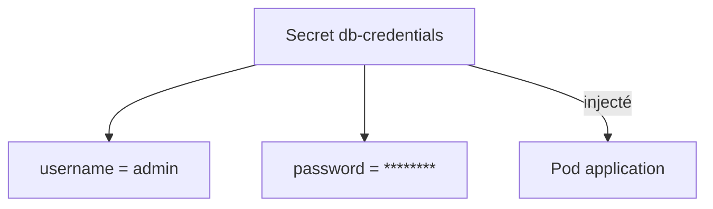
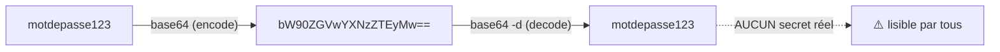
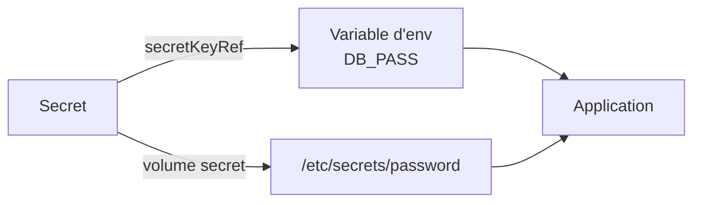
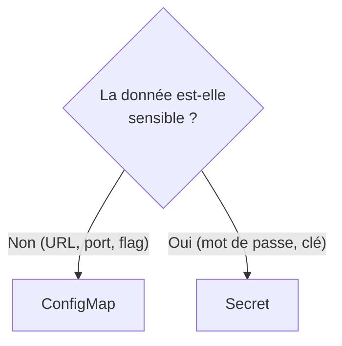
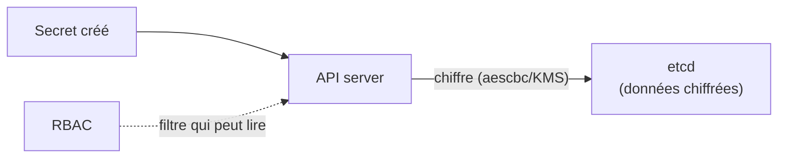
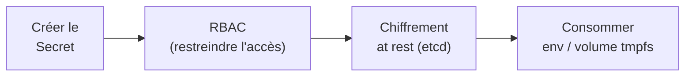

<a id="top"></a>

# 03 — Secrets : gérer les données sensibles

## Table des matières

| # | Section |
|---|---|
| 1 | [Qu'est-ce qu'un Secret](#section-1) |
| 2 | [base64 n'est pas du chiffrement](#section-2) |
| 3 | [Créer un Secret](#section-3) |
| 4 | [Consommer un Secret](#section-4) |
| 5 | [ConfigMap vs Secret](#section-5) |
| 6 | [Sécurité : RBAC et chiffrement at rest](#section-6) |
| 7 | [Quiz — Secrets](#section-7) |
| 8 | [Pratique — Injecter des identifiants](#section-8) |
| 9 | [Synthèse](#section-9) |

---

<a id="section-1"></a>

<details>
<summary>1 — Qu'est-ce qu'un Secret</summary>

<br/>

Un **Secret** est l'objet Kubernetes dédié aux **données sensibles** : mots de passe, jetons d'API, clés SSH, certificats TLS. Il fonctionne comme un ConfigMap, mais avec un traitement particulier (encodage, gestion d'accès, options de chiffrement).



Kubernetes propose plusieurs **types** de Secret selon l'usage :

| Type | Usage |
|---|---|
| `Opaque` | Données arbitraires (le plus courant) |
| `kubernetes.io/tls` | Certificat + clé TLS (cf. Ingress) |
| `kubernetes.io/dockerconfigjson` | Identifiants d'un registre privé |
| `kubernetes.io/basic-auth` | Identifiant + mot de passe |
| `kubernetes.io/ssh-auth` | Clé privée SSH |

> _Un Secret n'est **pas** un coffre-fort par défaut. C'est une convention qui « sépare » les données sensibles ; la vraie sécurité vient du **RBAC** et du **chiffrement at rest** (section 6)._

</details>

<p align="right"><a href="#top">↑ Retour en haut</a></p>

---

<a id="section-2"></a>

<details>
<summary>2 — base64 n'est pas du chiffrement</summary>

<br/>

Les valeurs d'un Secret sont stockées **encodées en base64** dans le champ `data`. C'est une source de malentendu majeure : **base64 est un encodage, pas un chiffrement**. N'importe qui peut le décoder instantanément.



```bash
# Encoder une valeur en base64
echo -n "motdepasse123" | base64
# -> bW90ZGVwYXNzZTEyMw==

# Décoder (n'importe qui peut le faire !)
echo "bW90ZGVwYXNzZTEyMw==" | base64 -d
# -> motdepasse123
```

| Idée reçue | Réalité |
|---|---|
| « base64 protège le secret » | ❌ C'est juste un encodage réversible |
| « les Secrets sont chiffrés » | ❌ Pas par défaut (en clair dans etcd) |
| « personne ne peut le lire » | ❌ Tout détenteur de droits `get secret` peut le décoder |

> _⚠️ Ne jamais committer un Secret YAML « base64 » dans Git en pensant qu'il est protégé. La protection réelle vient du chiffrement (SealedSecrets, External Secrets, Vault) et du RBAC._

**🔧 Mini-exercice —** Encode la chaîne `motdepasse` en base64 (sans saut de ligne), puis redécode le résultat pour vérifier.

<details>
<summary>✅ Voir une solution</summary>

```bash
echo -n "motdepasse" | base64
# -> bW90ZGVwYXNzZQ==
echo "bW90ZGVwYXNzZQ==" | base64 -d
# -> motdepasse
```

</details>

</details>

<p align="right"><a href="#top">↑ Retour en haut</a></p>

---

<a id="section-3"></a>

<details>
<summary>3 — Créer un Secret</summary>

<br/>

Méthode recommandée : `kubectl create secret` qui encode automatiquement en base64.

```bash
# Secret générique (Opaque) depuis des valeurs en clair
kubectl create secret generic db-credentials \
  --from-literal=username=admin \
  --from-literal=password='S3cr3t!2024'

# Depuis des fichiers (clé = nom du fichier)
kubectl create secret generic ssh-key \
  --from-file=id_rsa=./id_rsa

# Secret TLS (pour l'Ingress)
kubectl create secret tls exemple-tls \
  --cert=exemple.crt --key=exemple.key

# Identifiants d'un registre Docker privé
kubectl create secret docker-registry regcred \
  --docker-server=registry.exemple.com \
  --docker-username=ci \
  --docker-password='token123'
```

En YAML, on peut utiliser `stringData` pour écrire en **clair** (Kubernetes encode pour vous) :

```yaml
apiVersion: v1
kind: Secret
metadata:
  name: db-credentials
type: Opaque
stringData:           # valeurs en clair, encodées automatiquement
  username: admin
  password: "S3cr3t!2024"
```

```bash
# Vérifier (les valeurs apparaissent en base64)
kubectl get secret db-credentials -o yaml

# Décoder une clé précise
kubectl get secret db-credentials -o jsonpath='{.data.password}' | base64 -d
```

> _Astuce : `stringData` évite d'encoder soi-même en base64 et rend le YAML lisible. Kubernetes fusionne `stringData` dans `data` (encodé) à la création._

**🔧 Mini-exercice —** Crée un Secret générique `api-token` contenant la clé `token` avec la valeur `abc123` via `kubectl`.

<details>
<summary>✅ Voir une solution</summary>

```bash
kubectl create secret generic api-token \
  --from-literal=token=abc123
```

</details>

</details>

<p align="right"><a href="#top">↑ Retour en haut</a></p>

---

<a id="section-4"></a>

<details>
<summary>4 — Consommer un Secret</summary>

<br/>

Comme un ConfigMap, un Secret se consomme en **variables d'environnement** ou en **volume monté**.

```yaml
apiVersion: v1
kind: Pod
metadata:
  name: app-pod
spec:
  containers:
    - name: app
      image: mon-app:1.0
      # En variables d'environnement
      env:
        - name: DB_USER
          valueFrom:
            secretKeyRef:
              name: db-credentials
              key: username
        - name: DB_PASS
          valueFrom:
            secretKeyRef:
              name: db-credentials
              key: password
      # OU en volume monté (chaque clé = un fichier)
      volumeMounts:
        - name: secret-vol
          mountPath: /etc/secrets
          readOnly: true
  volumes:
    - name: secret-vol
      secret:
        secretName: db-credentials
```



| Mode | Quand l'utiliser |
|---|---|
| Variable d'env (`secretKeyRef`) | Simple, mais visible dans `kubectl describe pod` |
| Volume monté (`tmpfs`) | Plus sûr ; fichiers en mémoire, non écrits sur disque |

> _Le volume Secret est monté sur un système de fichiers **tmpfs** (en mémoire RAM) : le secret ne touche jamais le disque du nœud. C'est plus sûr que les variables d'environnement._

**🔧 Mini-exercice —** Injecte la clé `password` du Secret `db-credentials` dans une variable d'environnement nommée `DB_PASS`.

<details>
<summary>✅ Voir une solution</summary>

```yaml
env:
  - name: DB_PASS
    valueFrom:
      secretKeyRef:
        name: db-credentials
        key: password
```

</details>

</details>

<p align="right"><a href="#top">↑ Retour en haut</a></p>

---

<a id="section-5"></a>

<details>
<summary>5 — ConfigMap vs Secret</summary>

<br/>

Les deux objets se ressemblent beaucoup. La différence est l'**intention** et le **traitement de sécurité**.



| Critère | ConfigMap | Secret |
|---|---|---|
| Données visées | Non sensibles | Sensibles |
| Stockage | Texte clair | base64 (encodé, non chiffré par défaut) |
| Chiffrement at rest | Non concerné | Possible (EncryptionConfiguration) |
| Volume monté | Disque | **tmpfs** (mémoire) |
| Masquage dans logs/UI | Non | Oui (valeurs masquées) |
| Consommation | env / volume | env / volume (identique) |

> _Techniquement, un Secret est presque identique à un ConfigMap. Mais l'utiliser **signale l'intention** « ceci est sensible » et débloque les protections (RBAC ciblé, chiffrement, tmpfs)._

</details>

<p align="right"><a href="#top">↑ Retour en haut</a></p>

---

<a id="section-6"></a>

<details>
<summary>6 — Sécurité : RBAC et chiffrement at rest</summary>

<br/>

Pour qu'un Secret soit réellement sûr, deux mécanismes sont indispensables.

**1. RBAC (Role-Based Access Control)** — limiter qui peut lire les Secrets :

```yaml
apiVersion: rbac.authorization.k8s.io/v1
kind: Role
metadata:
  namespace: prod
  name: lecteur-secrets-app
rules:
  - apiGroups: [""]
    resources: ["secrets"]
    resourceNames: ["db-credentials"]   # un seul secret précis
    verbs: ["get"]
```

**2. Chiffrement at rest** — chiffrer les Secrets dans **etcd** (par défaut ils y sont en clair !) via une `EncryptionConfiguration` côté API server.



| Protection | Rôle |
|---|---|
| **RBAC** | Restreint l'accès en lecture aux Secrets |
| **Chiffrement at rest** | Chiffre les Secrets stockés dans etcd |
| **KMS provider** | Délègue la clé de chiffrement à un service cloud (AWS KMS, etc.) |
| **External Secrets / Vault** | Stocke les secrets hors du cluster, synchronisés à la demande |

> _⚠️ Par défaut, les Secrets sont stockés **en clair dans etcd**. Activez le **chiffrement at rest** et verrouillez le **RBAC** : sans cela, toute personne ayant accès à etcd ou aux droits `get secret` lit tout._

**🔧 Mini-exercice —** Écris une règle RBAC qui autorise uniquement la lecture (`get`) du Secret `db-credentials`.

<details>
<summary>✅ Voir une solution</summary>

```yaml
rules:
  - apiGroups: [""]
    resources: ["secrets"]
    resourceNames: ["db-credentials"]
    verbs: ["get"]
```

</details>

</details>

<p align="right"><a href="#top">↑ Retour en haut</a></p>

---

<a id="section-7"></a>

<details>
<summary>7 — Quiz — Secrets</summary>

<br/>

**Question 1 :** Comment sont stockées les valeurs d'un Secret dans le champ `data` ?

a) Chiffrées avec AES

b) Encodées en base64

c) En texte clair

d) Hachées avec SHA-256

<details>
<summary>💡 Voir la solution</summary>

✅ **Réponse : b)** — Les valeurs sont **encodées en base64**, ce qui n'est PAS du chiffrement : quiconque peut les décoder.

</details>

---

**Question 2 :** base64 protège-t-il un mot de passe ?

a) Oui, c'est un chiffrement fort

b) Non, c'est un simple encodage réversible

c) Oui, mais seulement pour les admins

d) Cela dépend de la longueur

<details>
<summary>💡 Voir la solution</summary>

✅ **Réponse : b)** — `base64 -d` décode instantanément. La protection vient du RBAC et du chiffrement at rest, pas de base64.

</details>

---

**Question 3 :** Quel champ YAML permet d'écrire les valeurs d'un Secret en **clair** (Kubernetes encode pour vous) ?

a) `data`

b) `stringData`

c) `plainData`

d) `rawData`

<details>
<summary>💡 Voir la solution</summary>

✅ **Réponse : b)** — `stringData` accepte du texte clair que Kubernetes encode automatiquement en base64 dans `data`.

</details>

---

**Question 4 :** Où sont stockés les Secrets par défaut côté serveur ?

a) Chiffrés dans etcd

b) En clair dans etcd

c) Dans un coffre-fort Vault intégré

d) Dans le système de fichiers de chaque nœud

<details>
<summary>💡 Voir la solution</summary>

✅ **Réponse : b)** — Par défaut, etcd stocke les Secrets **en clair**. Il faut activer une `EncryptionConfiguration` (chiffrement at rest) pour les protéger.

</details>

---

**Question 5 :** Quel mécanisme limite **qui** peut lire un Secret donné ?

a) Le base64

b) Le RBAC (Role / RoleBinding)

c) Le `pathType`

d) Le ConfigMap

<details>
<summary>💡 Voir la solution</summary>

✅ **Réponse : b)** — Le RBAC restreint l'accès aux ressources `secrets`, idéalement à un Secret précis via `resourceNames`.

</details>

</details>

<p align="right"><a href="#top">↑ Retour en haut</a></p>

---

<a id="section-8"></a>

<details>
<summary>8 — Pratique — Injecter des identifiants</summary>

<br/>

### Consigne

Créez un Secret `app-db` avec `DB_USER=appuser` et `DB_PASSWORD=Pa55w0rd!`, puis un Pod qui :
- reçoit `DB_USER` et `DB_PASSWORD` comme variables d'environnement ;
- monte le Secret en lecture seule dans `/etc/db`.

Vérifiez sans exposer le mot de passe en clair dans le manifeste versionné (utilisez `stringData` mais ne committez pas le fichier).

---

### Correction — Manifeste et commandes attendus

```yaml
# app-db.yaml  (NE PAS committer : contient un secret)
apiVersion: v1
kind: Secret
metadata:
  name: app-db
type: Opaque
stringData:
  DB_USER: appuser
  DB_PASSWORD: "Pa55w0rd!"
---
apiVersion: v1
kind: Pod
metadata:
  name: db-client
spec:
  containers:
    - name: client
      image: postgres:16
      command: ["sleep", "3600"]
      env:
        - name: DB_USER
          valueFrom:
            secretKeyRef:
              name: app-db
              key: DB_USER
        - name: DB_PASSWORD
          valueFrom:
            secretKeyRef:
              name: app-db
              key: DB_PASSWORD
      volumeMounts:
        - name: db-secret
          mountPath: /etc/db
          readOnly: true
  volumes:
    - name: db-secret
      secret:
        secretName: app-db
```

```bash
# 1. Appliquer
kubectl apply -f app-db.yaml

# 2. Vérifier la variable d'environnement
kubectl exec db-client -- printenv DB_USER

# 3. Vérifier le fichier monté (tmpfs, en mémoire)
kubectl exec db-client -- ls /etc/db
kubectl exec db-client -- cat /etc/db/DB_USER

# 4. Confirmer que le mot de passe est bien encodé dans etcd
kubectl get secret app-db -o jsonpath='{.data.DB_PASSWORD}' | base64 -d
```

**Résultat attendu :**

```
$ kubectl exec db-client -- printenv DB_USER
appuser

$ kubectl exec db-client -- ls /etc/db
DB_PASSWORD  DB_USER

$ kubectl get secret app-db -o jsonpath='{.data.DB_PASSWORD}' | base64 -d
Pa55w0rd!
```

> _Le fichier `app-db.yaml` contient un secret en clair : ajoutez-le au `.gitignore`. En production, on utilise **SealedSecrets** ou **External Secrets Operator** pour versionner sans exposer._

</details>

<p align="right"><a href="#top">↑ Retour en haut</a></p>

---

<a id="section-9"></a>

<details>
<summary>9 — Synthèse</summary>

<br/>

#### Points à retenir

1. Le **Secret** stocke les données **sensibles** (mots de passe, clés, certificats TLS).
2. **base64 ≠ chiffrement** : les valeurs sont encodées, pas protégées en soi.
3. Consommation identique au ConfigMap : **env** (`secretKeyRef`) ou **volume** (monté en **tmpfs**).
4. **ConfigMap = non sensible / Secret = sensible** : l'intention déclenche les protections.
5. Sécurité réelle = **RBAC** (qui peut lire) + **chiffrement at rest** dans etcd (+ Vault/External Secrets).



#### La suite

Leçon **04 — Service LoadBalancer dans le cloud** : exposer une application sur Internet via les fournisseurs cloud (AWS / GCP / Azure).

</details>

<p align="right"><a href="#top">↑ Retour en haut</a></p>

---

<p align="center">
  <em>Tous droits réservés. Toute reproduction, diffusion, utilisation ou adaptation de ce cours, en tout ou en partie, est strictement interdite sans l'autorisation écrite préalable de Dr. Haythem REHOUMA.</em>
</p>

<p align="center">
  <strong>Cours créé par Dr. Haythem REHOUMA — Développement et déploiement de solutions de données</strong>
</p>
