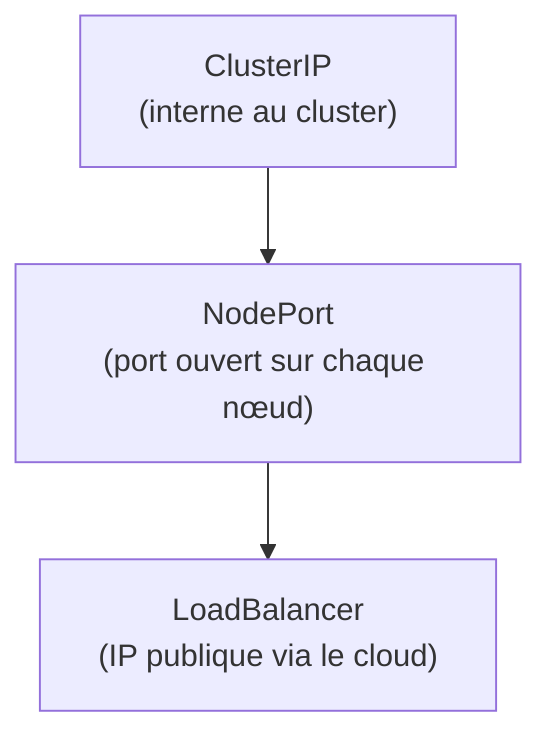
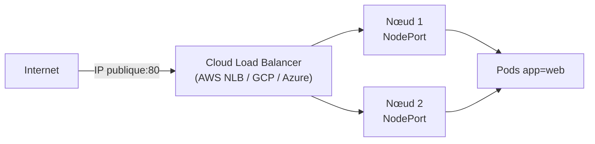
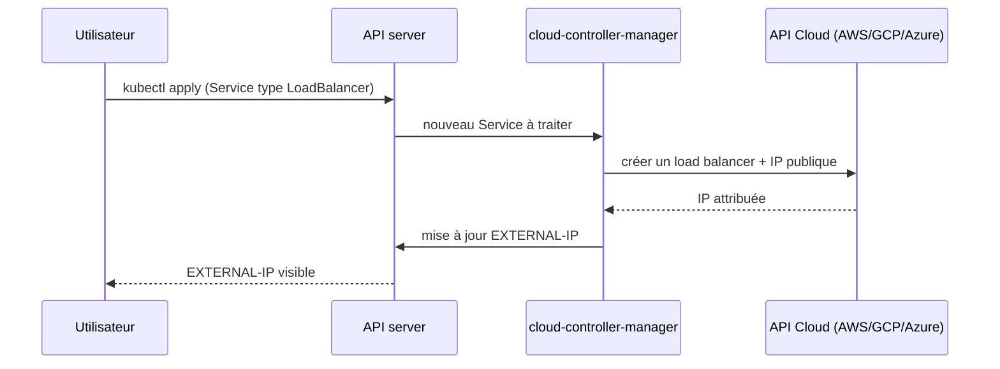
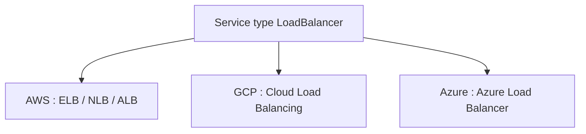
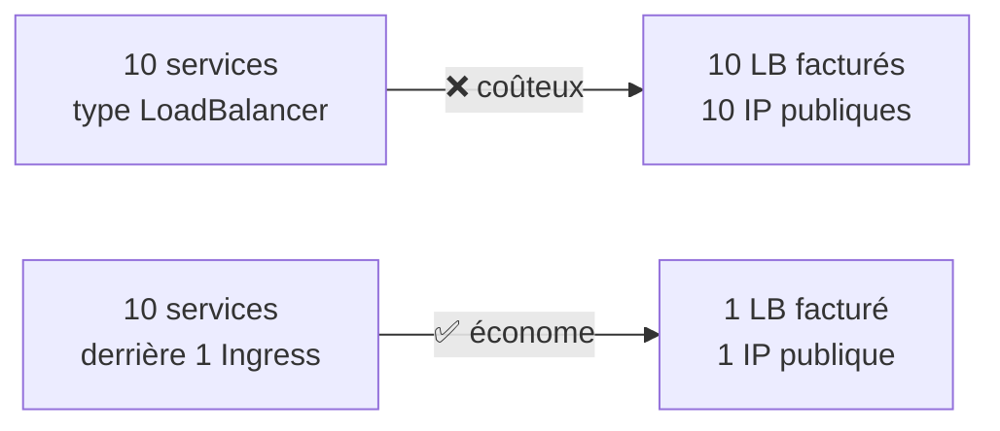
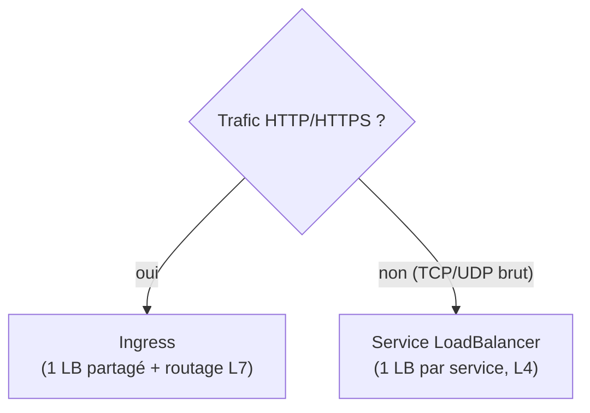
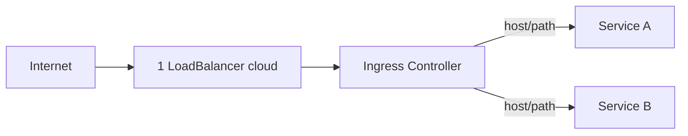
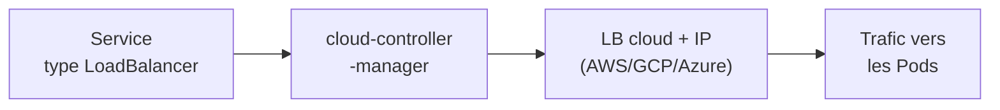

<a id="top"></a>

# 04 — Service LoadBalancer dans le cloud

## Table des matières

| # | Section |
|---|---|
| 1 | [Les types de Service en rappel](#section-1) |
| 2 | [Le type LoadBalancer](#section-2) |
| 3 | [Provisionnement automatique par le cloud](#section-3) |
| 4 | [Intégration AWS / GCP / Azure](#section-4) |
| 5 | [Coûts et considérations](#section-5) |
| 6 | [LoadBalancer vs Ingress : que choisir ?](#section-6) |
| 7 | [Quiz — Cloud LoadBalancer](#section-7) |
| 8 | [Pratique — Exposer un service sur Internet](#section-8) |
| 9 | [Synthèse](#section-9) |

---

<a id="section-1"></a>

<details>
<summary>1 — Les types de Service en rappel</summary>

<br/>

Avant de plonger dans le `LoadBalancer`, replaçons-le parmi les trois types de Service Kubernetes, du plus interne au plus exposé.



| Type | Portée | Accès |
|---|---|---|
| `ClusterIP` | Interne | Uniquement depuis le cluster (défaut) |
| `NodePort` | Nœuds | `IP-du-noeud:30000-32767` |
| `LoadBalancer` | Internet | IP publique stable, équilibrage automatique |
| `ExternalName` | DNS | Alias vers un nom DNS externe |

> _Le `LoadBalancer` **englobe** les deux autres : en interne, il crée un `ClusterIP` et un `NodePort`, puis demande au cloud un répartiteur de charge externe qui pointe vers ces NodePorts._

</details>

<p align="right"><a href="#top">↑ Retour en haut</a></p>

---

<a id="section-2"></a>

<details>
<summary>2 — Le type LoadBalancer</summary>

<br/>

Un Service `type: LoadBalancer` demande à l'infrastructure sous-jacente (un **cloud**) de fournir un répartiteur de charge externe avec une **IP publique**.

```yaml
apiVersion: v1
kind: Service
metadata:
  name: web-lb
spec:
  type: LoadBalancer
  selector:
    app: web
  ports:
    - protocol: TCP
      port: 80          # port exposé publiquement
      targetPort: 8080  # port du conteneur
```



```bash
# Créer le service et observer l'attribution de l'IP
kubectl apply -f web-lb.yaml
kubectl get svc web-lb -w     # EXTERNAL-IP passe de <pending> à une IP réelle
```

| Champ | Rôle |
|---|---|
| `type: LoadBalancer` | Déclenche le provisionnement cloud |
| `port` | Port public d'écoute |
| `targetPort` | Port du conteneur derrière |
| `EXTERNAL-IP` | IP publique attribuée par le cloud |

> _Sur un cluster **local** (Minikube, kind, bare-metal), `EXTERNAL-IP` reste `<pending>` : il n'y a pas de cloud pour fournir le LB. On utilise alors `minikube tunnel` ou **MetalLB** pour simuler le comportement._

**🔧 Mini-exercice —** Surveille en temps réel l'attribution de l'`EXTERNAL-IP` du Service `web-lb`.

<details>
<summary>✅ Voir une solution</summary>

```bash
kubectl get svc web-lb -w
```

L'option `-w` (watch) affiche les changements jusqu'à ce que `EXTERNAL-IP` passe de `<pending>` à une IP réelle.

</details>

</details>

<p align="right"><a href="#top">↑ Retour en haut</a></p>

---

<a id="section-3"></a>

<details>
<summary>3 — Provisionnement automatique par le cloud</summary>

<br/>

La magie du `LoadBalancer` vient du **cloud-controller-manager** : un composant qui surveille les Services et dialogue avec l'API du fournisseur pour créer/supprimer les répartiteurs.



| Étape | Acteur |
|---|---|
| Déclaration du Service | Vous (`kubectl apply`) |
| Détection | cloud-controller-manager |
| Création du LB + IP | API du fournisseur cloud |
| Mise à jour de `EXTERNAL-IP` | Kubernetes |
| Suppression du LB | Automatique au `kubectl delete svc` |

> _Le cycle de vie est **automatique** : supprimer le Service supprime le load balancer cloud (et arrête la facturation associée). Ne supprimez jamais un LB à la main côté console cloud, sinon Kubernetes le recréera._

</details>

<p align="right"><a href="#top">↑ Retour en haut</a></p>

---

<a id="section-4"></a>

<details>
<summary>4 — Intégration AWS / GCP / Azure</summary>

<br/>

Chaque fournisseur a son propre type de répartiteur, configurable via des **annotations**.

```yaml
# Exemple AWS : Network Load Balancer interne
apiVersion: v1
kind: Service
metadata:
  name: web-lb
  annotations:
    service.beta.kubernetes.io/aws-load-balancer-type: "nlb"
    service.beta.kubernetes.io/aws-load-balancer-internal: "true"
spec:
  type: LoadBalancer
  selector:
    app: web
  ports:
    - port: 80
      targetPort: 8080
```



| Cloud | Produit créé | Annotation typique |
|---|---|---|
| **AWS** (EKS) | Classic LB, **NLB** ou ALB | `service.beta.kubernetes.io/aws-load-balancer-type` |
| **GCP** (GKE) | Cloud Load Balancing | `cloud.google.com/load-balancer-type: "Internal"` |
| **Azure** (AKS) | Azure Load Balancer | `service.beta.kubernetes.io/azure-load-balancer-internal: "true"` |

```bash
# Décrire le service pour voir le LB cloud créé
kubectl describe svc web-lb
```

> _Les annotations permettent de régler le LB sans quitter Kubernetes : LB interne vs externe, type (NLB/ALB), certificat TLS managé, journalisation d'accès, sous-réseaux, etc._

**🔧 Mini-exercice —** Ajoute les annotations AWS qui demandent un Network Load Balancer (NLB) **interne** sur un Service.

<details>
<summary>✅ Voir une solution</summary>

```yaml
metadata:
  annotations:
    service.beta.kubernetes.io/aws-load-balancer-type: "nlb"
    service.beta.kubernetes.io/aws-load-balancer-internal: "true"
```

</details>

</details>

<p align="right"><a href="#top">↑ Retour en haut</a></p>

---

<a id="section-5"></a>

<details>
<summary>5 — Coûts et considérations</summary>

<br/>

Le confort du `LoadBalancer` a un **prix** : chaque Service de ce type provisionne un répartiteur **facturé** par le cloud, indépendamment du trafic.



| Considération | Détail |
|---|---|
| **Coût fixe** | Chaque LB est facturé à l'heure, même sans trafic |
| **Coût au trafic** | Facturation par Go traité / nombre de règles |
| **Quotas d'IP** | Les IP publiques sont limitées par compte/région |
| **Délai de création** | Quelques minutes pour provisionner le LB |
| **Protocole** | L4 (TCP/UDP) : pas de routage HTTP intelligent |

> _Règle d'économie : pour du HTTP/HTTPS, n'exposez **pas** chaque service en `LoadBalancer`. Mettez **un seul** LoadBalancer devant un **Ingress Controller**, et routez ensuite par host/path (leçon 01)._

**🔧 Mini-exercice —** Supprime le Service `web-lb` pour arrêter la facturation du LoadBalancer cloud après un test.

<details>
<summary>✅ Voir une solution</summary>

```bash
kubectl delete svc web-lb
```

Supprimer le Service déclenche automatiquement la suppression du load balancer cloud associé.

</details>

</details>

<p align="right"><a href="#top">↑ Retour en haut</a></p>

---

<a id="section-6"></a>

<details>
<summary>6 — LoadBalancer vs Ingress : que choisir ?</summary>

<br/>



| Besoin | Solution recommandée |
|---|---|
| Plusieurs sites/API HTTP | **Ingress** (1 LB, routage host/path, TLS) |
| Base de données exposée (PostgreSQL) | **LoadBalancer** (TCP brut) |
| Serveur de jeu / MQTT / gRPC brut | **LoadBalancer** |
| Réduire les coûts cloud | **Ingress** mutualisé |
| Terminaison TLS centralisée | **Ingress** (ou LB avec cert managé) |

L'architecture standard combine les deux : un **seul** Service `LoadBalancer` (créé automatiquement par l'Ingress Controller) sert de point d'entrée, et l'Ingress route ensuite en L7.



> _Le `LoadBalancer` n'est pas « dépassé » par l'Ingress : c'est lui qui **alimente** l'Ingress Controller. La bonne pratique est d'en avoir **un seul**, partagé par tout le trafic HTTP._

</details>

<p align="right"><a href="#top">↑ Retour en haut</a></p>

---

<a id="section-7"></a>

<details>
<summary>7 — Quiz — Cloud LoadBalancer</summary>

<br/>

**Question 1 :** Que déclenche un Service `type: LoadBalancer` dans un cluster cloud ?

a) La création d'un Pod supplémentaire

b) Le provisionnement automatique d'un répartiteur de charge externe avec IP publique

c) Le chiffrement des Secrets

d) Rien sans Ingress Controller

<details>
<summary>💡 Voir la solution</summary>

✅ **Réponse : b)** — Le cloud-controller-manager demande au fournisseur un load balancer et une IP publique, mis dans `EXTERNAL-IP`.

</details>

---

**Question 2 :** Sur Minikube, que vaut `EXTERNAL-IP` pour un Service LoadBalancer ?

a) Une IP publique réelle

b) `<pending>` (pas de cloud pour le provisionner)

c) `127.0.0.1` automatiquement

d) L'IP du master

<details>
<summary>💡 Voir la solution</summary>

✅ **Réponse : b)** — Sans cloud, l'IP reste `<pending>`. On utilise `minikube tunnel` ou MetalLB pour simuler le comportement.

</details>

---

**Question 3 :** À quelle couche OSI travaille un Service LoadBalancer ?

a) Couche 7 (HTTP)

b) Couche 4 (TCP/UDP)

c) Couche 2

d) Couche 3 uniquement

<details>
<summary>💡 Voir la solution</summary>

✅ **Réponse : b)** — Le LoadBalancer est en L4 (TCP/UDP) : il ne comprend pas le contenu HTTP, contrairement à l'Ingress (L7).

</details>

---

**Question 4 :** Pourquoi éviter d'exposer 10 services HTTP en 10 Services LoadBalancer ?

a) C'est interdit par Kubernetes

b) Chaque LB est facturé séparément : c'est coûteux ; un Ingress mutualise tout

c) Les Pods plantent

d) Cela double la latence

<details>
<summary>💡 Voir la solution</summary>

✅ **Réponse : b)** — Chaque LoadBalancer coûte (IP + facturation horaire). Pour du HTTP, on met un seul LB devant un Ingress Controller.

</details>

---

**Question 5 :** Comment configure-t-on un LB AWS interne ou de type NLB depuis Kubernetes ?

a) En modifiant l'image Docker

b) Via des annotations sur le Service

c) En éditant etcd manuellement

d) Ce n'est pas possible

<details>
<summary>💡 Voir la solution</summary>

✅ **Réponse : b)** — Les annotations `service.beta.kubernetes.io/aws-load-balancer-*` règlent le type, le caractère interne/externe, le TLS, etc.

</details>

</details>

<p align="right"><a href="#top">↑ Retour en haut</a></p>

---

<a id="section-8"></a>

<details>
<summary>8 — Pratique — Exposer un service sur Internet</summary>

<br/>

### Consigne

Vous avez un déploiement `web` (3 réplicas, conteneur sur le port 8080). Exposez-le sur Internet via un Service `type: LoadBalancer` sur le port 80, puis récupérez l'IP publique et testez l'accès.

---

### Correction — Manifeste et commandes attendus

```yaml
# web-lb.yaml
apiVersion: apps/v1
kind: Deployment
metadata:
  name: web
spec:
  replicas: 3
  selector:
    matchLabels:
      app: web
  template:
    metadata:
      labels:
        app: web
    spec:
      containers:
        - name: web
          image: hashicorp/http-echo
          args: ["-text=Bonjour depuis le cloud", "-listen=:8080"]
          ports:
            - containerPort: 8080
---
apiVersion: v1
kind: Service
metadata:
  name: web-lb
spec:
  type: LoadBalancer
  selector:
    app: web
  ports:
    - protocol: TCP
      port: 80
      targetPort: 8080
```

```bash
# 1. Appliquer
kubectl apply -f web-lb.yaml

# 2. Attendre l'attribution de l'IP publique
kubectl get svc web-lb -w
# (sur Minikube : ouvrir un autre terminal et lancer "minikube tunnel")

# 3. Récupérer l'IP externe
EXTERNAL_IP=$(kubectl get svc web-lb -o jsonpath='{.status.loadBalancer.ingress[0].ip}')

# 4. Tester l'accès
curl http://$EXTERNAL_IP/
```

**Résultat attendu :**

```
$ kubectl get svc web-lb
NAME     TYPE           CLUSTER-IP      EXTERNAL-IP     PORT(S)        AGE
web-lb   LoadBalancer   10.96.120.45    52.14.33.201    80:31578/TCP   2m

$ curl http://52.14.33.201/
Bonjour depuis le cloud
```

> _Pensez à `kubectl delete svc web-lb` après le TP : un LoadBalancer cloud oublié continue d'être **facturé** même sans trafic._

</details>

<p align="right"><a href="#top">↑ Retour en haut</a></p>

---

<a id="section-9"></a>

<details>
<summary>9 — Synthèse</summary>

<br/>

#### Points à retenir

1. Le Service **`LoadBalancer`** provisionne **automatiquement** un répartiteur cloud + IP publique (L4, TCP/UDP).
2. C'est le **cloud-controller-manager** qui dialogue avec AWS/GCP/Azure pour créer/supprimer le LB.
3. Sur cluster **local**, `EXTERNAL-IP` reste `<pending>` (utiliser `minikube tunnel` / MetalLB).
4. Les **annotations** règlent le type de LB (NLB/ALB), interne/externe, TLS managé selon le cloud.
5. **Coût** : un LB par service est cher → pour du HTTP, mutualiser via **un seul LB + Ingress**.



#### La suite

Vous maîtrisez désormais les concepts avancés de Kubernetes : **Ingress**, **ConfigMaps**, **Secrets** et **LoadBalancer**. Le module suivant aborde la mise à l'échelle, l'observabilité et le déploiement continu de vos applications.

</details>

<p align="right"><a href="#top">↑ Retour en haut</a></p>

---

<p align="center">
  <em>Tous droits réservés. Toute reproduction, diffusion, utilisation ou adaptation de ce cours, en tout ou en partie, est strictement interdite sans l'autorisation écrite préalable de Dr. Haythem REHOUMA.</em>
</p>

<p align="center">
  <strong>Cours créé par Dr. Haythem REHOUMA — Développement et déploiement de solutions de données</strong>
</p>
