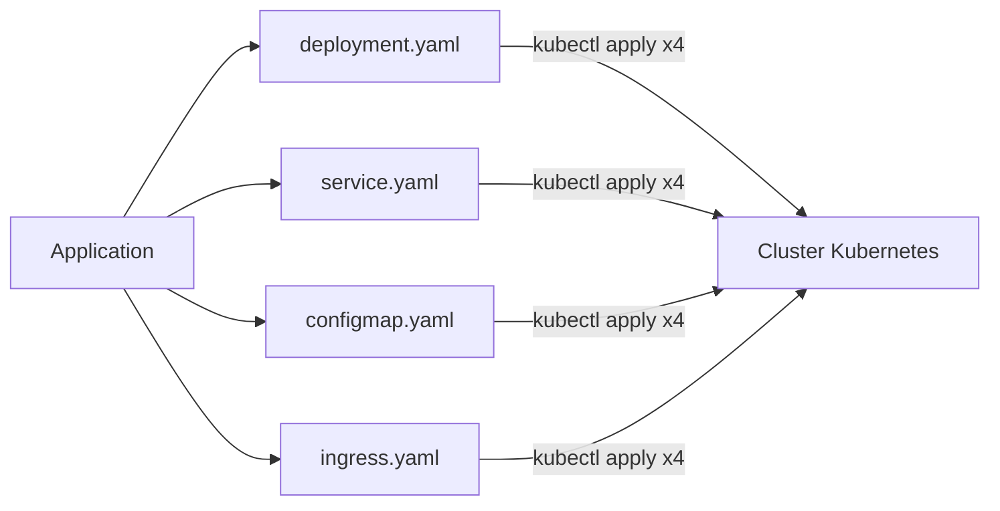
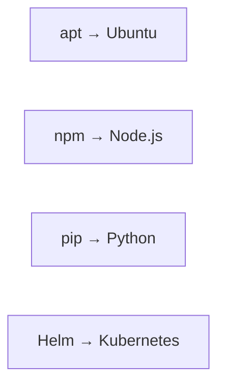
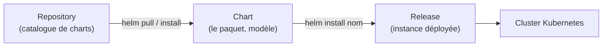
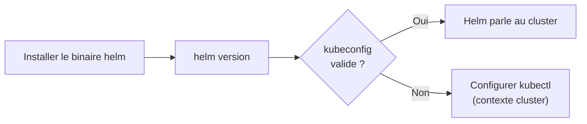
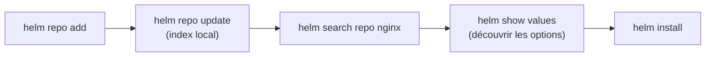
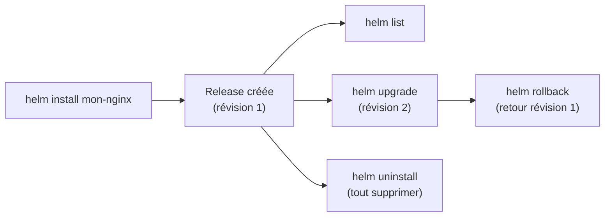
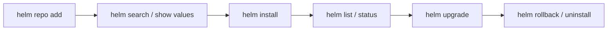

<a id="top"></a>

# 01 — Introduction à Helm

## Table des matières

| # | Section |
|---|---|
| 1 | [Le problème : déployer sur Kubernetes à la main](#section-1) |
| 2 | [Helm, le gestionnaire de paquets de Kubernetes](#section-2) |
| 3 | [Les trois concepts clés : chart, release, repository](#section-3) |
| 4 | [Installation de Helm](#section-4) |
| 5 | [Ajouter un dépôt et chercher un chart](#section-5) |
| 6 | [Installer, lister et désinstaller](#section-6) |
| 7 | [Quiz — Introduction à Helm](#section-7) |
| 8 | [Pratique — Déployer NGINX avec Helm](#section-8) |
| 9 | [Synthèse](#section-9) |

---

<a id="section-1"></a>

<details>
<summary>1 — Le problème : déployer sur Kubernetes à la main</summary>

<br/>

Déployer une application sur Kubernetes implique souvent **plusieurs fichiers YAML** : un `Deployment`, un `Service`, un `ConfigMap`, un `Ingress`, parfois un `Secret`… Chacun doit être appliqué avec `kubectl apply -f`.

```bash
# Déploiement "à la main" : un fichier après l'autre
kubectl apply -f deployment.yaml
kubectl apply -f service.yaml
kubectl apply -f configmap.yaml
kubectl apply -f ingress.yaml
```

Ce mode de travail devient vite douloureux :

| Problème | Conséquence |
|---|---|
| Plusieurs fichiers à appliquer dans le bon ordre | Erreurs d'oubli, déploiements partiels |
| Valeurs codées en dur (image, réplicas, port) | Impossible de réutiliser pour `dev` / `prod` |
| Pas de notion de **version** du déploiement | Difficile de revenir en arrière (rollback) |
| Désinstaller = supprimer chaque objet à la main | Ressources « orphelines » oubliées |



> _Sans Helm, chaque modification (changer le nombre de réplicas, l'image, un port) oblige à rééditer plusieurs YAML et à les réappliquer un par un. C'est répétitif et source d'erreurs._

</details>

<p align="right"><a href="#top">↑ Retour en haut</a></p>

---

<a id="section-2"></a>

<details>
<summary>2 — Helm, le gestionnaire de paquets de Kubernetes</summary>

<br/>

**Helm** est au cluster Kubernetes ce qu'`apt` est à Ubuntu ou ce que `npm` est à Node.js : un **gestionnaire de paquets**. Il regroupe tous les fichiers YAML d'une application dans un **paquet versionné** que l'on installe, met à jour et désinstalle en **une seule commande**.



| Sans Helm | Avec Helm |
|---|---|
| `kubectl apply -f` x N fichiers | `helm install mon-app ./chart` |
| Valeurs codées en dur | Valeurs paramétrables (`values.yaml`) |
| Pas de version | Chaque déploiement est une **release** versionnée |
| Rollback manuel | `helm rollback mon-app 1` |
| Suppression fichier par fichier | `helm uninstall mon-app` |

Helm apporte trois super-pouvoirs :

1. **Templating** : un même chart génère des YAML différents selon les valeurs fournies.
2. **Versionnement** : chaque installation/mise à jour crée une *révision* que l'on peut inspecter et annuler.
3. **Partage** : on publie et on récupère des charts depuis des dépôts publics ou privés.

> _Helm 3 (la version actuelle) fonctionne **uniquement côté client** : plus besoin de « Tiller » côté serveur comme en Helm 2. Helm parle directement à l'API de Kubernetes avec votre `kubeconfig`._

</details>

<p align="right"><a href="#top">↑ Retour en haut</a></p>

---

<a id="section-3"></a>

<details>
<summary>3 — Les trois concepts clés : chart, release, repository</summary>

<br/>

Toute la culture Helm tient dans **trois mots**. Il faut les distinguer clairement.



| Concept | Définition | Analogie |
|---|---|---|
| **Chart** | Le **paquet** : un dossier de templates + valeurs par défaut décrivant une application | Le « modèle » / la recette de cuisine |
| **Release** | Une **instance installée** d'un chart dans le cluster, avec un nom unique | Le plat préparé à partir de la recette |
| **Repository** | Un **catalogue** distant qui héberge des charts téléchargeables | L'App Store / la bibliothèque de recettes |

Un même **chart** peut donner plusieurs **releases** : on peut installer le chart `nginx` deux fois sous les noms `site-vitrine` et `site-blog`, avec des valeurs différentes.

```bash
# Un chart, deux releases distinctes
helm install site-vitrine bitnami/nginx
helm install site-blog    bitnami/nginx --set replicaCount=3
```

**🔧 Mini-exercice —** Écris la commande qui installe le chart `bitnami/redis` sous le nom de release `cache-prod`.

<details>
<summary>✅ Voir une solution</summary>

```bash
helm install cache-prod bitnami/redis
```

</details>

> _Erreur fréquente du débutant : confondre **chart** et **release**. Le chart est le *modèle* réutilisable ; la release est *une* application réellement déployée dans le cluster avec son propre nom._

</details>

<p align="right"><a href="#top">↑ Retour en haut</a></p>

---

<a id="section-4"></a>

<details>
<summary>4 — Installation de Helm</summary>

<br/>

Helm est un simple **binaire client**. On l'installe selon son système d'exploitation.

```bash
# Linux / macOS : script officiel
curl https://raw.githubusercontent.com/helm/helm/main/scripts/get-helm-3 | bash

# macOS avec Homebrew
brew install helm

# Windows avec Chocolatey
choco install kubernetes-helm
```

Vérifier l'installation :

```bash
# Afficher la version installée
helm version
# version.BuildInfo{Version:"v3.14.0", GitCommit:"...", GoVersion:"go1.21"}
```



| Pré-requis | Pourquoi |
|---|---|
| `kubectl` configuré | Helm réutilise le **même** `~/.kube/config` |
| Un cluster accessible | minikube, kind, EKS, GKE, AKS… |
| Droits suffisants (RBAC) | Pour créer Deployments, Services, etc. |

> _Helm n'a **pas** sa propre connexion au cluster : il s'appuie sur le contexte courant de `kubectl`. Si `kubectl get pods` fonctionne, Helm fonctionnera aussi._

</details>

<p align="right"><a href="#top">↑ Retour en haut</a></p>

---

<a id="section-5"></a>

<details>
<summary>5 — Ajouter un dépôt et chercher un chart</summary>

<br/>

Pour installer des charts publics, on **ajoute d'abord un dépôt** (repository), puis on met à jour son index local.

```bash
# Ajouter le dépôt public Bitnami
helm repo add bitnami https://charts.bitnami.com/bitnami

# Mettre à jour l'index local des dépôts
helm repo update

# Lister les dépôts configurés
helm repo list
```

Chercher un chart dans les dépôts ajoutés :

```bash
# Chercher tous les charts contenant "nginx"
helm search repo nginx

# Voir les valeurs par défaut d'un chart avant de l'installer
helm show values bitnami/nginx
```



| Commande | Rôle |
|---|---|
| `helm repo add <nom> <url>` | Enregistrer un dépôt |
| `helm repo update` | Rafraîchir le catalogue local |
| `helm search repo <mot>` | Chercher un chart dans les dépôts ajoutés |
| `helm search hub <mot>` | Chercher dans **Artifact Hub** (catalogue mondial) |
| `helm show values <chart>` | Afficher les valeurs configurables |

**🔧 Mini-exercice —** Ajoute le dépôt Bitnami puis rafraîchis l'index local en deux commandes.

<details>
<summary>✅ Voir une solution</summary>

```bash
helm repo add bitnami https://charts.bitnami.com/bitnami
helm repo update
```

</details>

> _Réflexe avant toute installation : `helm show values <chart>` pour découvrir **ce que l'on peut personnaliser** (image, réplicas, ressources, service…) sans deviner._

</details>

<p align="right"><a href="#top">↑ Retour en haut</a></p>

---

<a id="section-6"></a>

<details>
<summary>6 — Installer, lister et désinstaller</summary>

<br/>

Le cœur du quotidien Helm tient en trois verbes : **install**, **list**, **uninstall**.

```bash
# Installer un chart sous le nom de release "mon-nginx"
helm install mon-nginx bitnami/nginx

# Lister les releases installées (namespace courant)
helm list

# Lister dans tous les namespaces
helm list --all-namespaces

# Voir le détail / statut d'une release
helm status mon-nginx

# Désinstaller (supprime tous les objets de la release)
helm uninstall mon-nginx
```



| Commande | Effet |
|---|---|
| `helm install <nom> <chart>` | Crée une nouvelle release |
| `helm list` | Liste les releases du namespace |
| `helm status <nom>` | Statut, ressources, notes de la release |
| `helm upgrade <nom> <chart>` | Met à jour une release (nouvelle révision) |
| `helm rollback <nom> <rev>` | Revient à une révision antérieure |
| `helm uninstall <nom>` | Supprime la release et ses objets |

**🔧 Mini-exercice —** Écris la commande qui ramène la release `mon-nginx` à sa révision 1.

<details>
<summary>✅ Voir une solution</summary>

```bash
helm rollback mon-nginx 1
```

</details>

> _Chaque `helm install` puis `helm upgrade` incrémente le numéro de **révision**. C'est ce qui rend `helm rollback` possible : revenir à l'état précédent en une commande, sans réécrire de YAML._

</details>

<p align="right"><a href="#top">↑ Retour en haut</a></p>

---

<a id="section-7"></a>

<details>
<summary>7 — Quiz — Introduction à Helm</summary>

<br/>

**Question 1 :** Comment décrit-on le mieux Helm ?

a) Un éditeur de YAML

b) Le gestionnaire de paquets de Kubernetes

c) Un remplaçant de Docker

d) Un service cloud payant

<details>
<summary>💡 Voir la solution</summary>

✅ **Réponse : b)** — Helm est au cluster Kubernetes ce qu'`apt` est à Ubuntu : il package, installe, met à jour et désinstalle des applications en une commande.

</details>

---

**Question 2 :** Quelle est la différence entre un *chart* et une *release* ?

a) Aucune, ce sont des synonymes

b) Le chart est le modèle/paquet, la release est une instance installée dans le cluster

c) Le chart est installé, la release est le modèle

d) La release est un fichier YAML, le chart est une commande

<details>
<summary>💡 Voir la solution</summary>

✅ **Réponse : b)** — Le **chart** est le paquet réutilisable (la recette) ; la **release** est une application réellement déployée à partir de ce chart, avec un nom unique.

</details>

---

**Question 3 :** Quelle commande ajoute un dépôt de charts ?

a) `helm add repo <url>`

b) `helm repo add <nom> <url>`

c) `helm install repo <url>`

d) `helm get repo <url>`

<details>
<summary>💡 Voir la solution</summary>

✅ **Réponse : b)** — `helm repo add <nom> <url>` enregistre le dépôt, puis `helm repo update` rafraîchit l'index local.

</details>

---

**Question 4 :** Que fait `helm uninstall mon-app` ?

a) Supprime uniquement le Deployment

b) Met l'application en pause

c) Supprime la release et tous ses objets Kubernetes

d) Désinstalle le binaire Helm

<details>
<summary>💡 Voir la solution</summary>

✅ **Réponse : c)** — `helm uninstall` retire la release **et** tous les objets qu'elle avait créés (Deployment, Service, ConfigMap…), évitant les ressources orphelines.

</details>

---

**Question 5 :** En Helm 3, où s'exécute Helm ?

a) Uniquement côté serveur, via un composant « Tiller »

b) Côté client, en utilisant le kubeconfig de kubectl

c) Dans un pod dédié obligatoire

d) Sur un serveur cloud Helm

<details>
<summary>💡 Voir la solution</summary>

✅ **Réponse : b)** — Helm 3 est purement côté client : il a supprimé Tiller et parle directement à l'API Kubernetes via le `~/.kube/config` existant.

</details>

</details>

<p align="right"><a href="#top">↑ Retour en haut</a></p>

---

<a id="section-8"></a>

<details>
<summary>8 — Pratique — Déployer NGINX avec Helm</summary>

<br/>

### Consigne

Sur un cluster local (minikube ou kind), installez un serveur NGINX via le chart Bitnami sous le nom de release `web-demo`, vérifiez qu'il tourne, puis désinstallez-le proprement.

---

### Correction — Suite de commandes attendue

```bash
# 1. Ajouter le dépôt Bitnami et rafraîchir l'index
helm repo add bitnami https://charts.bitnami.com/bitnami
helm repo update

# 2. (Optionnel) Découvrir les valeurs configurables
helm show values bitnami/nginx | head -40

# 3. Installer le chart sous le nom "web-demo"
helm install web-demo bitnami/nginx

# 4. Vérifier que la release est bien installée
helm list

# 5. Vérifier le statut et les pods créés
helm status web-demo
kubectl get pods

# 6. Désinstaller proprement
helm uninstall web-demo
```

**Résultat attendu de `helm list` :**

```
NAME      NAMESPACE  REVISION  STATUS    CHART          APP VERSION
web-demo  default    1         deployed  nginx-15.x.x   1.25.x
```

**Résultat attendu de `kubectl get pods` :**

```
NAME                        READY   STATUS    RESTARTS   AGE
web-demo-nginx-7c9f...-x   1/1     Running   0          40s
```

> _Après `helm uninstall web-demo`, relancez `kubectl get pods` : le pod doit disparaître. C'est la preuve que Helm a bien nettoyé **tous** les objets de la release, sans rien laisser derrière._

</details>

<p align="right"><a href="#top">↑ Retour en haut</a></p>

---

<a id="section-9"></a>

<details>
<summary>9 — Synthèse</summary>

<br/>

#### Points à retenir

1. **Helm = gestionnaire de paquets** de Kubernetes (comme `apt` pour Ubuntu).
2. Il résout la douleur du **multi-YAML appliqué à la main** : une commande au lieu de N `kubectl apply`.
3. **Trois concepts** : *chart* (le paquet/modèle), *release* (l'instance déployée), *repository* (le catalogue).
4. **Installation** : un binaire client, qui réutilise le `kubeconfig` de `kubectl`.
5. **Quotidien** : `helm repo add/update`, `helm search`, `helm install`, `helm list`, `helm uninstall`, `helm upgrade`, `helm rollback`.



#### La suite

Leçon **02 — Charts** : ouvrir le capot d'un chart, comprendre sa structure (`Chart.yaml`, `templates/`, `values.yaml`, `charts/`) et créer le nôtre avec `helm create`.

</details>

<p align="right"><a href="#top">↑ Retour en haut</a></p>

---

<p align="center">
  <em>Tous droits réservés. Toute reproduction, diffusion, utilisation ou adaptation de ce cours, en tout ou en partie, est strictement interdite sans l'autorisation écrite préalable de Dr. Haythem REHOUMA.</em>
</p>

<p align="center">
  <strong>Cours créé par Dr. Haythem REHOUMA — Développement et déploiement de solutions de données</strong>
</p>
