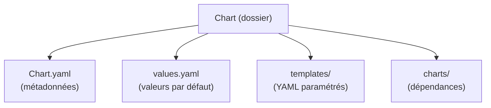
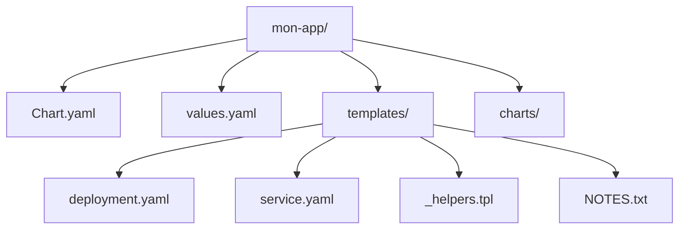
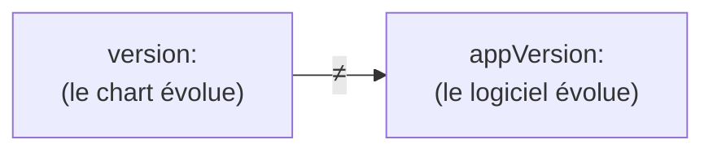
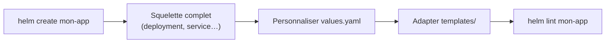
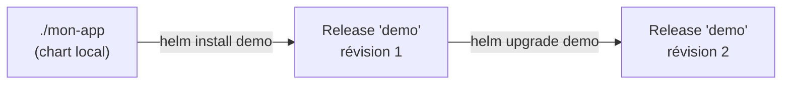
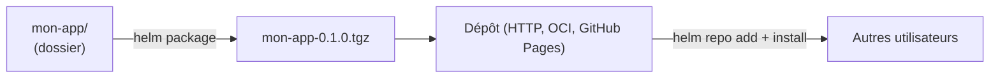
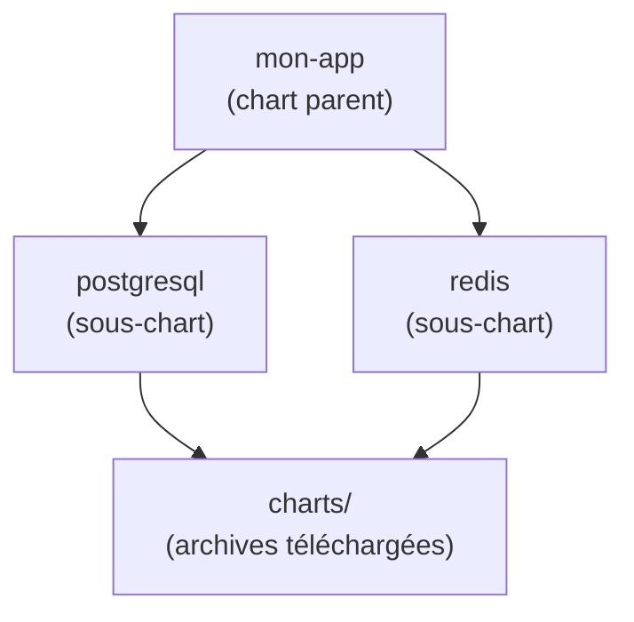
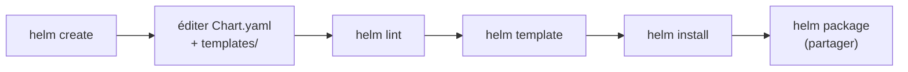

<a id="top"></a>

# 02 — Charts

## Table des matières

| # | Section |
|---|---|
| 1 | [Qu'est-ce qu'un chart ?](#section-1) |
| 2 | [La structure d'un chart](#section-2) |
| 3 | [Le fichier Chart.yaml](#section-3) |
| 4 | [Créer un chart avec helm create](#section-4) |
| 5 | [Installer son chart local](#section-5) |
| 6 | [Packager et partager un chart](#section-6) |
| 7 | [Les dépendances entre charts](#section-7) |
| 8 | [Quiz — Les charts](#section-8) |
| 9 | [Pratique — Créer et installer son chart](#section-9) |
| 10 | [Synthèse](#section-10) |

---

<a id="section-1"></a>

<details>
<summary>1 — Qu'est-ce qu'un chart ?</summary>

<br/>

Un **chart** est un **dossier** (ou une archive `.tgz`) qui contient tout le nécessaire pour décrire une application Kubernetes : ses templates YAML, ses valeurs par défaut, ses métadonnées et éventuellement ses sous-charts.



| Le chart est… | Le chart n'est pas… |
|---|---|
| Un **modèle réutilisable** | Une application déjà déployée (ça, c'est une *release*) |
| Versionné (`version:` dans `Chart.yaml`) | Un simple fichier YAML isolé |
| Paramétrable via `values.yaml` | Figé avec des valeurs codées en dur |

> _Un chart bien conçu sépare le **quoi** (la structure, dans `templates/`) du **combien/comment** (les valeurs, dans `values.yaml`). C'est ce qui le rend réutilisable d'un environnement à l'autre._

</details>

<p align="right"><a href="#top">↑ Retour en haut</a></p>

---

<a id="section-2"></a>

<details>
<summary>2 — La structure d'un chart</summary>

<br/>

Quand on génère un chart avec `helm create`, on obtient une arborescence standard.

```
mon-app/
├── Chart.yaml          # métadonnées du chart (nom, version…)
├── values.yaml         # valeurs par défaut
├── charts/             # dépendances (sous-charts)
├── templates/          # gabarits YAML générés
│   ├── deployment.yaml
│   ├── service.yaml
│   ├── ingress.yaml
│   ├── _helpers.tpl    # fonctions/templates réutilisables
│   └── NOTES.txt       # message affiché après installation
└── .helmignore         # fichiers à exclure du paquet
```



| Élément | Rôle |
|---|---|
| `Chart.yaml` | Carte d'identité : nom, version, description |
| `values.yaml` | Valeurs par défaut, surchargeables à l'install |
| `templates/` | Les YAML Kubernetes **paramétrés** |
| `templates/_helpers.tpl` | Fragments de templates réutilisables |
| `templates/NOTES.txt` | Notes affichées après `helm install` |
| `charts/` | Charts dont celui-ci dépend |
| `.helmignore` | Ce qui ne doit pas entrer dans le paquet `.tgz` |

> _Le dossier `templates/` est le cœur du chart : tout fichier qui s'y trouve passe par le **moteur de templates** (vu en leçon 04). `Chart.yaml` et `values.yaml`, eux, sont à la racine — pas dans `templates/`._

</details>

<p align="right"><a href="#top">↑ Retour en haut</a></p>

---

<a id="section-3"></a>

<details>
<summary>3 — Le fichier Chart.yaml</summary>

<br/>

`Chart.yaml` est la **carte d'identité** du chart. Helm refuse un chart sans ce fichier.

```yaml
# Chart.yaml
apiVersion: v2                 # v2 = Helm 3
name: mon-app                  # nom du chart
description: Un chart pour mon application web
type: application              # "application" ou "library"
version: 0.1.0                 # VERSION DU CHART (SemVer)
appVersion: "1.0.0"            # version de l'APPLICATION packagée
keywords:
  - web
  - demo
maintainers:
  - name: Haythem REHOUMA
    email: contact@example.com
```



| Champ | Signification |
|---|---|
| `apiVersion` | `v2` pour Helm 3 |
| `name` | Nom du chart |
| `version` | Version **du chart** (change à chaque modif du chart) |
| `appVersion` | Version **de l'application** embarquée |
| `type` | `application` (déployable) ou `library` (utilitaire) |
| `description` | Texte court affiché dans les recherches |

**🔧 Mini-exercice —** Dans `Chart.yaml`, passe la `version` du chart de `0.1.0` à `0.2.0` sans toucher à l'`appVersion`.

<details>
<summary>✅ Voir une solution</summary>

```yaml
version: 0.2.0        # le chart évolue
appVersion: "1.0.0"   # le logiciel déployé est inchangé
```

</details>

> _Piège classique : confondre `version` et `appVersion`. La première suit l'évolution du **chart** (vos templates), la seconde celle du **logiciel** déployé (ex. NGINX 1.25). On peut publier un chart 0.2.0 qui déploie toujours la même appVersion._

</details>

<p align="right"><a href="#top">↑ Retour en haut</a></p>

---

<a id="section-4"></a>

<details>
<summary>4 — Créer un chart avec helm create</summary>

<br/>

`helm create` génère un chart complet et fonctionnel (un déploiement NGINX d'exemple), prêt à être personnalisé.

```bash
# Générer un nouveau chart nommé "mon-app"
helm create mon-app

# Inspecter l'arborescence générée
ls -R mon-app
```



Vérifier la validité du chart **avant** de l'installer :

```bash
# Analyse statique : erreurs de syntaxe, bonnes pratiques
helm lint mon-app

# Rendu local des templates (sans toucher au cluster)
helm template mon-app
```

| Commande | Rôle |
|---|---|
| `helm create <nom>` | Génère un chart squelette fonctionnel |
| `helm lint <chart>` | Vérifie syntaxe et bonnes pratiques |
| `helm template <chart>` | Affiche les YAML générés localement |

**🔧 Mini-exercice —** Crée un nouveau chart nommé `mon-app`, puis vérifie-le avec `helm lint`.

<details>
<summary>✅ Voir une solution</summary>

```bash
helm create mon-app
helm lint mon-app
```

</details>

> _Bon réflexe : après chaque modification, lancer `helm lint` puis `helm template` pour voir le YAML produit. On corrige les erreurs **hors du cluster**, avant tout `helm install`._

</details>

<p align="right"><a href="#top">↑ Retour en haut</a></p>

---

<a id="section-5"></a>

<details>
<summary>5 — Installer son chart local</summary>

<br/>

On peut installer un chart depuis un **dossier local** (pas seulement depuis un dépôt distant).

```bash
# Installer le chart local "mon-app" sous le nom de release "demo"
helm install demo ./mon-app

# Simuler l'installation sans rien créer (dry-run + debug)
helm install demo ./mon-app --dry-run --debug

# Mettre à jour après modification du chart
helm upgrade demo ./mon-app
```



| Option | Effet |
|---|---|
| `--dry-run` | Calcule le rendu **sans** appliquer au cluster |
| `--debug` | Affiche les détails (utile avec `--dry-run`) |
| `--namespace <ns>` | Installe dans un namespace précis |
| `--create-namespace` | Crée le namespace s'il n'existe pas |

> _`helm install --dry-run --debug` est l'équivalent du « simulateur » : il montre exactement les YAML qui seraient envoyés au cluster, sans rien créer. À utiliser systématiquement avant un déploiement sensible._

</details>

<p align="right"><a href="#top">↑ Retour en haut</a></p>

---

<a id="section-6"></a>

<details>
<summary>6 — Packager et partager un chart</summary>

<br/>

Pour distribuer un chart, on le **packagе** en archive `.tgz`, puis on l'héberge dans un dépôt.

```bash
# Créer l'archive mon-app-0.1.0.tgz
helm package mon-app

# Construire l'index d'un dépôt local (fichier index.yaml)
helm repo index .
```



| Étape | Commande |
|---|---|
| Empaqueter | `helm package mon-app` |
| Générer l'index | `helm repo index <dossier>` |
| Publier | Héberger le `.tgz` + `index.yaml` (HTTP/OCI) |
| Consommer | `helm repo add` puis `helm install` |

Helm sait aussi pousser des charts vers un **registre OCI** (comme une image Docker) :

```bash
# Pousser un chart vers un registre OCI
helm push mon-app-0.1.0.tgz oci://registry.example.com/charts
```

> _Le numéro dans le nom de l'archive (`mon-app-0.1.0.tgz`) vient du champ `version:` de `Chart.yaml`. Pensez à l'incrémenter à chaque publication, sinon les utilisateurs ne verront pas la mise à jour._

</details>

<p align="right"><a href="#top">↑ Retour en haut</a></p>

---

<a id="section-7"></a>

<details>
<summary>7 — Les dépendances entre charts</summary>

<br/>

Un chart peut **dépendre** d'autres charts. Exemple : une application web qui a besoin d'une base de données PostgreSQL et d'un cache Redis. On déclare ces dépendances dans `Chart.yaml`.

```yaml
# Chart.yaml — section dependencies
dependencies:
  - name: postgresql
    version: "13.x.x"
    repository: https://charts.bitnami.com/bitnami
  - name: redis
    version: "18.x.x"
    repository: https://charts.bitnami.com/bitnami
    condition: redis.enabled        # n'installer Redis que si activé
```



Télécharger et figer les dépendances :

```bash
# Télécharge les dépendances dans charts/ et crée Chart.lock
helm dependency update mon-app

# Lister les dépendances et leur état
helm dependency list mon-app
```

| Élément | Rôle |
|---|---|
| `dependencies:` dans `Chart.yaml` | Déclare les sous-charts requis |
| `condition:` | Active/désactive un sous-chart selon une valeur |
| `helm dependency update` | Télécharge les sous-charts dans `charts/` |
| `Chart.lock` | Fige les versions exactes résolues |

**🔧 Mini-exercice —** Écris la commande qui télécharge les dépendances du chart `mon-app` dans son dossier `charts/`.

<details>
<summary>✅ Voir une solution</summary>

```bash
helm dependency update mon-app
```

</details>

> _Le champ `condition:` rend les dépendances **optionnelles**. Avec `redis.enabled: false` dans `values.yaml`, le sous-chart Redis ne sera pas déployé — pratique pour un mode « léger » en développement._

</details>

<p align="right"><a href="#top">↑ Retour en haut</a></p>

---

<a id="section-8"></a>

<details>
<summary>8 — Quiz — Les charts</summary>

<br/>

**Question 1 :** Quel fichier contient les métadonnées (nom, version) d'un chart ?

a) `values.yaml`

b) `Chart.yaml`

c) `templates/deployment.yaml`

d) `.helmignore`

<details>
<summary>💡 Voir la solution</summary>

✅ **Réponse : b)** — `Chart.yaml` est la carte d'identité du chart (nom, version, appVersion, description). Helm refuse un chart sans ce fichier.

</details>

---

**Question 2 :** Quelle commande génère un chart squelette fonctionnel ?

a) `helm new mon-app`

b) `helm init mon-app`

c) `helm create mon-app`

d) `helm generate mon-app`

<details>
<summary>💡 Voir la solution</summary>

✅ **Réponse : c)** — `helm create mon-app` crée une arborescence complète et fonctionnelle (deployment, service, _helpers.tpl, NOTES.txt…).

</details>

---

**Question 3 :** Quelle est la différence entre `version` et `appVersion` dans `Chart.yaml` ?

a) Aucune, ce sont des synonymes

b) `version` = version du chart ; `appVersion` = version de l'application déployée

c) `version` = version de Helm ; `appVersion` = version de Kubernetes

d) `appVersion` est obligatoire, `version` est optionnel

<details>
<summary>💡 Voir la solution</summary>

✅ **Réponse : b)** — `version` suit l'évolution du chart (vos templates) ; `appVersion` indique la version du logiciel packagé (ex. NGINX 1.25).

</details>

---

**Question 4 :** Que produit `helm package mon-app` ?

a) Une release dans le cluster

b) Une archive `.tgz` du chart

c) Un fichier `values.yaml`

d) Un dépôt distant

<details>
<summary>💡 Voir la solution</summary>

✅ **Réponse : b)** — `helm package` empaquète le dossier en `mon-app-<version>.tgz`, prêt à être hébergé dans un dépôt.

</details>

---

**Question 5 :** Où sont placées les dépendances (sous-charts) d'un chart ?

a) Dans `templates/`

b) Dans le dossier `charts/`

c) Dans `Chart.yaml` uniquement

d) Dans `values.yaml`

<details>
<summary>💡 Voir la solution</summary>

✅ **Réponse : b)** — Déclarées dans `Chart.yaml` (`dependencies:`), elles sont téléchargées par `helm dependency update` dans le dossier `charts/`.

</details>

</details>

<p align="right"><a href="#top">↑ Retour en haut</a></p>

---

<a id="section-9"></a>

<details>
<summary>9 — Pratique — Créer et installer son chart</summary>

<br/>

### Consigne

Générez un chart nommé `mini-web`, modifiez sa description dans `Chart.yaml`, vérifiez-le avec `helm lint`, prévisualisez le YAML avec `helm template`, puis installez-le sous le nom de release `m1`.

---

### Correction — Suite de commandes attendue

```bash
# 1. Générer le chart
helm create mini-web

# 2. Modifier Chart.yaml (description)
```

```yaml
# mini-web/Chart.yaml (extrait modifié)
apiVersion: v2
name: mini-web
description: Mon premier chart de démonstration
type: application
version: 0.1.0
appVersion: "1.0.0"
```

```bash
# 3. Vérifier le chart (analyse statique)
helm lint mini-web

# 4. Prévisualiser le YAML généré (sans toucher au cluster)
helm template mini-web | head -30

# 5. Simuler l'installation
helm install m1 ./mini-web --dry-run --debug

# 6. Installer pour de vrai
helm install m1 ./mini-web

# 7. Vérifier
helm list
kubectl get deploy,svc
```

**Résultat attendu de `helm lint` :**

```
==> Linting mini-web
1 chart(s) linted, 0 chart(s) failed
```

**Résultat attendu de `helm list` :**

```
NAME  NAMESPACE  REVISION  STATUS    CHART          APP VERSION
m1    default    1         deployed  mini-web-0.1.0  1.0.0
```

> _Notez la colonne `CHART` : `mini-web-0.1.0` reflète le `name` et le `version` de votre `Chart.yaml`. Si vous changez la `version`, pensez à `helm upgrade m1 ./mini-web` pour créer une nouvelle révision._

</details>

<p align="right"><a href="#top">↑ Retour en haut</a></p>

---

<a id="section-10"></a>

<details>
<summary>10 — Synthèse</summary>

<br/>

#### Points à retenir

1. Un **chart** est un dossier/archive contenant `Chart.yaml`, `values.yaml`, `templates/` et `charts/`.
2. **`Chart.yaml`** = carte d'identité : ne pas confondre `version` (du chart) et `appVersion` (du logiciel).
3. **`helm create`** génère un squelette fonctionnel ; **`helm lint`** et **`helm template`** valident hors cluster.
4. **`helm package`** produit un `.tgz` partageable via un dépôt HTTP ou OCI.
5. Les **dépendances** se déclarent dans `Chart.yaml` et se récupèrent avec `helm dependency update` (dossier `charts/`).



#### La suite

Leçon **03 — Le fichier values.yaml** : paramétrer un chart sans toucher aux templates, surcharger les valeurs avec `--set` / `-f`, et gérer plusieurs environnements.

</details>

<p align="right"><a href="#top">↑ Retour en haut</a></p>

---

<p align="center">
  <em>Tous droits réservés. Toute reproduction, diffusion, utilisation ou adaptation de ce cours, en tout ou en partie, est strictement interdite sans l'autorisation écrite préalable de Dr. Haythem REHOUMA.</em>
</p>

<p align="center">
  <strong>Cours créé par Dr. Haythem REHOUMA — Développement et déploiement de solutions de données</strong>
</p>
