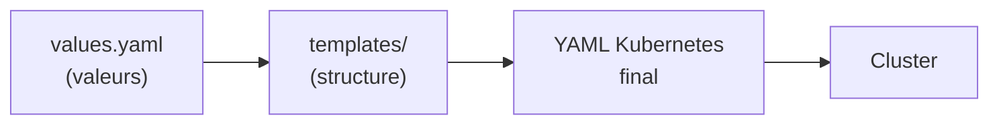
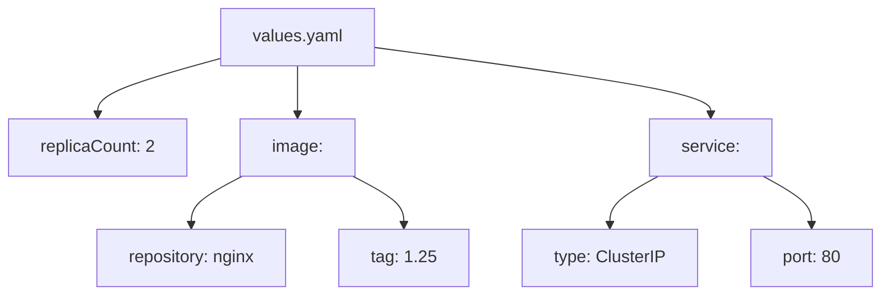
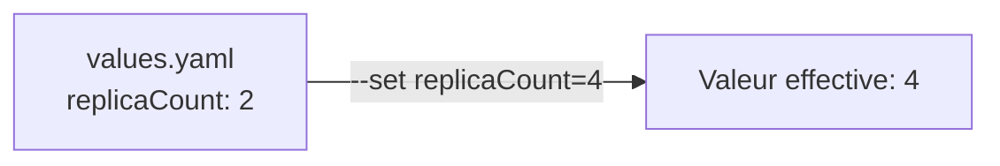
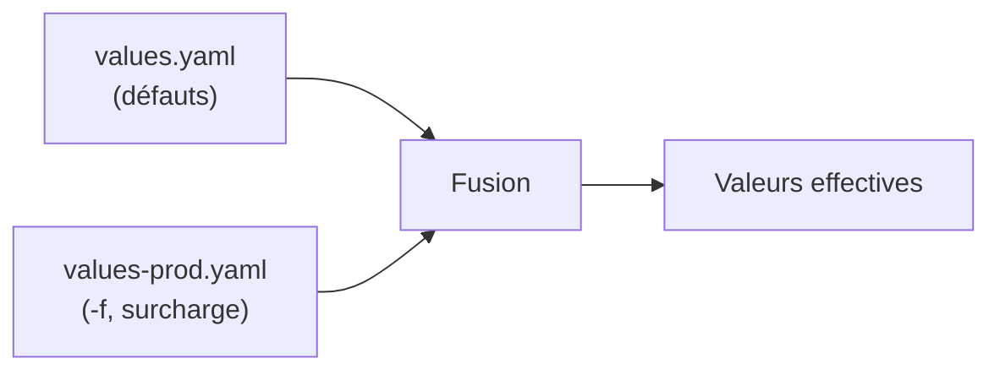
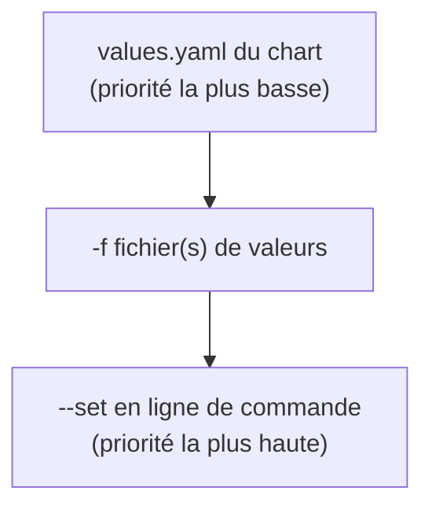
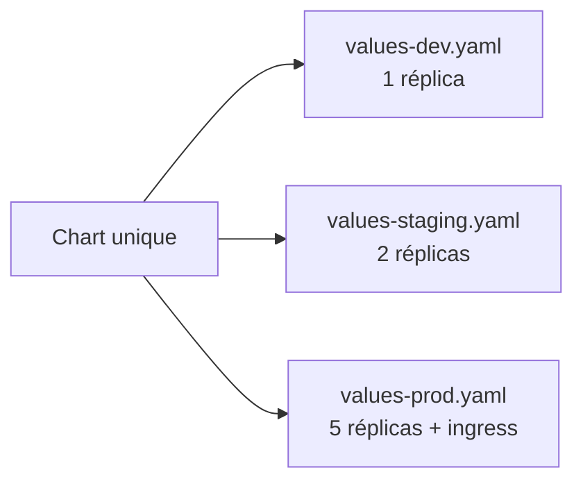
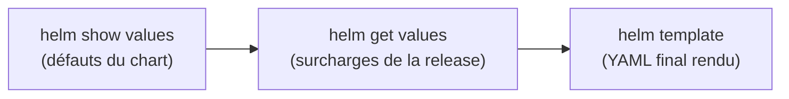
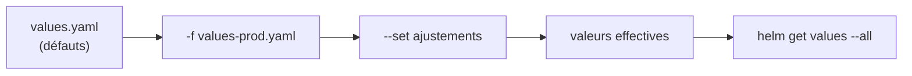

<a id="top"></a>

# 03 — Le fichier values.yaml

## Table des matières

| # | Section |
|---|---|
| 1 | [Pourquoi un fichier values.yaml ?](#section-1) |
| 2 | [Anatomie d'un values.yaml](#section-2) |
| 3 | [Surcharger avec --set](#section-3) |
| 4 | [Surcharger avec un fichier -f](#section-4) |
| 5 | [Ordre de priorité des valeurs](#section-5) |
| 6 | [Gérer plusieurs environnements](#section-6) |
| 7 | [Inspecter les valeurs effectives](#section-7) |
| 8 | [Quiz — Le fichier values.yaml](#section-8) |
| 9 | [Pratique — Déployer dev et prod](#section-9) |
| 10 | [Synthèse](#section-10) |

---

<a id="section-1"></a>

<details>
<summary>1 — Pourquoi un fichier values.yaml ?</summary>

<br/>

Le fichier **`values.yaml`** contient les **valeurs par défaut** d'un chart. Il permet de paramétrer l'application **sans toucher aux templates**. C'est lui qui rend un chart réutilisable d'un environnement à l'autre.



| Sans values.yaml | Avec values.yaml |
|---|---|
| Image, réplicas, port codés en dur dans les templates | Tout paramétré au même endroit |
| Un chart par environnement | Un seul chart, plusieurs jeux de valeurs |
| Modifier = éditer les templates | Modifier = changer une valeur |

> _Règle d'or : un bon chart ne contient **aucune valeur codée en dur** dans `templates/`. Tout ce qui peut changer (image, version, réplicas, ressources) passe par `values.yaml`._

</details>

<p align="right"><a href="#top">↑ Retour en haut</a></p>

---

<a id="section-2"></a>

<details>
<summary>2 — Anatomie d'un values.yaml</summary>

<br/>

`values.yaml` est un fichier YAML **hiérarchique**. Les templates y accèdent via `.Values` (voir leçon 04).

```yaml
# values.yaml
replicaCount: 2

image:
  repository: nginx
  tag: "1.25"
  pullPolicy: IfNotPresent

service:
  type: ClusterIP
  port: 80

resources:
  limits:
    cpu: 500m
    memory: 256Mi
  requests:
    cpu: 250m
    memory: 128Mi

ingress:
  enabled: false
  host: mon-app.local
```



| Clé | Accès dans un template |
|---|---|
| `replicaCount` | `.Values.replicaCount` |
| `image.repository` | `.Values.image.repository` |
| `service.port` | `.Values.service.port` |
| `ingress.enabled` | `.Values.ingress.enabled` |

> _La structure de `values.yaml` est libre, mais elle doit **correspondre** à ce que les templates lisent. Si un template attend `.Values.image.tag`, il faut une clé `image: { tag: ... }` dans le fichier._

</details>

<p align="right"><a href="#top">↑ Retour en haut</a></p>

---

<a id="section-3"></a>

<details>
<summary>3 — Surcharger avec --set</summary>

<br/>

L'option **`--set`** surcharge une valeur **directement en ligne de commande**, sans modifier `values.yaml`. Idéale pour un ajustement ponctuel.

```bash
# Surcharger une valeur simple
helm install demo ./mon-app --set replicaCount=4

# Surcharger une valeur imbriquée (notation pointée)
helm install demo ./mon-app --set image.tag=1.26

# Plusieurs valeurs à la fois
helm install demo ./mon-app \
  --set replicaCount=3 \
  --set image.tag=1.26 \
  --set service.type=NodePort
```



| Syntaxe | Effet |
|---|---|
| `--set clé=valeur` | Surcharge une clé simple |
| `--set parent.enfant=valeur` | Surcharge une clé imbriquée |
| `--set liste[0]=valeur` | Modifie un élément de liste |
| `--set-string clé=12` | Force l'interprétation en chaîne |

**🔧 Mini-exercice —** Écris la commande qui installe le chart `./mon-app` (release `demo`) en surchargeant `replicaCount=3` avec `--set`.

<details>
<summary>✅ Voir une solution</summary>

```bash
helm install demo ./mon-app --set replicaCount=3
```

</details>

> _`--set` est pratique mais **éphémère** : la valeur n'est nulle part dans un fichier versionné. Pour quelque chose de durable et reproductible, préférez un fichier de valeurs (`-f`)._

</details>

<p align="right"><a href="#top">↑ Retour en haut</a></p>

---

<a id="section-4"></a>

<details>
<summary>4 — Surcharger avec un fichier -f</summary>

<br/>

L'option **`-f`** (ou `--values`) fournit un **fichier de valeurs** qui surcharge le `values.yaml` du chart. C'est la méthode recommandée pour des configurations stables et versionnées.

```yaml
# values-prod.yaml — surcharges pour la production
replicaCount: 5

image:
  tag: "1.25-stable"

resources:
  limits:
    cpu: "1"
    memory: 512Mi

ingress:
  enabled: true
  host: mon-app.exemple.com
```

```bash
# Installer en appliquant le fichier de surcharge
helm install prod ./mon-app -f values-prod.yaml

# Combiner plusieurs fichiers (le dernier l'emporte)
helm install prod ./mon-app -f values-base.yaml -f values-prod.yaml
```



| Avantage de `-f` | Détail |
|---|---|
| Versionnable | Le fichier est suivi par Git |
| Reproductible | Même fichier = même déploiement |
| Lisible | Toute la config d'un env au même endroit |
| Cumulable | Plusieurs `-f` se fusionnent en cascade |

**🔧 Mini-exercice —** Écris la commande qui installe `./mon-app` (release `prod`) en appliquant le fichier `values-prod.yaml`.

<details>
<summary>✅ Voir une solution</summary>

```bash
helm install prod ./mon-app -f values-prod.yaml
```

</details>

> _Bonne pratique : un `values.yaml` avec les défauts « neutres », puis un fichier par environnement (`values-dev.yaml`, `values-prod.yaml`). On versionne ces fichiers, jamais les secrets en clair._

</details>

<p align="right"><a href="#top">↑ Retour en haut</a></p>

---

<a id="section-5"></a>

<details>
<summary>5 — Ordre de priorité des valeurs</summary>

<br/>

Quand une même clé est définie à plusieurs endroits, Helm applique un **ordre de priorité**. Le plus spécifique l'emporte.



| Priorité | Source | Exemple |
|---|---|---|
| 1 (basse) | `values.yaml` du chart | `replicaCount: 2` |
| 2 (moyenne) | Fichiers `-f` (dans l'ordre, le dernier gagne) | `values-prod.yaml` → `5` |
| 3 (haute) | `--set` en ligne de commande | `--set replicaCount=10` → `10` |

Exemple concret de résolution :

```bash
# values.yaml : replicaCount = 2
# values-prod.yaml : replicaCount = 5
helm install prod ./mon-app -f values-prod.yaml --set replicaCount=10
# Valeur effective = 10  (--set l'emporte sur tout)
```

> _Mémo : « **le plus précis gagne** ». `--set` bat `-f`, qui bat le `values.yaml` du chart. Entre plusieurs `-f`, c'est **le dernier** de la ligne de commande qui prime._

</details>

<p align="right"><a href="#top">↑ Retour en haut</a></p>

---

<a id="section-6"></a>

<details>
<summary>6 — Gérer plusieurs environnements</summary>

<br/>

Le pattern standard : **un chart unique** + **un fichier de valeurs par environnement**. On obtient des déploiements cohérents sans dupliquer les templates.

```
mon-app/
├── Chart.yaml
├── values.yaml          # défauts neutres
├── templates/
└── envs/
    ├── values-dev.yaml
    ├── values-staging.yaml
    └── values-prod.yaml
```



```bash
# Développement
helm install app-dev ./mon-app -f envs/values-dev.yaml -n dev --create-namespace

# Production
helm install app-prod ./mon-app -f envs/values-prod.yaml -n prod --create-namespace
```

| Environnement | Réplicas | Ingress | Ressources |
|---|---|---|---|
| `dev` | 1 | désactivé | faibles |
| `staging` | 2 | activé (host de test) | moyennes |
| `prod` | 5 | activé (host public) | élevées |

> _Avantage majeur : le **même chart** est testé en dev puis promu en prod. Seules les **valeurs** changent, pas la logique. C'est la base d'un déploiement fiable et reproductible._

</details>

<p align="right"><a href="#top">↑ Retour en haut</a></p>

---

<a id="section-7"></a>

<details>
<summary>7 — Inspecter les valeurs effectives</summary>

<br/>

Avant et après un déploiement, on veut savoir **quelles valeurs ont réellement été utilisées**.

```bash
# Voir les valeurs par défaut d'un chart
helm show values ./mon-app

# Voir les valeurs effectives d'une release installée
helm get values prod

# Voir TOUTES les valeurs (y compris les défauts du chart)
helm get values prod --all

# Rendre le YAML final avec un fichier de valeurs donné
helm template prod ./mon-app -f values-prod.yaml
```



| Commande | Montre… |
|---|---|
| `helm show values <chart>` | Les défauts du chart |
| `helm get values <release>` | Les surcharges fournies à l'install |
| `helm get values <release> --all` | Défauts **+** surcharges fusionnés |
| `helm template <chart> -f ...` | Le YAML Kubernetes final |

**🔧 Mini-exercice —** Écris la commande qui affiche **toutes** les valeurs effectives (défauts + surcharges) de la release `prod`.

<details>
<summary>✅ Voir une solution</summary>

```bash
helm get values prod --all
```

</details>

> _En cas de comportement inattendu (« pourquoi 5 réplicas ? »), `helm get values <release> --all` montre l'état exact des valeurs fusionnées. C'est l'outil de diagnostic numéro un._

</details>

<p align="right"><a href="#top">↑ Retour en haut</a></p>

---

<a id="section-8"></a>

<details>
<summary>8 — Quiz — Le fichier values.yaml</summary>

<br/>

**Question 1 :** À quoi sert `values.yaml` ?

a) À stocker les métadonnées du chart

b) À fournir les valeurs par défaut paramétrant le chart

c) À lister les dépendances

d) À définir les permissions RBAC

<details>
<summary>💡 Voir la solution</summary>

✅ **Réponse : b)** — `values.yaml` contient les valeurs par défaut, ce qui permet de paramétrer le chart sans toucher aux templates.

</details>

---

**Question 2 :** Comment surcharger `image.tag` directement en ligne de commande ?

a) `--image.tag=1.26`

b) `--set image.tag=1.26`

c) `-f image.tag=1.26`

d) `--value tag=1.26`

<details>
<summary>💡 Voir la solution</summary>

✅ **Réponse : b)** — `--set image.tag=1.26` utilise la notation pointée pour atteindre une clé imbriquée.

</details>

---

**Question 3 :** Quelle source de valeurs a la priorité la plus haute ?

a) Le `values.yaml` du chart

b) Un fichier `-f`

c) `--set` en ligne de commande

d) Le `Chart.yaml`

<details>
<summary>💡 Voir la solution</summary>

✅ **Réponse : c)** — L'ordre est : `values.yaml` < `-f` < `--set`. Le plus spécifique (`--set`) l'emporte.

</details>

---

**Question 4 :** Quelle est la bonne pratique pour gérer dev et prod ?

a) Dupliquer le chart pour chaque environnement

b) Un chart unique + un fichier de valeurs par environnement

c) Coder les valeurs en dur dans les templates

d) Utiliser uniquement `--set` partout

<details>
<summary>💡 Voir la solution</summary>

✅ **Réponse : b)** — Un seul chart, plusieurs fichiers `-f` (dev/staging/prod) : seules les valeurs changent, jamais la logique.

</details>

---

**Question 5 :** Quelle commande affiche les valeurs effectives d'une release installée ?

a) `helm show values <release>`

b) `helm get values <release>`

c) `helm list values <release>`

d) `helm values <release>`

<details>
<summary>💡 Voir la solution</summary>

✅ **Réponse : b)** — `helm get values <release>` montre les surcharges, et `--all` ajoute les défauts du chart fusionnés.

</details>

</details>

<p align="right"><a href="#top">↑ Retour en haut</a></p>

---

<a id="section-9"></a>

<details>
<summary>9 — Pratique — Déployer dev et prod</summary>

<br/>

### Consigne

À partir d'un chart `mini-web` (créé en leçon 02), déployez deux releases : une en `dev` (1 réplica, ingress désactivé) et une en `prod` (4 réplicas, ingress activé), en utilisant des fichiers de valeurs distincts. Vérifiez les valeurs effectives de la release `prod`.

---

### Correction — Fichiers et commandes attendus

```yaml
# values-dev.yaml
replicaCount: 1
ingress:
  enabled: false
```

```yaml
# values-prod.yaml
replicaCount: 4
ingress:
  enabled: true
  host: mini-web.exemple.com
```

```bash
# 1. Déployer en dev
helm install web-dev ./mini-web -f values-dev.yaml \
  -n dev --create-namespace

# 2. Déployer en prod
helm install web-prod ./mini-web -f values-prod.yaml \
  -n prod --create-namespace

# 3. Vérifier les deux releases
helm list --all-namespaces

# 4. Inspecter les valeurs effectives de prod
helm get values web-prod -n prod --all
```

**Résultat attendu de `helm get values web-prod --all` :**

```yaml
replicaCount: 4
ingress:
  enabled: true
  host: mini-web.exemple.com
# ... + les défauts du chart
```

**Vérification des réplicas :**

```bash
kubectl get deploy -n prod   # READY 4/4 attendu
kubectl get deploy -n dev    # READY 1/1 attendu
```

> _Le même chart `mini-web` produit deux déploiements radicalement différents (1 vs 4 réplicas, ingress off vs on) uniquement grâce aux fichiers `-f`. C'est tout l'intérêt de séparer valeurs et templates._

</details>

<p align="right"><a href="#top">↑ Retour en haut</a></p>

---

<a id="section-10"></a>

<details>
<summary>10 — Synthèse</summary>

<br/>

#### Points à retenir

1. **`values.yaml`** porte les valeurs par défaut et rend le chart paramétrable sans toucher aux templates.
2. **`--set`** surcharge en ligne de commande (ponctuel, éphémère) ; **`-f`** applique un fichier (durable, versionné).
3. **Priorité** : `values.yaml` < `-f` (le dernier gagne) < `--set`.
4. **Multi-environnements** : un chart unique + `values-dev/staging/prod.yaml`.
5. **Inspection** : `helm get values <release> --all` montre les valeurs réellement appliquées.



#### La suite

Leçon **04 — Templates** : comprendre le moteur de templates Go, la syntaxe `{{ }}`, les objets `.Values` / `.Release` / `.Chart`, les fonctions, les pipelines et les helpers (`_helpers.tpl`).

</details>

<p align="right"><a href="#top">↑ Retour en haut</a></p>

---

<p align="center">
  <em>Tous droits réservés. Toute reproduction, diffusion, utilisation ou adaptation de ce cours, en tout ou en partie, est strictement interdite sans l'autorisation écrite préalable de Dr. Haythem REHOUMA.</em>
</p>

<p align="center">
  <strong>Cours créé par Dr. Haythem REHOUMA — Développement et déploiement de solutions de données</strong>
</p>
