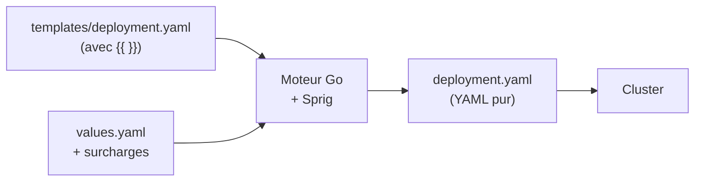
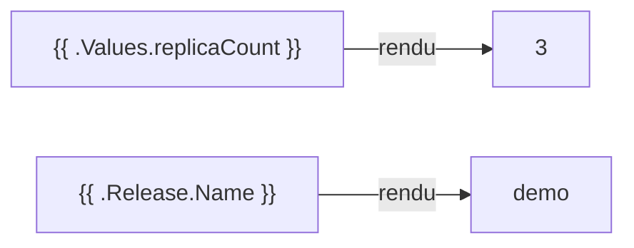
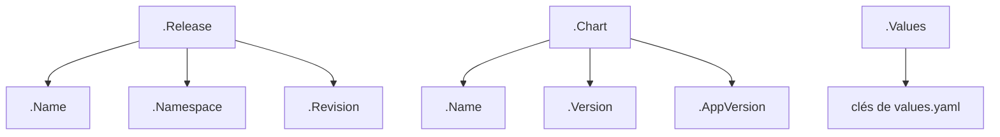
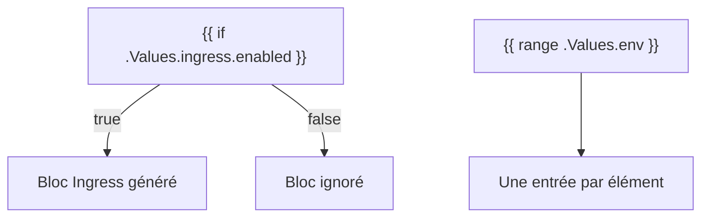
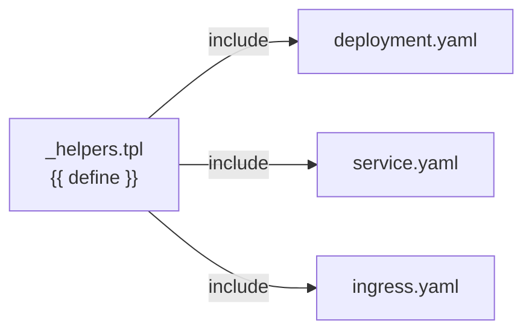
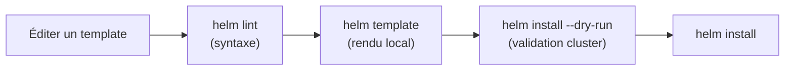
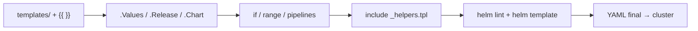

<a id="top"></a>

# 04 — Templates

## Table des matières

| # | Section |
|---|---|
| 1 | [Le moteur de templates Go](#section-1) |
| 2 | [La syntaxe {{ }}](#section-2) |
| 3 | [Les objets intégrés : .Values, .Release, .Chart](#section-3) |
| 4 | [Conditions et boucles](#section-4) |
| 5 | [Fonctions et pipelines](#section-5) |
| 6 | [Les helpers (_helpers.tpl)](#section-6) |
| 7 | [Déboguer : helm template et helm lint](#section-7) |
| 8 | [Quiz — Les templates](#section-8) |
| 9 | [Pratique — Rendre un template paramétrable](#section-9) |
| 10 | [Synthèse](#section-10) |

---

<a id="section-1"></a>

<details>
<summary>1 — Le moteur de templates Go</summary>

<br/>

Tout fichier placé dans `templates/` passe par le **moteur de templates de Go** (paquet `text/template`), enrichi par les fonctions **Sprig** et quelques fonctions propres à Helm. Le moteur fusionne le **template** avec les **valeurs** pour produire le YAML final.



| Entrée | Sortie |
|---|---|
| Template avec directives `{{ }}` | YAML Kubernetes valide |
| `values.yaml` + `--set` / `-f` | Valeurs injectées dans le template |
| Objets intégrés (`.Release`, `.Chart`) | Métadonnées injectées |

> _Le moteur ne « comprend » pas le YAML : il fait du **texte vers texte**. C'est pourquoi l'indentation produite par les templates doit être gérée à la main (fonctions `indent` / `nindent`, vues plus loin)._

</details>

<p align="right"><a href="#top">↑ Retour en haut</a></p>

---

<a id="section-2"></a>

<details>
<summary>2 — La syntaxe {{ }}</summary>

<br/>

Tout ce qui doit être **évalué** est entouré de doubles accolades `{{ ... }}`. Le reste est recopié tel quel.

```yaml
# templates/configmap.yaml
apiVersion: v1
kind: ConfigMap
metadata:
  name: {{ .Release.Name }}-config
data:
  greeting: "Bonjour depuis {{ .Chart.Name }}"
  replicas: "{{ .Values.replicaCount }}"
```

Rendu avec une release nommée `demo` et `replicaCount: 3` :

```yaml
apiVersion: v1
kind: ConfigMap
metadata:
  name: demo-config
data:
  greeting: "Bonjour depuis mon-app"
  replicas: "3"
```



| Élément | Rôle |
|---|---|
| `{{ ... }}` | Délimite une expression à évaluer |
| `{{- ... }}` | Le `-` à gauche supprime l'espace **avant** |
| `{{ ... -}}` | Le `-` à droite supprime l'espace **après** |
| `{{/* ... */}}` | Commentaire (n'apparaît pas dans le rendu) |

> _Le « **chuck whitespace** » (`{{-` et `-}}`) sert à éviter les lignes vides parasites dans le YAML généré. Mal géré, l'espace blanc casse l'indentation YAML — d'où l'importance de `helm template` pour vérifier le rendu._

</details>

<p align="right"><a href="#top">↑ Retour en haut</a></p>

---

<a id="section-3"></a>

<details>
<summary>3 — Les objets intégrés : .Values, .Release, .Chart</summary>

<br/>

Helm met à disposition des **objets intégrés** accessibles dans tout template. Les trois plus utilisés :

```yaml
# Exemples d'usage des objets intégrés
name: {{ .Release.Name }}              # nom de la release (ex. demo)
namespace: {{ .Release.Namespace }}    # namespace de déploiement
chart: {{ .Chart.Name }}-{{ .Chart.Version }}
replicas: {{ .Values.replicaCount }}   # valeur depuis values.yaml
```



| Objet | Contenu | Exemple |
|---|---|---|
| `.Values` | Les valeurs (defaults + surcharges) | `.Values.image.tag` |
| `.Release` | Infos sur la release | `.Release.Name`, `.Release.Namespace`, `.Release.Revision` |
| `.Chart` | Champs de `Chart.yaml` | `.Chart.Name`, `.Chart.Version`, `.Chart.AppVersion` |
| `.Capabilities` | Capacités du cluster | `.Capabilities.KubeVersion` |
| `.Files` | Fichiers du chart | `.Files.Get "config.txt"` |

**🔧 Mini-exercice —** Dans un template, écris la ligne `metadata.name` d'un Service qui combine le nom de la release et le suffixe `-svc`.

<details>
<summary>✅ Voir une solution</summary>

```yaml
  name: {{ .Release.Name }}-svc
```

</details>

> _Astuce de nommage : préfixer les noms d'objets par `{{ .Release.Name }}` (ex. `demo-config`) évite les collisions quand on installe **plusieurs releases** du même chart dans un même namespace._

</details>

<p align="right"><a href="#top">↑ Retour en haut</a></p>

---

<a id="section-4"></a>

<details>
<summary>4 — Conditions et boucles</summary>

<br/>

Les templates gèrent la **logique** : afficher un bloc selon une valeur (`if`), parcourir une liste (`range`).

```yaml
# Condition : créer l'Ingress seulement si activé
{{- if .Values.ingress.enabled }}
apiVersion: networking.k8s.io/v1
kind: Ingress
metadata:
  name: {{ .Release.Name }}-ingress
spec:
  rules:
    - host: {{ .Values.ingress.host }}
{{- end }}
```

```yaml
# Boucle : générer une variable d'env par entrée
env:
{{- range $key, $value := .Values.env }}
  - name: {{ $key }}
    value: "{{ $value }}"
{{- end }}
```



| Directive | Rôle |
|---|---|
| `{{ if COND }} … {{ end }}` | Génère le bloc si la condition est vraie |
| `{{ if … }} … {{ else }} … {{ end }}` | Alternative |
| `{{ range … }} … {{ end }}` | Itère sur une liste/map |
| `{{ with .Values.x }} … {{ end }}` | Change le contexte vers `.Values.x` |

> _Le pattern `{{- if .Values.<feature>.enabled }}` est partout dans les charts : il rend des fonctionnalités **optionnelles** (ingress, autoscaling, persistance) selon une simple valeur booléenne._

</details>

<p align="right"><a href="#top">↑ Retour en haut</a></p>

---

<a id="section-5"></a>

<details>
<summary>5 — Fonctions et pipelines</summary>

<br/>

Helm fournit des dizaines de **fonctions** (via Sprig). On les enchaîne avec le **pipe** `|`, à la manière du shell : la sortie de gauche devient l'entrée de droite.

```yaml
# Pipelines : la valeur traverse les fonctions de gauche à droite
name: {{ .Values.name | default "mon-app" | lower | quote }}
# si .Values.name = "  MonApp " → "monapp"

# default : valeur de repli si vide
tag: {{ .Values.image.tag | default .Chart.AppVersion }}

# nindent : ajoute un saut de ligne puis indente (clé pour les blocs)
labels:
  {{- include "mon-app.labels" . | nindent 4 }}
```

```mermaid
flowchart LR
    A[".Values.name"] -->|"| default"| B["valeur ou repli"]
    B -->|"| lower"| C["minuscules"]
    C -->|"| quote"| D['"valeur"']
```

| Fonction | Effet |
|---|---|
| `default "x" .v` | Renvoie `.v`, ou `"x"` si `.v` est vide |
| `quote` | Entoure de guillemets |
| `upper` / `lower` | Casse |
| `indent N` / `nindent N` | Indente de N espaces (n = avec saut de ligne) |
| `toYaml` | Sérialise une structure en YAML |
| `printf` | Formatage de chaîne |

**🔧 Mini-exercice —** Écris un pipeline qui rend `.Values.image.tag`, ou `latest` si la valeur est vide, le tout entouré de guillemets.

<details>
<summary>✅ Voir une solution</summary>

```yaml
tag: {{ .Values.image.tag | default "latest" | quote }}
```

</details>

> _Le duo `toYaml | nindent N` est essentiel pour insérer des blocs complets (ressources, labels) en respectant l'indentation YAML. Exemple : `{{ toYaml .Values.resources | nindent 12 }}`._

</details>

<p align="right"><a href="#top">↑ Retour en haut</a></p>

---

<a id="section-6"></a>

<details>
<summary>6 — Les helpers (_helpers.tpl)</summary>

<br/>

Pour éviter de répéter du code (ex. la construction du nom complet ou des labels), on définit des **templates nommés** dans `templates/_helpers.tpl`. Les fichiers commençant par `_` ne génèrent **pas** d'objet Kubernetes.

```yaml
# templates/_helpers.tpl
{{- define "mon-app.fullname" -}}
{{ .Release.Name }}-{{ .Chart.Name }}
{{- end -}}

{{- define "mon-app.labels" -}}
app.kubernetes.io/name: {{ .Chart.Name }}
app.kubernetes.io/instance: {{ .Release.Name }}
app.kubernetes.io/version: {{ .Chart.AppVersion }}
helm.sh/chart: {{ .Chart.Name }}-{{ .Chart.Version }}
{{- end -}}
```

Utilisation dans un template via `include` :

```yaml
# templates/deployment.yaml
metadata:
  name: {{ include "mon-app.fullname" . }}
  labels:
    {{- include "mon-app.labels" . | nindent 4 }}
```



| Élément | Rôle |
|---|---|
| `{{ define "nom" }} … {{ end }}` | Déclare un template réutilisable |
| `{{ include "nom" . }}` | Insère le rendu du template (passe le contexte `.`) |
| Fichier `_*.tpl` | Convention : ne produit aucun objet K8s |

> _Préférez **`include`** à `template` : `include` renvoie une chaîne, donc on peut la passer dans un pipeline (`| nindent 4`). `template` ne le permet pas. C'est pourquoi les charts générés par `helm create` utilisent `include` partout._

</details>

<p align="right"><a href="#top">↑ Retour en haut</a></p>

---

<a id="section-7"></a>

<details>
<summary>7 — Déboguer : helm template et helm lint</summary>

<br/>

On ne devine pas le rendu d'un template : on le **vérifie localement** avant tout déploiement.

```bash
# Rendre TOUS les templates avec les valeurs par défaut
helm template mon-app

# Rendre avec des surcharges
helm template mon-app -f values-prod.yaml --set replicaCount=5

# Rendre un seul fichier
helm template mon-app --show-only templates/deployment.yaml

# Analyse statique (syntaxe + bonnes pratiques)
helm lint mon-app

# Simuler l'install côté cluster (validation API incluse)
helm install demo ./mon-app --dry-run --debug
```



| Commande | Vérifie… | Touche le cluster ? |
|---|---|---|
| `helm lint` | Syntaxe, structure, bonnes pratiques | Non |
| `helm template` | Le YAML rendu localement | Non |
| `helm install --dry-run --debug` | Rendu **+** validation API K8s | Non (simulation) |

**🔧 Mini-exercice —** Écris la commande qui rend **uniquement** le fichier `templates/deployment.yaml` du chart `mon-app`.

<details>
<summary>✅ Voir une solution</summary>

```bash
helm template mon-app --show-only templates/deployment.yaml
```

</details>

> _Workflow de débogage gagnant : `helm lint` (la forme) → `helm template` (le contenu rendu) → `--dry-run --debug` (la validation par l'API). On ne fait `helm install` qu'une fois ces trois étapes propres._

</details>

<p align="right"><a href="#top">↑ Retour en haut</a></p>

---

<a id="section-8"></a>

<details>
<summary>8 — Quiz — Les templates</summary>

<br/>

**Question 1 :** Quel moteur de templates utilise Helm ?

a) Jinja2 (Python)

b) Le moteur de templates de Go (text/template) + Sprig

c) Mustache

d) ERB (Ruby)

<details>
<summary>💡 Voir la solution</summary>

✅ **Réponse : b)** — Helm s'appuie sur `text/template` de Go, enrichi par les fonctions Sprig et quelques fonctions propres à Helm.

</details>

---

**Question 2 :** Comment accède-t-on au nom de la release dans un template ?

a) `{{ .Chart.Name }}`

b) `{{ .Values.name }}`

c) `{{ .Release.Name }}`

d) `{{ .Helm.Release }}`

<details>
<summary>💡 Voir la solution</summary>

✅ **Réponse : c)** — `.Release.Name` donne le nom de la release ; `.Chart.Name` est le nom du chart et `.Values.*` les valeurs.

</details>

---

**Question 3 :** Que fait le pipeline `{{ .Values.name | default "app" | quote }}` ?

a) Concatène trois valeurs

b) Prend `.Values.name` (ou « app » si vide) et l'entoure de guillemets

c) Crée une boucle

d) Supprime les espaces

<details>
<summary>💡 Voir la solution</summary>

✅ **Réponse : b)** — Le `|` enchaîne : `default` fournit un repli, puis `quote` ajoute les guillemets. La valeur traverse les fonctions de gauche à droite.

</details>

---

**Question 4 :** À quoi sert un fichier `_helpers.tpl` ?

a) À stocker des secrets

b) À définir des templates nommés réutilisables (ne génère aucun objet K8s)

c) À lister les dépendances

d) À configurer le cluster

<details>
<summary>💡 Voir la solution</summary>

✅ **Réponse : b)** — Les fichiers `_*.tpl` contiennent des `{{ define }}` réutilisés via `include`, et ne produisent pas d'objet Kubernetes.

</details>

---

**Question 5 :** Quelle commande affiche le YAML rendu **sans** toucher au cluster ?

a) `helm install`

b) `helm template`

c) `helm uninstall`

d) `helm status`

<details>
<summary>💡 Voir la solution</summary>

✅ **Réponse : b)** — `helm template` rend les templates localement. Pour une validation côté API sans rien créer, on ajoute `helm install --dry-run --debug`.

</details>

</details>

<p align="right"><a href="#top">↑ Retour en haut</a></p>

---

<a id="section-9"></a>

<details>
<summary>9 — Pratique — Rendre un template paramétrable</summary>

<br/>

### Consigne

Dans le chart `mini-web`, ajoutez un `ConfigMap` paramétré : son nom doit utiliser le nom de la release, il doit contenir un message issu de `values.yaml` (avec une valeur de repli) et n'être créé que si `configmap.enabled` est vrai. Vérifiez le rendu avec `helm template`.

---

### Correction — Template et valeurs attendus

```yaml
# mini-web/values.yaml (ajout)
configmap:
  enabled: true
  message: "Bonjour depuis mini-web"
```

```yaml
# mini-web/templates/configmap.yaml
{{- if .Values.configmap.enabled }}
apiVersion: v1
kind: ConfigMap
metadata:
  name: {{ .Release.Name }}-config
  labels:
    app.kubernetes.io/instance: {{ .Release.Name }}
data:
  message: {{ .Values.configmap.message | default "Bonjour" | quote }}
  chart: {{ .Chart.Name }}-{{ .Chart.Version }}
{{- end }}
```

```bash
# 1. Vérifier la syntaxe
helm lint mini-web

# 2. Rendre uniquement le ConfigMap
helm template demo ./mini-web --show-only templates/configmap.yaml

# 3. Tester la désactivation
helm template demo ./mini-web \
  --show-only templates/configmap.yaml \
  --set configmap.enabled=false
```

**Résultat attendu (étape 2) :**

```yaml
apiVersion: v1
kind: ConfigMap
metadata:
  name: demo-config
  labels:
    app.kubernetes.io/instance: demo
data:
  message: "Bonjour depuis mini-web"
  chart: mini-web-0.1.0
```

**Résultat attendu (étape 3) :** sortie **vide** — le bloc `{{- if }}` n'a rien généré car `configmap.enabled=false`.

> _Cet exercice combine les trois piliers de la leçon : un objet intégré (`.Release.Name`), un pipeline (`default | quote`) et une condition (`if .enabled`). C'est exactement le motif des charts professionnels._

</details>

<p align="right"><a href="#top">↑ Retour en haut</a></p>

---

<a id="section-10"></a>

<details>
<summary>10 — Synthèse</summary>

<br/>

#### Points à retenir

1. Les fichiers de `templates/` passent par le **moteur Go (text/template) + Sprig**.
2. La syntaxe **`{{ }}`** évalue les expressions ; `{{-` / `-}}` gèrent les espaces.
3. **Objets intégrés** : `.Values` (valeurs), `.Release` (nom/namespace/révision), `.Chart` (métadonnées).
4. **Logique** : `if` / `else`, `range`, `with` ; **pipelines** `|` enchaînent les fonctions (`default`, `quote`, `nindent`, `toYaml`).
5. **Helpers** (`_helpers.tpl`) + `include` évitent la répétition ; **`helm template`** / **`helm lint`** débuggent hors cluster.



#### La suite

Vous maîtrisez désormais Helm de bout en bout : installer des charts, en créer, les paramétrer avec `values.yaml` et les rendre dynamiques avec les templates. Prochaine étape du parcours : déployer ces charts dans un **pipeline CI/CD** pour automatiser entièrement la livraison sur Kubernetes.

</details>

<p align="right"><a href="#top">↑ Retour en haut</a></p>

---

<p align="center">
  <em>Tous droits réservés. Toute reproduction, diffusion, utilisation ou adaptation de ce cours, en tout ou en partie, est strictement interdite sans l'autorisation écrite préalable de Dr. Haythem REHOUMA.</em>
</p>

<p align="center">
  <strong>Cours créé par Dr. Haythem REHOUMA — Développement et déploiement de solutions de données</strong>
</p>
