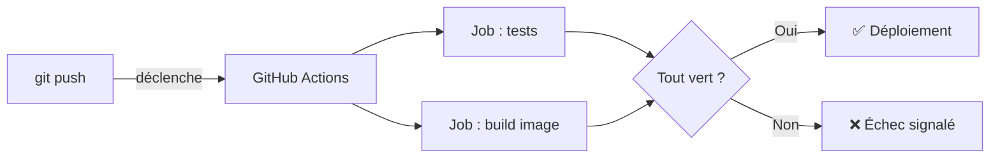
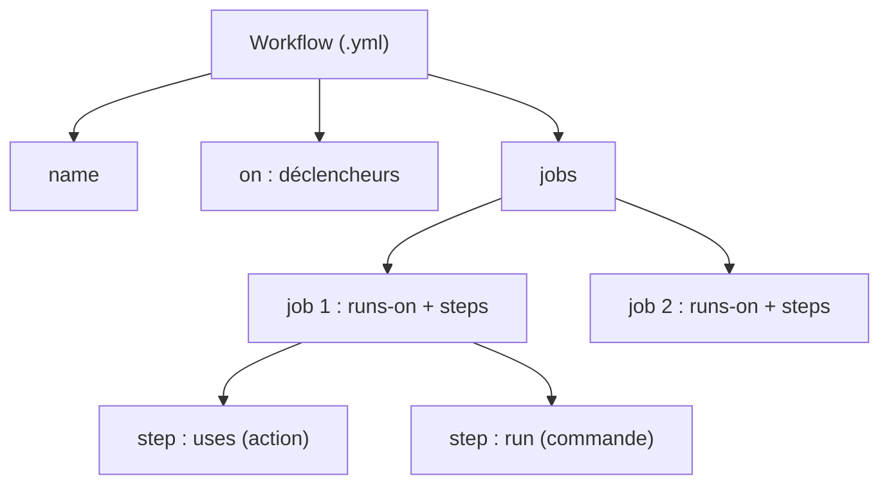
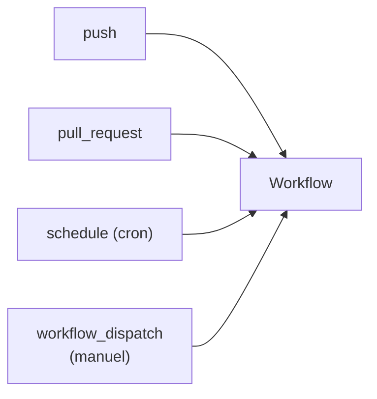
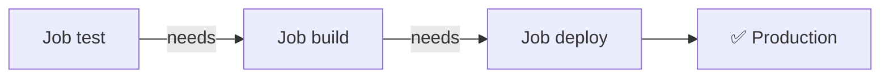
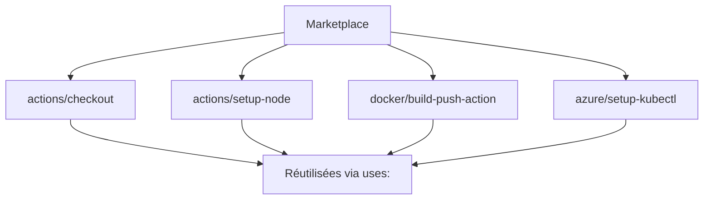
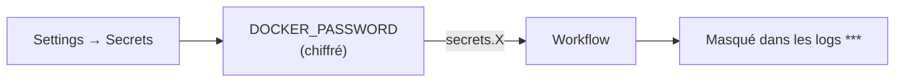
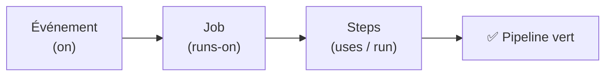

<a id="top"></a>

# 01 — GitHub Actions : workflows, déclencheurs et secrets

## Table des matières

| # | Section |
|---|---|
| 1 | [Qu'est-ce que GitHub Actions ?](#section-1) |
| 2 | [Anatomie d'un fichier de workflow](#section-2) |
| 3 | [Les déclencheurs (`on`)](#section-3) |
| 4 | [Jobs, runners et steps](#section-4) |
| 5 | [Les actions du Marketplace](#section-5) |
| 6 | [Secrets et variables d'environnement](#section-6) |
| 7 | [Quiz — Les workflows](#section-7) |
| 8 | [Pratique — Votre premier pipeline CI](#section-8) |
| 9 | [Synthèse](#section-9) |

---

<a id="section-1"></a>

<details>
<summary>1 — Qu'est-ce que GitHub Actions ?</summary>

<br/>

**GitHub Actions** est la plateforme d'**intégration et de déploiement continus** (*CI/CD*) intégrée à GitHub. Elle exécute automatiquement des tâches — tests, build, déploiement — en réaction à des événements de votre dépôt (un `push`, une *pull request*, une horloge…).

> _L'idée centrale du CI/CD : à chaque modification du code, une machine vérifie, teste et déploie automatiquement, sans intervention humaine. On supprime les « ça marche sur ma machine »._



**Vocabulaire essentiel :**

| Terme | Définition |
|---|---|
| **Workflow** | Un fichier YAML qui décrit un processus automatisé complet. |
| **Événement** | Ce qui déclenche le workflow (`push`, `pull_request`, `schedule`…). |
| **Job** | Un ensemble d'étapes exécutées sur un même *runner*. |
| **Step** | Une étape unique : une commande ou une action. |
| **Runner** | La machine virtuelle qui exécute le job. |
| **Action** | Un composant réutilisable (du Marketplace ou maison). |

> _Les fichiers de workflow vivent toujours dans le dossier `.github/workflows/` à la racine du dépôt. GitHub les détecte et les exécute automatiquement._

**🔧 Mini-exercice —** Donne le chemin complet où tu placerais un workflow nommé `ci.yml` pour que GitHub le détecte automatiquement.

<details>
<summary>✅ Voir une solution</summary>

`.github/workflows/ci.yml`, à la racine du dépôt.

</details>

</details>

<p align="right"><a href="#top">↑ Retour en haut</a></p>

---

<a id="section-2"></a>

<details>
<summary>2 — Anatomie d'un fichier de workflow</summary>

<br/>

Un workflow est un fichier `.yml` (ou `.yaml`) placé dans `.github/workflows/`. Sa structure repose sur quelques clés de premier niveau.

```yaml
# .github/workflows/ci.yml
name: Intégration continue        # Nom affiché dans l'onglet Actions

on: [push]                        # Quand déclencher ?

jobs:                             # Un ou plusieurs jobs
  tests:                          # Identifiant du job
    runs-on: ubuntu-latest        # Quelle machine ?
    steps:                        # Liste ordonnée d'étapes
      - name: Récupérer le code
        uses: actions/checkout@v4

      - name: Exécuter les tests
        run: |
          npm install
          npm test
```



| Clé | Rôle | Obligatoire ? |
|---|---|---|
| `name` | Nom lisible du workflow | Non (mais recommandé) |
| `on` | Événement(s) déclencheur(s) | **Oui** |
| `jobs` | Les tâches à exécuter | **Oui** |
| `runs-on` | Le système du runner | **Oui** (par job) |
| `steps` | Les étapes du job | **Oui** (par job) |

> _Deux mots-clés à ne jamais confondre dans un step : `uses` appelle une **action** réutilisable, tandis que `run` exécute une **commande shell** directement._

**🔧 Mini-exercice —** Écris un step unique qui exécute la commande `npm run build` sur le runner.

<details>
<summary>✅ Voir une solution</summary>

```yaml
- name: Construire le projet
  run: npm run build
```

</details>

</details>

<p align="right"><a href="#top">↑ Retour en haut</a></p>

---

<a id="section-3"></a>

<details>
<summary>3 — Les déclencheurs (`on`)</summary>

<br/>

La clé `on` définit **quand** le workflow s'exécute. C'est le cœur de l'automatisation.



### Sur un push (avec filtres de branches et de chemins)

```yaml
on:
  push:
    branches:
      - main
      - 'release/**'
    paths:
      - 'src/**'          # Ne se déclenche que si src/ change
```

### Sur une pull request

```yaml
on:
  pull_request:
    branches: [main]
    types: [opened, synchronize, reopened]
```

### Sur une planification (cron)

```yaml
on:
  schedule:
    # Tous les jours à 02h00 UTC (minute heure jour mois jour-semaine)
    - cron: '0 2 * * *'
```

### Déclenchement manuel

```yaml
on:
  workflow_dispatch:        # Bouton « Run workflow » dans l'UI
```

| Déclencheur | Cas d'usage typique |
|---|---|
| `push` | Tester / déployer à chaque envoi de code |
| `pull_request` | Valider une contribution avant fusion |
| `schedule` | Tâches nocturnes, rapports, nettoyage |
| `workflow_dispatch` | Lancer un déploiement à la demande |
| `release` | Publier un artefact quand une release est créée |

> _La syntaxe `cron` de GitHub suit l'ordre « minute heure jour-du-mois mois jour-de-la-semaine » et fonctionne en **UTC**. Pensez au décalage horaire de votre fuseau._

**🔧 Mini-exercice —** Écris la clé `on:` pour déclencher un workflow uniquement sur un `push` vers la branche `main`.

<details>
<summary>✅ Voir une solution</summary>

```yaml
on:
  push:
    branches: [main]
```

</details>

</details>

<p align="right"><a href="#top">↑ Retour en haut</a></p>

---

<a id="section-4"></a>

<details>
<summary>4 — Jobs, runners et steps</summary>

<br/>

Un workflow contient un ou plusieurs **jobs**. Par défaut, les jobs s'exécutent **en parallèle** ; on peut les enchaîner avec `needs`.

```yaml
jobs:
  test:
    runs-on: ubuntu-latest
    steps:
      - uses: actions/checkout@v4
      - run: npm test

  build:
    needs: test            # Ne démarre que si "test" réussit
    runs-on: ubuntu-latest
    steps:
      - uses: actions/checkout@v4
      - run: npm run build
```



### Choisir un runner

| Valeur de `runs-on` | Système |
|---|---|
| `ubuntu-latest` | Linux (le plus courant et rapide) |
| `windows-latest` | Windows |
| `macos-latest` | macOS |
| `self-hosted` | Votre propre machine |

### Matrice de configurations

Pour tester sur plusieurs versions à la fois :

```yaml
jobs:
  test:
    runs-on: ubuntu-latest
    strategy:
      matrix:
        node: [18, 20, 22]
    steps:
      - uses: actions/checkout@v4
      - uses: actions/setup-node@v4
        with:
          node-version: ${{ matrix.node }}
      - run: npm test
```

> _La matrice génère un job par combinaison. Ici, trois jobs s'exécutent en parallèle (Node 18, 20 et 22), ce qui valide la compatibilité sans dupliquer le YAML._

**🔧 Mini-exercice —** Fais en sorte qu'un job `deploy` ne démarre qu'après la réussite d'un job `build`.

<details>
<summary>✅ Voir une solution</summary>

```yaml
deploy:
  needs: build
  runs-on: ubuntu-latest
```

</details>

</details>

<p align="right"><a href="#top">↑ Retour en haut</a></p>

---

<a id="section-5"></a>

<details>
<summary>5 — Les actions du Marketplace</summary>

<br/>

Une **action** est un composant réutilisable, appelé avec `uses`. Le **GitHub Marketplace** en propose des milliers, officielles et communautaires.

```yaml
steps:
  - name: Récupérer le code
    uses: actions/checkout@v4         # Action officielle

  - name: Installer Node.js
    uses: actions/setup-node@v4
    with:                             # Paramètres de l'action
      node-version: '20'
      cache: 'npm'
```



### Actions officielles incontournables

| Action | Rôle |
|---|---|
| `actions/checkout@v4` | Clone le dépôt sur le runner |
| `actions/setup-node@v4` | Installe Node.js (+ cache) |
| `actions/setup-python@v5` | Installe Python |
| `actions/upload-artifact@v4` | Sauvegarde des fichiers produits |
| `actions/cache@v4` | Met en cache des dépendances |

> _Épinglez toujours une **version** d'action (`@v4`), jamais une branche mobile. Cela garantit que votre pipeline ne casse pas lorsqu'un mainteneur publie une nouvelle version incompatible._

</details>

<p align="right"><a href="#top">↑ Retour en haut</a></p>

---

<a id="section-6"></a>

<details>
<summary>6 — Secrets et variables d'environnement</summary>

<br/>

Un pipeline a souvent besoin d'informations sensibles : mots de passe de registry, jetons d'API, `kubeconfig`. On ne les écrit **jamais en clair** dans le YAML. On utilise les **secrets**.

### Créer un secret

Dans le dépôt : **Settings → Secrets and variables → Actions → New repository secret**. Exemple : `DOCKER_PASSWORD`.

### Les utiliser dans un workflow

```yaml
jobs:
  deploy:
    runs-on: ubuntu-latest
    steps:
      - name: Connexion au registry
        run: echo "${{ secrets.DOCKER_PASSWORD }}" | docker login -u user --password-stdin
        env:
          API_TOKEN: ${{ secrets.API_TOKEN }}
```



| Élément | Syntaxe | Visible dans les logs ? |
|---|---|---|
| Secret | `${{ secrets.NOM }}` | Non — masqué automatiquement |
| Variable de dépôt | `${{ vars.NOM }}` | Oui |
| Token intégré | `${{ secrets.GITHUB_TOKEN }}` | Non — généré par job |

> _Le `GITHUB_TOKEN` est fourni automatiquement à chaque exécution. Il sert notamment à se connecter au registry `ghcr.io` sans créer de secret manuel._

**🔧 Mini-exercice —** Écris un step qui passe le secret `API_TOKEN` à la commande comme variable d'environnement nommée `TOKEN`.

<details>
<summary>✅ Voir une solution</summary>

```yaml
- name: Appeler l'API
  run: ./deploy.sh
  env:
    TOKEN: ${{ secrets.API_TOKEN }}
```

</details>

</details>

<p align="right"><a href="#top">↑ Retour en haut</a></p>

---

<a id="section-7"></a>

<details>
<summary>7 — Quiz — Les workflows</summary>

<br/>

**Question 1 :** Dans quel dossier doit-on placer les fichiers de workflow ?

a) `.git/workflows/`

b) `.github/workflows/`

c) `workflows/`

d) `.actions/`

<details>
<summary>💡 Voir la solution</summary>

✅ **Réponse : b)** — GitHub détecte automatiquement les fichiers `.yml` placés dans `.github/workflows/` à la racine du dépôt.

</details>

---

**Question 2 :** Quelle clé YAML définit l'événement qui déclenche un workflow ?

a) `trigger`

b) `when`

c) `on`

d) `event`

<details>
<summary>💡 Voir la solution</summary>

✅ **Réponse : c)** — La clé `on` liste les événements (`push`, `pull_request`, `schedule`…) qui lancent le workflow.

</details>

---

**Question 3 :** Quelle est la différence entre `uses` et `run` dans un step ?

a) Aucune, ce sont des synonymes

b) `uses` appelle une action réutilisable, `run` exécute une commande shell

c) `run` appelle une action, `uses` exécute une commande

d) `uses` sert uniquement pour Docker

<details>
<summary>💡 Voir la solution</summary>

✅ **Réponse : b)** — `uses` invoque une action (du Marketplace ou maison) ; `run` lance directement des commandes dans le shell du runner.

</details>

---

**Question 4 :** Comment faire qu'un job attende la réussite d'un autre avant de démarrer ?

a) `depends-on`

b) `after`

c) `needs`

d) `wait-for`

<details>
<summary>💡 Voir la solution</summary>

✅ **Réponse : c)** — La clé `needs: <job>` crée une dépendance : le job ne démarre que si le job nommé a réussi.

</details>

---

**Question 5 :** Comment référencer un secret nommé `API_TOKEN` ?

a) `$API_TOKEN`

b) `${{ env.API_TOKEN }}`

c) `${{ secrets.API_TOKEN }}`

d) `secrets("API_TOKEN")`

<details>
<summary>💡 Voir la solution</summary>

✅ **Réponse : c)** — La syntaxe `${{ secrets.NOM }}` injecte le secret, qui est automatiquement masqué dans les logs.

</details>

</details>

<p align="right"><a href="#top">↑ Retour en haut</a></p>

---

<a id="section-8"></a>

<details>
<summary>8 — Pratique — Votre premier pipeline CI</summary>

<br/>

### Consigne

Créez un workflow `ci.yml` qui :

1. se déclenche sur les `push` vers `main` **et** sur les pull requests visant `main` ;
2. s'exécute sur Ubuntu ;
3. récupère le code, installe Node.js 20 (avec cache npm) ;
4. installe les dépendances et lance les tests ;
5. teste en parallèle sur Node 18, 20 et 22 via une matrice.

---

### Correction — Workflow attendu

```yaml
# .github/workflows/ci.yml
name: Intégration continue

on:
  push:
    branches: [main]
  pull_request:
    branches: [main]

jobs:
  tests:
    runs-on: ubuntu-latest
    strategy:
      matrix:
        node: [18, 20, 22]
    steps:
      - name: Récupérer le code
        uses: actions/checkout@v4

      - name: Installer Node.js ${{ matrix.node }}
        uses: actions/setup-node@v4
        with:
          node-version: ${{ matrix.node }}
          cache: 'npm'

      - name: Installer les dépendances
        run: npm ci

      - name: Lancer les tests
        run: npm test
```

**Résultat attendu dans l'onglet Actions :**

```
✅ Intégration continue
   ├── tests (18)   ✓  42s
   ├── tests (20)   ✓  39s
   └── tests (22)   ✓  41s
```

> _Trois jobs apparaissent (un par version de Node), exécutés en parallèle. Si l'un échoue, la pull request affiche une coche rouge et la fusion peut être bloquée par une règle de protection de branche._

</details>

<p align="right"><a href="#top">↑ Retour en haut</a></p>

---

<a id="section-9"></a>

<details>
<summary>9 — Synthèse</summary>

<br/>

#### Points à retenir

1. **GitHub Actions** automatise le CI/CD directement dans le dépôt, via des fichiers YAML dans `.github/workflows/`.
2. **Structure** : `name`, `on` (déclencheurs), `jobs`, chaque job avec `runs-on` et `steps`.
3. **Déclencheurs** : `push`, `pull_request`, `schedule` (cron), `workflow_dispatch` (manuel).
4. **Steps** : `uses` pour une action, `run` pour une commande shell.
5. **Marketplace** : `actions/checkout`, `actions/setup-node`… toujours épinglés à une version.
6. **Secrets** : `${{ secrets.NOM }}`, masqués dans les logs ; `GITHUB_TOKEN` fourni automatiquement.



#### La suite

Leçon **02 — Construire et publier une image Docker** : utiliser un workflow pour builder une image, se connecter à un registry (GHCR) et faire `build & push`.

</details>

<p align="right"><a href="#top">↑ Retour en haut</a></p>

---

<p align="center">
  <em>Tous droits réservés. Toute reproduction, diffusion, utilisation ou adaptation de ce cours, en tout ou en partie, est strictement interdite sans l'autorisation écrite préalable de Dr. Haythem REHOUMA.</em>
</p>

<p align="center">
  <strong>Cours créé par Dr. Haythem REHOUMA — Développement et déploiement de solutions de données</strong>
</p>
