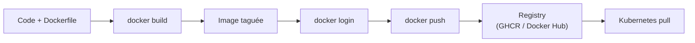
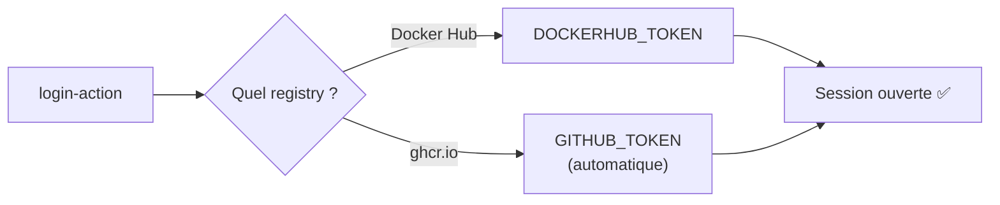
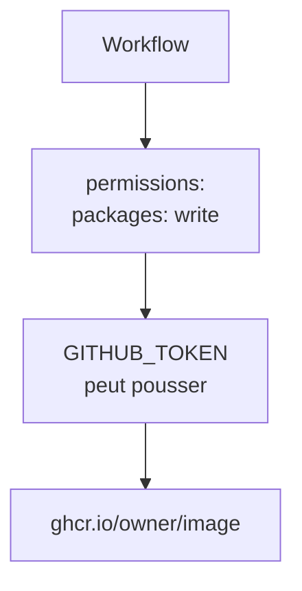
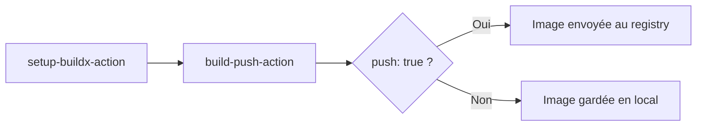
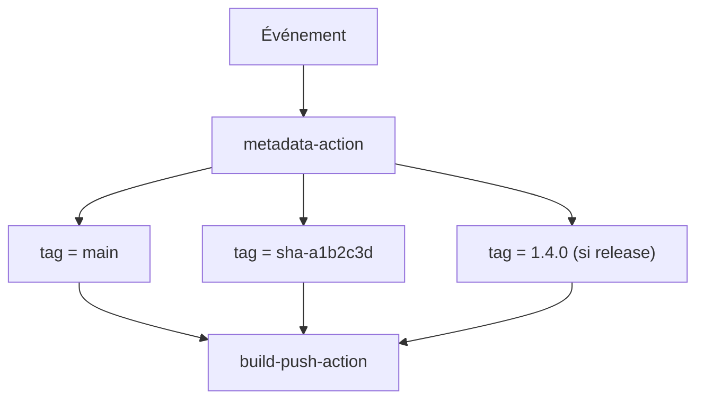
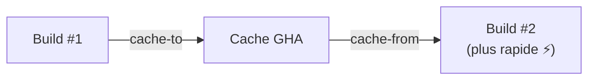
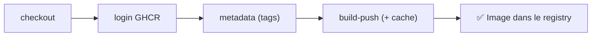

<a id="top"></a>

# 02 — Construire et publier une image Docker

## Table des matières

| # | Section |
|---|---|
| 1 | [Du code à l'image dans un pipeline](#section-1) |
| 2 | [Se connecter à un registry (`docker/login-action`)](#section-2) |
| 3 | [GitHub Container Registry (GHCR)](#section-3) |
| 4 | [Build & push (`docker/build-push-action`)](#section-4) |
| 5 | [Stratégie de tags (`docker/metadata-action`)](#section-5) |
| 6 | [Le cache du build](#section-6) |
| 7 | [Quiz — Build et push](#section-7) |
| 8 | [Pratique — Publier une image sur GHCR](#section-8) |
| 9 | [Synthèse](#section-9) |

---

<a id="section-1"></a>

<details>
<summary>1 — Du code à l'image dans un pipeline</summary>

<br/>

Une fois les tests verts, l'étape suivante du CI/CD consiste à **emballer l'application dans une image Docker** et à la **publier** dans un *registry*. C'est cette image que Kubernetes déploiera ensuite.



| Étape | Outil / Action | Rôle |
|---|---|---|
| Construire | `docker build` / `build-push-action` | Transforme le `Dockerfile` en image |
| S'authentifier | `docker/login-action` | Ouvre une session sur le registry |
| Publier | `docker push` | Envoie l'image vers le registry |
| Étiqueter | `docker/metadata-action` | Génère des tags cohérents |

> _Un **registry** est un dépôt d'images. Les plus courants : Docker Hub, GitHub Container Registry (GHCR), Amazon ECR, Google Artifact Registry. GHCR est gratuit pour les dépôts publics et intégré à GitHub._

**🔧 Mini-exercice —** Remets dans l'ordre les 4 étapes du passage du code à l'image publiée : push, build, login, écrire le Dockerfile.

<details>
<summary>✅ Voir une solution</summary>

1. écrire le Dockerfile, 2. `docker build`, 3. `docker login`, 4. `docker push`.

</details>

</details>

<p align="right"><a href="#top">↑ Retour en haut</a></p>

---

<a id="section-2"></a>

<details>
<summary>2 — Se connecter à un registry (`docker/login-action`)</summary>

<br/>

Avant de publier, il faut s'authentifier. L'action officielle **`docker/login-action`** gère ce login proprement, sans exposer le mot de passe dans les logs.

### Connexion à Docker Hub

```yaml
- name: Connexion à Docker Hub
  uses: docker/login-action@v3
  with:
    username: ${{ secrets.DOCKERHUB_USERNAME }}
    password: ${{ secrets.DOCKERHUB_TOKEN }}
```

### Connexion à GHCR (GitHub Container Registry)

```yaml
- name: Connexion à GHCR
  uses: docker/login-action@v3
  with:
    registry: ghcr.io
    username: ${{ github.actor }}
    password: ${{ secrets.GITHUB_TOKEN }}
```



| Registry | `registry:` | Identifiant | Secret |
|---|---|---|---|
| Docker Hub | (vide, défaut) | `DOCKERHUB_USERNAME` | `DOCKERHUB_TOKEN` |
| GHCR | `ghcr.io` | `github.actor` | `GITHUB_TOKEN` |
| Amazon ECR | `*.amazonaws.com` | géré par `aws-actions` | clés AWS |

> _Pour GHCR, pas besoin de créer un secret : le `GITHUB_TOKEN` fourni automatiquement suffit. Veillez seulement à accorder la permission `packages: write` au job._

**🔧 Mini-exercice —** Écris un step qui se connecte à GHCR avec `docker/login-action`, en utilisant `github.actor` et le `GITHUB_TOKEN`.

<details>
<summary>✅ Voir une solution</summary>

```yaml
- name: Connexion à GHCR
  uses: docker/login-action@v3
  with:
    registry: ghcr.io
    username: ${{ github.actor }}
    password: ${{ secrets.GITHUB_TOKEN }}
```

</details>

</details>

<p align="right"><a href="#top">↑ Retour en haut</a></p>

---

<a id="section-3"></a>

<details>
<summary>3 — GitHub Container Registry (GHCR)</summary>

<br/>

**GHCR** héberge vos images directement à côté de votre code. Le nom d'une image GHCR suit ce schéma :

```
ghcr.io/<propriétaire>/<nom-image>:<tag>
   │         │              │         │
registry   compte/orga    image     version
```

Exemple : `ghcr.io/haythem/mon-api:1.2.0`.

### Donner les bonnes permissions au job

Le `GITHUB_TOKEN` a besoin du droit d'écrire des paquets. On le déclare au niveau du job (ou du workflow) :

```yaml
jobs:
  build-and-push:
    runs-on: ubuntu-latest
    permissions:
      contents: read
      packages: write       # Indispensable pour pousser sur GHCR
```



| Permission | Effet |
|---|---|
| `contents: read` | Lire le code (checkout) |
| `packages: write` | Pousser des images sur GHCR |
| `packages: read` | Tirer des images privées |

> _Par défaut, une image poussée sur GHCR est **privée**. Vous pouvez la rendre publique dans les réglages du package, sous l'onglet « Packages » du compte ou de l'organisation._

**🔧 Mini-exercice —** Déclare le bloc `permissions:` minimal pour qu'un job puisse cloner le code et pousser une image sur GHCR.

<details>
<summary>✅ Voir une solution</summary>

```yaml
permissions:
  contents: read
  packages: write
```

</details>

</details>

<p align="right"><a href="#top">↑ Retour en haut</a></p>

---

<a id="section-4"></a>

<details>
<summary>4 — Build & push (`docker/build-push-action`)</summary>

<br/>

L'action **`docker/build-push-action`** construit l'image **et** la pousse en une seule étape. Elle s'appuie sur **Buildx**, qu'on installe via `docker/setup-buildx-action`.

```yaml
- name: Préparer Buildx
  uses: docker/setup-buildx-action@v3

- name: Build & push
  uses: docker/build-push-action@v6
  with:
    context: .
    file: ./Dockerfile
    push: true
    tags: ghcr.io/haythem/mon-api:latest
```



| Paramètre | Rôle |
|---|---|
| `context` | Dossier de build (souvent `.`) |
| `file` | Chemin du `Dockerfile` |
| `push` | `true` pour publier, `false` pour seulement builder |
| `tags` | Un ou plusieurs tags de l'image |
| `platforms` | Architectures cibles (ex. `linux/amd64,linux/arm64`) |

> _Mettez `push: false` sur les pull requests (pour seulement valider que l'image se construit) et `push: true` uniquement sur la branche `main`. On évite ainsi de publier des images depuis du code non fusionné._

**🔧 Mini-exercice —** Écris un step `build-push-action` qui construit l'image depuis le contexte courant et la pousse avec le tag `ghcr.io/haythem/mon-api:latest`.

<details>
<summary>✅ Voir une solution</summary>

```yaml
- name: Build & push
  uses: docker/build-push-action@v6
  with:
    context: .
    push: true
    tags: ghcr.io/haythem/mon-api:latest
```

</details>

</details>

<p align="right"><a href="#top">↑ Retour en haut</a></p>

---

<a id="section-5"></a>

<details>
<summary>5 — Stratégie de tags (`docker/metadata-action`)</summary>

<br/>

Taguer en `latest` seulement est dangereux : on perd la traçabilité. L'action **`docker/metadata-action`** génère automatiquement des tags cohérents (par branche, par SHA, par version).

```yaml
- name: Générer les métadonnées
  id: meta
  uses: docker/metadata-action@v5
  with:
    images: ghcr.io/haythem/mon-api
    tags: |
      type=ref,event=branch
      type=sha,prefix=sha-
      type=semver,pattern={{version}}

- name: Build & push
  uses: docker/build-push-action@v6
  with:
    context: .
    push: true
    tags: ${{ steps.meta.outputs.tags }}
    labels: ${{ steps.meta.outputs.labels }}
```



| Stratégie de tag | Exemple produit | Utilité |
|---|---|---|
| `type=ref,event=branch` | `main` | Dernière image d'une branche |
| `type=sha` | `sha-a1b2c3d` | Traçabilité exacte du commit |
| `type=semver` | `1.4.0`, `1.4`, `1` | Versions sémantiques (releases) |

> _Un tag immuable comme `sha-a1b2c3d` permet de savoir **exactement** quel commit tourne en production. Pour un rollback, on redéploie simplement l'ancien SHA._

</details>

<p align="right"><a href="#top">↑ Retour en haut</a></p>

---

<a id="section-6"></a>

<details>
<summary>6 — Le cache du build</summary>

<br/>

Reconstruire une image complète à chaque push est lent. Buildx sait **réutiliser un cache** entre les exécutions, ce qui accélère fortement les builds.

```yaml
- name: Build & push avec cache
  uses: docker/build-push-action@v6
  with:
    context: .
    push: true
    tags: ghcr.io/haythem/mon-api:latest
    cache-from: type=gha          # Lire le cache GitHub Actions
    cache-to: type=gha,mode=max   # Écrire le cache (toutes les couches)
```



| Backend de cache | `type=` | Remarque |
|---|---|---|
| GitHub Actions | `gha` | Le plus simple, intégré |
| Registry | `registry` | Cache stocké comme image |
| Inline | `inline` | Cache embarqué dans l'image |

> _Avec `cache-from`/`cache-to`, les couches inchangées (installation des dépendances, par exemple) ne sont pas reconstruites. Un build peut passer de plusieurs minutes à quelques secondes._

**🔧 Mini-exercice —** Ajoute les deux lignes de cache GitHub Actions (lecture + écriture de toutes les couches) à un step `build-push-action`.

<details>
<summary>✅ Voir une solution</summary>

```yaml
    cache-from: type=gha
    cache-to: type=gha,mode=max
```

</details>

</details>

<p align="right"><a href="#top">↑ Retour en haut</a></p>

---

<a id="section-7"></a>

<details>
<summary>7 — Quiz — Build et push</summary>

<br/>

**Question 1 :** Quelle action sert à s'authentifier sur un registry Docker ?

a) `docker/auth-action`

b) `docker/login-action`

c) `actions/docker-login`

d) `docker/connect`

<details>
<summary>💡 Voir la solution</summary>

✅ **Réponse : b)** — `docker/login-action@v3` ouvre une session sur le registry sans exposer le secret dans les logs.

</details>

---

**Question 2 :** Pour pousser une image sur GHCR, quelle permission le job doit-il avoir ?

a) `contents: write`

b) `packages: write`

c) `images: push`

d) `registry: write`

<details>
<summary>💡 Voir la solution</summary>

✅ **Réponse : b)** — `packages: write` autorise le `GITHUB_TOKEN` à publier des images sur `ghcr.io`.

</details>

---

**Question 3 :** Que fait `push: false` dans `docker/build-push-action` ?

a) Supprime l'image

b) Construit l'image sans la publier

c) Publie sans construire

d) Désactive le cache

<details>
<summary>💡 Voir la solution</summary>

✅ **Réponse : b)** — L'image est construite (utile pour valider une PR) mais n'est pas envoyée au registry.

</details>

---

**Question 4 :** Quel tag offre la meilleure traçabilité vers un commit précis ?

a) `latest`

b) `main`

c) `sha-a1b2c3d`

d) `dev`

<details>
<summary>💡 Voir la solution</summary>

✅ **Réponse : c)** — Un tag basé sur le SHA du commit est immuable et identifie exactement le code embarqué dans l'image.

</details>

---

**Question 5 :** À quoi servent `cache-from` et `cache-to` ?

a) À chiffrer l'image

b) À accélérer les builds en réutilisant les couches inchangées

c) À supprimer les anciennes images

d) À pousser sur plusieurs registries

<details>
<summary>💡 Voir la solution</summary>

✅ **Réponse : b)** — Ils permettent à Buildx de réutiliser un cache de couches entre exécutions, réduisant fortement la durée des builds.

</details>

</details>

<p align="right"><a href="#top">↑ Retour en haut</a></p>

---

<a id="section-8"></a>

<details>
<summary>8 — Pratique — Publier une image sur GHCR</summary>

<br/>

### Consigne

Créez un workflow `build.yml` qui, sur un `push` vers `main` :

1. récupère le code ;
2. accorde la permission `packages: write` ;
3. se connecte à GHCR avec le `GITHUB_TOKEN` ;
4. génère des tags via `metadata-action` (branche + SHA) ;
5. construit et pousse l'image avec le cache GitHub Actions.

---

### Correction — Workflow attendu

```yaml
# .github/workflows/build.yml
name: Build et publication de l'image

on:
  push:
    branches: [main]

jobs:
  build-and-push:
    runs-on: ubuntu-latest
    permissions:
      contents: read
      packages: write
    steps:
      - name: Récupérer le code
        uses: actions/checkout@v4

      - name: Préparer Buildx
        uses: docker/setup-buildx-action@v3

      - name: Connexion à GHCR
        uses: docker/login-action@v3
        with:
          registry: ghcr.io
          username: ${{ github.actor }}
          password: ${{ secrets.GITHUB_TOKEN }}

      - name: Générer les métadonnées
        id: meta
        uses: docker/metadata-action@v5
        with:
          images: ghcr.io/${{ github.repository }}
          tags: |
            type=ref,event=branch
            type=sha,prefix=sha-

      - name: Build & push
        uses: docker/build-push-action@v6
        with:
          context: .
          push: true
          tags: ${{ steps.meta.outputs.tags }}
          labels: ${{ steps.meta.outputs.labels }}
          cache-from: type=gha
          cache-to: type=gha,mode=max
```

**Résultat attendu :**

```
✅ Build et publication de l'image
   └── build-and-push   ✓  1m 12s
Image publiée :
  ghcr.io/haythem/mon-api:main
  ghcr.io/haythem/mon-api:sha-a1b2c3d
```

> _Après exécution, l'image apparaît dans l'onglet « Packages » du dépôt. Le tag `sha-…` permettra de redéployer précisément cette version sur Kubernetes (leçon 03)._

</details>

<p align="right"><a href="#top">↑ Retour en haut</a></p>

---

<a id="section-9"></a>

<details>
<summary>9 — Synthèse</summary>

<br/>

#### Points à retenir

1. Après les tests, le pipeline **construit une image Docker** et la **publie** dans un registry.
2. `docker/login-action@v3` authentifie le runner ; pour **GHCR**, le `GITHUB_TOKEN` suffit (avec `packages: write`).
3. `docker/build-push-action@v6` (avec `setup-buildx-action`) construit et pousse en une étape ; `push: false` pour seulement valider.
4. `docker/metadata-action@v5` génère des tags cohérents (branche, SHA, semver) pour la traçabilité.
5. `cache-from`/`cache-to` (`type=gha`) accélèrent fortement les builds.



#### La suite

Leçon **03 — Déploiement avec kubectl et Helm** : tirer cette image dans un cluster Kubernetes depuis le workflow, avec `kubectl apply`, `helm upgrade`, environnements et approbations.

</details>

<p align="right"><a href="#top">↑ Retour en haut</a></p>

---

<p align="center">
  <em>Tous droits réservés. Toute reproduction, diffusion, utilisation ou adaptation de ce cours, en tout ou en partie, est strictement interdite sans l'autorisation écrite préalable de Dr. Haythem REHOUMA.</em>
</p>

<p align="center">
  <strong>Cours créé par Dr. Haythem REHOUMA — Développement et déploiement de solutions de données</strong>
</p>
