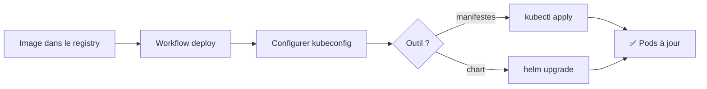
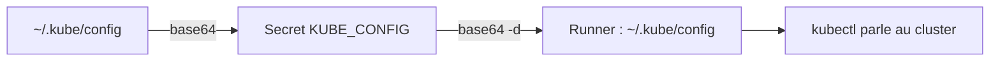
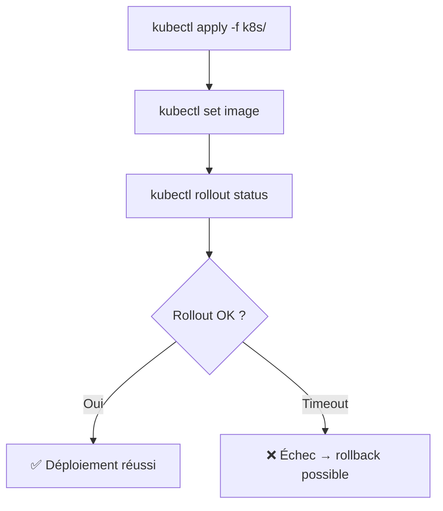
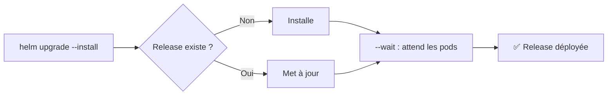
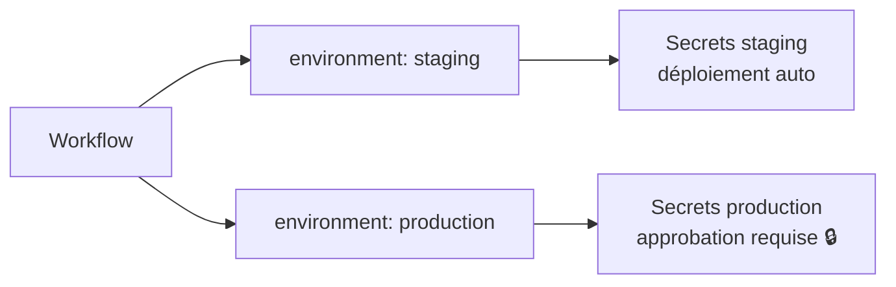
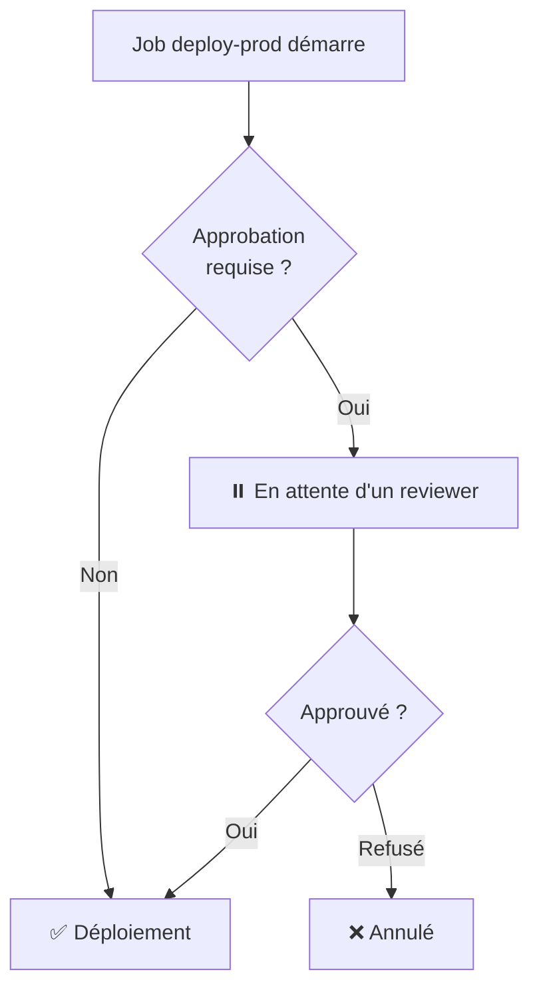
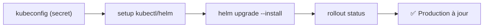

<a id="top"></a>

# 03 — Déploiement sur Kubernetes avec kubectl et Helm

## Table des matières

| # | Section |
|---|---|
| 1 | [Déployer depuis un workflow](#section-1) |
| 2 | [Configurer l'accès au cluster (kubeconfig)](#section-2) |
| 3 | [Déployer avec `kubectl apply`](#section-3) |
| 4 | [Déployer avec `helm upgrade`](#section-4) |
| 5 | [Les environnements GitHub](#section-5) |
| 6 | [Approbations et protections](#section-6) |
| 7 | [Quiz — Déploiement Kubernetes](#section-7) |
| 8 | [Pratique — Pipeline de déploiement complet](#section-8) |
| 9 | [Synthèse](#section-9) |

---

<a id="section-1"></a>

<details>
<summary>1 — Déployer depuis un workflow</summary>

<br/>

La dernière étape du CI/CD : prendre l'image publiée et la **déployer sur un cluster Kubernetes**. Le workflow doit pouvoir parler à l'API du cluster, puis appliquer un manifeste (`kubectl`) ou un *chart* (`helm`).



| Approche | Outil | Quand ? |
|---|---|---|
| Manifestes YAML bruts | `kubectl apply` | Déploiements simples |
| Charts paramétrables | `helm upgrade` | Apps complexes, multi-environnements |

> _Le principe est le même que pour un déploiement manuel : on s'authentifie au cluster, puis on lance la commande. La seule différence, c'est que le runner GitHub remplace votre poste de travail._

</details>

<p align="right"><a href="#top">↑ Retour en haut</a></p>

---

<a id="section-2"></a>

<details>
<summary>2 — Configurer l'accès au cluster (kubeconfig)</summary>

<br/>

Pour parler au cluster, `kubectl` a besoin d'un fichier **`kubeconfig`** (URL de l'API, certificat, jeton). Ce fichier est **sensible** : on le stocke dans un **secret** GitHub, encodé en base64.

### 1. Encoder le kubeconfig en local

```bash
# Encoder le fichier en base64 (une seule ligne)
cat ~/.kube/config | base64 -w 0
```

Copiez le résultat dans un secret du dépôt nommé `KUBE_CONFIG`.

### 2. Le restaurer dans le workflow

```yaml
- name: Configurer kubectl
  run: |
    mkdir -p $HOME/.kube
    echo "${{ secrets.KUBE_CONFIG }}" | base64 -d > $HOME/.kube/config
    chmod 600 $HOME/.kube/config

- name: Installer kubectl
  uses: azure/setup-kubectl@v4
  with:
    version: 'v1.30.0'
```



| Étape | Commande / Action |
|---|---|
| Encoder | `base64 -w 0` |
| Stocker | Secret `KUBE_CONFIG` |
| Décoder | `base64 -d > $HOME/.kube/config` |
| Installer l'outil | `azure/setup-kubectl@v4` |

> _N'écrivez **jamais** le kubeconfig en clair dans le dépôt : il donne un accès complet au cluster. Le secret, lui, est chiffré et masqué dans les logs._

**🔧 Mini-exercice —** Écris la commande qui décode le secret `KUBE_CONFIG` (base64) vers `$HOME/.kube/config`.

<details>
<summary>✅ Voir une solution</summary>

```bash
echo "${{ secrets.KUBE_CONFIG }}" | base64 -d > $HOME/.kube/config
```

</details>

</details>

<p align="right"><a href="#top">↑ Retour en haut</a></p>

---

<a id="section-3"></a>

<details>
<summary>3 — Déployer avec `kubectl apply`</summary>

<br/>

Avec les manifestes YAML, on applique l'état désiré. Pour déployer une **nouvelle image**, on met à jour le tag, soit en éditant le manifeste, soit avec `kubectl set image`.

```yaml
- name: Déployer sur Kubernetes
  run: |
    # Appliquer les manifestes
    kubectl apply -f k8s/

    # Mettre à jour l'image du déploiement vers le tag du commit
    kubectl set image deployment/mon-api \
      mon-api=ghcr.io/${{ github.repository }}:sha-${{ github.sha }}

    # Attendre la fin du rollout
    kubectl rollout status deployment/mon-api --timeout=120s
```



| Commande | Rôle |
|---|---|
| `kubectl apply -f k8s/` | Applique tous les manifestes du dossier |
| `kubectl set image …` | Change l'image d'un déploiement |
| `kubectl rollout status` | Attend que les nouveaux pods soient prêts |
| `kubectl rollout undo` | Revient à la version précédente |

> _Toujours terminer par `kubectl rollout status` : si les nouveaux pods ne démarrent pas, la commande échoue (timeout), le job devient rouge et vous êtes averti. Sans cela, un déploiement cassé passerait inaperçu._

**🔧 Mini-exercice —** Écris la commande qui attend la fin du rollout du déploiement `mon-api` avec un timeout de 120 secondes.

<details>
<summary>✅ Voir une solution</summary>

```bash
kubectl rollout status deployment/mon-api --timeout=120s
```

</details>

</details>

<p align="right"><a href="#top">↑ Retour en haut</a></p>

---

<a id="section-4"></a>

<details>
<summary>4 — Déployer avec `helm upgrade`</summary>

<br/>

**Helm** est le gestionnaire de paquets de Kubernetes. Un *chart* regroupe les manifestes en un modèle paramétrable. La commande clé : `helm upgrade --install`.

```yaml
- name: Installer Helm
  uses: azure/setup-helm@v4
  with:
    version: 'v3.15.0'

- name: Déployer le chart
  run: |
    helm upgrade --install mon-api ./charts/mon-api \
      --namespace production \
      --create-namespace \
      --set image.repository=ghcr.io/${{ github.repository }} \
      --set image.tag=sha-${{ github.sha }} \
      --wait --timeout 2m
```



| Option Helm | Rôle |
|---|---|
| `--install` | Installe si la release n'existe pas encore |
| `--set clé=valeur` | Surcharge une valeur du chart |
| `--namespace` | Espace de noms cible |
| `--wait` | Attend que les ressources soient prêtes |
| `--atomic` | Annule automatiquement en cas d'échec |

> _`helm upgrade --install` est **idempotent** : première fois → installation, fois suivantes → mise à jour. Ajoutez `--atomic` pour un rollback automatique si le déploiement échoue._

**🔧 Mini-exercice —** Écris une commande `helm upgrade --install` qui surcharge le tag de l'image avec `sha-abc123` pour la release `mon-api`.

<details>
<summary>✅ Voir une solution</summary>

```bash
helm upgrade --install mon-api ./charts/mon-api --set image.tag=sha-abc123
```

</details>

</details>

<p align="right"><a href="#top">↑ Retour en haut</a></p>

---

<a id="section-5"></a>

<details>
<summary>5 — Les environnements GitHub</summary>

<br/>

Un **environnement** GitHub (Settings → Environments) représente une cible de déploiement : `staging`, `production`… Il porte ses propres **secrets** et ses **règles de protection**.

```yaml
jobs:
  deploy-prod:
    runs-on: ubuntu-latest
    environment:
      name: production
      url: https://mon-api.exemple.com
    steps:
      - run: echo "Déploiement en production"
```



| Avantage des environnements | Détail |
|---|---|
| Secrets isolés | Un `KUBE_CONFIG` différent par environnement |
| Protection ciblée | Approbation requise sur `production` seulement |
| Traçabilité | Historique des déploiements par environnement |
| URL affichée | Lien direct vers l'app déployée |

> _Le même secret peut exister avec des valeurs différentes selon l'environnement. Le job qui déclare `environment: production` reçoit la version « production » du secret._

**🔧 Mini-exercice —** Ajoute à un job le bloc `environment:` ciblant `production` avec l'URL `https://mon-api.exemple.com`.

<details>
<summary>✅ Voir une solution</summary>

```yaml
environment:
  name: production
  url: https://mon-api.exemple.com
```

</details>

</details>

<p align="right"><a href="#top">↑ Retour en haut</a></p>

---

<a id="section-6"></a>

<details>
<summary>6 — Approbations et protections</summary>

<br/>

Pour la production, on veut souvent un **humain dans la boucle**. Les *protection rules* d'un environnement permettent d'exiger une **approbation manuelle** avant le déploiement.

Dans **Settings → Environments → production**, on active :

- **Required reviewers** : une ou plusieurs personnes doivent approuver.
- **Wait timer** : un délai avant exécution (ex. 5 min).
- **Deployment branches** : seules certaines branches peuvent déployer.



| Règle de protection | Effet |
|---|---|
| Required reviewers | Bloque jusqu'à approbation humaine |
| Wait timer | Impose un délai de réflexion |
| Deployment branches | Restreint les branches autorisées |

> _Avec une approbation requise sur `production`, le workflow se met en pause et envoie une notification. Le déploiement n'a lieu qu'après le clic d'un relecteur autorisé — un garde-fou essentiel._

**🔧 Mini-exercice —** Cite les deux règles de protection à activer pour exiger une approbation humaine ET imposer un délai avant un déploiement en production.

<details>
<summary>✅ Voir une solution</summary>

« Required reviewers » (approbation humaine) et « Wait timer » (délai avant exécution), dans Settings → Environments → production.

</details>

</details>

<p align="right"><a href="#top">↑ Retour en haut</a></p>

---

<a id="section-7"></a>

<details>
<summary>7 — Quiz — Déploiement Kubernetes</summary>

<br/>

**Question 1 :** Où stocke-t-on le fichier kubeconfig pour un workflow ?

a) En clair dans le dépôt

b) Dans un secret GitHub, encodé en base64

c) Dans un fichier `.env` committé

d) Dans le README

<details>
<summary>💡 Voir la solution</summary>

✅ **Réponse : b)** — Le kubeconfig donne un accès complet au cluster : on l'encode en base64 et on le place dans un secret chiffré.

</details>

---

**Question 2 :** Que fait `kubectl rollout status deployment/mon-api` ?

a) Supprime le déploiement

b) Attend que les nouveaux pods soient prêts et échoue en cas de problème

c) Crée un nouveau namespace

d) Affiche les logs

<details>
<summary>💡 Voir la solution</summary>

✅ **Réponse : b)** — Elle attend la fin du déploiement ; si les pods ne démarrent pas, elle échoue (timeout), ce qui fait passer le job en rouge.

</details>

---

**Question 3 :** Pourquoi utiliser `helm upgrade --install` plutôt que `helm install` ?

a) C'est plus rapide

b) C'est idempotent : installe si absent, met à jour sinon

c) Cela supprime la release

d) Cela désactive les secrets

<details>
<summary>💡 Voir la solution</summary>

✅ **Réponse : b)** — `--install` rend la commande idempotente : elle fonctionne aussi bien au premier déploiement qu'aux suivants.

</details>

---

**Question 4 :** À quoi sert un **environnement** GitHub ?

a) À installer Docker

b) À isoler secrets et règles de protection par cible de déploiement

c) À compiler le code

d) À remplacer le Dockerfile

<details>
<summary>💡 Voir la solution</summary>

✅ **Réponse : b)** — Un environnement (`staging`, `production`…) porte ses propres secrets et peut exiger une approbation avant déploiement.

</details>

---

**Question 5 :** Comment exiger une validation humaine avant un déploiement en production ?

a) Ajouter `manual: true` au job

b) Configurer « Required reviewers » sur l'environnement

c) Utiliser `kubectl pause`

d) Mettre un commentaire dans le YAML

<details>
<summary>💡 Voir la solution</summary>

✅ **Réponse : b)** — La règle de protection « Required reviewers » de l'environnement met le job en pause jusqu'à l'approbation d'un relecteur.

</details>

</details>

<p align="right"><a href="#top">↑ Retour en haut</a></p>

---

<a id="section-8"></a>

<details>
<summary>8 — Pratique — Pipeline de déploiement complet</summary>

<br/>

### Consigne

Créez un workflow `deploy.yml` qui, sur un `push` vers `main` :

1. cible l'environnement `production` (avec approbation requise configurée dans les réglages) ;
2. restaure le kubeconfig depuis le secret `KUBE_CONFIG` ;
3. installe `kubectl` et `helm` ;
4. déploie le chart via `helm upgrade --install`, en injectant l'image taguée par le SHA du commit ;
5. attend la fin du déploiement (`--wait`) avec un rollback atomique.

---

### Correction — Workflow attendu

```yaml
# .github/workflows/deploy.yml
name: Déploiement en production

on:
  push:
    branches: [main]

jobs:
  deploy:
    runs-on: ubuntu-latest
    environment:
      name: production
      url: https://mon-api.exemple.com
    steps:
      - name: Récupérer le code
        uses: actions/checkout@v4

      - name: Configurer kubectl (kubeconfig)
        run: |
          mkdir -p $HOME/.kube
          echo "${{ secrets.KUBE_CONFIG }}" | base64 -d > $HOME/.kube/config
          chmod 600 $HOME/.kube/config

      - name: Installer kubectl
        uses: azure/setup-kubectl@v4
        with:
          version: 'v1.30.0'

      - name: Installer Helm
        uses: azure/setup-helm@v4
        with:
          version: 'v3.15.0'

      - name: Déployer le chart Helm
        run: |
          helm upgrade --install mon-api ./charts/mon-api \
            --namespace production \
            --create-namespace \
            --set image.repository=ghcr.io/${{ github.repository }} \
            --set image.tag=sha-${{ github.sha }} \
            --atomic --wait --timeout 2m

      - name: Vérifier le rollout
        run: kubectl rollout status deployment/mon-api -n production --timeout=120s
```

**Résultat attendu :**

```
⏸️  Déploiement en production — en attente d'approbation
✅  Approuvé par @haythem
Release "mon-api" has been upgraded. Happy Helming!
deployment "mon-api" successfully rolled out
```

> _Le job se met en pause pour l'approbation, puis Helm déploie la version `sha-…` du commit. Si un pod échoue à démarrer, `--atomic` annule automatiquement et restaure la version précédente._

</details>

<p align="right"><a href="#top">↑ Retour en haut</a></p>

---

<a id="section-9"></a>

<details>
<summary>9 — Synthèse</summary>

<br/>

#### Points à retenir

1. Le workflow de déploiement **configure l'accès au cluster** via un kubeconfig stocké en secret (base64).
2. `azure/setup-kubectl` et `azure/setup-helm` installent les outils sur le runner.
3. **`kubectl apply`** + `kubectl set image` + `kubectl rollout status` pour les manifestes bruts.
4. **`helm upgrade --install`** (idempotent, `--atomic --wait`) pour les charts paramétrables.
5. Les **environnements** isolent secrets et protections ; « Required reviewers » impose une **approbation humaine** avant la production.



#### La suite

Module suivant : approfondir l'**observabilité** et le **monitoring** des applications déployées, afin de fermer la boucle DevOps (déployer → observer → améliorer).

</details>

<p align="right"><a href="#top">↑ Retour en haut</a></p>

---

<p align="center">
  <em>Tous droits réservés. Toute reproduction, diffusion, utilisation ou adaptation de ce cours, en tout ou en partie, est strictement interdite sans l'autorisation écrite préalable de Dr. Haythem REHOUMA.</em>
</p>

<p align="center">
  <strong>Cours créé par Dr. Haythem REHOUMA — Développement et déploiement de solutions de données</strong>
</p>
