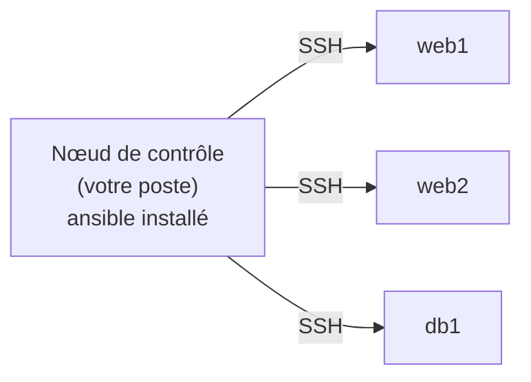
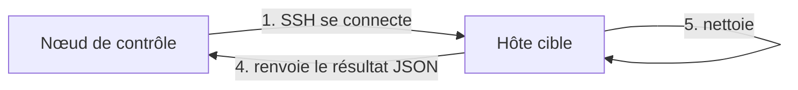
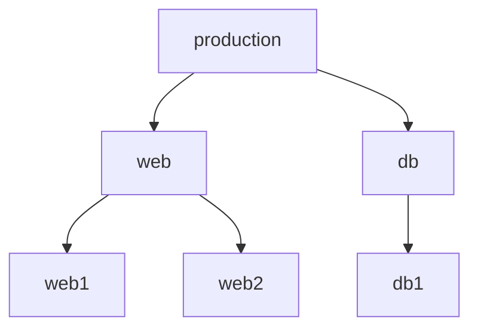
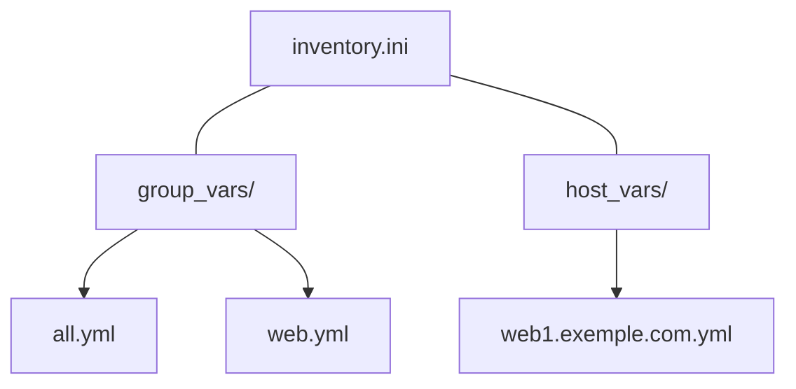
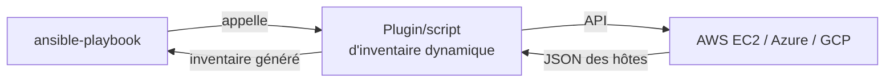
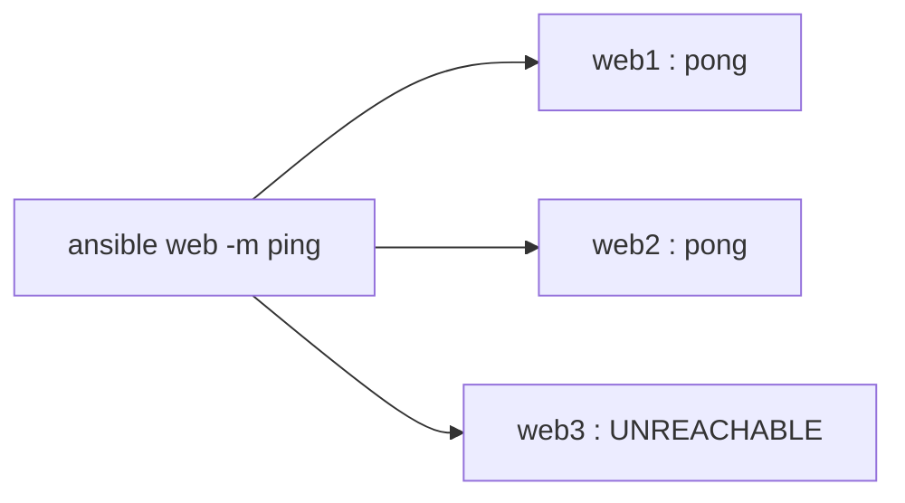
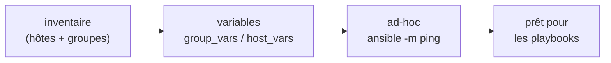

<a id="top"></a>

# 01 — Ansible et les inventaires

## Table des matières

| # | Section |
|---|---|
| 1 | [Ansible : la gestion de configuration sans agent](#section-1) |
| 2 | [Comment Ansible se connecte (SSH)](#section-2) |
| 3 | [L'inventaire statique (INI et YAML)](#section-3) |
| 4 | [Groupes d'hôtes et hiérarchie](#section-4) |
| 5 | [Variables d'hôtes et de groupes](#section-5) |
| 6 | [Inventaires dynamiques](#section-6) |
| 7 | [Commandes ad-hoc (ping, etc.)](#section-7) |
| 8 | [Quiz — Inventaires Ansible](#section-8) |
| 9 | [Pratique — Construire un inventaire](#section-9) |
| 10 | [Synthèse](#section-10) |

---

<a id="section-1"></a>

<details>
<summary>1 — Ansible : la gestion de configuration sans agent</summary>

<br/>

**Ansible** est un outil de **gestion de configuration** et d'**automatisation** : au lieu de configurer chaque serveur à la main (installer des paquets, copier des fichiers, démarrer des services), on **décrit l'état désiré** dans des fichiers et Ansible l'applique à des dizaines ou des milliers de machines.

Sa caractéristique majeure : il est **sans agent** (*agentless*). Aucun démon à installer sur les machines cibles. Ansible pousse les instructions par **SSH** depuis un poste de contrôle.



| Outil | Modèle | Agent requis ? | Langage |
|---|---|---|---|
| **Ansible** | Push (SSH) | ❌ Non | YAML |
| Puppet | Pull | ✅ Oui | DSL Ruby |
| Chef | Pull | ✅ Oui | DSL Ruby |
| SaltStack | Push/Pull | ✅ (souvent) | YAML |

> _Le côté « sans agent » est l'argument décisif d'Ansible : si une machine a un accès SSH et Python, elle est déjà gérable. Rien à installer côté cible._

**🔧 Mini-exercice —** Cite les deux seuls pré-requis qu'une machine cible doit fournir pour qu'Ansible la gère, sans rien y installer de permanent.

<details>
<summary>✅ Voir une solution</summary>

Un accès **SSH** (port 22) et un interpréteur **Python**. Ansible pousse ses modules par SSH et les exécute via Python, sans laisser d'agent.

</details>

</details>

<p align="right"><a href="#top">↑ Retour en haut</a></p>

---

<a id="section-2"></a>

<details>
<summary>2 — Comment Ansible se connecte (SSH)</summary>

<br/>

Ansible exécute ses modules en se connectant en **SSH** sur chaque hôte cible, puis en y lançant du **Python** temporairement. Aucune trace permanente n'est laissée.



Pré-requis sur la cible :

| Élément | Rôle |
|---|---|
| **SSH (port 22)** | Canal de communication |
| **Python** | Exécution des modules Ansible |
| **Utilisateur + clé/mot de passe** | Authentification |
| **sudo** (souvent) | Élévation de privilèges (`become`) |

```bash
# Vérifier qu'on peut se connecter en SSH avant Ansible
ssh deploy@192.168.1.10

# Tester la version d'Ansible installée localement
ansible --version
```

> _Configurez l'authentification par **clé SSH** plutôt que par mot de passe : c'est plus sûr et indispensable pour automatiser sans saisie interactive._

**🔧 Mini-exercice —** Écris la commande qui teste, depuis ton poste, la connexion SSH vers l'hôte `192.168.1.10` avec l'utilisateur `deploy`, avant même de lancer Ansible.

<details>
<summary>✅ Voir une solution</summary>

```bash
ssh deploy@192.168.1.10
```

Si cette connexion fonctionne (et idéalement par clé), Ansible pourra se connecter aussi.

</details>

</details>

<p align="right"><a href="#top">↑ Retour en haut</a></p>

---

<a id="section-3"></a>

<details>
<summary>3 — L'inventaire statique (INI et YAML)</summary>

<br/>

L'**inventaire** est la liste des machines qu'Ansible peut gérer. La forme la plus simple est un fichier **statique**, écrit en **INI** ou en **YAML**.

Format **INI** (`inventory.ini`) :

```ini
# Hôtes individuels
192.168.1.10
web1.exemple.com

# Groupe [web]
[web]
web1.exemple.com
web2.exemple.com

[db]
db1.exemple.com
```

Le **même** inventaire en **YAML** (`inventory.yml`) :

```yaml
all:
  hosts:
    web1.exemple.com:
    web2.exemple.com:
    db1.exemple.com:
  children:
    web:
      hosts:
        web1.exemple.com:
        web2.exemple.com:
    db:
      hosts:
        db1.exemple.com:
```

```bash
# Lister tous les hôtes vus par Ansible dans cet inventaire
ansible-inventory -i inventory.ini --list

# Représentation en arbre (groupes + hôtes)
ansible-inventory -i inventory.yml --graph
```

| Format | Avantage | Inconvénient |
|---|---|---|
| **INI** | Concis, lisible pour les petits cas | Peu adapté aux structures profondes |
| **YAML** | Hiérarchies et variables riches | Plus verbeux, sensible à l'indentation |

> _Le groupe spécial **`all`** contient automatiquement **tous** les hôtes. Un autre groupe implicite, `ungrouped`, contient les hôtes sans groupe explicite._

**🔧 Mini-exercice —** Écris un inventaire **INI** minimal contenant un groupe `web` avec deux hôtes (`web1.exemple.com`, `web2.exemple.com`) et un groupe `db` avec `db1.exemple.com`.

<details>
<summary>✅ Voir une solution</summary>

```ini
[web]
web1.exemple.com
web2.exemple.com

[db]
db1.exemple.com
```

</details>

</details>

<p align="right"><a href="#top">↑ Retour en haut</a></p>

---

<a id="section-4"></a>

<details>
<summary>4 — Groupes d'hôtes et hiérarchie</summary>

<br/>

Les **groupes** permettent de cibler plusieurs machines d'un coup. On peut aussi créer des **groupes de groupes** avec `:children` (INI) ou `children` (YAML).

```ini
[web]
web1.exemple.com
web2.exemple.com

[db]
db1.exemple.com

# Groupe parent qui contient web ET db
[production:children]
web
db
```



```bash
# Cibler uniquement le groupe web
ansible web -i inventory.ini --list-hosts

# Cibler le groupe parent (web + db)
ansible production -i inventory.ini --list-hosts
```

| Motif de ciblage | Sélectionne |
|---|---|
| `all` | Tous les hôtes |
| `web` | Les hôtes du groupe `web` |
| `web:db` | Union de `web` et `db` |
| `web:!web2.exemple.com` | `web` sauf `web2` |
| `web:&production` | Intersection `web` ∩ `production` |

> _Un hôte peut appartenir à **plusieurs groupes** à la fois (ex. `web1` peut être dans `web` et dans `paris`). C'est ce qui rend le ciblage très souple._

**🔧 Mini-exercice —** Donne le motif de ciblage qui sélectionne tous les hôtes du groupe `web` **sauf** `web2.exemple.com`.

<details>
<summary>✅ Voir une solution</summary>

```
web:!web2.exemple.com
```

Le `!` exclut un hôte (ou un groupe) de la sélection.

</details>

</details>

<p align="right"><a href="#top">↑ Retour en haut</a></p>

---

<a id="section-5"></a>

<details>
<summary>5 — Variables d'hôtes et de groupes</summary>

<br/>

On associe des **variables** aux hôtes et aux groupes pour personnaliser le comportement (port SSH, version d'application, utilisateur…).

Variables directement dans l'inventaire INI :

```ini
[web]
web1.exemple.com http_port=8080
web2.exemple.com http_port=8081

# Variables communes au groupe web
[web:vars]
app_version=2.3.0
ansible_user=deploy
```

Méthode recommandée : des dossiers **`host_vars/`** et **`group_vars/`** à côté de l'inventaire.



```yaml
# group_vars/web.yml
app_version: "2.3.0"
ansible_user: deploy
nginx_workers: 4
```

```yaml
# host_vars/web1.exemple.com.yml
http_port: 8080
role_special: true
```

| Source de variable | Portée | Priorité (du plus faible au plus fort) |
|---|---|---|
| `group_vars/all.yml` | Tous les hôtes | Faible |
| `group_vars/<groupe>.yml` | Un groupe | Moyenne |
| `host_vars/<hôte>.yml` | Un hôte précis | Élevée |

```bash
# Voir toutes les variables résolues pour un hôte donné
ansible-inventory -i inventory.ini --host web1.exemple.com
```

> _Règle de priorité essentielle : **plus c'est spécifique, plus ça gagne**. Une variable d'hôte écrase la même variable définie au niveau du groupe._

</details>

<p align="right"><a href="#top">↑ Retour en haut</a></p>

---

<a id="section-6"></a>

<details>
<summary>6 — Inventaires dynamiques</summary>

<br/>

Dans le cloud, les machines apparaissent et disparaissent sans cesse : maintenir un fichier statique devient impossible. Un **inventaire dynamique** interroge une source (AWS, Azure, GCP, un CMDB…) et génère la liste des hôtes **à la volée**.



Exemple de plugin d'inventaire dynamique AWS (`aws_ec2.yml`) :

```yaml
plugin: amazon.aws.aws_ec2
regions:
  - ca-central-1
keyed_groups:
  # Crée un groupe par valeur du tag "role"
  - key: tags.role
    prefix: role
filters:
  instance-state-name: running
```

```bash
# Lister les hôtes découverts dynamiquement sur AWS
ansible-inventory -i aws_ec2.yml --graph

# Un script exécutable peut aussi servir d'inventaire
ansible all -i ./inventaire_dynamique.py -m ping
```

| Type | Source | Quand l'utiliser |
|---|---|---|
| **Statique** | Fichier INI/YAML | Parc fixe, labo, petits projets |
| **Dynamique** | Plugin/script + API cloud | Cloud, autoscaling, parc changeant |

> _Un inventaire dynamique doit renvoyer du **JSON** au format attendu par Ansible. Les plugins officiels (`aws_ec2`, `azure_rm`, `gcp_compute`) remplacent aujourd'hui les anciens scripts maison._

</details>

<p align="right"><a href="#top">↑ Retour en haut</a></p>

---

<a id="section-7"></a>

<details>
<summary>7 — Commandes ad-hoc (ping, etc.)</summary>

<br/>

Une commande **ad-hoc** exécute **une seule tâche** immédiatement, sans écrire de playbook. Idéal pour tester la connectivité ou faire une action rapide.

```bash
# Le module "ping" vérifie SSH + Python sur la cible
ansible all -i inventory.ini -m ping

# Cibler un groupe précis
ansible web -i inventory.ini -m ping
```

Résultat attendu (succès) :

```
web1.exemple.com | SUCCESS => {
    "changed": false,
    "ping": "pong"
}
```



Autres exemples d'ad-hoc :

```bash
# Espace disque sur toutes les machines
ansible all -i inventory.ini -m shell -a "df -h"

# Installer un paquet (avec élévation de privilèges)
ansible web -i inventory.ini -m apt -a "name=nginx state=present" --become
```

| Option | Rôle |
|---|---|
| `-i` | Fichier d'inventaire |
| `-m` | Module à utiliser (`ping`, `apt`, `shell`…) |
| `-a` | Arguments du module |
| `--become` | Exécuter en `sudo` |

> _Le module **`ping`** d'Ansible n'est PAS un ping ICMP : il vérifie qu'Ansible peut se connecter en SSH **et** lancer Python. La réponse `pong` signifie « tout est prêt »._

</details>

<p align="right"><a href="#top">↑ Retour en haut</a></p>

---

<a id="section-8"></a>

<details>
<summary>8 — Quiz — Inventaires Ansible</summary>

<br/>

**Question 1 :** Pourquoi dit-on qu'Ansible est « sans agent » ?

a) Il n'a pas besoin d'Internet

b) Il ne nécessite aucun logiciel installé en permanence sur les cibles, il passe par SSH

c) Il fonctionne sans utilisateur

d) Il ne gère qu'une seule machine

<details>
<summary>💡 Voir la solution</summary>

✅ **Réponse : b)** — Ansible se connecte en SSH et lance temporairement du Python ; rien de permanent n'est installé sur les cibles.

</details>

---

**Question 2 :** À quoi sert un fichier d'inventaire ?

a) À stocker les mots de passe

b) À lister les machines qu'Ansible peut gérer et leurs groupes

c) À écrire les tâches à exécuter

d) À configurer SSH

<details>
<summary>💡 Voir la solution</summary>

✅ **Réponse : b)** — L'inventaire définit les hôtes, les groupes et leurs variables. Les tâches, elles, vivent dans les playbooks.

</details>

---

**Question 3 :** Une variable définie dans `host_vars/web1.yml` et la même dans `group_vars/web.yml` : laquelle gagne pour `web1` ?

a) Celle du groupe

b) Celle de l'hôte

c) Aucune, c'est une erreur

d) La première lue alphabétiquement

<details>
<summary>💡 Voir la solution</summary>

✅ **Réponse : b)** — Plus une variable est spécifique, plus elle est prioritaire. La variable d'hôte écrase la variable de groupe.

</details>

---

**Question 4 :** Que renvoie un `ansible all -m ping` réussi ?

a) `OK`

b) `pong`

c) un temps de latence ICMP

d) `connected`

<details>
<summary>💡 Voir la solution</summary>

✅ **Réponse : b)** — Le module `ping` renvoie `"ping": "pong"` quand SSH et Python répondent (ce n'est pas un ping réseau ICMP).

</details>

---

**Question 5 :** Quand préférer un inventaire dynamique ?

a) Toujours, c'est obligatoire

b) Pour un labo de 2 machines fixes

c) Pour un parc cloud changeant (autoscaling, instances éphémères)

d) Jamais en production

<details>
<summary>💡 Voir la solution</summary>

✅ **Réponse : c)** — Un inventaire dynamique interroge l'API du cloud pour découvrir les hôtes en temps réel, ce qui est idéal quand le parc varie sans cesse.

</details>

</details>

<p align="right"><a href="#top">↑ Retour en haut</a></p>

---

<a id="section-9"></a>

<details>
<summary>9 — Pratique — Construire un inventaire</summary>

<br/>

### Consigne

Créez un inventaire **YAML** avec deux serveurs web et un serveur de base de données, regroupés sous un parent `production`. Donnez la variable `ansible_user=deploy` à tout le monde et `http_port=8080` au premier serveur web. Vérifiez avec `ansible-inventory`, puis testez la connectivité du groupe `web` avec une commande ad-hoc.

---

### Correction — Fichiers et commandes attendus

```yaml
# inventory.yml
all:
  vars:
    ansible_user: deploy
  children:
    web:
      hosts:
        web1.exemple.com:
          http_port: 8080
        web2.exemple.com:
    db:
      hosts:
        db1.exemple.com:
    production:
      children:
        web:
        db:
```

```bash
# 1. Vérifier la structure (arbre des groupes)
ansible-inventory -i inventory.yml --graph

# 2. Voir les variables résolues pour web1
ansible-inventory -i inventory.yml --host web1.exemple.com

# 3. Tester la connectivité du groupe web
ansible web -i inventory.yml -m ping
```

**Résultat attendu de `--graph` :**

```
@all:
  |--@production:
  |  |--@web:
  |  |  |--web1.exemple.com
  |  |  |--web2.exemple.com
  |  |--@db:
  |  |  |--db1.exemple.com
```

**Résultat attendu du `--host web1.exemple.com` :**

```json
{
    "ansible_user": "deploy",
    "http_port": 8080
}
```

> _Notez que `web1` hérite de `ansible_user` (variable `all`) **et** possède son propre `http_port`. C'est la combinaison héritage + spécificité qui rend les inventaires puissants._

</details>

<p align="right"><a href="#top">↑ Retour en haut</a></p>

---

<a id="section-10"></a>

<details>
<summary>10 — Synthèse</summary>

<br/>

#### Points à retenir

1. **Ansible est sans agent** : il pilote les cibles par **SSH** + Python, rien à installer côté serveur.
2. L'**inventaire** liste les machines (INI ou YAML) ; `all` et `ungrouped` sont implicites.
3. Les **groupes** (et groupes de groupes `children`) permettent un ciblage souple.
4. Les **variables** se placent dans `group_vars/` et `host_vars/` ; la plus spécifique gagne.
5. Les **inventaires dynamiques** découvrent les hôtes via l'API du cloud.
6. Les **commandes ad-hoc** (`-m ping`) testent vite la connectivité.



#### La suite

Leçon **02 — Playbooks** : passer des commandes ponctuelles aux **playbooks YAML** qui décrivent des suites de tâches reproductibles.

</details>

<p align="right"><a href="#top">↑ Retour en haut</a></p>

---

<p align="center">
  <em>Tous droits réservés. Toute reproduction, diffusion, utilisation ou adaptation de ce cours, en tout ou en partie, est strictement interdite sans l'autorisation écrite préalable de Dr. Haythem REHOUMA.</em>
</p>

<p align="center">
  <strong>Cours créé par Dr. Haythem REHOUMA — Développement et déploiement de solutions de données</strong>
</p>
