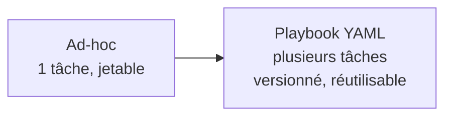
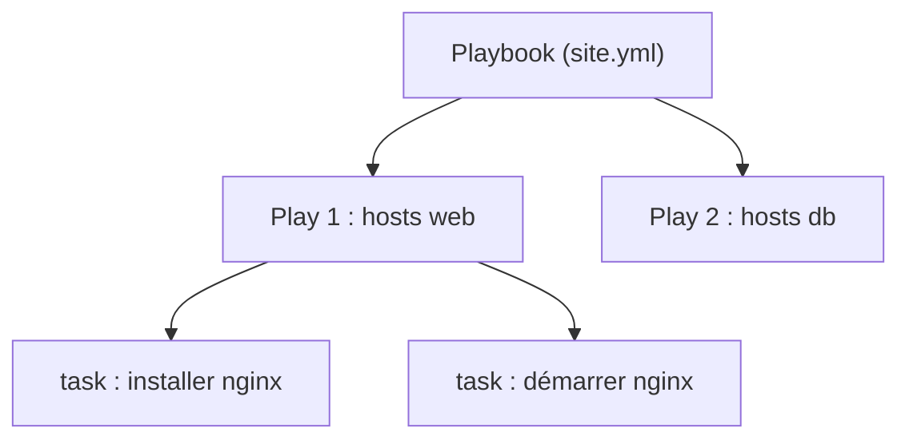
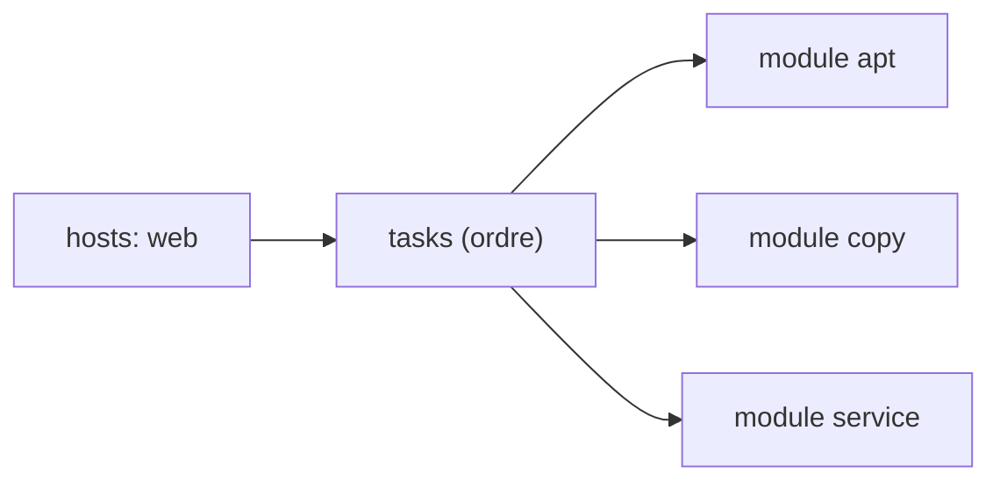
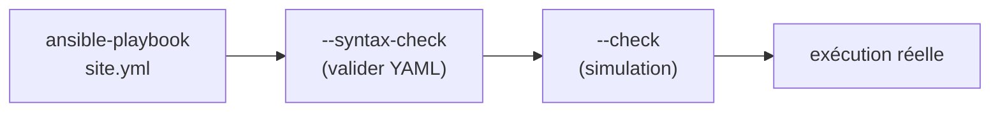
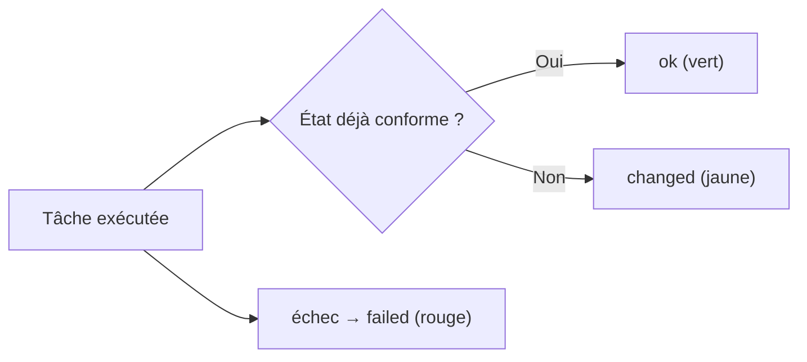
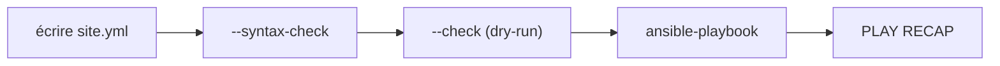

<a id="top"></a>

# 02 — Playbooks Ansible

## Table des matières

| # | Section |
|---|---|
| 1 | [Du ad-hoc au playbook](#section-1) |
| 2 | [Anatomie d'un playbook YAML](#section-2) |
| 3 | [Hosts, tasks et modules](#section-3) |
| 4 | [Modules courants (apt, copy, template, service)](#section-4) |
| 5 | [Variables dans un playbook](#section-5) |
| 6 | [Exécuter avec ansible-playbook](#section-6) |
| 7 | [Lire la sortie du PLAY RECAP](#section-7) |
| 8 | [Quiz — Playbooks](#section-8) |
| 9 | [Pratique — Déployer Nginx](#section-9) |
| 10 | [Synthèse](#section-10) |

---

<a id="section-1"></a>

<details>
<summary>1 — Du ad-hoc au playbook</summary>

<br/>

Une commande ad-hoc est pratique pour une action unique. Mais pour **déployer une application complète** (installer, configurer, démarrer), il faut enchaîner plusieurs tâches **de façon reproductible** : c'est le rôle du **playbook**.

Un playbook est un fichier **YAML** qui décrit, dans l'ordre, **ce qu'il faut faire** et **sur quels hôtes**.



| Aspect | Ad-hoc | Playbook |
|---|---|---|
| Nombre de tâches | 1 | Plusieurs |
| Réutilisable | ❌ | ✅ |
| Versionnable (Git) | Difficile | ✅ Oui |
| Usage typique | Test, dépannage | Déploiement répétable |

> _Un playbook, c'est de l'**infrastructure as code** : on lit le fichier et on sait exactement dans quel état seront les serveurs. On le commit dans Git comme n'importe quel code._

**🔧 Mini-exercice —** Cite deux avantages concrets d'un playbook par rapport à une commande ad-hoc.

<details>
<summary>✅ Voir une solution</summary>

Un playbook est **réutilisable** (plusieurs tâches enchaînées, rejouables) et **versionnable dans Git** (on suit l'historique). Une ad-hoc, elle, est jetable et faite pour une seule action.

</details>

</details>

<p align="right"><a href="#top">↑ Retour en haut</a></p>

---

<a id="section-2"></a>

<details>
<summary>2 — Anatomie d'un playbook YAML</summary>

<br/>

Un playbook est une **liste de plays**. Chaque **play** associe un groupe d'hôtes à une liste de **tasks**.

```yaml
# site.yml
- name: Configurer les serveurs web        # nom du play
  hosts: web                               # cibles
  become: true                             # exécuter en sudo
  tasks:
    - name: Installer Nginx                 # nom de la tâche
      ansible.builtin.apt:                  # module
        name: nginx
        state: present
```



| Clé | Rôle |
|---|---|
| `name` | Description lisible (play ou task) |
| `hosts` | Groupe ou hôte ciblé |
| `become` | Élévation de privilèges (sudo) |
| `tasks` | Liste ordonnée des tâches |
| `vars` | Variables locales au play |

> _Le YAML est **sensible à l'indentation** (espaces uniquement, jamais de tabulation). Une seule erreur d'alignement et le playbook ne se charge pas. Validez avec `--syntax-check`._

**🔧 Mini-exercice —** Écris un play minimal qui cible le groupe `db`, s'exécute en sudo, et contient une seule tâche nommée « Installer PostgreSQL » via le module `apt`.

<details>
<summary>✅ Voir une solution</summary>

```yaml
- name: Configurer les bases de données
  hosts: db
  become: true
  tasks:
    - name: Installer PostgreSQL
      ansible.builtin.apt:
        name: postgresql
        state: present
```

</details>

</details>

<p align="right"><a href="#top">↑ Retour en haut</a></p>

---

<a id="section-3"></a>

<details>
<summary>3 — Hosts, tasks et modules</summary>

<br/>

Trois notions structurent tout playbook :

- **hosts** : sur quelles machines agir (depuis l'inventaire).
- **tasks** : la liste ordonnée des actions.
- **modules** : les outils qui réalisent chaque action (`apt`, `copy`, `service`…).

```yaml
- name: Préparer le serveur
  hosts: web
  become: true
  tasks:
    - name: Mettre à jour le cache de paquets
      ansible.builtin.apt:
        update_cache: true

    - name: Installer Git
      ansible.builtin.apt:
        name: git
        state: present
```



> _Les tâches s'exécutent **dans l'ordre, de haut en bas**, et sur **tous les hôtes en parallèle** par défaut. La tâche 2 ne démarre que lorsque la tâche 1 est finie sur l'ensemble du parc (par lots)._

</details>

<p align="right"><a href="#top">↑ Retour en haut</a></p>

---

<a id="section-4"></a>

<details>
<summary>4 — Modules courants (apt, copy, template, service)</summary>

<br/>

Les **modules** sont le cœur d'Ansible. En voici quatre incontournables.

```yaml
tasks:
  # apt : gérer les paquets Debian/Ubuntu
  - name: Installer Nginx
    ansible.builtin.apt:
      name: nginx
      state: present
      update_cache: true

  # copy : copier un fichier tel quel sur la cible
  - name: Déposer la page d'accueil
    ansible.builtin.copy:
      src: files/index.html
      dest: /var/www/html/index.html
      mode: "0644"

  # template : copier un fichier en injectant des variables (Jinja2)
  - name: Générer la config Nginx
    ansible.builtin.template:
      src: templates/nginx.conf.j2
      dest: /etc/nginx/nginx.conf

  # service : gérer l'état d'un service
  - name: Démarrer et activer Nginx
    ansible.builtin.service:
      name: nginx
      state: started
      enabled: true
```

| Module | Fait quoi | Différence clé |
|---|---|---|
| `apt` | Installe/supprime des paquets | `state: present / absent / latest` |
| `copy` | Copie un fichier **statique** | Pas de variables interprétées |
| `template` | Copie un fichier **avec variables** | Rend du **Jinja2** (`.j2`) |
| `service` | Démarre/arrête/active un service | `state` + `enabled` |

> _`copy` vs `template` : utilisez `copy` pour un fichier figé, et `template` dès que le contenu doit changer selon l'hôte (port, nom, version) grâce aux variables Jinja2._

**🔧 Mini-exercice —** Écris une tâche qui s'assure que le service `nginx` est **démarré** et **activé au démarrage** de la machine.

<details>
<summary>✅ Voir une solution</summary>

```yaml
- name: Démarrer et activer Nginx
  ansible.builtin.service:
    name: nginx
    state: started
    enabled: true
```

</details>

</details>

<p align="right"><a href="#top">↑ Retour en haut</a></p>

---

<a id="section-5"></a>

<details>
<summary>5 — Variables dans un playbook</summary>

<br/>

Les **variables** évitent de coder en dur. On les réutilise avec la syntaxe Jinja2 `{{ ma_var }}`.

```yaml
- name: Déployer l'application
  hosts: web
  become: true
  vars:
    paquet: nginx
    port_http: 8080
  tasks:
    - name: Installer {{ paquet }}
      ansible.builtin.apt:
        name: "{{ paquet }}"
        state: present

    - name: Générer la config avec le bon port
      ansible.builtin.template:
        src: templates/app.conf.j2
        dest: /etc/app/app.conf
```

Dans le template `app.conf.j2` :

```
listen {{ port_http }};
server_name {{ inventory_hostname }};
```

| Origine de la variable | Exemple | Portée |
|---|---|---|
| `vars:` dans le play | `port_http: 8080` | Le play |
| `group_vars/` | `group_vars/web.yml` | Un groupe |
| `host_vars/` | `host_vars/web1.yml` | Un hôte |
| `--extra-vars` (CLI) | `-e "port_http=9090"` | Priorité maximale |

```bash
# Surcharger une variable à la volée
ansible-playbook site.yml -e "port_http=9090"
```

> _`inventory_hostname` est une **variable magique** fournie par Ansible : c'est le nom de l'hôte courant tel qu'il apparaît dans l'inventaire. Très utile dans les templates._

**🔧 Mini-exercice —** Écris la commande qui exécute `site.yml` en surchargeant la variable `port_http` à la valeur `9090` depuis la ligne de commande.

<details>
<summary>✅ Voir une solution</summary>

```bash
ansible-playbook site.yml -e "port_http=9090"
```

`--extra-vars` (`-e`) a la priorité la plus élevée sur toutes les autres sources de variables.

</details>

</details>

<p align="right"><a href="#top">↑ Retour en haut</a></p>

---

<a id="section-6"></a>

<details>
<summary>6 — Exécuter avec ansible-playbook</summary>

<br/>

On lance un playbook avec la commande **`ansible-playbook`**.

```bash
# Exécution de base
ansible-playbook -i inventory.yml site.yml

# Vérifier la syntaxe SANS rien exécuter
ansible-playbook -i inventory.yml site.yml --syntax-check

# Lister les tâches qui seraient exécutées
ansible-playbook -i inventory.yml site.yml --list-tasks

# Limiter à un seul hôte
ansible-playbook -i inventory.yml site.yml --limit web1.exemple.com
```



| Option | Effet |
|---|---|
| `-i` | Inventaire à utiliser |
| `--syntax-check` | Valide le YAML sans exécuter |
| `--check` | Mode simulation (*dry-run*) |
| `--limit` | Restreindre à certains hôtes |
| `-v` / `-vvv` | Mode verbeux (débogage) |

> _Bon réflexe : enchaîner `--syntax-check` puis `--check` avant la vraie exécution. On attrape les erreurs de syntaxe et on voit ce qui changerait, sans rien casser._

</details>

<p align="right"><a href="#top">↑ Retour en haut</a></p>

---

<a id="section-7"></a>

<details>
<summary>7 — Lire la sortie du PLAY RECAP</summary>

<br/>

À la fin de chaque exécution, Ansible affiche un **PLAY RECAP** : le bilan par hôte.

```
PLAY RECAP *********************************************************
web1.exemple.com : ok=4    changed=1    unreachable=0    failed=0
web2.exemple.com : ok=4    changed=1    unreachable=0    failed=0
```

| Compteur | Signification |
|---|---|
| `ok` | Tâches réussies (déjà conformes ou modifiées) |
| `changed` | Tâches qui ont **réellement modifié** l'hôte |
| `unreachable` | Hôte injoignable (SSH) |
| `failed` | Tâches en échec |
| `skipped` | Tâches ignorées (condition non remplie) |



> _Le compteur **`changed`** est le plus intéressant : à la **deuxième** exécution d'un playbook idempotent, il devrait tomber à **0** (rien à modifier). Nous y reviendrons en détail dans la leçon 04._

</details>

<p align="right"><a href="#top">↑ Retour en haut</a></p>

---

<a id="section-8"></a>

<details>
<summary>8 — Quiz — Playbooks</summary>

<br/>

**Question 1 :** Dans quel langage écrit-on un playbook ?

a) JSON

b) YAML

c) Python

d) Bash

<details>
<summary>💡 Voir la solution</summary>

✅ **Réponse : b)** — Les playbooks Ansible sont des fichiers YAML (sensibles à l'indentation, espaces uniquement).

</details>

---

**Question 2 :** Quelle clé indique sur quelles machines un play s'applique ?

a) `tasks`

b) `vars`

c) `hosts`

d) `name`

<details>
<summary>💡 Voir la solution</summary>

✅ **Réponse : c)** — `hosts` désigne le groupe ou l'hôte ciblé, défini dans l'inventaire.

</details>

---

**Question 3 :** Quelle est la différence entre `copy` et `template` ?

a) Aucune

b) `template` interprète les variables Jinja2, `copy` non

c) `copy` ne fonctionne que sur Windows

d) `template` ne copie que des dossiers

<details>
<summary>💡 Voir la solution</summary>

✅ **Réponse : b)** — `template` rend du Jinja2 (`{{ var }}`) à la copie ; `copy` dépose un fichier statique tel quel.

</details>

---

**Question 4 :** Quelle option simule un playbook sans rien modifier ?

a) `--syntax-check`

b) `--check`

c) `--limit`

d) `--list-tasks`

<details>
<summary>💡 Voir la solution</summary>

✅ **Réponse : b)** — `--check` lance un *dry-run* : Ansible montre ce qui changerait sans l'appliquer. `--syntax-check` valide seulement le YAML.

</details>

---

**Question 5 :** Dans le PLAY RECAP, que signifie `changed=1` ?

a) Une tâche a échoué

b) Un hôte est injoignable

c) Une tâche a réellement modifié l'état de l'hôte

d) Une tâche a été ignorée

<details>
<summary>💡 Voir la solution</summary>

✅ **Réponse : c)** — `changed` compte les tâches qui ont effectivement apporté une modification sur la machine cible.

</details>

</details>

<p align="right"><a href="#top">↑ Retour en haut</a></p>

---

<a id="section-9"></a>

<details>
<summary>9 — Pratique — Déployer Nginx</summary>

<br/>

### Consigne

Écrivez un playbook `deploy-web.yml` qui, sur le groupe `web` : met à jour le cache apt, installe Nginx, dépose une page d'accueil personnalisée via `template`, puis démarre et active le service. Utilisez une variable `message_accueil`. Validez la syntaxe, simulez, puis exécutez.

---

### Correction — Playbook et commandes attendus

```yaml
# deploy-web.yml
- name: Déployer un serveur web Nginx
  hosts: web
  become: true
  vars:
    message_accueil: "Bienvenue sur {{ inventory_hostname }}"
  tasks:
    - name: Mettre à jour le cache apt
      ansible.builtin.apt:
        update_cache: true

    - name: Installer Nginx
      ansible.builtin.apt:
        name: nginx
        state: present

    - name: Déposer la page d'accueil personnalisée
      ansible.builtin.template:
        src: templates/index.html.j2
        dest: /var/www/html/index.html
        mode: "0644"

    - name: Démarrer et activer Nginx
      ansible.builtin.service:
        name: nginx
        state: started
        enabled: true
```

```
<!-- templates/index.html.j2 -->
<h1>{{ message_accueil }}</h1>
```

```bash
# 1. Valider la syntaxe YAML
ansible-playbook -i inventory.yml deploy-web.yml --syntax-check

# 2. Simuler (dry-run)
ansible-playbook -i inventory.yml deploy-web.yml --check

# 3. Exécuter réellement
ansible-playbook -i inventory.yml deploy-web.yml
```

**Résultat attendu (première exécution) :**

```
PLAY RECAP ********************************************************
web1.exemple.com : ok=4    changed=3    unreachable=0    failed=0
web2.exemple.com : ok=4    changed=3    unreachable=0    failed=0
```

> _Relancez le playbook une 2ᵉ fois : `changed` doit passer à `0`. Si l'état désiré est déjà atteint, Ansible ne refait rien — c'est l'idempotence (leçon 04)._

</details>

<p align="right"><a href="#top">↑ Retour en haut</a></p>

---

<a id="section-10"></a>

<details>
<summary>10 — Synthèse</summary>

<br/>

#### Points à retenir

1. Un **playbook** est un fichier **YAML** = liste de **plays** (hosts + tasks).
2. Les **tasks** s'exécutent **dans l'ordre** ; chaque tâche appelle un **module**.
3. Modules clés : `apt` (paquets), `copy` (fichier statique), `template` (Jinja2), `service`.
4. Les **variables** (`vars`, `group_vars`, `-e`) rendent les playbooks réutilisables.
5. On exécute avec **`ansible-playbook`** ; `--syntax-check` puis `--check` avant le réel.
6. Le **PLAY RECAP** résume `ok` / `changed` / `failed` par hôte.



#### La suite

Leçon **03 — Rôles et handlers** : organiser un gros playbook en **rôles** réutilisables et déclencher des actions avec les **handlers**.

</details>

<p align="right"><a href="#top">↑ Retour en haut</a></p>

---

<p align="center">
  <em>Tous droits réservés. Toute reproduction, diffusion, utilisation ou adaptation de ce cours, en tout ou en partie, est strictement interdite sans l'autorisation écrite préalable de Dr. Haythem REHOUMA.</em>
</p>

<p align="center">
  <strong>Cours créé par Dr. Haythem REHOUMA — Développement et déploiement de solutions de données</strong>
</p>
