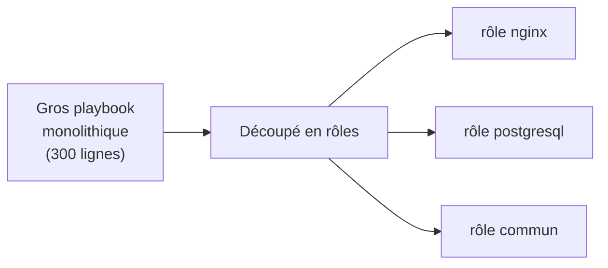
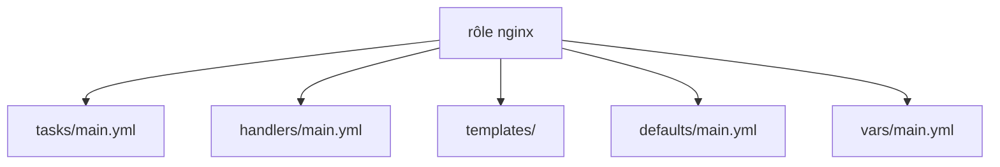
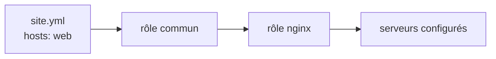
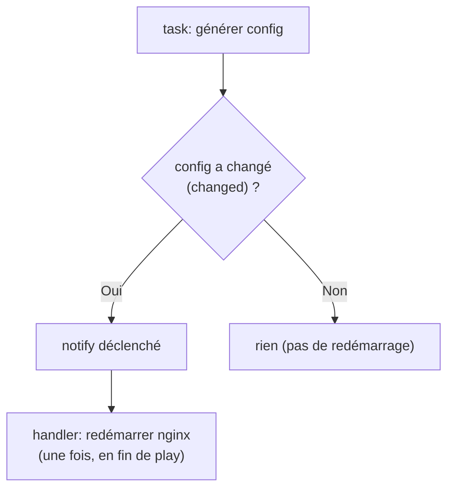
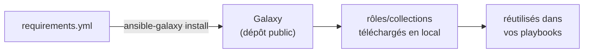
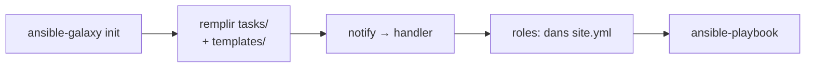

<a id="top"></a>

# 03 — Rôles et handlers

## Table des matières

| # | Section |
|---|---|
| 1 | [Pourquoi des rôles ?](#section-1) |
| 2 | [La structure standard d'un rôle](#section-2) |
| 3 | [Utiliser un rôle dans un playbook](#section-3) |
| 4 | [defaults, vars et templates](#section-4) |
| 5 | [Les handlers et notify](#section-5) |
| 6 | [Ansible Galaxy](#section-6) |
| 7 | [Quiz — Rôles et handlers](#section-7) |
| 8 | [Pratique — Créer un rôle nginx](#section-8) |
| 9 | [Synthèse](#section-9) |

---

<a id="section-1"></a>

<details>
<summary>1 — Pourquoi des rôles ?</summary>

<br/>

Quand un playbook grossit (installer, configurer, copier, démarrer, gérer le pare-feu…), il devient illisible. Un **rôle** est une **unité réutilisable** qui regroupe tâches, fichiers, modèles et variables d'une même responsabilité (ex. « tout ce qui concerne Nginx »).



| Sans rôle | Avec rôle |
|---|---|
| Tout dans un fichier | Découpé par responsabilité |
| Copier-coller entre projets | Réutilisable tel quel |
| Difficile à maintenir | Chaque rôle est autonome |
| Pas partageable | Publiable sur Galaxy |

> _Un rôle suit le principe « une responsabilité = un rôle ». Le rôle `nginx` sait installer et configurer Nginx, point. On l'assemble ensuite avec d'autres rôles dans un playbook chapeau._

**🔧 Mini-exercice —** Tu dois déployer Nginx **et** PostgreSQL sur un parc. Selon le principe « une responsabilité = un rôle », combien de rôles crées-tu et lesquels ?

<details>
<summary>✅ Voir une solution</summary>

Deux rôles distincts : un rôle `nginx` (installer/configurer le serveur web) et un rôle `postgresql` (installer/configurer la base). On les assemble ensuite dans un playbook chapeau.

</details>

</details>

<p align="right"><a href="#top">↑ Retour en haut</a></p>

---

<a id="section-2"></a>

<details>
<summary>2 — La structure standard d'un rôle</summary>

<br/>

Un rôle suit une **arborescence conventionnelle**. Ansible sait automatiquement où trouver chaque chose : pas besoin de chemins explicites.

```
roles/
└── nginx/
    ├── tasks/
    │   └── main.yml        # tâches principales
    ├── handlers/
    │   └── main.yml        # handlers (redémarrages…)
    ├── templates/
    │   └── nginx.conf.j2   # modèles Jinja2
    ├── files/
    │   └── index.html      # fichiers statiques
    ├── defaults/
    │   └── main.yml        # variables par défaut (faible priorité)
    ├── vars/
    │   └── main.yml        # variables internes (forte priorité)
    └── meta/
        └── main.yml        # dépendances, infos Galaxy
```



| Dossier | Contient | Chargé automatiquement ? |
|---|---|---|
| `tasks/` | Les tâches (`main.yml`) | ✅ |
| `handlers/` | Les handlers | ✅ |
| `templates/` | Fichiers `.j2` | Via `template:` |
| `files/` | Fichiers statiques | Via `copy:` |
| `defaults/` | Variables par défaut | ✅ (priorité faible) |
| `vars/` | Variables fixes | ✅ (priorité forte) |

```bash
# Générer le squelette complet d'un rôle
ansible-galaxy init roles/nginx
```

> _`ansible-galaxy init` crée toute l'arborescence d'un coup. C'est la façon standard de démarrer un rôle proprement, sans rien oublier._

**🔧 Mini-exercice —** Écris la commande qui génère le squelette complet d'un rôle nommé `postgresql` dans le dossier `roles/`.

<details>
<summary>✅ Voir une solution</summary>

```bash
ansible-galaxy init roles/postgresql
```

Elle crée d'un coup `tasks/`, `handlers/`, `templates/`, `files/`, `defaults/`, `vars/`, `meta/`.

</details>

</details>

<p align="right"><a href="#top">↑ Retour en haut</a></p>

---

<a id="section-3"></a>

<details>
<summary>3 — Utiliser un rôle dans un playbook</summary>

<br/>

Une fois le rôle créé, on l'appelle depuis un playbook avec la clé **`roles`**.

```yaml
# site.yml
- name: Configurer les serveurs web
  hosts: web
  become: true
  roles:
    - nginx
    - commun
```

Ou, plus explicitement, avec des variables passées au rôle :

```yaml
- name: Configurer les serveurs web
  hosts: web
  become: true
  roles:
    - role: nginx
      vars:
        port_http: 8080
```



> _Ansible cherche les rôles dans le dossier `roles/` à côté du playbook (et dans les chemins configurés). Les rôles s'exécutent **dans l'ordre** où ils sont listés._

</details>

<p align="right"><a href="#top">↑ Retour en haut</a></p>

---

<a id="section-4"></a>

<details>
<summary>4 — defaults, vars et templates</summary>

<br/>

Un rôle expose des **variables par défaut** (`defaults/`) que l'utilisateur peut surcharger, et des **variables internes** (`vars/`) plus difficiles à écraser.

```yaml
# roles/nginx/defaults/main.yml
port_http: 80
worker_processes: auto
```

```yaml
# roles/nginx/vars/main.yml
paquet_nginx: nginx
chemin_config: /etc/nginx/nginx.conf
```

```yaml
# roles/nginx/tasks/main.yml
- name: Installer Nginx
  ansible.builtin.apt:
    name: "{{ paquet_nginx }}"
    state: present

- name: Générer la configuration
  ansible.builtin.template:
    src: nginx.conf.j2          # cherché dans templates/
    dest: "{{ chemin_config }}"
  notify: Redémarrer nginx       # déclenche un handler
```

| Type | Dossier | Priorité | Usage |
|---|---|---|---|
| **defaults** | `defaults/main.yml` | Faible | Valeurs surchargeables par l'utilisateur |
| **vars** | `vars/main.yml` | Forte | Valeurs internes, peu modifiables |

> _Règle pratique : tout ce que l'utilisateur du rôle **doit pouvoir personnaliser** va dans `defaults/`. Tout ce qui est **interne et fixe** va dans `vars/`._

**🔧 Mini-exercice —** Dans quel fichier du rôle places-tu la variable `port_http: 80` que l'utilisateur doit pouvoir surcharger ? Écris le fichier.

<details>
<summary>✅ Voir une solution</summary>

Dans `defaults/`, car c'est une valeur surchargeable (faible priorité) :

```yaml
# roles/nginx/defaults/main.yml
port_http: 80
```

</details>

</details>

<p align="right"><a href="#top">↑ Retour en haut</a></p>

---

<a id="section-5"></a>

<details>
<summary>5 — Les handlers et notify</summary>

<br/>

Un **handler** est une tâche spéciale qui ne s'exécute **que si elle est notifiée** par une autre tâche, et **une seule fois** à la fin du play. Cas typique : ne redémarrer Nginx **que si** sa configuration a changé.

```yaml
# roles/nginx/handlers/main.yml
- name: Redémarrer nginx
  ansible.builtin.service:
    name: nginx
    state: restarted
```

```yaml
# roles/nginx/tasks/main.yml
- name: Générer la configuration
  ansible.builtin.template:
    src: nginx.conf.j2
    dest: /etc/nginx/nginx.conf
  notify: Redémarrer nginx     # le nom DOIT correspondre au handler
```



| Caractéristique du handler | Détail |
|---|---|
| Déclenché par | `notify: <nom exact>` |
| S'exécute si | La tâche notifiante est `changed` |
| Quand | À la **fin** du play |
| Combien de fois | **Une seule**, même si notifié plusieurs fois |

> _Le handler est la clé d'une automatisation propre : on ne redémarre le service **que** lorsque c'est nécessaire. Pas de redémarrage inutile à chaque exécution._

**🔧 Mini-exercice —** Écris un handler nommé « Recharger nginx » qui recharge (reload) le service `nginx`, et la ligne `notify` qu'une tâche doit utiliser pour le déclencher.

<details>
<summary>✅ Voir une solution</summary>

```yaml
# handlers/main.yml
- name: Recharger nginx
  ansible.builtin.service:
    name: nginx
    state: reloaded
```

Côté tâche : `notify: Recharger nginx` (le nom doit correspondre exactement).

</details>

</details>

<p align="right"><a href="#top">↑ Retour en haut</a></p>

---

<a id="section-6"></a>

<details>
<summary>6 — Ansible Galaxy</summary>

<br/>

**Ansible Galaxy** est le dépôt public de **rôles et collections** réutilisables. Plutôt que de réécrire un rôle PostgreSQL, on télécharge celui de la communauté.

```bash
# Installer un rôle depuis Galaxy
ansible-galaxy role install geerlingguy.nginx

# Installer une collection (ensemble de modules + rôles)
ansible-galaxy collection install community.general

# Installer tout ce qui est listé dans un fichier requirements
ansible-galaxy install -r requirements.yml
```

```yaml
# requirements.yml
roles:
  - name: geerlingguy.nginx
    version: "3.1.4"
collections:
  - name: community.general
```



| Notion | Définition |
|---|---|
| **Rôle** | Une unité réutilisable (tasks + handlers + vars…) |
| **Collection** | Un paquet de modules, plugins ET rôles |
| **requirements.yml** | Liste des dépendances à installer |

> _Épinglez toujours une **version** (`version: "3.1.4"`) dans `requirements.yml`. Sinon une mise à jour amont peut casser vos déploiements sans prévenir._

</details>

<p align="right"><a href="#top">↑ Retour en haut</a></p>

---

<a id="section-7"></a>

<details>
<summary>7 — Quiz — Rôles et handlers</summary>

<br/>

**Question 1 :** À quoi sert un rôle ?

a) À remplacer l'inventaire

b) À regrouper tâches, fichiers et variables d'une responsabilité, de façon réutilisable

c) À se connecter en SSH

d) À stocker les mots de passe

<details>
<summary>💡 Voir la solution</summary>

✅ **Réponse : b)** — Un rôle est une unité réutilisable et autonome (tasks/handlers/templates/defaults/vars).

</details>

---

**Question 2 :** Dans quel fichier place-t-on les tâches principales d'un rôle ?

a) `vars/main.yml`

b) `tasks/main.yml`

c) `handlers/main.yml`

d) `meta/main.yml`

<details>
<summary>💡 Voir la solution</summary>

✅ **Réponse : b)** — Les tâches d'un rôle vivent dans `tasks/main.yml`, chargé automatiquement.

</details>

---

**Question 3 :** Quand un handler s'exécute-t-il ?

a) Toujours, à chaque exécution

b) Jamais

c) Seulement s'il est notifié par une tâche `changed`, à la fin du play

d) Avant les tâches

<details>
<summary>💡 Voir la solution</summary>

✅ **Réponse : c)** — Un handler ne tourne que s'il reçoit un `notify` d'une tâche ayant réellement changé l'état, et une seule fois en fin de play.

</details>

---

**Question 4 :** Quelle différence entre `defaults/` et `vars/` dans un rôle ?

a) Aucune

b) `defaults/` a une priorité faible (surchargeable), `vars/` une priorité forte

c) `vars/` ne fonctionne pas

d) `defaults/` est pour les handlers

<details>
<summary>💡 Voir la solution</summary>

✅ **Réponse : b)** — On met dans `defaults/` ce que l'utilisateur peut personnaliser, et dans `vars/` les valeurs internes plus difficiles à écraser.

</details>

---

**Question 5 :** Que fait `ansible-galaxy role install geerlingguy.nginx` ?

a) Crée un nouveau rôle vide

b) Télécharge un rôle public depuis Ansible Galaxy

c) Lance un playbook

d) Supprime un rôle

<details>
<summary>💡 Voir la solution</summary>

✅ **Réponse : b)** — La commande installe un rôle partagé par la communauté depuis le dépôt Galaxy.

</details>

</details>

<p align="right"><a href="#top">↑ Retour en haut</a></p>

---

<a id="section-8"></a>

<details>
<summary>8 — Pratique — Créer un rôle nginx</summary>

<br/>

### Consigne

Générez un rôle `nginx` avec `ansible-galaxy init`. Faites-lui installer Nginx, déposer une config via `template`, et **redémarrer Nginx uniquement si la config change** (handler + notify). Exposez `port_http` dans `defaults/`. Appelez le rôle depuis `site.yml`.

---

### Correction — Fichiers et commandes attendus

```bash
# 1. Créer le squelette du rôle
ansible-galaxy init roles/nginx
```

```yaml
# roles/nginx/defaults/main.yml
port_http: 80
```

```yaml
# roles/nginx/tasks/main.yml
- name: Installer Nginx
  ansible.builtin.apt:
    name: nginx
    state: present
    update_cache: true

- name: Déployer la configuration
  ansible.builtin.template:
    src: nginx.conf.j2
    dest: /etc/nginx/nginx.conf
    mode: "0644"
  notify: Redémarrer nginx

- name: S'assurer que Nginx est démarré et activé
  ansible.builtin.service:
    name: nginx
    state: started
    enabled: true
```

```yaml
# roles/nginx/handlers/main.yml
- name: Redémarrer nginx
  ansible.builtin.service:
    name: nginx
    state: restarted
```

```
# roles/nginx/templates/nginx.conf.j2
server {
    listen {{ port_http }};
    server_name {{ inventory_hostname }};
    root /var/www/html;
}
```

```yaml
# site.yml
- name: Déployer le web
  hosts: web
  become: true
  roles:
    - role: nginx
      vars:
        port_http: 8080
```

```bash
# 2. Exécuter
ansible-playbook -i inventory.yml site.yml
```

**Résultat attendu (1ʳᵉ exécution) :** la config change → le handler `Redémarrer nginx` se déclenche.

```
RUNNING HANDLER [nginx : Redémarrer nginx] ***********************
changed: [web1.exemple.com]

PLAY RECAP ******************************************************
web1.exemple.com : ok=4    changed=2    unreachable=0    failed=0
```

À la **2ᵉ** exécution : config inchangée → **aucun** redémarrage, `changed=0`.

> _C'est exactement le comportement recherché : Nginx n'est redémarré que lorsque sa configuration a réellement bougé. Zéro redémarrage gratuit._

</details>

<p align="right"><a href="#top">↑ Retour en haut</a></p>

---

<a id="section-9"></a>

<details>
<summary>9 — Synthèse</summary>

<br/>

#### Points à retenir

1. Un **rôle** découpe un gros playbook en unités réutilisables (une responsabilité chacune).
2. Structure standard : `tasks/`, `handlers/`, `templates/`, `files/`, `defaults/`, `vars/`, `meta/`.
3. `ansible-galaxy init` crée le squelette ; on appelle un rôle via la clé `roles:`.
4. `defaults/` = surchargeable (faible priorité) ; `vars/` = interne (forte priorité).
5. Un **handler** + `notify` ne s'exécute **que si** la tâche a changé l'état, **une fois** en fin de play.
6. **Ansible Galaxy** fournit rôles et collections prêts à l'emploi (`requirements.yml`).



#### La suite

Leçon **04 — Idempotence** : comprendre pourquoi Ansible ne refait rien d'inutile, la différence `ok` vs `changed`, et comment vérifier avec `--check` et `--diff`.

</details>

<p align="right"><a href="#top">↑ Retour en haut</a></p>

---

<p align="center">
  <em>Tous droits réservés. Toute reproduction, diffusion, utilisation ou adaptation de ce cours, en tout ou en partie, est strictement interdite sans l'autorisation écrite préalable de Dr. Haythem REHOUMA.</em>
</p>

<p align="center">
  <strong>Cours créé par Dr. Haythem REHOUMA — Développement et déploiement de solutions de données</strong>
</p>
