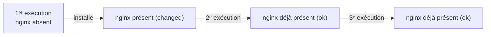
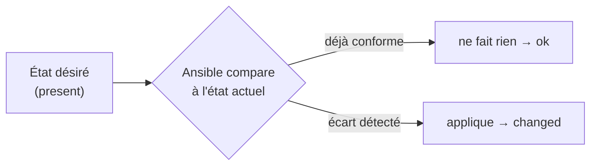
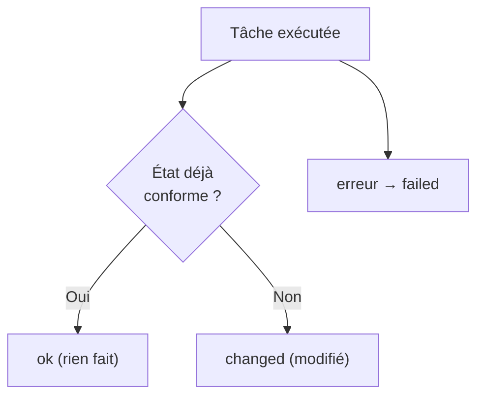
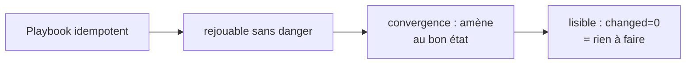
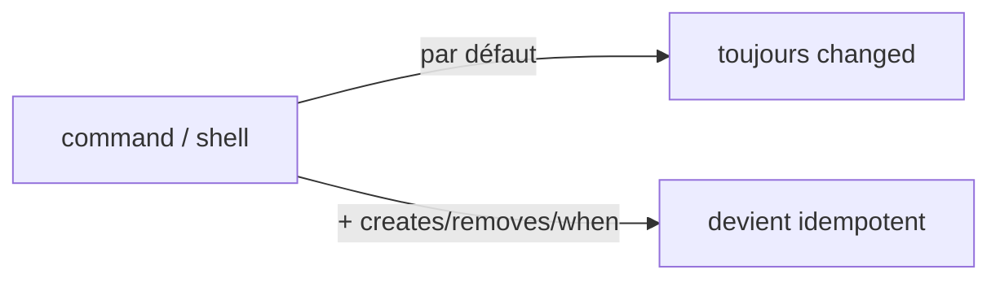
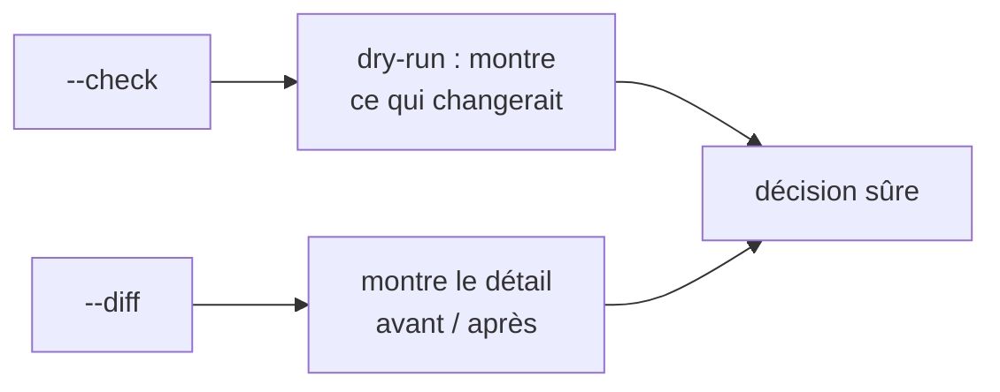

<a id="top"></a>

# 04 — Idempotence

## Table des matières

| # | Section |
|---|---|
| 1 | [Qu'est-ce que l'idempotence ?](#section-1) |
| 2 | [L'état désiré plutôt que les étapes](#section-2) |
| 3 | [changed vs ok](#section-3) |
| 4 | [Pourquoi l'idempotence est centrale](#section-4) |
| 5 | [Modules idempotents vs command/shell](#section-5) |
| 6 | [Vérifier avec --check et --diff](#section-6) |
| 7 | [Quiz — Idempotence](#section-7) |
| 8 | [Pratique — Rendre un playbook idempotent](#section-8) |
| 9 | [Synthèse](#section-9) |

---

<a id="section-1"></a>

<details>
<summary>1 — Qu'est-ce que l'idempotence ?</summary>

<br/>

L'**idempotence** est la propriété qui fait qu'**exécuter une opération une fois ou cent fois donne le même résultat**. Avec Ansible : si l'état désiré est déjà atteint, relancer le playbook ne change **rien**.



| Opération | Idempotente ? | Pourquoi |
|---|---|---|
| « S'assurer que Nginx est installé » | ✅ Oui | Si déjà là, rien à faire |
| « Ajouter une ligne au fichier » | ❌ Non | La ligne s'ajoute à chaque fois |
| « Créer le dossier `/data` » (state=directory) | ✅ Oui | Existe déjà → ok |
| « Lancer `echo coucou >> log` » | ❌ Non | Le log grossit à chaque exécution |

> _Analogie : un interrupteur idempotent serait « mets la lumière sur ON ». Que tu le dises 1 fois ou 10 fois, la lumière est ON. À l'inverse, « bascule l'interrupteur » n'est PAS idempotent : 2 fois = retour à l'état initial._

**🔧 Mini-exercice —** L'opération « ajouter la ligne `PORT=8080` au fichier `config` avec `echo >>` » est-elle idempotente ? Justifie en une phrase.

<details>
<summary>✅ Voir une solution</summary>

Non. À chaque exécution, `echo >>` ajoute une nouvelle ligne identique : le fichier grossit et finit avec des doublons. Le résultat dépend du nombre d'exécutions.

</details>

</details>

<p align="right"><a href="#top">↑ Retour en haut</a></p>

---

<a id="section-2"></a>

<details>
<summary>2 — L'état désiré plutôt que les étapes</summary>

<br/>

Ansible est **déclaratif** : on décrit **l'état souhaité**, pas la suite d'étapes. Ansible compare l'état actuel à l'état désiré et n'agit **que si nécessaire**.

```yaml
# Déclaratif : "je veux que nginx soit présent"
- name: S'assurer que Nginx est installé
  ansible.builtin.apt:
    name: nginx
    state: present
```

À comparer avec une approche **impérative** (script bash), qui décrit les étapes :

```bash
# Impératif : "installe nginx" — échoue ou réinstalle s'il est déjà là
apt-get install -y nginx
```



| Approche | Vous décrivez | Risque |
|---|---|---|
| **Déclarative** (Ansible) | Le **résultat** voulu | Faible : Ansible gère l'écart |
| **Impérative** (script) | Les **étapes** | Élevé : doublons, erreurs si déjà fait |

> _Le bon réflexe Ansible : penser « état final » et non « commandes à lancer ». On dit `state: present`, pas « lance apt install »._

**🔧 Mini-exercice —** Réécris l'étape impérative `apt-get install -y nginx` en une tâche Ansible **déclarative** qui s'assure que Nginx est présent.

<details>
<summary>✅ Voir une solution</summary>

```yaml
- name: S'assurer que Nginx est installé
  ansible.builtin.apt:
    name: nginx
    state: present
```

On décrit l'état désiré (`present`) ; Ansible n'agit que s'il y a un écart.

</details>

</details>

<p align="right"><a href="#top">↑ Retour en haut</a></p>

---

<a id="section-3"></a>

<details>
<summary>3 — changed vs ok</summary>

<br/>

Après chaque tâche, Ansible indique un statut. Les deux principaux :

- **ok** (vert) : l'état était **déjà conforme**, rien n'a été modifié.
- **changed** (jaune) : Ansible a **réellement modifié** la machine.



Exemple sur deux exécutions successives :

```
# 1ʳᵉ exécution (nginx absent)
TASK [Installer Nginx] ok=0 changed=1

# 2ᵉ exécution (nginx déjà là)
TASK [Installer Nginx] ok=1 changed=0
```

| Statut | Couleur | Signification |
|---|---|---|
| `ok` | Vert | Déjà conforme, aucune action |
| `changed` | Jaune | Modification réellement appliquée |
| `failed` | Rouge | Échec |
| `skipped` | Cyan | Tâche ignorée (condition) |

> _Test de l'idempotence : lancez le playbook **deux fois**. Si la 2ᵉ exécution affiche `changed=0`, votre playbook est idempotent. Sinon, une tâche refait quelque chose à chaque fois — à corriger._

**🔧 Mini-exercice —** À la 2ᵉ exécution, une tâche affiche `changed=1`. Que conclus-tu, et quel type de module en est souvent la cause ?

<details>
<summary>✅ Voir une solution</summary>

La tâche **n'est pas idempotente** : elle refait une action à chaque exécution. La cause typique est un module `command` ou `shell` sans garde-fou (`creates`/`removes`/`when`).

</details>

</details>

<p align="right"><a href="#top">↑ Retour en haut</a></p>

---

<a id="section-4"></a>

<details>
<summary>4 — Pourquoi l'idempotence est centrale</summary>

<br/>

L'idempotence est **la** propriété qui rend Ansible sûr en production.



| Bénéfice | Explication |
|---|---|
| **Rejouable** | On peut relancer 100 fois sans casser quoi que ce soit |
| **Convergence** | Une machine en dérive est ramenée à l'état désiré |
| **Sécurité** | Pas de doublons (utilisateur créé 2 fois, ligne répétée…) |
| **Lisibilité** | `changed` = ce qui a vraiment bougé, donc audit facile |
| **CI/CD** | On déploie en continu sans craindre les ré-exécutions |

> _En production, on relance souvent le **même** playbook (déploiement, correction de dérive). Sans idempotence, chaque relance ajouterait des effets de bord. C'est pour ça qu'on dit que l'idempotence est le cœur d'Ansible._

</details>

<p align="right"><a href="#top">↑ Retour en haut</a></p>

---

<a id="section-5"></a>

<details>
<summary>5 — Modules idempotents vs command/shell</summary>

<br/>

La plupart des modules Ansible sont **idempotents par conception** : ils vérifient l'état avant d'agir. En revanche, **`command`** et **`shell`** exécutent une commande **à chaque fois**, sans rien vérifier — ils ne sont **pas** idempotents par défaut.

```yaml
# ✅ Idempotent : apt vérifie si nginx est déjà là
- name: Installer Nginx
  ansible.builtin.apt:
    name: nginx
    state: present

# ❌ NON idempotent : la commande s'exécute toujours
- name: Créer un dossier (mauvaise façon)
  ansible.builtin.command: mkdir /data

# ✅ Mieux : module file, idempotent
- name: Créer un dossier (bonne façon)
  ansible.builtin.file:
    path: /data
    state: directory
```

Si on doit absolument utiliser `command`/`shell`, on le rend idempotent avec `creates`, `removes` ou une condition `when` :

```yaml
- name: Lancer un script seulement s'il n'a pas déjà tourné
  ansible.builtin.command: /opt/install.sh
  args:
    creates: /opt/.installe   # si ce fichier existe, on saute la tâche
```



| Module | Idempotent par défaut ? | Recommandation |
|---|---|---|
| `apt`, `file`, `copy`, `service`, `user` | ✅ Oui | À privilégier |
| `command` | ❌ Non | Ajouter `creates`/`removes` |
| `shell` | ❌ Non | Dernier recours, avec garde-fou |

> _Règle d'or : préférez **toujours** un module dédié à `command`/`shell`. Ces deux-là sont la principale cause de playbooks non idempotents (`changed` éternel)._

**🔧 Mini-exercice —** Rends idempotente cette tâche : `ansible.builtin.command: /opt/install.sh`, sachant que le script crée le fichier témoin `/opt/.installe`.

<details>
<summary>✅ Voir une solution</summary>

```yaml
- name: Lancer l'installation une seule fois
  ansible.builtin.command: /opt/install.sh
  args:
    creates: /opt/.installe
```

Avec `creates`, la tâche est sautée si `/opt/.installe` existe déjà.

</details>

</details>

<p align="right"><a href="#top">↑ Retour en haut</a></p>

---

<a id="section-6"></a>

<details>
<summary>6 — Vérifier avec --check et --diff</summary>

<br/>

Deux options rendent l'idempotence **visible et sûre** :

- **`--check`** : mode simulation (*dry-run*). Ansible dit ce qu'il **ferait** sans rien appliquer.
- **`--diff`** : affiche les **différences** ligne par ligne sur les fichiers modifiés.

```bash
# Simuler sans rien changer
ansible-playbook -i inventory.yml site.yml --check

# Voir le détail des changements (avant/après)
ansible-playbook -i inventory.yml site.yml --diff

# Les deux ensemble : simulation + diff
ansible-playbook -i inventory.yml site.yml --check --diff
```

Exemple de sortie `--diff` sur un fichier de config :

```diff
--- before: /etc/nginx/nginx.conf
+++ after: /etc/nginx/nginx.conf
@@ -1,3 +1,3 @@
 server {
-    listen 80;
+    listen 8080;
 }
```



| Option | Modifie la machine ? | Montre |
|---|---|---|
| `--check` | ❌ Non | Quelles tâches seraient `changed` |
| `--diff` | (selon le mode) | Les différences de contenu |
| `--check --diff` | ❌ Non | Simulation + différences détaillées |

> _Avant tout déploiement sensible, lancez `--check --diff` : vous voyez exactement ce qui va bouger, sans aucun risque. Si tout est `ok` et qu'il n'y a aucun diff, l'environnement est déjà conforme._

</details>

<p align="right"><a href="#top">↑ Retour en haut</a></p>

---

<a id="section-7"></a>

<details>
<summary>7 — Quiz — Idempotence</summary>

<br/>

**Question 1 :** Qu'est-ce que l'idempotence ?

a) Exécuter plus vite

b) Obtenir le même résultat qu'on exécute 1 fois ou plusieurs fois

c) Chiffrer les données

d) Se connecter sans mot de passe

<details>
<summary>💡 Voir la solution</summary>

✅ **Réponse : b)** — Une opération idempotente laisse le système dans le même état final, quel que soit le nombre d'exécutions.

</details>

---

**Question 2 :** À la 2ᵉ exécution d'un playbook idempotent, à quoi s'attend-on ?

a) `failed` partout

b) `changed=0`

c) Une erreur

d) Tout est réinstallé

<details>
<summary>💡 Voir la solution</summary>

✅ **Réponse : b)** — Si l'état désiré est déjà atteint, rien n'est modifié : `changed=0`. C'est le test classique d'idempotence.

</details>

---

**Question 3 :** Quel module n'est PAS idempotent par défaut ?

a) `apt`

b) `file`

c) `command`

d) `service`

<details>
<summary>💡 Voir la solution</summary>

✅ **Réponse : c)** — `command` (et `shell`) exécute la commande à chaque fois sans vérifier l'état ; il faut ajouter `creates`/`removes`/`when`.

</details>

---

**Question 4 :** Que fait l'option `--check` ?

a) Elle applique les changements deux fois

b) Elle simule sans rien modifier (dry-run)

c) Elle supprime le playbook

d) Elle valide uniquement la syntaxe

<details>
<summary>💡 Voir la solution</summary>

✅ **Réponse : b)** — `--check` est un dry-run : Ansible montre ce qui changerait sans toucher aux machines. (La syntaxe seule, c'est `--syntax-check`.)

</details>

---

**Question 5 :** Comment rendre une tâche `command` idempotente ?

a) Impossible

b) En ajoutant `creates:` (ou `removes:` / `when:`)

c) En la lançant deux fois

d) En la mettant dans un handler

<details>
<summary>💡 Voir la solution</summary>

✅ **Réponse : b)** — `creates: /chemin/témoin` fait sauter la tâche si le fichier témoin existe déjà, ce qui la rend idempotente.

</details>

</details>

<p align="right"><a href="#top">↑ Retour en haut</a></p>

---

<a id="section-8"></a>

<details>
<summary>8 — Pratique — Rendre un playbook idempotent</summary>

<br/>

### Consigne

On vous donne un playbook **non idempotent** (il utilise `command` et `shell` sans garde-fou). Réécrivez-le avec des modules idempotents, puis prouvez l'idempotence en l'exécutant deux fois (la 2ᵉ doit afficher `changed=0`). Utilisez `--check --diff` pour vérifier avant.

---

### Correction

**Avant (non idempotent) :**

```yaml
- name: Mauvaise version
  hosts: web
  become: true
  tasks:
    - name: Créer le dossier
      ansible.builtin.command: mkdir /opt/app          # change à chaque fois / échoue si existe

    - name: Ajouter une ligne de config
      ansible.builtin.shell: echo "PORT=8080" >> /opt/app/config   # ajoute en double !
```

**Après (idempotent) :**

```yaml
- name: Bonne version idempotente
  hosts: web
  become: true
  tasks:
    - name: S'assurer que le dossier existe
      ansible.builtin.file:
        path: /opt/app
        state: directory
        mode: "0755"

    - name: S'assurer que la ligne de config est présente (une seule fois)
      ansible.builtin.lineinfile:
        path: /opt/app/config
        line: "PORT=8080"
        create: true
```

```bash
# 1. Simuler et voir les différences
ansible-playbook -i inventory.yml site.yml --check --diff

# 2. Première exécution réelle
ansible-playbook -i inventory.yml site.yml

# 3. Deuxième exécution (preuve d'idempotence)
ansible-playbook -i inventory.yml site.yml
```

**Résultat attendu :**

```
# 1ʳᵉ exécution
PLAY RECAP : web1.exemple.com : ok=2  changed=2  failed=0

# 2ᵉ exécution (preuve)
PLAY RECAP : web1.exemple.com : ok=2  changed=0  failed=0
```

> _Le passage de `command`/`shell` vers `file` et `lineinfile` est la transformation type pour rendre un playbook idempotent. `lineinfile` garantit qu'une ligne existe **une seule fois**, contrairement à `echo >>`._

</details>

<p align="right"><a href="#top">↑ Retour en haut</a></p>

---

<a id="section-9"></a>

<details>
<summary>9 — Synthèse</summary>

<br/>

#### Points à retenir

1. **Idempotence** = même résultat qu'on exécute 1 fois ou N fois ; relancer ne casse rien.
2. Ansible est **déclaratif** : on décrit l'**état désiré**, il agit seulement en cas d'écart.
3. **`ok`** = déjà conforme ; **`changed`** = réellement modifié. Test : 2ᵉ run → `changed=0`.
4. C'est **central** : rejouable, convergent, sûr en CI/CD.
5. La plupart des modules sont idempotents ; **`command`/`shell`** ne le sont pas (ajouter `creates`/`removes`/`when`).
6. **`--check`** simule, **`--diff`** montre les différences : à lancer avant tout déploiement.


#### La suite

Vous maîtrisez maintenant Ansible : inventaires, playbooks, rôles/handlers et idempotence. Le module suivant du cours poursuit l'automatisation du déploiement avec les outils de la chaîne CI/CD.

</details>

<p align="right"><a href="#top">↑ Retour en haut</a></p>

---

<p align="center">
  <em>Tous droits réservés. Toute reproduction, diffusion, utilisation ou adaptation de ce cours, en tout ou en partie, est strictement interdite sans l'autorisation écrite préalable de Dr. Haythem REHOUMA.</em>
</p>

<p align="center">
  <strong>Cours créé par Dr. Haythem REHOUMA — Développement et déploiement de solutions de données</strong>
</p>
