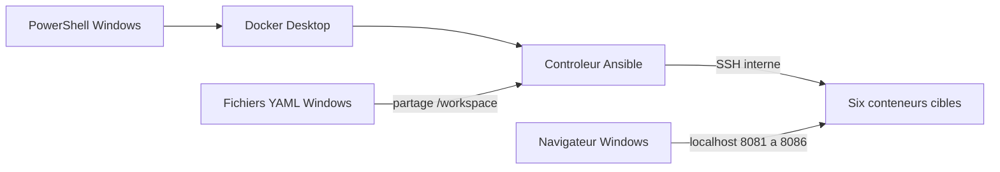

# Ansible avec Docker Desktop sous Windows

Ce module permet de suivre les six pratiques Ansible depuis **PowerShell sous Windows**. Docker Desktop héberge un conteneur de contrôle Ansible et six conteneurs cibles. Tous les fichiers nécessaires sont fournis dans [laboratoire-docker-desktop](laboratoire-docker-desktop/).

## Ce qui s’exécute où

| Élément | Emplacement |
|---|---|
| Docker Desktop, PowerShell, éditeur et navigateur | Votre Windows |
| Ansible, ses collections et la clé SSH du laboratoire | Conteneur `controleur` |
| Apache, fichiers, utilisateurs et paquets des exercices | Conteneurs `node1` à `node6` |
| Fichiers YAML du cours | Dossier Windows partagé sous `/workspace` |

Ansible ne fonctionne pas nativement comme contrôleur Windows ; le conteneur de contrôle fournit son environnement d’exécution. Vous utilisez les commandes Docker depuis PowerShell. Docker Desktop peut utiliser le moteur WSL 2 sans que vous installiez une distribution Ubuntu pour travailler dans son terminal. Sources : [installation Ansible](https://docs.ansible.com/projects/ansible/latest/installation_guide/intro_installation.html), [Docker Desktop et WSL 2](https://docs.docker.com/desktop/features/wsl/).

Les machines étudiées restent des conteneurs Linux : c’est nécessaire pour conserver les exercices APT, DNF, SSH et Apache. Votre poste de travail reste Windows.



## Démarrage

Ouvrir Docker Desktop, puis suivre le [chapitre 00](00-ansible-installer-un-laboratoire-docker-configurer-ssh-et-creer-un-premier-playbook-apache.md) pour les prérequis et les explications. Depuis PowerShell :

```powershell
Set-Location "C:\Users\rehou\Downloads\Compressed\deploiement-de-solutions-de-donnees-main\deploiement-de-solutions-de-donnees-main\12-ansible-playbooks-roles\laboratoire-docker-desktop"
docker version
docker compose version
docker compose up -d --build --wait
docker compose exec controleur ansible all -m ansible.builtin.ping
docker compose exec controleur ansible-playbook playbooks/00-premier-apache.yml
```

Ouvrir [Apache sur node1](http://localhost:8081) et [Apache sur node2](http://localhost:8082). Le premier téléchargement et la construction des images peuvent prendre plusieurs minutes.

## Parcours et vérification fichier par fichier

| Document | Adaptation effectuée |
|---|---|
| [00 — Préparer le laboratoire](00-ansible-installer-un-laboratoire-docker-configurer-ssh-et-creer-un-premier-playbook-apache.md) | Docker Desktop, PowerShell, contrôleur en conteneur, SSH interne et premiers ports web |
| [01 — Déployer Apache](01-ansible-deployer-et-configurer-apache-sur-des-conteneurs-docker-ubuntu-debian-et-almalinux.md) | Six nœuds, rôle commun, APT/DNF et démarrage Apache compatible avec les conteneurs |
| [02 — Inventaires et commandes](02-ansible-organiser-les-inventaires-en-groupes-et-administrer-les-serveurs-en-commandes-ad-hoc.md) | Groupes communs, commandes depuis Windows et traitement correct des groupes mixtes |
| [03 — Playbooks et réutilisation](03-ansible-concevoir-des-playbooks-multitaches-reutiliser-les-taches-et-gerer-les-tags.md) | Fichiers exécutables, collection d’archivage, importations et tags corrigés |
| [03 — Dépannage](03-ansible-diagnostiquer-les-avertissements-python-et-les-erreurs-d-archivage-des-journaux.md) | Diagnostic Docker Desktop, SSH, Python, Apache et archives |
| [04 — Variables et conditions](04-ansible-maitriser-les-variables-les-facts-et-register-pour-des-playbooks-conditionnels.md) | Fichiers externes, facts des conteneurs, état final après installation et paquets disponibles |
| [05 — Boucles](05-ansible-automatiser-les-taches-avec-des-boucles-sur-listes-dictionnaires-et-hotes-de-l-inventaire.md) | Groupe database défini, utilisateurs, délégation expliquée et pause valide |
| README | Point d’entrée, architecture et démarrage communs |

Les résultats des contrôles réalisés sont consignés dans [VERIFICATION-DOCKER-DESKTOP.md](VERIFICATION-DOCKER-DESKTOP.md).

## Adresses du laboratoire

| Nœud | Image de base | Groupe fonctionnel | URL Windows après le chapitre 01 |
|---|---|---|---|
| node1 | Ubuntu 24.04 | web | [localhost:8081](http://localhost:8081) |
| node2 | Debian 12 | database | [localhost:8082](http://localhost:8082) |
| node3 | AlmaLinux 9 | database | [localhost:8083](http://localhost:8083) |
| node4 | AlmaLinux 9 | mail | [localhost:8084](http://localhost:8084) |
| node5 | Ubuntu 24.04 | web | [localhost:8085](http://localhost:8085) |
| node6 | Ubuntu 24.04 | mail | [localhost:8086](http://localhost:8086) |

Les noms `database` et `mail` servent au classement des exercices ; ils n’installent aucun service de base de données ou de messagerie. Les six serveurs HTTP sont installés au chapitre 01 pour illustrer les distributions.

## Sauvegarde et cycle de vie

Les documents avant adaptation sont conservés dans l’archive `sauvegarde-avant-docker-desktop.zip`. Le code de laboratoire et les documents sont fournis ensemble.

Pour mettre en pause les conteneurs en conservant les paquets et fichiers créés pendant les exercices :

```powershell
docker compose stop
docker compose start
```

Pour supprimer les conteneurs du laboratoire, après avoir récupéré les résultats utiles :

```powershell
docker compose down
```

Cette dernière commande efface les modifications dans les systèmes de fichiers des nœuds. Les sources Windows et les volumes des clés SSH restent présents. Après une recréation, suivre le dépannage des clés d’hôtes, puis rejouer les playbooks. Les clés du laboratoire sont distinctes de vos clés SSH personnelles.
