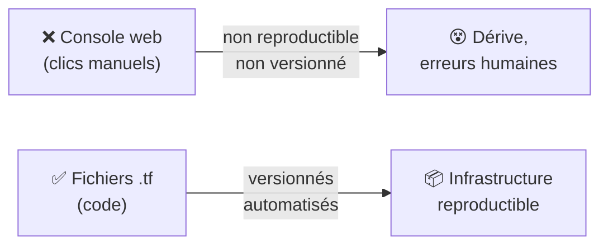
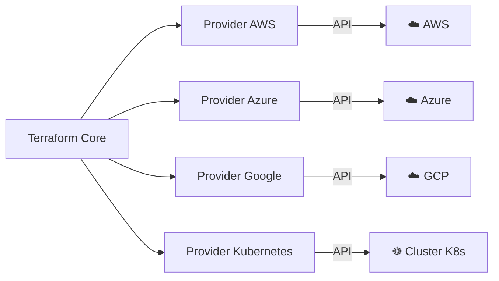
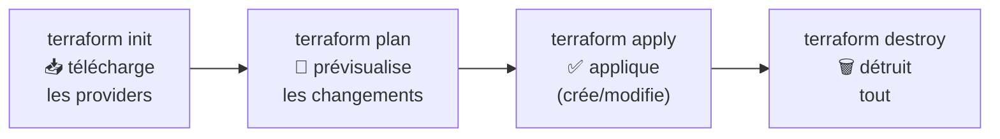
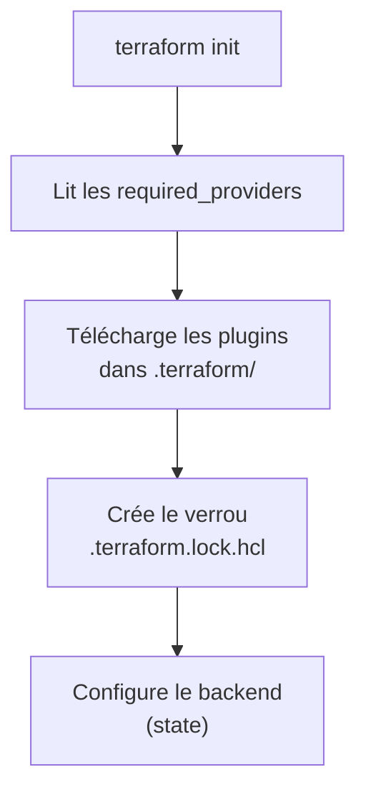
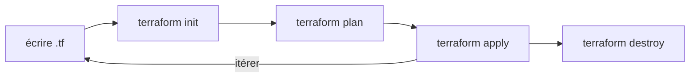

<a id="top"></a>

# 01 — Providers et workflow Terraform

## Table des matières

| # | Section |
|---|---|
| 1 | [Qu'est-ce que l'Infrastructure as Code ?](#section-1) |
| 2 | [Terraform et le langage HCL](#section-2) |
| 3 | [Les providers](#section-3) |
| 4 | [Déclarer une ressource](#section-4) |
| 5 | [Le workflow Terraform](#section-5) |
| 6 | [terraform init en détail](#section-6) |
| 7 | [Quiz — Providers et workflow](#section-7) |
| 8 | [Pratique — Votre première infrastructure](#section-8) |
| 9 | [Synthèse](#section-9) |

---

<a id="section-1"></a>

<details>
<summary>1 — Qu'est-ce que l'Infrastructure as Code ?</summary>

<br/>

L'**Infrastructure as Code** (IaC) consiste à décrire son infrastructure (serveurs, réseaux, bases de données, buckets…) dans des **fichiers texte versionnés**, plutôt qu'en cliquant manuellement dans une console web.



Terraform adopte une approche **déclarative** : vous décrivez **l'état désiré** (« je veux 1 serveur web et 1 base de données »), et Terraform calcule **comment y arriver**. À l'opposé, une approche **impérative** (un script bash) décrit **les étapes** une par une.

| Approche | Vous écrivez | Exemple |
|---|---|---|
| **Impérative** | Les étapes à exécuter | Script shell `aws ec2 run-instances …` |
| **Déclarative** | L'état final souhaité | Terraform, `resource "aws_instance"` |

> _Avantage clé du déclaratif : si la ressource existe déjà conforme, Terraform **ne fait rien**. Vous pouvez relancer 100 fois sans dupliquer l'infrastructure — c'est l'idempotence._

**🔧 Mini-exercice —** Classe ces deux outils : un script `bash` qui lance `aws ec2 run-instances`, et un fichier `.tf` qui déclare `resource "aws_instance"`. Lequel est impératif, lequel est déclaratif ?

<details>
<summary>✅ Voir une solution</summary>

Le script `bash` est **impératif** (il décrit les étapes). Le fichier `.tf` est **déclaratif** (il décrit l'état final souhaité).

</details>

</details>

<p align="right"><a href="#top">↑ Retour en haut</a></p>

---

<a id="section-2"></a>

<details>
<summary>2 — Terraform et le langage HCL</summary>

<br/>

Terraform, développé par **HashiCorp**, utilise le langage **HCL** (*HashiCorp Configuration Language*). C'est un langage lisible, conçu pour décrire des configurations.

La syntaxe de base est le **bloc** :

```hcl
type_de_bloc "label1" "label2" {
  argument = "valeur"
  nombre   = 3
  liste    = ["a", "b", "c"]
}
```

```hcl
# Un bloc terraform : exigences de version
terraform {
  required_version = ">= 1.5.0"

  required_providers {
    aws = {
      source  = "hashicorp/aws"
      version = "~> 5.0"
    }
  }
}
```

| Élément | Rôle |
|---|---|
| **Bloc** (`terraform { … }`) | Regroupe une configuration |
| **Argument** (`region = "ca-central-1"`) | Une paire clé = valeur |
| **Label** (`"aws"`) | Nomme ou type le bloc |
| **Commentaire** (`#` ou `//`) | Ignoré par Terraform |

> _Les fichiers Terraform portent l'extension `.tf`. Tous les fichiers `.tf` d'un même dossier sont **fusionnés** : l'ordre des blocs et des fichiers n'a pas d'importance._

**🔧 Mini-exercice —** Écris un bloc `terraform { }` qui exige une version Terraform supérieure ou égale à `1.5.0`.

<details>
<summary>✅ Voir une solution</summary>

```hcl
terraform {
  required_version = ">= 1.5.0"
}
```

</details>

</details>

<p align="right"><a href="#top">↑ Retour en haut</a></p>

---

<a id="section-3"></a>

<details>
<summary>3 — Les providers</summary>

<br/>

Un **provider** est un *plugin* qui permet à Terraform de communiquer avec une plateforme (AWS, Azure, Google Cloud, Kubernetes, GitHub…). C'est lui qui traduit vos blocs HCL en appels d'API.



| Provider | Plateforme | Source registry |
|---|---|---|
| `aws` | Amazon Web Services | `hashicorp/aws` |
| `azurerm` | Microsoft Azure | `hashicorp/azurerm` |
| `google` | Google Cloud Platform | `hashicorp/google` |
| `kubernetes` | Cluster Kubernetes | `hashicorp/kubernetes` |

On configure un provider avec un bloc `provider` :

```hcl
provider "aws" {
  region = "ca-central-1"   # Région Canada (Montréal)
}
```

> _Un même fichier peut utiliser **plusieurs providers** à la fois : par exemple créer un cluster sur AWS (`aws`) puis y déployer des applications (`kubernetes`). C'est la force de Terraform : un seul outil pour tout._

**🔧 Mini-exercice —** Écris un bloc `provider "aws"` configuré sur la région Montréal (`ca-central-1`).

<details>
<summary>✅ Voir une solution</summary>

```hcl
provider "aws" {
  region = "ca-central-1"
}
```

</details>

</details>

<p align="right"><a href="#top">↑ Retour en haut</a></p>

---

<a id="section-4"></a>

<details>
<summary>4 — Déclarer une ressource</summary>

<br/>

La **ressource** est l'élément central de Terraform : c'est un objet d'infrastructure (une machine, un bucket, un réseau). On la déclare avec un bloc `resource`.

```hcl
resource "aws_s3_bucket" "donnees" {
  bucket = "donnees-projet-d30-2026"

  tags = {
    Projet      = "Cours D30"
    Environnement = "dev"
  }
}
```

La syntaxe se décompose ainsi :

```mermaid
flowchart LR
    A["resource"] --> B["\"aws_s3_bucket\"<br/>(type)"]
    B --> C["\"donnees\"<br/>(nom local)"]
    C --> D["{ arguments }"]
```

| Partie | Exemple | Signification |
|---|---|---|
| Mot-clé | `resource` | Déclare une ressource |
| **Type** | `"aws_s3_bucket"` | Quel objet (défini par le provider) |
| **Nom local** | `"donnees"` | Identifiant interne à Terraform |
| Corps | `{ bucket = … }` | Les arguments de configuration |

On référence une ressource ailleurs avec `type.nom.attribut` :

```hcl
output "nom_du_bucket" {
  value = aws_s3_bucket.donnees.bucket
}
```

> _Le **nom local** (`donnees`) n'existe que dans votre code Terraform. Le **nom réel** sur AWS est l'argument `bucket`. Ne confondez pas les deux._

</details>

<p align="right"><a href="#top">↑ Retour en haut</a></p>

---

<a id="section-5"></a>

<details>
<summary>5 — Le workflow Terraform</summary>

<br/>

Le cycle de vie d'une infrastructure Terraform suit **quatre commandes** principales.



| Commande | Rôle | Modifie l'infra ? |
|---|---|---|
| `terraform init` | Initialise le dossier, télécharge les providers | Non |
| `terraform validate` | Vérifie la syntaxe | Non |
| `terraform plan` | Affiche ce qui **va** être créé/modifié/détruit | Non |
| `terraform apply` | Exécute le plan (après confirmation) | **Oui** |
| `terraform destroy` | Supprime toutes les ressources gérées | **Oui** |

```bash
# Cycle complet
terraform init           # une seule fois par dossier
terraform plan           # vérifier avant d'agir
terraform apply          # demande "yes" pour confirmer
# ... plus tard ...
terraform destroy        # nettoyer
```

> _⚠️ Toujours lire la sortie de `terraform plan` **avant** `apply`. Le plan indique `+` (créer), `~` (modifier) et `-` (détruire). Un `-` inattendu peut signifier une destruction de données !_

**🔧 Mini-exercice —** Quelle commande prévisualise les changements **sans** les appliquer ? Et laquelle détruit toutes les ressources gérées ?

<details>
<summary>✅ Voir une solution</summary>

`terraform plan` prévisualise sans rien modifier ; `terraform destroy` supprime toutes les ressources gérées.

</details>

</details>

<p align="right"><a href="#top">↑ Retour en haut</a></p>

---

<a id="section-6"></a>

<details>
<summary>6 — terraform init en détail</summary>

<br/>

`terraform init` est **toujours la première commande** dans un nouveau dossier. Elle prépare le terrain.



```bash
terraform init
```

Sortie typique :

```
Initializing provider plugins...
- Finding hashicorp/aws versions matching "~> 5.0"...
- Installing hashicorp/aws v5.31.0...
Terraform has been successfully initialized!
```

| Fichier / dossier créé | Rôle |
|---|---|
| `.terraform/` | Plugins providers téléchargés (à mettre dans `.gitignore`) |
| `.terraform.lock.hcl` | Verrouille les **versions exactes** (à versionner !) |

> _Relancez `terraform init` chaque fois que vous **ajoutez un provider** ou changez sa version. Le fichier `.terraform.lock.hcl` garantit que toute l'équipe utilise les mêmes versions — commitez-le toujours._

</details>

<p align="right"><a href="#top">↑ Retour en haut</a></p>

---

<a id="section-7"></a>

<details>
<summary>7 — Quiz — Providers et workflow</summary>

<br/>

**Question 1 :** Quel type d'approche Terraform utilise-t-il ?

a) Impérative (étape par étape)

b) Déclarative (état désiré)

c) Orientée objet

d) Procédurale

<details>
<summary>💡 Voir la solution</summary>

✅ **Réponse : b)** — Terraform est déclaratif : vous décrivez l'état final souhaité, et il calcule comment y parvenir, de façon idempotente.

</details>

---

**Question 2 :** À quoi sert un provider dans Terraform ?

a) À stocker l'état

b) À communiquer avec une plateforme (AWS, Azure…) via son API

c) À écrire des variables

d) À créer des modules

<details>
<summary>💡 Voir la solution</summary>

✅ **Réponse : b)** — Le provider est un plugin qui traduit le HCL en appels d'API vers la plateforme ciblée (AWS, Azure, GCP, Kubernetes…).

</details>

---

**Question 3 :** Quelle commande prévisualise les changements **sans** rien modifier ?

a) `terraform apply`

b) `terraform init`

c) `terraform plan`

d) `terraform destroy`

<details>
<summary>💡 Voir la solution</summary>

✅ **Réponse : c)** — `terraform plan` affiche les créations (`+`), modifications (`~`) et destructions (`-`) prévues, sans toucher à l'infrastructure.

</details>

---

**Question 4 :** Dans `resource "aws_s3_bucket" "donnees"`, que représente `"donnees"` ?

a) Le nom réel du bucket sur AWS

b) Le type de ressource

c) Le nom local utilisé dans le code Terraform

d) La région

<details>
<summary>💡 Voir la solution</summary>

✅ **Réponse : c)** — `"donnees"` est le nom local interne à Terraform. Le nom réel sur AWS est défini par l'argument `bucket`.

</details>

---

**Question 5 :** Quel fichier doit-on **versionner** dans Git ?

a) `.terraform/`

b) `.terraform.lock.hcl`

c) `terraform.tfstate`

d) Aucun

<details>
<summary>💡 Voir la solution</summary>

✅ **Réponse : b)** — `.terraform.lock.hcl` verrouille les versions des providers et garantit la cohérence de l'équipe. Le dossier `.terraform/` et le state ne se versionnent pas (le second contient des secrets).

</details>

</details>

<p align="right"><a href="#top">↑ Retour en haut</a></p>

---

<a id="section-8"></a>

<details>
<summary>8 — Pratique — Votre première infrastructure</summary>

<br/>

### Consigne

Créez un dossier Terraform qui déclare le provider AWS (région Montréal) et crée un **bucket S3**. Initialisez, prévisualisez puis appliquez.

---

### Correction

Créez un fichier `main.tf` :

```hcl
terraform {
  required_version = ">= 1.5.0"

  required_providers {
    aws = {
      source  = "hashicorp/aws"
      version = "~> 5.0"
    }
  }
}

provider "aws" {
  region = "ca-central-1"
}

resource "aws_s3_bucket" "premier" {
  bucket = "mon-premier-bucket-d30-2026"

  tags = {
    Projet = "Cours D30"
    Auteur = "Etudiant"
  }
}
```

Commandes attendues :

```bash
# 1. Initialiser (télécharge le provider aws)
terraform init

# 2. Vérifier la syntaxe
terraform validate

# 3. Prévisualiser
terraform plan

# 4. Appliquer (répondre "yes")
terraform apply
```

**Résultat attendu (extrait de `plan`) :**

```
  # aws_s3_bucket.premier will be created
  + resource "aws_s3_bucket" "premier" {
      + bucket = "mon-premier-bucket-d30-2026"
      + tags   = {
          + "Projet" = "Cours D30"
        }
    }

Plan: 1 to add, 0 to change, 0 to destroy.
```

```
aws_s3_bucket.premier: Creation complete after 3s
Apply complete! Resources: 1 added, 0 changed, 0 destroyed.
```

> _Relancez `terraform plan` après l'apply : il doit afficher `No changes`. C'est la preuve de l'idempotence — l'état réel correspond déjà à l'état désiré._

</details>

<p align="right"><a href="#top">↑ Retour en haut</a></p>

---

<a id="section-9"></a>

<details>
<summary>9 — Synthèse</summary>

<br/>

#### Points à retenir

1. **Terraform = IaC déclaratif** : on décrit l'état désiré, pas les étapes.
2. **HCL** organise la config en **blocs** (`terraform`, `provider`, `resource`).
3. Un **provider** est un plugin vers une plateforme (`aws`, `azurerm`, `google`, `kubernetes`).
4. Une **ressource** = `resource "type" "nom_local" { … }`.
5. **Workflow** : `init` → `plan` → `apply` → `destroy`.
6. **`init`** télécharge les providers et crée `.terraform.lock.hcl` (à versionner).



#### La suite

Leçon **02 — Variables et outputs** : rendre vos configurations **paramétrables et réutilisables** grâce aux variables d'entrée, aux locals et aux sorties.

</details>

<p align="right"><a href="#top">↑ Retour en haut</a></p>

---

<p align="center">
  <em>Tous droits réservés. Toute reproduction, diffusion, utilisation ou adaptation de ce cours, en tout ou en partie, est strictement interdite sans l'autorisation écrite préalable de Dr. Haythem REHOUMA.</em>
</p>

<p align="center">
  <strong>Cours créé par Dr. Haythem REHOUMA — Développement et déploiement de solutions de données</strong>
</p>
