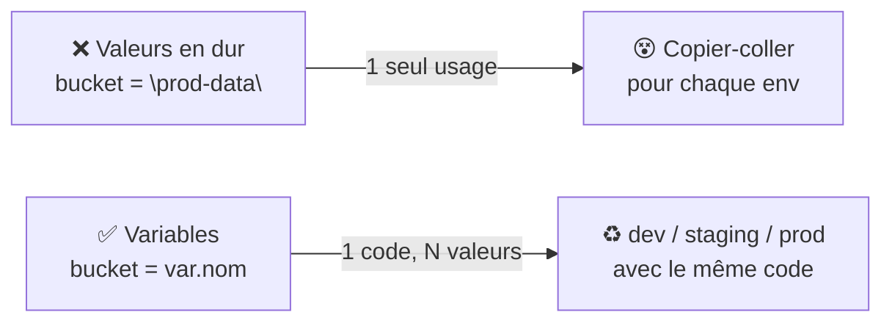
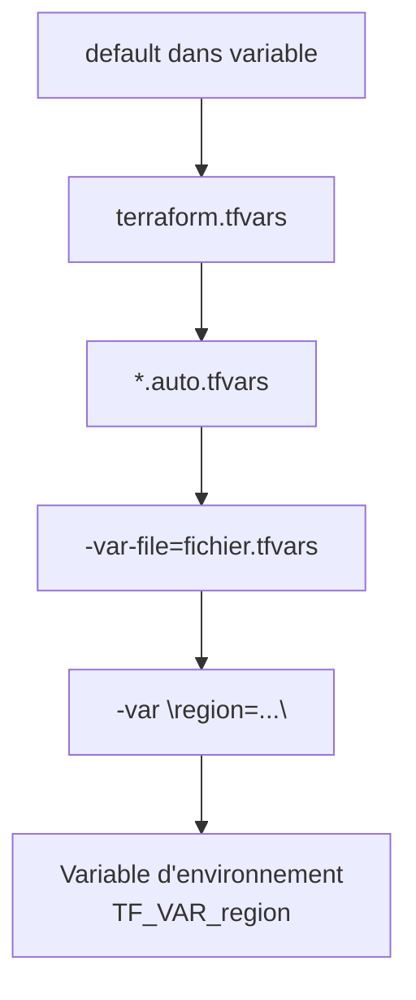
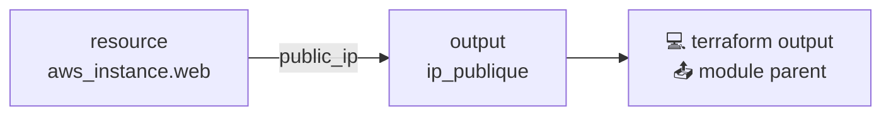
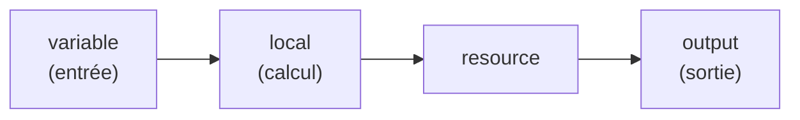

<a id="top"></a>

# 02 — Variables et outputs

## Table des matières

| # | Section |
|---|---|
| 1 | [Pourquoi paramétrer ?](#section-1) |
| 2 | [Déclarer une variable d'entrée](#section-2) |
| 3 | [Les types de variables](#section-3) |
| 4 | [Fournir des valeurs (tfvars)](#section-4) |
| 5 | [Les locals](#section-5) |
| 6 | [Les outputs](#section-6) |
| 7 | [Validation et interpolation](#section-7) |
| 8 | [Quiz — Variables et outputs](#section-8) |
| 9 | [Pratique — Une infra paramétrable](#section-9) |
| 10 | [Synthèse](#section-10) |

---

<a id="section-1"></a>

<details>
<summary>1 — Pourquoi paramétrer ?</summary>

<br/>

Coder en dur des valeurs (région, nom, taille) rend une configuration **rigide** : impossible de la réutiliser pour un autre environnement sans tout réécrire. Les **variables** rendent le code **paramétrable**.



| Sans variable | Avec variable |
|---|---|
| Un fichier par environnement | Un seul code |
| Modifier = chercher partout | Modifier = changer une valeur |
| Risque d'oubli, d'incohérence | Source unique de vérité |

> _Règle pratique : dès qu'une valeur change selon l'environnement (région, taille, nombre d'instances), elle doit devenir une variable._

</details>

<p align="right"><a href="#top">↑ Retour en haut</a></p>

---

<a id="section-2"></a>

<details>
<summary>2 — Déclarer une variable d'entrée</summary>

<br/>

On déclare une variable avec le bloc `variable`. On la place souvent dans un fichier `variables.tf`.

```hcl
variable "region" {
  description = "Région AWS de déploiement"
  type        = string
  default     = "ca-central-1"
}

variable "nb_instances" {
  description = "Nombre d'instances web"
  type        = number
  default     = 2
}
```

| Argument | Rôle |
|---|---|
| `description` | Documente la variable (bonne pratique) |
| `type` | Contraint le type accepté |
| `default` | Valeur par défaut si non fournie |

On utilise la variable avec `var.nom` :

```hcl
provider "aws" {
  region = var.region
}
```

```mermaid
flowchart LR
    A["variable \"region\"<br/>{ default = ... }"] -->|"var.region"| B["provider \"aws\"<br/>region = var.region"]
```

> _Si une variable n'a **pas** de `default` et qu'aucune valeur n'est fournie, Terraform la **demandera de façon interactive** au lancement. Évitez cela en production : fournissez toujours les valeurs._

**🔧 Mini-exercice —** Déclare une variable `region` de type `string` avec une valeur par défaut `ca-central-1`.

<details>
<summary>✅ Voir une solution</summary>

```hcl
variable "region" {
  type    = string
  default = "ca-central-1"
}
```

</details>

</details>

<p align="right"><a href="#top">↑ Retour en haut</a></p>

---

<a id="section-3"></a>

<details>
<summary>3 — Les types de variables</summary>

<br/>

Terraform supporte des types **primitifs** et **complexes**.

| Type | Exemple | Usage |
|---|---|---|
| `string` | `"ca-central-1"` | Texte |
| `number` | `3` | Nombre |
| `bool` | `true` | Booléen |
| `list(type)` | `["a", "b"]` | Liste ordonnée |
| `map(type)` | `{ env = "dev" }` | Clé → valeur |
| `set(type)` | `["a", "b"]` | Ensemble unique |
| `object({...})` | structure | Objet typé |

```hcl
variable "zones" {
  type    = list(string)
  default = ["ca-central-1a", "ca-central-1b"]
}

variable "tags" {
  type = map(string)
  default = {
    Projet      = "D30"
    Environnement = "dev"
  }
}

variable "config_serveur" {
  type = object({
    taille = string
    disque = number
  })
  default = {
    taille = "t3.micro"
    disque = 20
  }
}
```

> _Typer les variables permet à Terraform de **détecter les erreurs tôt** : passer `"deux"` à une variable `number` échoue dès le `plan`, pas au moment de créer l'infra._

**🔧 Mini-exercice —** Déclare une variable `zones` de type `list(string)` avec pour valeur par défaut deux zones de disponibilité de Montréal.

<details>
<summary>✅ Voir une solution</summary>

```hcl
variable "zones" {
  type    = list(string)
  default = ["ca-central-1a", "ca-central-1b"]
}
```

</details>

</details>

<p align="right"><a href="#top">↑ Retour en haut</a></p>

---

<a id="section-4"></a>

<details>
<summary>4 — Fournir des valeurs (tfvars)</summary>

<br/>

Plusieurs façons de donner une valeur à une variable, par **ordre de priorité croissant** :



Le fichier le plus courant est `terraform.tfvars` :

```hcl
# terraform.tfvars
region       = "us-east-1"
nb_instances = 4
tags = {
  Projet      = "D30"
  Environnement = "prod"
}
```

```bash
# Valeur via la ligne de commande (priorité élevée)
terraform apply -var="nb_instances=5"

# Fichier de valeurs spécifique à un environnement
terraform apply -var-file="prod.tfvars"

# Variable d'environnement
export TF_VAR_region="eu-west-1"
terraform plan
```

| Méthode | Quand l'utiliser |
|---|---|
| `terraform.tfvars` | Valeurs par défaut du projet |
| `prod.tfvars`, `dev.tfvars` | Par environnement |
| `-var=...` | Test ponctuel |
| `TF_VAR_*` | CI/CD, secrets |

> _⚠️ Ne mettez **jamais** de secrets (mots de passe, clés) dans un `.tfvars` commité. Utilisez `TF_VAR_*` en variable d'environnement ou un gestionnaire de secrets, et ajoutez `*.tfvars` au `.gitignore` si nécessaire._

</details>

<p align="right"><a href="#top">↑ Retour en haut</a></p>

---

<a id="section-5"></a>

<details>
<summary>5 — Les locals</summary>

<br/>

Les **locals** sont des valeurs **calculées** réutilisables à l'intérieur d'une configuration. Contrairement aux variables, elles ne sont **pas** fournies de l'extérieur.

```hcl
locals {
  prefixe = "${var.projet}-${var.environnement}"

  tags_communs = {
    Projet        = var.projet
    Environnement = var.environnement
    GerePar       = "Terraform"
  }
}
```

On les référence avec `local.nom` :

```hcl
resource "aws_s3_bucket" "data" {
  bucket = "${local.prefixe}-data"
  tags   = local.tags_communs
}
```

| | Variable | Local |
|---|---|---|
| Source | Externe (utilisateur) | Calculée en interne |
| Préfixe | `var.` | `local.` |
| Usage | Paramètre d'entrée | Éviter la répétition (DRY) |

> _Les locals évitent de répéter une même expression. Si vous écrivez deux fois la même concaténation, transformez-la en local — vous ne corrigerez qu'à un seul endroit._

**🔧 Mini-exercice —** Crée un local `prefixe` qui concatène `var.projet` et `var.environnement` séparés par un tiret.

<details>
<summary>✅ Voir une solution</summary>

```hcl
locals {
  prefixe = "${var.projet}-${var.environnement}"
}
```

</details>

</details>

<p align="right"><a href="#top">↑ Retour en haut</a></p>

---

<a id="section-6"></a>

<details>
<summary>6 — Les outputs</summary>

<br/>

Les **outputs** exposent des valeurs **après** l'apply : adresse IP d'un serveur, URL d'un bucket, nom DNS… Pratiques pour récupérer une information ou la passer entre modules.

```hcl
output "url_bucket" {
  description = "URL du bucket S3"
  value       = aws_s3_bucket.data.bucket_domain_name
}

output "ip_publique" {
  value       = aws_instance.web.public_ip
  description = "IP publique du serveur web"
}

output "mot_de_passe_bd" {
  value     = aws_db_instance.bd.password
  sensitive = true   # masqué dans la sortie
}
```

```bash
# Voir tous les outputs après apply
terraform output

# Un output précis (utile en script)
terraform output -raw ip_publique
```



> _Marquez `sensitive = true` toute valeur secrète : Terraform la **masquera** dans la sortie console (affichée `(sensitive value)`). Attention : elle reste lisible dans le fichier d'état._

**🔧 Mini-exercice —** Déclare un `output` nommé `ip_publique` qui expose l'attribut `public_ip` de la ressource `aws_instance.web`.

<details>
<summary>✅ Voir une solution</summary>

```hcl
output "ip_publique" {
  value = aws_instance.web.public_ip
}
```

</details>

</details>

<p align="right"><a href="#top">↑ Retour en haut</a></p>

---

<a id="section-7"></a>

<details>
<summary>7 — Validation et interpolation</summary>

<br/>

L'**interpolation** insère une expression dans une chaîne avec `${ … }` :

```hcl
bucket = "${var.projet}-${var.environnement}-data"
```

La **validation** ajoute des règles métier à une variable :

```hcl
variable "environnement" {
  type = string

  validation {
    condition     = contains(["dev", "staging", "prod"], var.environnement)
    error_message = "L'environnement doit être dev, staging ou prod."
  }
}

variable "nb_instances" {
  type = number

  validation {
    condition     = var.nb_instances >= 1 && var.nb_instances <= 10
    error_message = "Le nombre d'instances doit être entre 1 et 10."
  }
}
```

| Fonction utile | Effet |
|---|---|
| `contains(liste, x)` | `x` est-il dans la liste ? |
| `length(x)` | Taille d'une liste/chaîne |
| `upper(x)` / `lower(x)` | Casse |
| `coalesce(a, b)` | Première valeur non vide |

> _La validation échoue **dès le `plan`** avec votre message d'erreur personnalisé. C'est une protection précieuse : elle empêche des valeurs absurdes d'atteindre votre infrastructure._

</details>

<p align="right"><a href="#top">↑ Retour en haut</a></p>

---

<a id="section-8"></a>

<details>
<summary>8 — Quiz — Variables et outputs</summary>

<br/>

**Question 1 :** Comment référence-t-on une variable nommée `region` ?

a) `region`

b) `$region`

c) `var.region`

d) `local.region`

<details>
<summary>💡 Voir la solution</summary>

✅ **Réponse : c)** — On accède à une variable d'entrée avec le préfixe `var.`, donc `var.region`.

</details>

---

**Question 2 :** Quelle est la différence entre une variable et un local ?

a) Aucune

b) La variable vient de l'extérieur ; le local est calculé en interne

c) Le local vient de l'extérieur

d) La variable ne peut pas avoir de type

<details>
<summary>💡 Voir la solution</summary>

✅ **Réponse : b)** — Les variables (`var.`) sont fournies par l'utilisateur ; les locals (`local.`) sont des valeurs calculées internes pour éviter la répétition.

</details>

---

**Question 3 :** À quoi sert un `output` ?

a) À déclarer une variable

b) À exposer une valeur après l'apply

c) À télécharger un provider

d) À stocker l'état

<details>
<summary>💡 Voir la solution</summary>

✅ **Réponse : b)** — Un output expose une valeur calculée (IP, URL…) après l'apply, consultable via `terraform output` ou utilisable par un module parent.

</details>

---

**Question 4 :** Quel fichier contient couramment les valeurs des variables ?

a) `variables.tf`

b) `terraform.tfstate`

c) `terraform.tfvars`

d) `outputs.tf`

<details>
<summary>💡 Voir la solution</summary>

✅ **Réponse : c)** — `terraform.tfvars` (et ses variantes) fournit les **valeurs**. `variables.tf` ne fait que **déclarer** les variables.

</details>

---

**Question 5 :** Comment masquer un output secret dans la console ?

a) `secret = true`

b) `hidden = true`

c) `sensitive = true`

d) `private = true`

<details>
<summary>💡 Voir la solution</summary>

✅ **Réponse : c)** — `sensitive = true` masque la valeur dans la sortie (`(sensitive value)`). Attention, elle reste présente dans le fichier d'état.

</details>

</details>

<p align="right"><a href="#top">↑ Retour en haut</a></p>

---

<a id="section-9"></a>

<details>
<summary>9 — Pratique — Une infra paramétrable</summary>

<br/>

### Consigne

Transformez la configuration de la leçon 01 pour qu'elle soit **paramétrable** : la région, le nom du projet et l'environnement deviennent des variables (avec validation de l'environnement), et le nom du bucket exposé en output.

---

### Correction

`variables.tf` :

```hcl
variable "region" {
  description = "Région AWS"
  type        = string
  default     = "ca-central-1"
}

variable "projet" {
  description = "Nom du projet"
  type        = string
  default     = "d30"
}

variable "environnement" {
  description = "Environnement (dev/staging/prod)"
  type        = string
  default     = "dev"

  validation {
    condition     = contains(["dev", "staging", "prod"], var.environnement)
    error_message = "L'environnement doit être dev, staging ou prod."
  }
}
```

`main.tf` :

```hcl
provider "aws" {
  region = var.region
}

locals {
  prefixe = "${var.projet}-${var.environnement}"
}

resource "aws_s3_bucket" "data" {
  bucket = "${local.prefixe}-data-2026"

  tags = {
    Projet        = var.projet
    Environnement = var.environnement
  }
}
```

`outputs.tf` :

```hcl
output "nom_bucket" {
  description = "Nom du bucket créé"
  value       = aws_s3_bucket.data.bucket
}
```

Commandes attendues :

```bash
terraform init
terraform plan -var="environnement=prod"
terraform apply -var="environnement=prod"
terraform output nom_bucket
```

**Résultat attendu :**

```
Outputs:

nom_bucket = "d30-prod-data-2026"
```

Et si l'on tente une valeur interdite :

```bash
terraform plan -var="environnement=test"
# Error: Invalid value for variable
# L'environnement doit être dev, staging ou prod.
```

> _Le même code produit `d30-dev-data-2026` ou `d30-prod-data-2026` selon la valeur passée : c'est exactement l'objectif des variables._

</details>

<p align="right"><a href="#top">↑ Retour en haut</a></p>

---

<a id="section-10"></a>

<details>
<summary>10 — Synthèse</summary>

<br/>

#### Points à retenir

1. Les **variables** (`var.`) rendent le code paramétrable et réutilisable.
2. Le **type** contraint les valeurs (`string`, `number`, `list`, `map`, `object`…).
3. Les **valeurs** se fournissent via `terraform.tfvars`, `-var`, `-var-file` ou `TF_VAR_*`.
4. Les **locals** (`local.`) calculent des valeurs internes pour éviter la répétition.
5. Les **outputs** exposent des résultats après l'apply (`sensitive` pour masquer).
6. La **validation** rejette les valeurs invalides dès le `plan`.



#### La suite

Leçon **03 — Le fichier d'état** : comprendre `terraform.tfstate`, pourquoi il existe, et comment le stocker de façon sûre et partagée avec un **backend distant**.

</details>

<p align="right"><a href="#top">↑ Retour en haut</a></p>

---

<p align="center">
  <em>Tous droits réservés. Toute reproduction, diffusion, utilisation ou adaptation de ce cours, en tout ou en partie, est strictement interdite sans l'autorisation écrite préalable de Dr. Haythem REHOUMA.</em>
</p>

<p align="center">
  <strong>Cours créé par Dr. Haythem REHOUMA — Développement et déploiement de solutions de données</strong>
</p>
