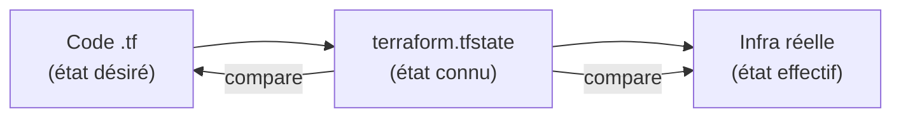
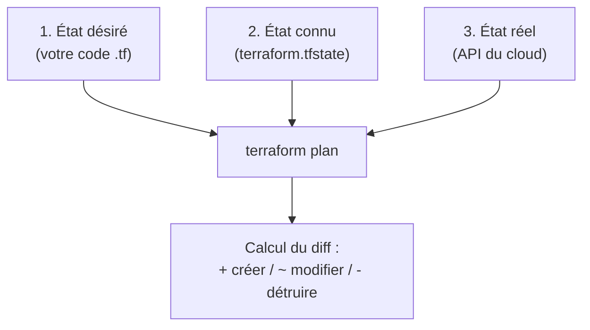
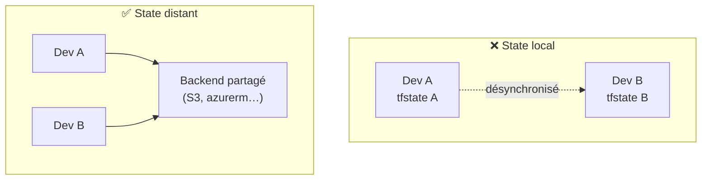
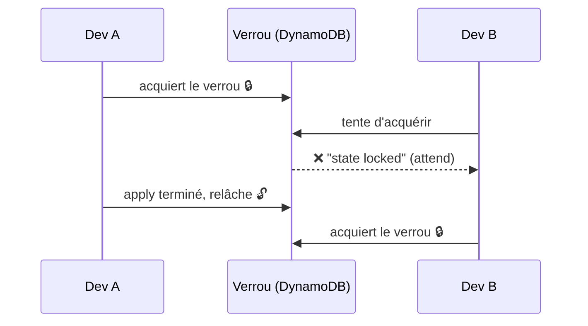
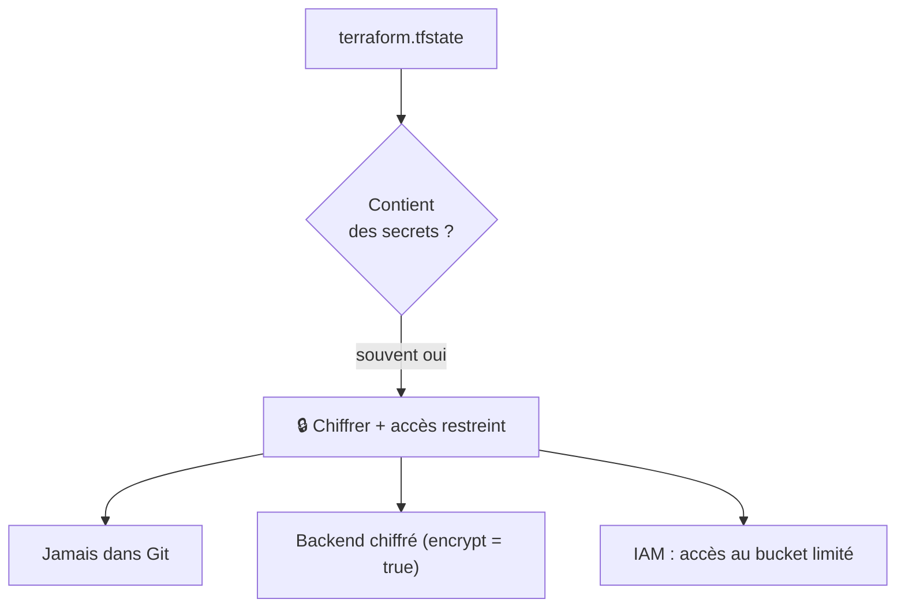
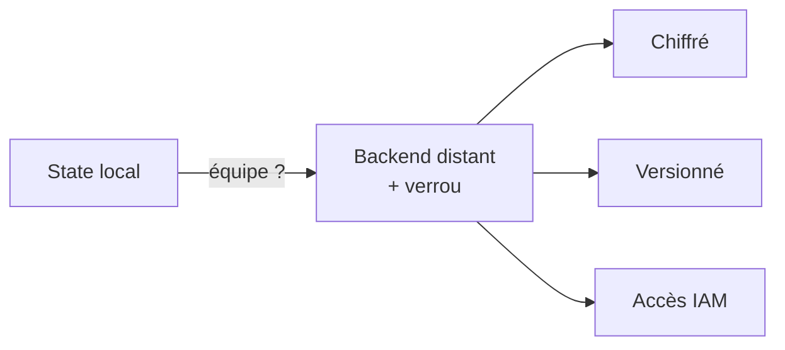

<a id="top"></a>

# 03 — Le fichier d'état (state)

## Table des matières

| # | Section |
|---|---|
| 1 | [Qu'est-ce que le fichier d'état ?](#section-1) |
| 2 | [Pourquoi le state existe-t-il ?](#section-2) |
| 3 | [State local vs distant](#section-3) |
| 4 | [Configurer un backend distant](#section-4) |
| 5 | [Le verrouillage du state](#section-5) |
| 6 | [Inspecter et manipuler le state](#section-6) |
| 7 | [Sécurité du state](#section-7) |
| 8 | [Quiz — Le fichier d'état](#section-8) |
| 9 | [Pratique — Migrer vers un backend S3](#section-9) |
| 10 | [Synthèse](#section-10) |

---

<a id="section-1"></a>

<details>
<summary>1 — Qu'est-ce que le fichier d'état ?</summary>

<br/>

Le fichier **`terraform.tfstate`** est la **mémoire** de Terraform. Il enregistre, au format JSON, la correspondance entre votre code et les **ressources réelles** créées sur la plateforme.



Extrait simplifié d'un state :

```json
{
  "resources": [
    {
      "type": "aws_s3_bucket",
      "name": "data",
      "instances": [
        {
          "attributes": {
            "id": "d30-dev-data-2026",
            "arn": "arn:aws:s3:::d30-dev-data-2026"
          }
        }
      ]
    }
  ]
}
```

> _Le state est ce qui permet à Terraform de savoir que `aws_s3_bucket.data` dans votre code **correspond** au bucket réel `d30-dev-data-2026`. Sans lui, Terraform ne saurait pas quoi modifier ou détruire._

**🔧 Mini-exercice —** Quel est le nom du fichier de state par défaut, et dans quel format est-il écrit ?

<details>
<summary>✅ Voir une solution</summary>

Le fichier s'appelle `terraform.tfstate` et il est écrit au format **JSON**.

</details>

</details>

<p align="right"><a href="#top">↑ Retour en haut</a></p>

---

<a id="section-2"></a>

<details>
<summary>2 — Pourquoi le state existe-t-il ?</summary>

<br/>

Lors d'un `plan` ou `apply`, Terraform fait une **triple comparaison** :



| Rôle du state | Explication |
|---|---|
| **Mappage** | Relie le nom local au vrai identifiant cloud |
| **Suivi des attributs** | Mémorise les valeurs calculées (ID, ARN, IP) |
| **Performance** | Évite d'interroger toute l'API à chaque fois |
| **Détection de dérive** | Compare ce qui est attendu à ce qui existe |

Si quelqu'un modifie une ressource à la main dans la console (= **dérive**), `terraform plan` le détecte en comparant le state à la réalité, et propose de revenir à l'état désiré.

> _Sans state, Terraform devrait deviner quelles ressources lui appartiennent — impossible. C'est pourquoi **on ne supprime jamais** le `terraform.tfstate` d'une infra en production._

</details>

<p align="right"><a href="#top">↑ Retour en haut</a></p>

---

<a id="section-3"></a>

<details>
<summary>3 — State local vs distant</summary>

<br/>

Par défaut, le state est **local** : un simple fichier `terraform.tfstate` sur votre disque. C'est pratique pour apprendre, mais problématique en équipe.



| | State local | State distant |
|---|---|---|
| Stockage | Disque local | S3, Azure Storage, GCS… |
| Partage en équipe | ❌ Impossible | ✅ Source unique |
| Verrouillage | ❌ Non | ✅ Oui (DynamoDB…) |
| Sécurité | Fichier en clair | Chiffré + accès contrôlé |
| Usage | Apprentissage, solo | Équipe, production |

> _Dès qu'**au moins deux personnes** (ou un pipeline CI/CD) travaillent sur la même infra, le state local devient dangereux : deux apply simultanés peuvent corrompre l'infrastructure. Passez au backend distant._

**🔧 Mini-exercice —** Cite deux raisons pour lesquelles un state distant est préférable à un state local quand on travaille en équipe.

<details>
<summary>✅ Voir une solution</summary>

Le state distant offre une **source unique partagée** entre tous les membres et permet le **verrouillage** (évite les apply concurrents qui corrompraient le state). Il est aussi chiffré et à accès contrôlé.

</details>

</details>

<p align="right"><a href="#top">↑ Retour en haut</a></p>

---

<a id="section-4"></a>

<details>
<summary>4 — Configurer un backend distant</summary>

<br/>

On configure le **backend** dans le bloc `terraform`. Exemple avec **S3** (AWS) :

```hcl
terraform {
  backend "s3" {
    bucket         = "d30-terraform-state"
    key            = "prod/infra.tfstate"
    region         = "ca-central-1"
    dynamodb_table = "terraform-locks"
    encrypt        = true
  }
}
```

Exemple avec **azurerm** (Azure) :

```hcl
terraform {
  backend "azurerm" {
    resource_group_name  = "rg-terraform"
    storage_account_name = "d30tfstate"
    container_name       = "tfstate"
    key                  = "prod.terraform.tfstate"
  }
}
```

| Argument (S3) | Rôle |
|---|---|
| `bucket` | Bucket S3 qui stocke le state |
| `key` | Chemin du fichier dans le bucket |
| `dynamodb_table` | Table de **verrouillage** |
| `encrypt` | Chiffrement au repos |

```bash
# Après avoir ajouté le bloc backend
terraform init
# Terraform propose de migrer le state local vers S3 :
# "Do you want to copy existing state to the new backend?"
```

> _Le bucket S3 et la table DynamoDB du backend doivent **exister avant** le `init`. On les crée souvent dans un dossier Terraform séparé (« bootstrap ») à state local, ou à la main une seule fois._

**🔧 Mini-exercice —** Écris un bloc `backend "s3"` qui stocke le state dans le bucket `d30-terraform-state`, sous la clé `dev/infra.tfstate`, avec chiffrement activé.

<details>
<summary>✅ Voir une solution</summary>

```hcl
terraform {
  backend "s3" {
    bucket  = "d30-terraform-state"
    key     = "dev/infra.tfstate"
    region  = "ca-central-1"
    encrypt = true
  }
}
```

</details>

</details>

<p align="right"><a href="#top">↑ Retour en haut</a></p>

---

<a id="section-5"></a>

<details>
<summary>5 — Le verrouillage du state</summary>

<br/>

Le **verrouillage** (*state locking*) empêche deux `apply` de modifier le state **en même temps**, ce qui le corromprait.



Avec le backend S3, le verrou est géré par une table **DynamoDB**. Si un verrou reste bloqué (ex. apply interrompu) :

```bash
# Voir le message d'erreur indiquant le Lock ID
terraform apply
# Error: Error acquiring the state lock ... ID: 1a2b3c4d

# Forcer le déverrouillage (avec prudence !)
terraform force-unlock 1a2b3c4d
```

> _⚠️ `force-unlock` est dangereux : ne l'utilisez **que** si vous êtes certain qu'aucun autre apply n'est en cours. Le déverrouiller pendant qu'un collègue travaille corromprait le state._

</details>

<p align="right"><a href="#top">↑ Retour en haut</a></p>

---

<a id="section-6"></a>

<details>
<summary>6 — Inspecter et manipuler le state</summary>

<br/>

La commande `terraform state` permet d'explorer et de manipuler le state **sans toucher** au code.

```bash
# Lister toutes les ressources suivies
terraform state list

# Voir les détails d'une ressource
terraform state show aws_s3_bucket.data

# Renommer une ressource dans le state (sans la recréer)
terraform state mv aws_s3_bucket.data aws_s3_bucket.donnees

# Retirer une ressource du suivi (sans la détruire)
terraform state rm aws_s3_bucket.data

# Importer une ressource existante dans le state
terraform import aws_s3_bucket.data mon-bucket-existant
```

| Commande | Effet | Détruit l'infra ? |
|---|---|---|
| `state list` | Liste les ressources | Non |
| `state show` | Affiche les attributs | Non |
| `state mv` | Renomme dans le state | Non |
| `state rm` | Oublie la ressource | Non (elle survit) |
| `import` | Adopte une ressource existante | Non |

> _`terraform import` est précieux pour reprendre une infra créée à la main : Terraform l'« adopte » dans le state, puis vous écrivez le code correspondant. Après quoi, `plan` ne propose plus de la recréer._

**🔧 Mini-exercice —** Quelle commande liste toutes les ressources suivies dans le state ? Et laquelle retire une ressource du suivi **sans** la détruire ?

<details>
<summary>✅ Voir une solution</summary>

`terraform state list` liste les ressources suivies ; `terraform state rm <adresse>` retire une ressource du suivi sans la détruire (elle survit sur la plateforme).

</details>

</details>

<p align="right"><a href="#top">↑ Retour en haut</a></p>

---

<a id="section-7"></a>

<details>
<summary>7 — Sécurité du state</summary>

<br/>

Le state contient parfois des **secrets en clair** : mots de passe de bases de données, clés générées, certificats. Il faut donc le protéger.



| Règle de sécurité | Pourquoi |
|---|---|
| **Jamais committer le state** | Ajouter `*.tfstate*` au `.gitignore` |
| **Chiffrer au repos** | `encrypt = true` côté backend |
| **Restreindre l'accès** | IAM/RBAC sur le bucket de state |
| **Activer le versioning** | Permet de restaurer un state corrompu |

`.gitignore` typique :

```bash
.terraform/
*.tfstate
*.tfstate.*
crash.log
*.tfvars        # si contient des secrets
```

> _Un state dans un dépôt Git public = fuite de secrets garantie. Mettez `*.tfstate*` dans `.gitignore` **dès le premier commit**, avant même le premier apply._

</details>

<p align="right"><a href="#top">↑ Retour en haut</a></p>

---

<a id="section-8"></a>

<details>
<summary>8 — Quiz — Le fichier d'état</summary>

<br/>

**Question 1 :** À quoi sert le fichier `terraform.tfstate` ?

a) À stocker le code source

b) À relier le code aux ressources réelles créées

c) À télécharger les providers

d) À définir les variables

<details>
<summary>💡 Voir la solution</summary>

✅ **Réponse : b)** — Le state est la mémoire de Terraform : il mappe chaque ressource du code à son identifiant réel sur la plateforme.

</details>

---

**Question 2 :** Pourquoi préférer un state **distant** en équipe ?

a) Il est plus rapide à lire

b) Il permet le partage et le verrouillage entre plusieurs personnes

c) Il supprime le besoin de providers

d) Il chiffre le code

<details>
<summary>💡 Voir la solution</summary>

✅ **Réponse : b)** — Un backend distant offre une source unique partagée et le verrouillage, évitant les corruptions lors d'apply concurrents.

</details>

---

**Question 3 :** Quel service gère couramment le **verrouillage** avec un backend S3 ?

a) S3 lui-même

b) DynamoDB

c) Lambda

d) CloudWatch

<details>
<summary>💡 Voir la solution</summary>

✅ **Réponse : b)** — Avec le backend S3, le verrouillage est assuré par une table DynamoDB (`dynamodb_table`).

</details>

---

**Question 4 :** Que fait `terraform state rm aws_s3_bucket.data` ?

a) Détruit le bucket sur AWS

b) Retire la ressource du suivi sans la détruire

c) Renomme le bucket

d) Crée un nouveau bucket

<details>
<summary>💡 Voir la solution</summary>

✅ **Réponse : b)** — `state rm` fait « oublier » la ressource à Terraform ; la ressource réelle continue d'exister sur la plateforme.

</details>

---

**Question 5 :** Pourquoi ne **jamais** committer le state dans Git ?

a) Il est trop volumineux

b) Il peut contenir des secrets en clair

c) Git ne supporte pas le JSON

d) Il ralentit les commits

<details>
<summary>💡 Voir la solution</summary>

✅ **Réponse : b)** — Le state peut contenir des mots de passe et clés en clair. Il doit rester chiffré, à accès restreint, et hors de Git (`.gitignore`).

</details>

</details>

<p align="right"><a href="#top">↑ Retour en haut</a></p>

---

<a id="section-9"></a>

<details>
<summary>9 — Pratique — Migrer vers un backend S3</summary>

<br/>

### Consigne

Vous avez une infra avec un state **local**. Configurez un **backend S3** avec verrouillage DynamoDB, puis migrez le state local vers ce backend.

---

### Correction

On suppose que le bucket `d30-terraform-state` et la table DynamoDB `terraform-locks` existent déjà.

Ajoutez le bloc backend dans `main.tf` :

```hcl
terraform {
  required_version = ">= 1.5.0"

  required_providers {
    aws = {
      source  = "hashicorp/aws"
      version = "~> 5.0"
    }
  }

  backend "s3" {
    bucket         = "d30-terraform-state"
    key            = "dev/infra.tfstate"
    region         = "ca-central-1"
    dynamodb_table = "terraform-locks"
    encrypt        = true
  }
}
```

Ajoutez le `.gitignore` :

```bash
.terraform/
*.tfstate
*.tfstate.*
```

Commandes attendues :

```bash
# Re-initialiser pour activer le backend
terraform init

# Terraform détecte le state local et propose la migration
#   Do you want to copy existing state to the new backend? yes

# Vérifier que tout est intact
terraform state list
terraform plan
```

**Résultat attendu :**

```
Successfully configured the backend "s3"! Terraform will automatically
use this backend unless the backend configuration changes.

Terraform has been successfully initialized!
```

```
aws_s3_bucket.data
# (plan)
No changes. Your infrastructure matches the configuration.
```

> _Après migration, le fichier `terraform.tfstate` local est vidé : la vérité est désormais dans S3. Le `plan` affichant `No changes` confirme que la migration n'a rien cassé._

</details>

<p align="right"><a href="#top">↑ Retour en haut</a></p>

---

<a id="section-10"></a>

<details>
<summary>10 — Synthèse</summary>

<br/>

#### Points à retenir

1. Le **state** (`terraform.tfstate`) est la mémoire qui relie le code aux ressources réelles.
2. Terraform compare **3 états** : désiré (code), connu (state), réel (API).
3. **State local** = solo/apprentissage ; **state distant** = équipe/production.
4. Un **backend** (S3, azurerm, GCS) partage le state, avec **verrouillage** (DynamoDB).
5. `terraform state` inspecte/manipule le state ; `import` adopte une ressource existante.
6. **Sécurité** : chiffrer, restreindre l'accès, **jamais** dans Git.



#### La suite

Leçon **04 — Les modules** : factoriser et réutiliser votre infrastructure (DRY) avec des modules locaux, le registry public et une organisation propre par environnement.

</details>

<p align="right"><a href="#top">↑ Retour en haut</a></p>

---

<p align="center">
  <em>Tous droits réservés. Toute reproduction, diffusion, utilisation ou adaptation de ce cours, en tout ou en partie, est strictement interdite sans l'autorisation écrite préalable de Dr. Haythem REHOUMA.</em>
</p>

<p align="center">
  <strong>Cours créé par Dr. Haythem REHOUMA — Développement et déploiement de solutions de données</strong>
</p>
