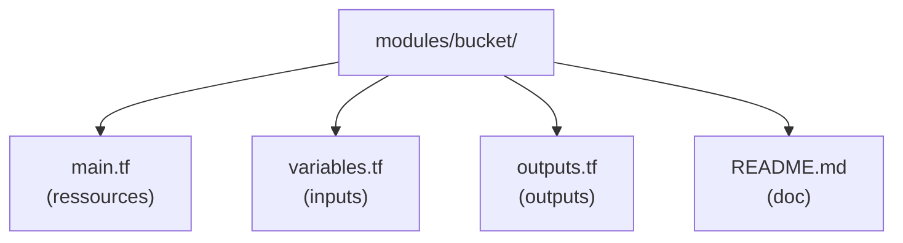
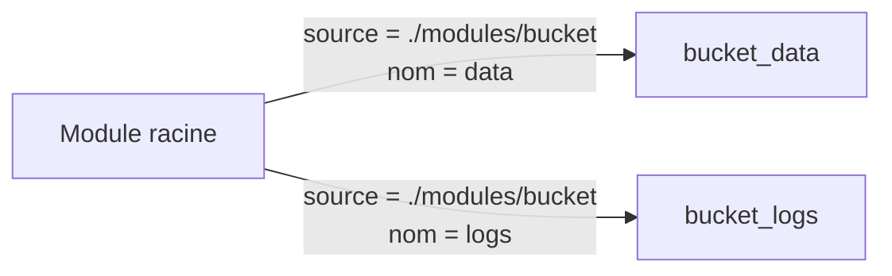
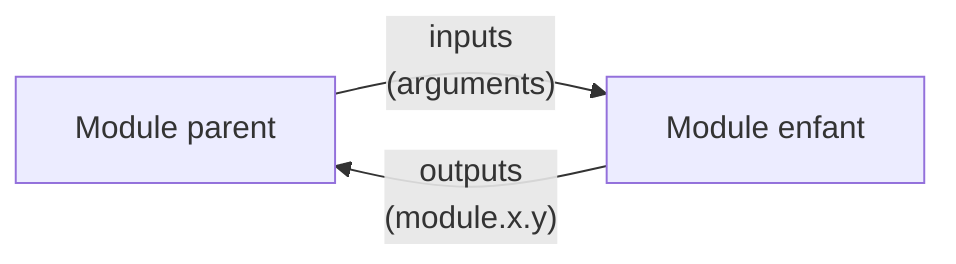
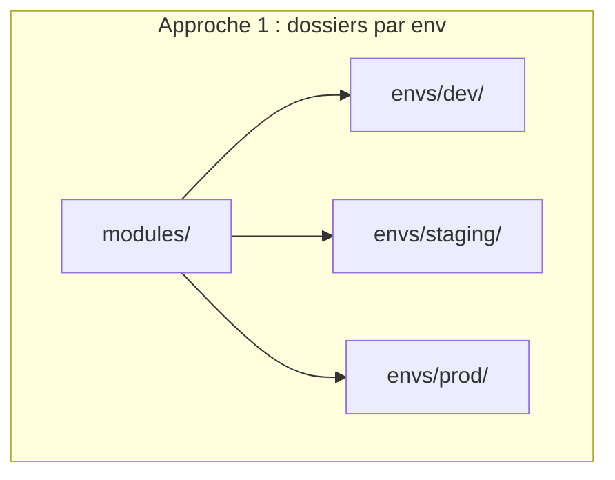
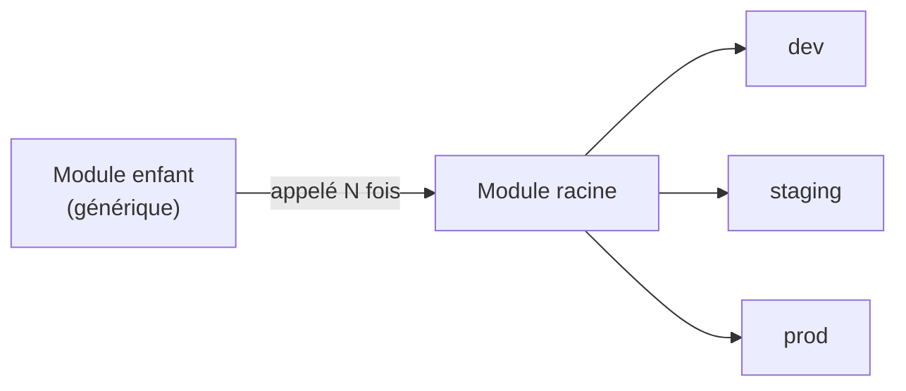

<a id="top"></a>

# 04 — Les modules

## Table des matières

| # | Section |
|---|---|
| 1 | [Pourquoi des modules ?](#section-1) |
| 2 | [Structure d'un module](#section-2) |
| 3 | [Appeler un module local](#section-3) |
| 4 | [Inputs et outputs d'un module](#section-4) |
| 5 | [Le registry public](#section-5) |
| 6 | [Organiser les environnements](#section-6) |
| 7 | [Bonnes pratiques](#section-7) |
| 8 | [Quiz — Les modules](#section-8) |
| 9 | [Pratique — Un module réutilisable](#section-9) |
| 10 | [Synthèse](#section-10) |

---

<a id="section-1"></a>

<details>
<summary>1 — Pourquoi des modules ?</summary>

<br/>

Un **module** est un ensemble de fichiers `.tf` regroupés pour être **réutilisés**. C'est l'équivalent d'une **fonction** en programmation : on l'écrit une fois, on l'appelle plusieurs fois avec des paramètres différents.

```mermaid
flowchart TD
    M["Module \"reseau\"<br/>(écrit une fois)"] --> A["Appel : env dev"]
    M --> B["Appel : env staging"]
    M --> C["Appel : env prod"]
```

Le principe clé est **DRY** (*Don't Repeat Yourself*) : ne pas dupliquer le code.

| Sans module | Avec module |
|---|---|
| Copier-coller pour chaque env | Un module, N appels |
| Bug corrigé à N endroits | Corrigé une seule fois |
| Code long et répétitif | Code court et lisible |

> _Tout dossier contenant des fichiers `.tf` est techniquement un module. Le dossier où vous lancez `terraform apply` est le **module racine** (root module). Les autres sont des **modules enfants** que vous appelez._

**🔧 Mini-exercice —** À quel concept de programmation un module Terraform est-il comparable, et quel principe applique-t-il ?

<details>
<summary>✅ Voir une solution</summary>

Un module est comparable à une **fonction** : on l'écrit une fois et on l'appelle plusieurs fois avec des paramètres différents. Il applique le principe **DRY** (*Don't Repeat Yourself*).

</details>

</details>

<p align="right"><a href="#top">↑ Retour en haut</a></p>

---

<a id="section-2"></a>

<details>
<summary>2 — Structure d'un module</summary>

<br/>

Un module bien organisé suit une **convention de fichiers** :



```
projet/
├── main.tf              # module racine (appelle les enfants)
├── variables.tf
├── outputs.tf
└── modules/
    └── bucket/          # module enfant
        ├── main.tf
        ├── variables.tf
        └── outputs.tf
```

| Fichier | Contenu | Rôle |
|---|---|---|
| `main.tf` | Blocs `resource` | Le cœur du module |
| `variables.tf` | Blocs `variable` | Les **entrées** du module |
| `outputs.tf` | Blocs `output` | Les **sorties** du module |

> _Cette convention (`main` / `variables` / `outputs`) n'est pas imposée par Terraform — tous les `.tf` sont fusionnés — mais elle est **universellement** suivie. Respectez-la pour que tout le monde s'y retrouve._

</details>

<p align="right"><a href="#top">↑ Retour en haut</a></p>

---

<a id="section-3"></a>

<details>
<summary>3 — Appeler un module local</summary>

<br/>

On appelle un module avec le bloc `module`, en précisant sa **source** :

```hcl
module "bucket_data" {
  source = "./modules/bucket"

  nom_bucket    = "d30-data"
  environnement = "prod"
}

module "bucket_logs" {
  source = "./modules/bucket"   # même module, autres valeurs

  nom_bucket    = "d30-logs"
  environnement = "prod"
}
```



| Valeur de `source` | Type |
|---|---|
| `./modules/bucket` | Module **local** (chemin relatif) |
| `terraform-aws-modules/vpc/aws` | **Registry** public |
| `git::https://github.com/...` | Dépôt Git |

```bash
# Après ajout/modif d'un bloc module : re-init obligatoire
terraform init
terraform plan
```

> _Après avoir ajouté un bloc `module`, relancez **toujours** `terraform init` : Terraform doit « installer » le module (le copier ou le télécharger) avant de pouvoir l'utiliser._

**🔧 Mini-exercice —** Écris un bloc `module` nommé `bucket_logs` qui appelle le module local situé dans `./modules/bucket`.

<details>
<summary>✅ Voir une solution</summary>

```hcl
module "bucket_logs" {
  source = "./modules/bucket"
}
```

</details>

</details>

<p align="right"><a href="#top">↑ Retour en haut</a></p>

---

<a id="section-4"></a>

<details>
<summary>4 — Inputs et outputs d'un module</summary>

<br/>

Un module communique par ses **inputs** (variables) et ses **outputs** :



Le **module enfant** (`modules/bucket/`) :

```hcl
# modules/bucket/variables.tf
variable "nom_bucket" {
  type = string
}
variable "environnement" {
  type = string
}

# modules/bucket/main.tf
resource "aws_s3_bucket" "ce" {
  bucket = "${var.nom_bucket}-${var.environnement}"
}

# modules/bucket/outputs.tf
output "arn" {
  value = aws_s3_bucket.ce.arn
}
```

Le **module parent** récupère l'output avec `module.nom.output` :

```hcl
module "bucket_data" {
  source        = "./modules/bucket"
  nom_bucket    = "d30-data"
  environnement = "prod"
}

output "arn_data" {
  value = module.bucket_data.arn
}
```

> _Un module est une **boîte noire** : le parent ne voit que les inputs (ce qu'il fournit) et les outputs (ce qu'il reçoit). Les ressources internes restent encapsulées — c'est ce qui rend le module réutilisable._

**🔧 Mini-exercice —** Dans le module parent, comment référence-t-on l'output `arn` du module appelé `bucket_data` ?

<details>
<summary>✅ Voir une solution</summary>

Avec la syntaxe `module.<nom>.<output>`, donc `module.bucket_data.arn`.

</details>

</details>

<p align="right"><a href="#top">↑ Retour en haut</a></p>

---

<a id="section-5"></a>

<details>
<summary>5 — Le registry public</summary>

<br/>

Le **Terraform Registry** (`registry.terraform.io`) héberge des milliers de modules **prêts à l'emploi**, maintenus par la communauté et les éditeurs.

```hcl
module "vpc" {
  source  = "terraform-aws-modules/vpc/aws"
  version = "5.5.0"

  name = "d30-vpc"
  cidr = "10.0.0.0/16"

  azs            = ["ca-central-1a", "ca-central-1b"]
  public_subnets = ["10.0.1.0/24", "10.0.2.0/24"]
}
```

Le format de `source` est `<NAMESPACE>/<NAME>/<PROVIDER>` :

| Partie | Exemple |
|---|---|
| `NAMESPACE` | `terraform-aws-modules` |
| `NAME` | `vpc` |
| `PROVIDER` | `aws` |

| Avantage du registry | Détail |
|---|---|
| Gain de temps | Réseau, EKS, RDS déjà codés |
| Bonnes pratiques | Modules testés et reconnus |
| Versionné | `version = "5.5.0"` (épinglez !) |

> _⚠️ **Épinglez toujours la version** d'un module du registry (`version = "5.5.0"`). Sans cela, une mise à jour automatique pourrait introduire un changement cassant lors d'un `init`._

**🔧 Mini-exercice —** Écris un bloc `module` qui appelle le module `vpc` du registry (`terraform-aws-modules/vpc/aws`) en épinglant la version `5.5.0`.

<details>
<summary>✅ Voir une solution</summary>

```hcl
module "vpc" {
  source  = "terraform-aws-modules/vpc/aws"
  version = "5.5.0"
}
```

</details>

</details>

<p align="right"><a href="#top">↑ Retour en haut</a></p>

---

<a id="section-6"></a>

<details>
<summary>6 — Organiser les environnements</summary>

<br/>

Pour gérer **dev / staging / prod**, deux approches courantes :



```
infra/
├── modules/
│   ├── reseau/
│   └── bucket/
└── envs/
    ├── dev/
    │   ├── main.tf       # appelle les modules avec valeurs dev
    │   └── terraform.tfvars
    ├── staging/
    └── prod/
```

| Approche | Avantage | Inconvénient |
|---|---|---|
| **Dossiers par env** | Isolation totale du state | Un peu de duplication d'appels |
| **Workspaces** | Un seul dossier | State partagé, plus risqué |

```bash
# Chaque environnement a son propre state isolé
cd envs/prod
terraform init
terraform apply
```

> _L'approche par **dossiers** est la plus recommandée en production : chaque environnement a son **state isolé**, donc un apply en dev ne peut jamais impacter prod par erreur._

</details>

<p align="right"><a href="#top">↑ Retour en haut</a></p>

---

<a id="section-7"></a>

<details>
<summary>7 — Bonnes pratiques</summary>

<br/>

Quelques règles pour des modules sains :

| Pratique | Pourquoi |
|---|---|
| Un module = **une responsabilité** | Réutilisable, testable |
| **Documenter** les inputs/outputs | `README.md` clair |
| **Épingler** les versions | Reproductibilité |
| **Ne pas** mettre de provider dans un module enfant | Le parent le configure |
| Préfixer les ressources par `var` | Éviter les collisions de noms |

```hcl
# ✅ Bon : le module enfant reçoit tout en input, pas de provider codé en dur
variable "region" { type = string }

# ❌ Éviter dans un module enfant :
# provider "aws" { region = "ca-central-1" }
```

```bash
# Formater et valider avant de committer
terraform fmt -recursive
terraform validate
```

> _Pensez « bibliothèque » : un bon module est générique, documenté et versionné, comme un paquet npm ou pip. Quelqu'un d'autre doit pouvoir l'utiliser **sans lire son code interne**._

</details>

<p align="right"><a href="#top">↑ Retour en haut</a></p>

---

<a id="section-8"></a>

<details>
<summary>8 — Quiz — Les modules</summary>

<br/>

**Question 1 :** À quoi un module est-il comparable en programmation ?

a) À une variable

b) À une fonction réutilisable

c) À un commentaire

d) À une boucle

<details>
<summary>💡 Voir la solution</summary>

✅ **Réponse : b)** — Un module est comme une fonction : on l'écrit une fois et on l'appelle plusieurs fois avec des paramètres différents (principe DRY).

</details>

---

**Question 2 :** Quel argument indique l'emplacement d'un module ?

a) `path`

b) `location`

c) `source`

d) `module`

<details>
<summary>💡 Voir la solution</summary>

✅ **Réponse : c)** — `source` indique où trouver le module : chemin local, registry public ou dépôt Git.

</details>

---

**Question 3 :** Comment référence-t-on l'output `arn` du module `bucket_data` ?

a) `var.bucket_data.arn`

b) `local.bucket_data.arn`

c) `module.bucket_data.arn`

d) `output.bucket_data.arn`

<details>
<summary>💡 Voir la solution</summary>

✅ **Réponse : c)** — On accède à la sortie d'un module avec `module.<nom>.<output>`, donc `module.bucket_data.arn`.

</details>

---

**Question 4 :** Pourquoi épingler la `version` d'un module du registry ?

a) Pour aller plus vite

b) Pour éviter qu'une mise à jour automatique casse l'infra

c) Parce que c'est obligatoire

d) Pour réduire la taille du state

<details>
<summary>💡 Voir la solution</summary>

✅ **Réponse : b)** — Épingler la version (`version = "5.5.0"`) garantit la reproductibilité et évite qu'un changement cassant soit tiré au prochain `init`.

</details>

---

**Question 5 :** Quelle approche isole le mieux les states de dev/staging/prod ?

a) Tout dans un seul fichier

b) Des dossiers séparés par environnement

c) Coder en dur les valeurs

d) Ne jamais utiliser de modules

<details>
<summary>💡 Voir la solution</summary>

✅ **Réponse : b)** — Des dossiers par environnement donnent à chacun son state isolé, empêchant qu'un apply en dev impacte la prod.

</details>

</details>

<p align="right"><a href="#top">↑ Retour en haut</a></p>

---

<a id="section-9"></a>

<details>
<summary>9 — Pratique — Un module réutilisable</summary>

<br/>

### Consigne

Créez un module local `modules/bucket` qui crée un bucket S3 nommé `<nom>-<environnement>` et expose son ARN. Appelez-le deux fois (data et logs) depuis le module racine.

---

### Correction

`modules/bucket/variables.tf` :

```hcl
variable "nom_bucket" {
  description = "Préfixe du nom du bucket"
  type        = string
}

variable "environnement" {
  description = "Environnement"
  type        = string
}
```

`modules/bucket/main.tf` :

```hcl
resource "aws_s3_bucket" "ce" {
  bucket = "${var.nom_bucket}-${var.environnement}"

  tags = {
    Environnement = var.environnement
    GerePar       = "Terraform"
  }
}
```

`modules/bucket/outputs.tf` :

```hcl
output "arn" {
  description = "ARN du bucket"
  value       = aws_s3_bucket.ce.arn
}
```

`main.tf` (racine) :

```hcl
provider "aws" {
  region = "ca-central-1"
}

module "bucket_data" {
  source        = "./modules/bucket"
  nom_bucket    = "d30-data"
  environnement = "prod"
}

module "bucket_logs" {
  source        = "./modules/bucket"
  nom_bucket    = "d30-logs"
  environnement = "prod"
}

output "arn_data" {
  value = module.bucket_data.arn
}
output "arn_logs" {
  value = module.bucket_logs.arn
}
```

Commandes attendues :

```bash
terraform init     # installe le module local
terraform plan
terraform apply
terraform output
```

**Résultat attendu :**

```
Plan: 2 to add, 0 to change, 0 to destroy.
```

```
Outputs:

arn_data = "arn:aws:s3:::d30-data-prod"
arn_logs = "arn:aws:s3:::d30-logs-prod"
```

> _Un seul module, deux buckets : voilà le DRY en action. Pour ajouter un troisième bucket, il suffit d'un nouveau bloc `module` de 4 lignes — pas de copier-coller des ressources._

</details>

<p align="right"><a href="#top">↑ Retour en haut</a></p>

---

<a id="section-10"></a>

<details>
<summary>10 — Synthèse</summary>

<br/>

#### Points à retenir

1. Un **module** = du code Terraform réutilisable, comme une fonction (DRY).
2. Convention : `main.tf` / `variables.tf` / `outputs.tf` + `README.md`.
3. On appelle un module avec un bloc `module` et un argument `source`.
4. Communication par **inputs** (variables) et **outputs** (`module.nom.output`).
5. Le **registry public** offre des modules tout faits — **épinglez la version**.
6. Organisez **dev/staging/prod** en dossiers pour isoler les states.



#### La suite

Vous maîtrisez désormais les fondations de Terraform : **providers**, **variables/outputs**, **state** et **modules**. Le module suivant du cours aborde l'**intégration de Terraform dans un pipeline CI/CD** pour automatiser totalement le déploiement de votre infrastructure.

</details>

<p align="right"><a href="#top">↑ Retour en haut</a></p>

---

<p align="center">
  <em>Tous droits réservés. Toute reproduction, diffusion, utilisation ou adaptation de ce cours, en tout ou en partie, est strictement interdite sans l'autorisation écrite préalable de Dr. Haythem REHOUMA.</em>
</p>

<p align="center">
  <strong>Cours créé par Dr. Haythem REHOUMA — Développement et déploiement de solutions de données</strong>
</p>
