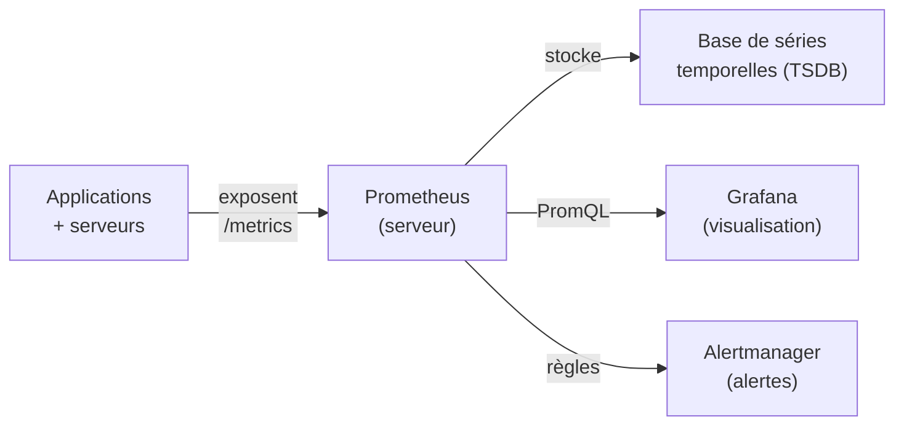
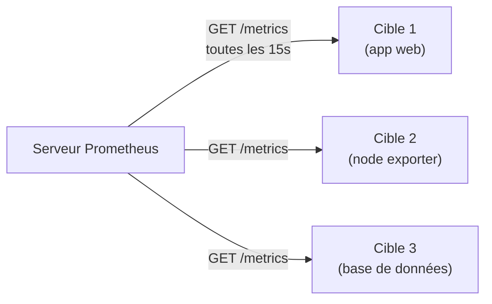
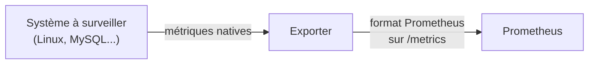
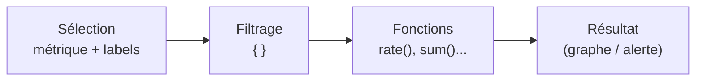
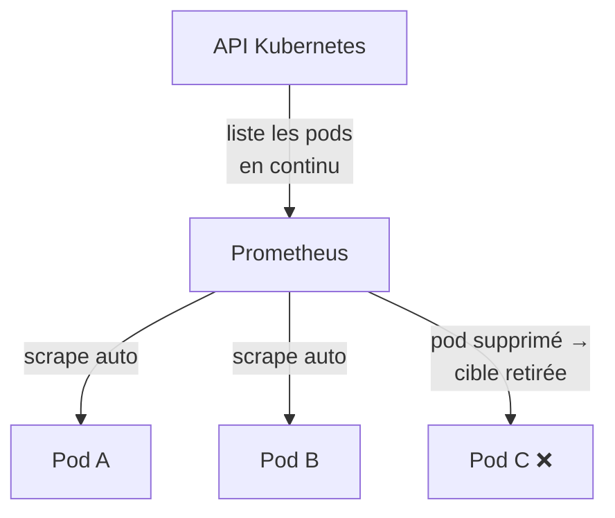
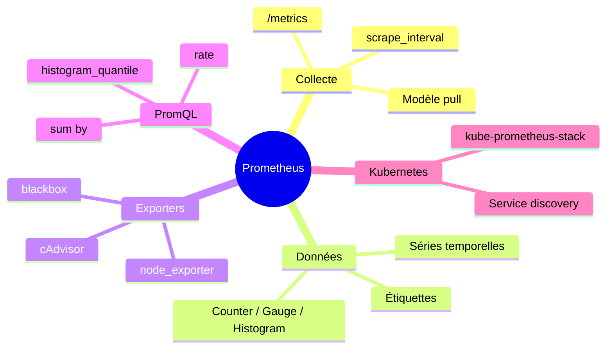

<a id="top"></a>

# 01 — Prometheus : la collecte de métriques

## Table des matières

| # | Section |
|---|---|
| 1 | [Qu'est-ce que Prometheus ?](#section-1) |
| 2 | [Le modèle pull et les séries temporelles](#section-2) |
| 3 | [Les exporters](#section-3) |
| 4 | [La configuration du scraping (prometheus.yml)](#section-4) |
| 5 | [PromQL — les bases du langage de requête](#section-5) |
| 6 | [Intégration avec Kubernetes](#section-6) |
| 7 | [Quiz — Prometheus](#section-7) |
| 8 | [Pratique — Scraper une application](#section-8) |
| 9 | [Synthèse](#section-9) |

---

<a id="section-1"></a>

<details>
<summary>1 — Qu'est-ce que Prometheus ?</summary>

<br/>

**Prometheus** est un système **open source** de **surveillance** (*monitoring*) et d'**alerting**, créé chez SoundCloud en 2012 et aujourd'hui projet phare de la **CNCF** (la même fondation que Kubernetes). Il est devenu le standard de fait pour collecter des **métriques** dans les environnements cloud-native.

> _Une **métrique** est une mesure numérique prise à un instant donné : utilisation CPU à 73 %, 1 240 requêtes HTTP par seconde, 512 Mo de mémoire utilisée. Prometheus stocke ces nombres dans le temps pour qu'on puisse les interroger, les visualiser et déclencher des alertes._



### Ce qui fait sa force

| Caractéristique | Bénéfice |
|---|---|
| **Modèle pull** | Prometheus va chercher les données, pas l'inverse |
| **Base de séries temporelles** intégrée | Pas besoin de base externe |
| **PromQL** | Langage de requête puissant et flexible |
| **Multidimensionnel** | Les métriques portent des étiquettes (*labels*) |
| **Écosystème** | Des centaines d'**exporters** prêts à l'emploi |

</details>

<p align="right"><a href="#top">↑ Retour en haut</a></p>

---

<a id="section-2"></a>

<details>
<summary>2 — Le modèle pull et les séries temporelles</summary>

<br/>

Contrairement à beaucoup d'outils qui reçoivent les données (*push*), Prometheus **va chercher** (*pull*) les métriques en interrogeant périodiquement un point d'accès HTTP, par convention `/metrics`.



**Pourquoi le pull ?**

- Prometheus sait **quelles cibles** doivent répondre → il détecte une cible **down** (elle ne répond plus).
- Pas de configuration côté application pour « où envoyer » : il suffit d'**exposer** `/metrics`.
- Plus simple à sécuriser et à tester (on peut visiter `/metrics` avec un navigateur).

### Une série temporelle

Une **série temporelle** (*time series*) est identifiée par un **nom de métrique** + un ensemble d'**étiquettes** (paires clé/valeur). Chaque série est une suite de couples `(timestamp, valeur)`.

```
http_requests_total{method="GET", handler="/api/users", status="200"}  →  4523
http_requests_total{method="POST", handler="/api/users", status="500"} →  12
```

| Élément | Exemple | Rôle |
|---|---|---|
| Nom de métrique | `http_requests_total` | Ce qu'on mesure |
| Étiquettes | `method="GET"`, `status="200"` | Dimensions de filtrage |
| Valeur | `4523` | La mesure |
| Timestamp | `1717920000` | L'instant de la mesure |

> _Les étiquettes sont la clé du modèle multidimensionnel : une seule métrique `http_requests_total` peut se décliner en milliers de séries selon la méthode, le code de statut, le service, etc._

**🔧 Mini-exercice —** Écris le sélecteur PromQL qui ne garde que les requêtes `POST` ayant échoué (code 500) de la métrique `http_requests_total`.

<details>
<summary>✅ Voir une solution</summary>

```promql
http_requests_total{method="POST", status="500"}
```

</details>

### Les 4 types de métriques

| Type | Usage | Exemple |
|---|---|---|
| **Counter** | Compteur qui ne fait qu'augmenter | `http_requests_total` |
| **Gauge** | Valeur qui monte et descend | `memory_usage_bytes` |
| **Histogram** | Distribution dans des seaux (*buckets*) | `request_duration_seconds` |
| **Summary** | Quantiles calculés côté client | latence p95, p99 |

</details>

<p align="right"><a href="#top">↑ Retour en haut</a></p>

---

<a id="section-3"></a>

<details>
<summary>3 — Les exporters</summary>

<br/>

Tous les systèmes ne savent pas exposer du `/metrics` au format Prometheus. Un **exporter** est un petit programme qui **traduit** les métriques d'un système (Linux, PostgreSQL, Redis…) au format Prometheus.



| Exporter | Surveille | Port par défaut |
|---|---|---|
| **node_exporter** | CPU, RAM, disque, réseau d'une machine Linux | 9100 |
| **cAdvisor** | Conteneurs (Docker) | 8080 |
| **blackbox_exporter** | Sondes HTTP/TCP/ICMP (disponibilité externe) | 9115 |
| **postgres_exporter** | PostgreSQL | 9187 |
| **redis_exporter** | Redis | 9121 |

### Exemple : lancer node_exporter

```bash
# Télécharger et lancer le node exporter
wget https://github.com/prometheus/node_exporter/releases/download/v1.8.1/node_exporter-1.8.1.linux-amd64.tar.gz
tar xvfz node_exporter-1.8.1.linux-amd64.tar.gz
cd node_exporter-1.8.1.linux-amd64
./node_exporter

# Vérifier que les métriques sont exposées
curl http://localhost:9100/metrics | head -20
```

Sortie typique (extrait) :

```
# HELP node_cpu_seconds_total Seconds the CPUs spent in each mode.
# TYPE node_cpu_seconds_total counter
node_cpu_seconds_total{cpu="0",mode="idle"} 81234.56
node_memory_MemAvailable_bytes 4.123456e+09
```

> _Pour instrumenter **votre propre** application, on n'utilise pas d'exporter : on intègre directement une **bibliothèque client** (Python `prometheus_client`, Go, Java…) qui expose `/metrics` depuis le code._

**🔧 Mini-exercice —** Quel exporter choisirais-tu pour surveiller une base PostgreSQL, et sur quel port écoute-t-il par défaut ?

<details>
<summary>✅ Voir une solution</summary>

Le `postgres_exporter`, qui écoute par défaut sur le port **9187**.

</details>

</details>

<p align="right"><a href="#top">↑ Retour en haut</a></p>

---

<a id="section-4"></a>

<details>
<summary>4 — La configuration du scraping (prometheus.yml)</summary>

<br/>

Tout se configure dans un seul fichier : **`prometheus.yml`**. Il définit la fréquence de collecte et les **cibles** (*targets*) à scraper.

```yaml
# prometheus.yml
global:
  scrape_interval: 15s        # fréquence de collecte par défaut
  evaluation_interval: 15s    # fréquence d'évaluation des règles

# Où envoyer les alertes
alerting:
  alertmanagers:
    - static_configs:
        - targets: ["alertmanager:9093"]

# Fichiers de règles d'alerte (voir leçon 04)
rule_files:
  - "alert_rules.yml"

# Les cibles à surveiller
scrape_configs:
  - job_name: "prometheus"          # Prometheus se surveille lui-même
    static_configs:
      - targets: ["localhost:9090"]

  - job_name: "node"
    static_configs:
      - targets: ["192.168.1.10:9100", "192.168.1.11:9100"]
        labels:
          env: "production"

  - job_name: "mon-app"
    metrics_path: "/metrics"        # par défaut /metrics
    scrape_interval: 5s             # surcharge le global pour ce job
    static_configs:
      - targets: ["mon-app:8000"]
```

| Clé | Rôle |
|---|---|
| `scrape_interval` | À quelle fréquence collecter |
| `job_name` | Nom logique d'un groupe de cibles |
| `static_configs.targets` | Liste d'adresses `host:port` à scraper |
| `metrics_path` | Chemin HTTP des métriques (`/metrics` par défaut) |
| `labels` | Étiquettes ajoutées à toutes les séries de la cible |

### Vérifier et recharger la configuration

```bash
# Valider la syntaxe du fichier avant de l'appliquer
promtool check config prometheus.yml

# Recharger la config sans redémarrer (si --web.enable-lifecycle est actif)
curl -X POST http://localhost:9090/-/reload
```

> _L'état de chaque cible (UP / DOWN) se consulte dans l'interface web sur `http://localhost:9090/targets`. C'est le premier réflexe quand une métrique manque._

**🔧 Mini-exercice —** Ajoute dans `prometheus.yml` un job `redis` qui scrape la cible `192.168.1.20:9121`.

<details>
<summary>✅ Voir une solution</summary>

```yaml
  - job_name: "redis"
    static_configs:
      - targets: ["192.168.1.20:9121"]
```

</details>

</details>

<p align="right"><a href="#top">↑ Retour en haut</a></p>

---

<a id="section-5"></a>

<details>
<summary>5 — PromQL — les bases du langage de requête</summary>

<br/>

**PromQL** (*Prometheus Query Language*) est le langage qui interroge les séries temporelles. Il sert aussi bien à construire des graphiques qu'à écrire des règles d'alerte.



### Sélectionner et filtrer

```promql
# Toutes les séries de la métrique
http_requests_total

# Filtrer par étiquette (=, !=, =~ regex, !~)
http_requests_total{status="500"}
http_requests_total{status=~"5.."}        # tous les codes 5xx

# Plage de temps (range vector) : les 5 dernières minutes
http_requests_total[5m]
```

### Les fonctions essentielles

| Fonction | Rôle | Exemple |
|---|---|---|
| `rate()` | Taux de croissance par seconde d'un counter | `rate(http_requests_total[5m])` |
| `sum()` | Agréger plusieurs séries | `sum(rate(http_requests_total[5m]))` |
| `avg()` | Moyenne | `avg(node_cpu_seconds_total)` |
| `by ()` | Grouper le résultat par étiquette | `sum by (status) (...)` |
| `histogram_quantile()` | Calculer un quantile (p95, p99) | latence p95 |

```promql
# Requêtes par seconde, groupées par code de statut
sum by (status) (rate(http_requests_total[5m]))

# Taux d'erreurs 5xx en pourcentage du trafic total
sum(rate(http_requests_total{status=~"5.."}[5m]))
  / sum(rate(http_requests_total[5m])) * 100

# Latence au 95e percentile (sur un histogram)
histogram_quantile(0.95, rate(http_request_duration_seconds_bucket[5m]))

# Utilisation CPU d'un nœud (100 % - temps idle)
100 - (avg by (instance) (rate(node_cpu_seconds_total{mode="idle"}[5m])) * 100)
```

> _Règle d'or : sur un **counter**, on n'affiche presque jamais la valeur brute (qui ne fait qu'augmenter). On applique `rate(...[5m])` pour obtenir un **taux par seconde** lisible et stable._

**🔧 Mini-exercice —** Écris une requête PromQL qui donne le taux total de requêtes par seconde sur 5 minutes, groupé par `handler`.

<details>
<summary>✅ Voir une solution</summary>

```promql
sum by (handler) (rate(http_requests_total[5m]))
```

</details>

</details>

<p align="right"><a href="#top">↑ Retour en haut</a></p>

---

<a id="section-6"></a>

<details>
<summary>6 — Intégration avec Kubernetes</summary>

<br/>

Dans Kubernetes, les pods apparaissent et disparaissent en permanence : impossible de lister les cibles à la main. Prometheus utilise la **découverte de services** (*service discovery*) pour s'adapter automatiquement.



### Découverte automatique via annotations

```yaml
# Service Kubernetes annoté pour être scrapé
apiVersion: v1
kind: Service
metadata:
  name: mon-app
  annotations:
    prometheus.io/scrape: "true"
    prometheus.io/port: "8000"
    prometheus.io/path: "/metrics"
```

```yaml
# Extrait de prometheus.yml : découverte des pods
scrape_configs:
  - job_name: "kubernetes-pods"
    kubernetes_sd_configs:
      - role: pod
    relabel_configs:
      - source_labels: [__meta_kubernetes_pod_annotation_prometheus_io_scrape]
        action: keep
        regex: true
```

### La solution recommandée : kube-prometheus-stack

En pratique, on n'écrit pas tout cela à la main. On installe le **kube-prometheus-stack** via Helm, qui déploie Prometheus, Grafana, Alertmanager et les exporters d'un coup.

```bash
# Ajouter le dépôt Helm et installer la stack complète
helm repo add prometheus-community https://prometheus-community.github.io/helm-charts
helm repo update
helm install monitoring prometheus-community/kube-prometheus-stack \
  --namespace monitoring --create-namespace

# Vérifier les pods déployés
kubectl get pods -n monitoring
```

> _Avec l'opérateur Prometheus (inclus dans la stack), on déclare les cibles avec des objets **ServiceMonitor** plutôt que d'éditer `prometheus.yml`. C'est la pratique standard sur Kubernetes._

</details>

<p align="right"><a href="#top">↑ Retour en haut</a></p>

---

<a id="section-7"></a>

<details>
<summary>7 — Quiz — Prometheus</summary>

<br/>

**Question 1 :** Quel modèle de collecte Prometheus utilise-t-il ?

a) Push — les applications envoient leurs métriques au serveur

b) Pull — Prometheus interroge périodiquement les cibles

c) Stream — un flux continu permanent

d) Batch — un envoi groupé une fois par jour

<details>
<summary>💡 Voir la solution</summary>

✅ **Réponse : b)** — Prometheus va chercher (*pull*) les métriques en interrogeant le point d'accès `/metrics` des cibles à intervalle régulier. Cela lui permet aussi de détecter les cibles indisponibles.

</details>

---

**Question 2 :** Quel type de métrique convient pour mesurer la mémoire utilisée, qui monte et descend ?

a) Counter

b) Histogram

c) Gauge

d) Summary

<details>
<summary>💡 Voir la solution</summary>

✅ **Réponse : c)** — Une **gauge** représente une valeur qui peut augmenter ou diminuer (mémoire, température, nombre de connexions actives). Un **counter** ne fait que croître.

</details>

---

**Question 3 :** Que fait la fonction `rate(http_requests_total[5m])` ?

a) Le total cumulé de requêtes

b) Le taux de croissance par seconde du counter sur 5 minutes

c) Le nombre de requêtes en 5 minutes exactement

d) La moyenne des étiquettes

<details>
<summary>💡 Voir la solution</summary>

✅ **Réponse : b)** — `rate()` calcule la croissance moyenne par seconde d'un counter sur la fenêtre indiquée. C'est la façon standard de rendre un counter lisible (requêtes/s).

</details>

---

**Question 4 :** À quoi sert un exporter comme `node_exporter` ?

a) À exporter des dashboards Grafana

b) À traduire les métriques d'un système (machine Linux) au format Prometheus

c) À envoyer des alertes par email

d) À sauvegarder la base de données

<details>
<summary>💡 Voir la solution</summary>

✅ **Réponse : b)** — Un exporter traduit les métriques d'un système qui ne parle pas nativement Prometheus. `node_exporter` expose CPU, RAM, disque et réseau d'une machine Linux sur le port 9100.

</details>

---

**Question 5 :** Sur Kubernetes, comment Prometheus trouve-t-il les nouveaux pods à surveiller ?

a) Il faut éditer `prometheus.yml` à chaque nouveau pod

b) Grâce à la découverte de services (`kubernetes_sd_configs`)

c) Les pods envoient leur adresse par email

d) C'est impossible, il faut tout faire à la main

<details>
<summary>💡 Voir la solution</summary>

✅ **Réponse : b)** — La découverte de services interroge l'API Kubernetes en continu pour adapter automatiquement la liste des cibles quand des pods apparaissent ou disparaissent.

</details>

</details>

<p align="right"><a href="#top">↑ Retour en haut</a></p>

---

<a id="section-8"></a>

<details>
<summary>8 — Pratique — Scraper une application</summary>

<br/>

### Consigne

Vous disposez d'une application web exposant ses métriques sur `http://mon-app:8000/metrics` et d'une machine Linux surveillée par node_exporter sur `192.168.1.50:9100`.

1. Écrivez le fichier **`prometheus.yml`** qui scrape ces deux cibles toutes les **10 secondes**, avec l'étiquette `env: "prod"` sur la machine Linux.
2. Écrivez une requête **PromQL** donnant le **taux de requêtes 5xx par seconde** de l'application sur les 5 dernières minutes.

---

### Correction

**1. Le fichier `prometheus.yml` :**

```yaml
global:
  scrape_interval: 10s

scrape_configs:
  - job_name: "mon-app"
    static_configs:
      - targets: ["mon-app:8000"]

  - job_name: "node"
    static_configs:
      - targets: ["192.168.1.50:9100"]
        labels:
          env: "prod"
```

**2. La requête PromQL :**

```promql
sum(rate(http_requests_total{status=~"5.."}[5m]))
```

**Résultat attendu :** Prometheus passe les deux cibles à l'état **UP** dans `/targets`. La requête renvoie un nombre comme `0.4` (soit 0,4 requête en erreur par seconde). Pour valider la config avant de l'appliquer :

```bash
promtool check config prometheus.yml
```

> _Astuce : si une cible reste **DOWN**, vérifiez d'abord avec `curl http://cible:port/metrics` que le point d'accès répond bien. 9 fois sur 10, le problème est réseau ou de port, pas Prometheus._

</details>

<p align="right"><a href="#top">↑ Retour en haut</a></p>

---

<a id="section-9"></a>

<details>
<summary>9 — Synthèse</summary>

<br/>

#### Points à retenir

1. **Prometheus** est le standard cloud-native de collecte de **métriques** (projet CNCF).
2. Il utilise le **modèle pull** : il va chercher les métriques sur `/metrics`.
3. Les données sont des **séries temporelles** : nom de métrique + **étiquettes** + valeur dans le temps.
4. Les **exporters** (node_exporter, cAdvisor…) traduisent les systèmes qui ne parlent pas Prometheus.
5. Tout se configure dans **`prometheus.yml`** (`scrape_configs`, cibles, intervalle).
6. **PromQL** interroge les données ; `rate()`, `sum()` et `by ()` sont les fonctions de base.
7. Sur **Kubernetes**, la découverte de services automatise les cibles (kube-prometheus-stack).



#### La suite

Prometheus collecte et stocke. Pour **voir** ces données dans de beaux tableaux de bord, place à la leçon **02 — Grafana : la visualisation**.

</details>

<p align="right"><a href="#top">↑ Retour en haut</a></p>

---

<p align="center">
  <em>Tous droits réservés. Toute reproduction, diffusion, utilisation ou adaptation de ce cours, en tout ou en partie, est strictement interdite sans l'autorisation écrite préalable de Dr. Haythem REHOUMA.</em>
</p>

<p align="center">
  <strong>Cours créé par Dr. Haythem REHOUMA — Développement et déploiement de solutions de données</strong>
</p>
