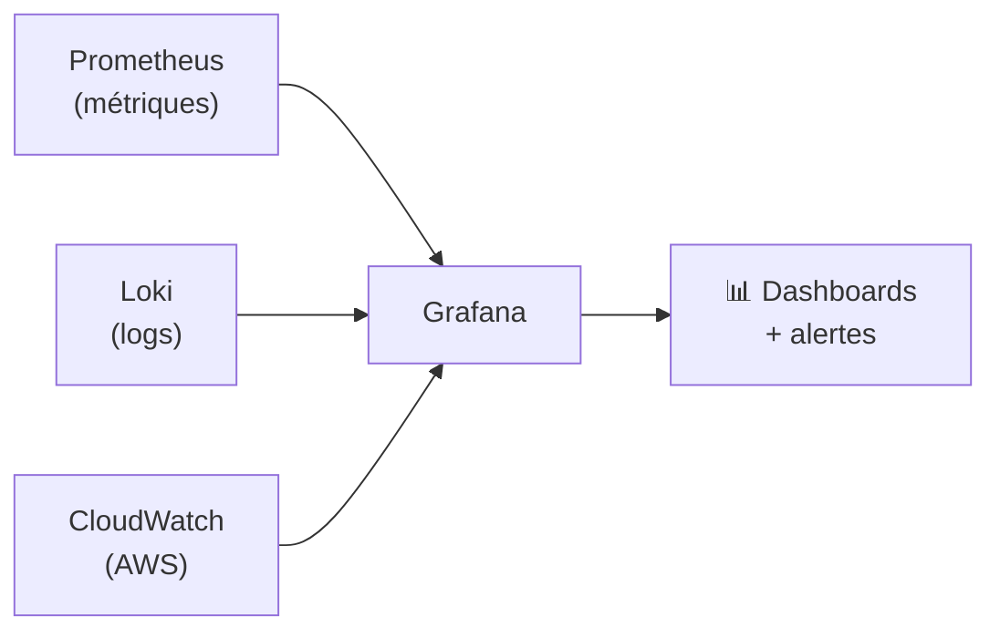
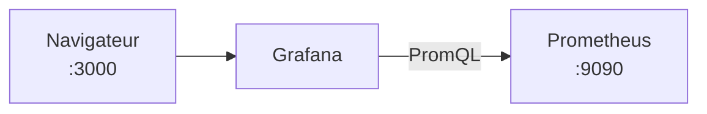
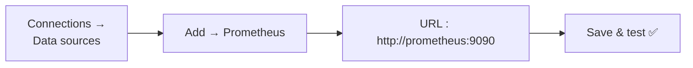
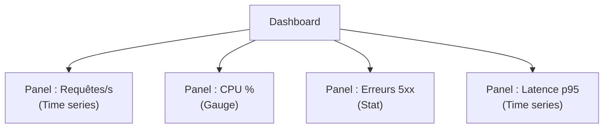
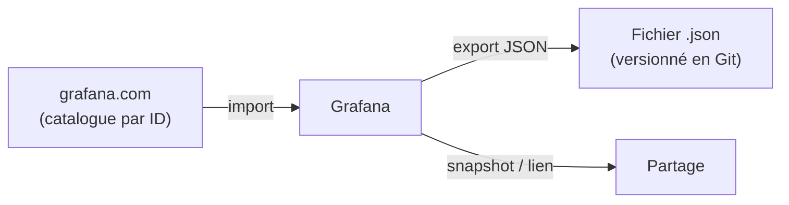
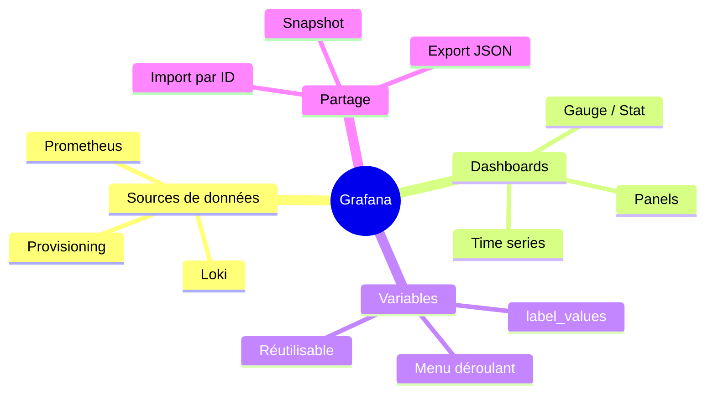

<a id="top"></a>

# 02 — Grafana : la visualisation

## Table des matières

| # | Section |
|---|---|
| 1 | [Qu'est-ce que Grafana ?](#section-1) |
| 2 | [Installer et démarrer Grafana](#section-2) |
| 3 | [Connecter une source de données (Prometheus)](#section-3) |
| 4 | [Construire un dashboard et des panels](#section-4) |
| 5 | [Les variables de tableau de bord](#section-5) |
| 6 | [Importer, exporter et partager](#section-6) |
| 7 | [Quiz — Grafana](#section-7) |
| 8 | [Pratique — Créer un panel de latence](#section-8) |
| 9 | [Synthèse](#section-9) |

---

<a id="section-1"></a>

<details>
<summary>1 — Qu'est-ce que Grafana ?</summary>

<br/>

**Grafana** est une plateforme **open source** de **visualisation** et d'**analyse**. Elle ne stocke pas de données : elle se connecte à des **sources de données** (Prometheus, Loki, MySQL, CloudWatch…) et les transforme en **tableaux de bord** (*dashboards*) interactifs.

> _Prometheus est le **cerveau** (il collecte et stocke les métriques) ; Grafana est les **yeux** (il les rend visibles et compréhensibles). Les deux forment le duo le plus répandu en observabilité._



### Pourquoi Grafana ?

| Atout | Détail |
|---|---|
| **Multi-sources** | Un même dashboard peut mêler métriques et logs |
| **Riche en visualisations** | Courbes, jauges, heatmaps, tableaux, stats |
| **Interactif** | Zoom temporel, variables, filtres dynamiques |
| **Partageable** | Export JSON, lien, instantané (*snapshot*) |
| **Communauté** | Des milliers de dashboards prêts à importer |

</details>

<p align="right"><a href="#top">↑ Retour en haut</a></p>

---

<a id="section-2"></a>

<details>
<summary>2 — Installer et démarrer Grafana</summary>

<br/>

La façon la plus simple de démarrer Grafana est via **Docker**.

```bash
# Lancer Grafana en conteneur, accessible sur le port 3000
docker run -d --name grafana -p 3000:3000 grafana/grafana

# Vérifier qu'il tourne
docker ps | grep grafana
```

On ouvre ensuite `http://localhost:3000` dans un navigateur. Identifiants par défaut : **admin / admin** (Grafana demande de changer le mot de passe à la première connexion).

### Avec Docker Compose (Prometheus + Grafana ensemble)

```yaml
# docker-compose.yml
version: "3"
services:
  prometheus:
    image: prom/prometheus
    ports:
      - "9090:9090"
    volumes:
      - ./prometheus.yml:/etc/prometheus/prometheus.yml

  grafana:
    image: grafana/grafana
    ports:
      - "3000:3000"
    depends_on:
      - prometheus
```

```bash
# Démarrer toute la stack d'un coup
docker compose up -d
```



> _En production sur Kubernetes, Grafana arrive déjà installé et préconfiguré avec le **kube-prometheus-stack** vu en leçon 01 — la source de données Prometheus est branchée automatiquement._

</details>

<p align="right"><a href="#top">↑ Retour en haut</a></p>

---

<a id="section-3"></a>

<details>
<summary>3 — Connecter une source de données (Prometheus)</summary>

<br/>

Avant d'afficher quoi que ce soit, Grafana a besoin d'une **source de données** (*data source*). C'est l'étape numéro un.



**Étapes dans l'interface :**

1. Menu → **Connections** → **Data sources** → **Add data source**.
2. Choisir **Prometheus**.
3. Renseigner l'**URL** : `http://prometheus:9090` (nom du service Docker) ou `http://localhost:9090`.
4. Cliquer sur **Save & test** → message vert « Data source is working ».

### Approvisionnement automatique (provisioning)

Pour éviter de cliquer, on déclare la source dans un fichier YAML chargé au démarrage. C'est la pratique en production (infrastructure as code).

```yaml
# provisioning/datasources/prometheus.yml
apiVersion: 1
datasources:
  - name: Prometheus
    type: prometheus
    access: proxy
    url: http://prometheus:9090
    isDefault: true
```

> _Le mode `access: proxy` (recommandé) fait passer les requêtes par le serveur Grafana, et non par le navigateur du client. Cela évite les problèmes de CORS et garde l'URL interne de Prometheus privée._

**🔧 Mini-exercice —** Complète le fichier de provisioning pour déclarer une seconde source de données Loki accessible sur `http://loki:3100`.

<details>
<summary>✅ Voir une solution</summary>

```yaml
  - name: Loki
    type: loki
    access: proxy
    url: http://loki:3100
```

</details>

</details>

<p align="right"><a href="#top">↑ Retour en haut</a></p>

---

<a id="section-4"></a>

<details>
<summary>4 — Construire un dashboard et des panels</summary>

<br/>

Un **dashboard** (tableau de bord) est une page composée de **panels** (panneaux). Chaque **panel** affiche le résultat d'une **requête** (en PromQL pour une source Prometheus) avec une visualisation choisie.



### Les types de visualisation courants

| Visualisation | Usage idéal |
|---|---|
| **Time series** | Évolution dans le temps (la plus utilisée) |
| **Gauge** | Une valeur unique avec seuils (CPU, mémoire) |
| **Stat** | Un grand chiffre clé (uptime, total) |
| **Bar gauge** | Comparaison de plusieurs valeurs |
| **Table** | Liste détaillée (top des endpoints) |
| **Heatmap** | Distribution (idéale pour les histogrammes) |

### Créer un panel — pas à pas

1. **New** → **New dashboard** → **Add visualization**.
2. Choisir la source **Prometheus**.
3. Saisir la requête PromQL, par exemple :

```promql
sum by (status) (rate(http_requests_total[5m]))
```

4. Choisir la visualisation **Time series**.
5. Donner un titre au panel, puis **Apply** et **Save dashboard**.

> _Bonne pratique : un panel = une question claire. « Combien de requêtes par seconde ? », « Quel est le taux d'erreur ? ». Évitez les panels fourre-tout illisibles._

**🔧 Mini-exercice —** Quelle visualisation choisirais-tu pour un panel affichant l'uptime du service sous forme d'un seul grand chiffre ?

<details>
<summary>✅ Voir une solution</summary>

La visualisation **Stat** : elle met en avant une unique valeur clé en grand format.

</details>

</details>

<p align="right"><a href="#top">↑ Retour en haut</a></p>

---

<a id="section-5"></a>

<details>
<summary>5 — Les variables de tableau de bord</summary>

<br/>

Les **variables** rendent un dashboard **dynamique** et **réutilisable** : au lieu de coder en dur `instance="serveur1"`, on crée un menu déroulant qui liste tous les serveurs.

```mermaid
flowchart LR
    A["Variable $instance<br/>(menu déroulant)"] --> B["Requête utilise<br/>{instance=\"$instance\"}"]
    B --> C["Un seul dashboard<br/>pour N serveurs"]
```

### Créer une variable

Dans **Dashboard settings → Variables → New variable** :

| Champ | Valeur |
|---|---|
| Name | `instance` |
| Type | **Query** |
| Data source | Prometheus |
| Query | `label_values(node_cpu_seconds_total, instance)` |

La requête `label_values(...)` interroge Prometheus pour récupérer **toutes les valeurs** de l'étiquette `instance`. Le menu se remplit automatiquement.

### Utiliser la variable dans un panel

```promql
# Avant : codé en dur
100 - (avg(rate(node_cpu_seconds_total{instance="serveur1", mode="idle"}[5m])) * 100)

# Après : dynamique grâce à la variable
100 - (avg(rate(node_cpu_seconds_total{instance="$instance", mode="idle"}[5m])) * 100)
```

> _Astuce : ajoutez l'option « **Include All option** » à la variable pour avoir un choix « All » qui affiche tous les serveurs d'un coup. Combiné avec `=~` dans la requête (`instance=~"$instance"`), c'est très puissant._

**🔧 Mini-exercice —** Écris la requête de variable (type *Query*) qui liste toutes les valeurs de l'étiquette `job` présentes dans `up`.

<details>
<summary>✅ Voir une solution</summary>

```promql
label_values(up, job)
```

</details>

</details>

<p align="right"><a href="#top">↑ Retour en haut</a></p>

---

<a id="section-6"></a>

<details>
<summary>6 — Importer, exporter et partager</summary>

<br/>

On ne construit pas toujours tout soi-même. Grafana permet d'**importer** des dashboards tout faits et de **partager** les siens.



### Importer un dashboard de la communauté

Le site **grafana.com/dashboards** propose des milliers de dashboards identifiés par un **ID numérique**.

1. **Dashboards** → **New** → **Import**.
2. Saisir l'ID (ex. **1860** = « Node Exporter Full »).
3. Sélectionner la source de données Prometheus → **Import**.

| Dashboard populaire | ID | Pour |
|---|---|---|
| Node Exporter Full | 1860 | Machines Linux |
| Kubernetes Cluster | 7249 | Cluster K8s |
| Docker / cAdvisor | 893 | Conteneurs |

### Exporter et partager

| Méthode | Usage |
|---|---|
| **Export JSON** | Versionner le dashboard dans Git (provisioning) |
| **Snapshot** | Figer un instant T pour le partager publiquement |
| **Lien de partage** | Donner accès en lecture à un collègue |

> _Bonne pratique GitOps : exportez vos dashboards en JSON et stockez-les dans le dépôt Git. Au prochain déploiement, ils sont recréés automatiquement — pas de clics manuels à refaire._

**🔧 Mini-exercice —** Quel ID de dashboard importerais-tu depuis grafana.com pour surveiller une machine Linux via node_exporter ?

<details>
<summary>✅ Voir une solution</summary>

L'ID **1860** (« Node Exporter Full »).

</details>

</details>

<p align="right"><a href="#top">↑ Retour en haut</a></p>

---

<a id="section-7"></a>

<details>
<summary>7 — Quiz — Grafana</summary>

<br/>

**Question 1 :** Que stocke Grafana lui-même ?

a) Toutes les métriques en base de données

b) Rien : il interroge des sources de données externes

c) Les logs uniquement

d) Les conteneurs Docker

<details>
<summary>💡 Voir la solution</summary>

✅ **Réponse : b)** — Grafana ne stocke pas les métriques. Il se connecte à des sources (Prometheus, Loki…) et les visualise. C'est un outil de visualisation, pas de stockage.

</details>

---

**Question 2 :** Quelle est la première étape pour afficher des données Prometheus dans Grafana ?

a) Créer un panel

b) Ajouter Prometheus comme source de données

c) Importer un dashboard

d) Créer une variable

<details>
<summary>💡 Voir la solution</summary>

✅ **Réponse : b)** — Sans source de données configurée, aucun panel ne peut interroger Prometheus. On ajoute d'abord la *data source*, puis on construit les panels.

</details>

---

**Question 3 :** À quoi sert une variable de dashboard ?

a) À stocker un mot de passe

b) À rendre le dashboard dynamique (ex. menu déroulant des serveurs)

c) À envoyer une alerte

d) À changer la couleur du thème

<details>
<summary>💡 Voir la solution</summary>

✅ **Réponse : b)** — Une variable crée un sélecteur (menu déroulant) qui filtre dynamiquement les panels, permettant de réutiliser un même dashboard pour plusieurs serveurs ou environnements.

</details>

---

**Question 4 :** Quelle visualisation est la plus adaptée pour suivre l'évolution des requêtes/s dans le temps ?

a) Gauge

b) Stat

c) Time series

d) Table

<details>
<summary>💡 Voir la solution</summary>

✅ **Réponse : c)** — La **Time series** (courbe temporelle) est conçue pour montrer une évolution dans le temps. La gauge et la stat affichent une valeur instantanée.

</details>

---

**Question 5 :** Comment réutiliser un dashboard tout fait de la communauté ?

a) Le recopier panel par panel à la main

b) L'importer via son ID numérique depuis grafana.com

c) C'est impossible

d) En modifiant prometheus.yml

<details>
<summary>💡 Voir la solution</summary>

✅ **Réponse : b)** — Dashboards → Import → saisir l'ID (ex. 1860 pour Node Exporter Full) → choisir la source. Le dashboard est recréé en quelques secondes.

</details>

</details>

<p align="right"><a href="#top">↑ Retour en haut</a></p>

---

<a id="section-8"></a>

<details>
<summary>8 — Pratique — Créer un panel de latence</summary>

<br/>

### Consigne

Votre application expose un histogramme `http_request_duration_seconds`. On vous demande de créer dans Grafana un **panel Time series** affichant la **latence au 95e percentile (p95)**, et de le rendre filtrable par **service** grâce à une variable `$service`.

1. Donnez la **requête PromQL** du panel.
2. Donnez la **requête de la variable** `$service`.

---

### Correction

**1. Requête PromQL du panel (p95) :**

```promql
histogram_quantile(
  0.95,
  sum by (le, service) (rate(http_request_duration_seconds_bucket{service="$service"}[5m]))
)
```

**2. Requête de la variable `$service`** (type *Query*, source Prometheus) :

```promql
label_values(http_request_duration_seconds_bucket, service)
```

**Résultat attendu :** un panel Time series montrant la courbe de latence p95 (en secondes), avec en haut du dashboard un menu déroulant **$service** listant tous les services. Changer la sélection met à jour le graphique instantanément.

> _Le `sum by (le, ...)` avant `histogram_quantile` est obligatoire : on doit agréger sur l'étiquette `le` (limite des buckets) pour que le calcul du quantile soit correct._

</details>

<p align="right"><a href="#top">↑ Retour en haut</a></p>

---

<a id="section-9"></a>

<details>
<summary>9 — Synthèse</summary>

<br/>

#### Points à retenir

1. **Grafana** visualise des données ; il ne les stocke pas (les yeux du monitoring).
2. La première étape est de connecter une **source de données** (Prometheus).
3. Un **dashboard** est composé de **panels**, chacun affichant une requête PromQL.
4. Les **variables** rendent un dashboard dynamique et réutilisable.
5. On choisit la **visualisation** selon la question : Time series, Gauge, Stat, Table…
6. On peut **importer** des dashboards par ID et **exporter** en JSON (GitOps).



#### La suite

Les métriques ne sont qu'**un** des piliers de l'observabilité. Place à la leçon **03 — Logs et métriques : les 3 piliers de l'observabilité**.

</details>

<p align="right"><a href="#top">↑ Retour en haut</a></p>

---

<p align="center">
  <em>Tous droits réservés. Toute reproduction, diffusion, utilisation ou adaptation de ce cours, en tout ou en partie, est strictement interdite sans l'autorisation écrite préalable de Dr. Haythem REHOUMA.</em>
</p>

<p align="center">
  <strong>Cours créé par Dr. Haythem REHOUMA — Développement et déploiement de solutions de données</strong>
</p>
