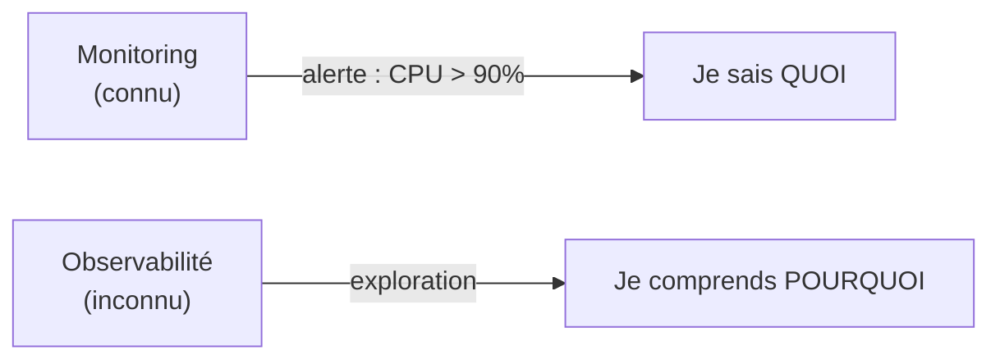
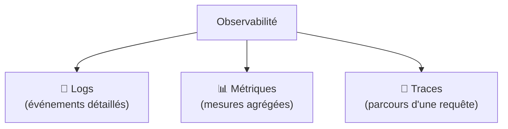
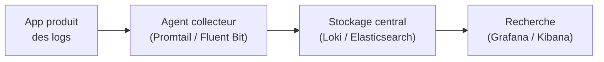
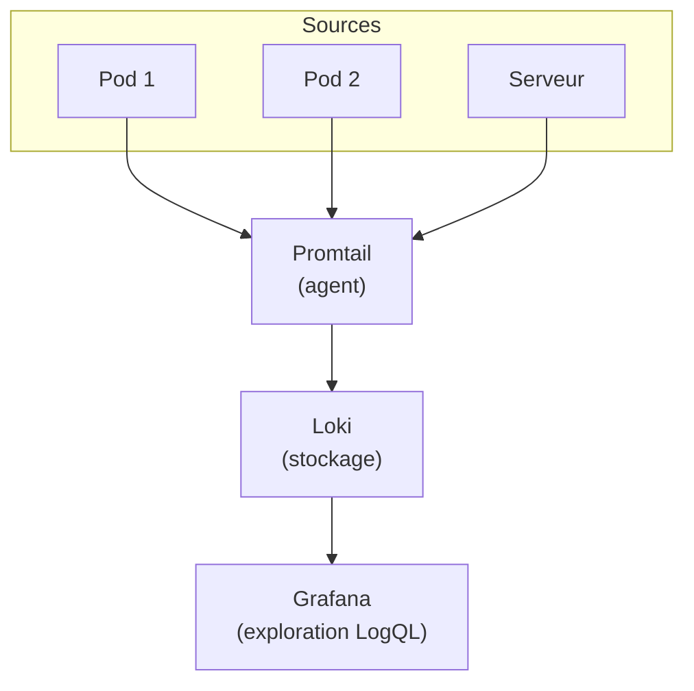
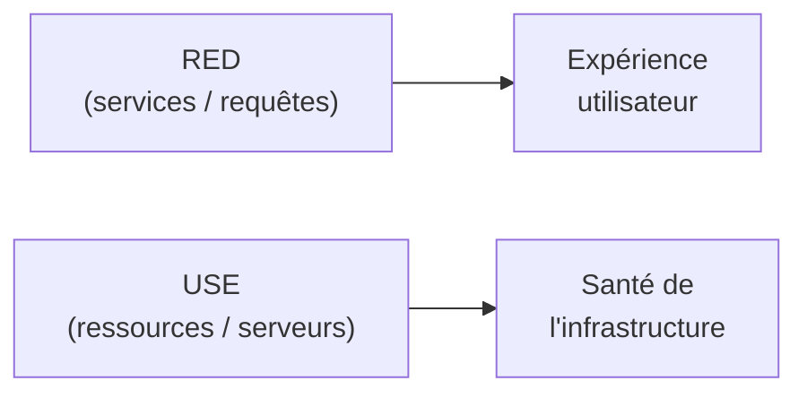
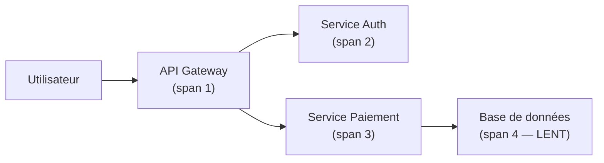
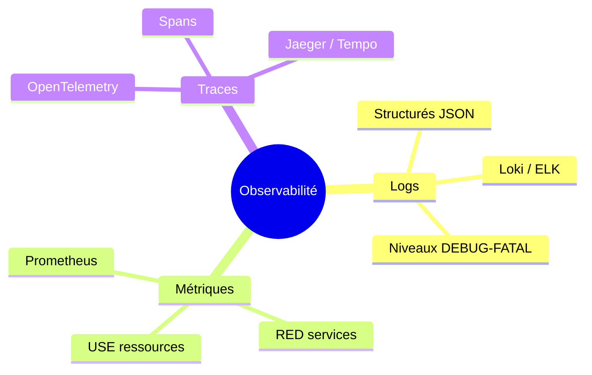

<a id="top"></a>

# 03 — Logs et métriques : les 3 piliers de l'observabilité

## Table des matières

| # | Section |
|---|---|
| 1 | [Monitoring vs observabilité](#section-1) |
| 2 | [Les 3 piliers : logs, métriques, traces](#section-2) |
| 3 | [Les logs en détail](#section-3) |
| 4 | [Centraliser les logs (Loki et ELK)](#section-4) |
| 5 | [Les métriques RED et USE](#section-5) |
| 6 | [Les traces distribuées](#section-6) |
| 7 | [Quiz — Les piliers de l'observabilité](#section-7) |
| 8 | [Pratique — Choisir le bon pilier](#section-8) |
| 9 | [Synthèse](#section-9) |

---

<a id="section-1"></a>

<details>
<summary>1 — Monitoring vs observabilité</summary>

<br/>

Les deux mots sont souvent confondus, mais ils ne disent pas la même chose.

| Terme | Question posée | Exemple |
|---|---|---|
| **Monitoring** | « Mon système va-t-il bien ? » (problèmes **connus**) | Le CPU dépasse-t-il 90 % ? |
| **Observabilité** | « **Pourquoi** mon système se comporte-t-il ainsi ? » (problèmes **inconnus**) | Pourquoi cette requête précise est-elle lente pour cet utilisateur ? |

> _Le monitoring répond à des questions qu'on a anticipées (des seuils, des tableaux de bord). L'observabilité permet de poser des questions **qu'on n'avait pas prévues**, en explorant les données. Un système observable se laisse interroger en profondeur._



L'observabilité repose sur trois types de données complémentaires : les **logs**, les **métriques** et les **traces**.

</details>

<p align="right"><a href="#top">↑ Retour en haut</a></p>

---

<a id="section-2"></a>

<details>
<summary>2 — Les 3 piliers : logs, métriques, traces</summary>

<br/>



| Pilier | Ce que c'est | Répond à | Outil typique |
|---|---|---|---|
| **Logs** | Messages texte horodatés d'événements | « Que s'est-il passé exactement ? » | Loki, ELK |
| **Métriques** | Mesures numériques agrégées dans le temps | « Combien ? À quel rythme ? » | Prometheus |
| **Traces** | Parcours d'une requête à travers les services | « Où est passé le temps ? » | Jaeger, Tempo |

### Comment ils se complètent

Imaginons une alerte « latence élevée » :

1. **Métrique** : la latence p95 a explosé à 14 h 02 → *on sait QUE c'est lent*.
2. **Trace** : on suit une requête lente et on voit que 90 % du temps est passé dans le service « paiement » → *on sait OÙ*.
3. **Log** : dans le service paiement, le log indique `timeout connexion base de données` → *on sait POURQUOI*.

> _Aucun pilier ne suffit seul. Les métriques détectent, les traces localisent, les logs expliquent. C'est leur combinaison qui rend un système véritablement observable._

</details>

<p align="right"><a href="#top">↑ Retour en haut</a></p>

---

<a id="section-3"></a>

<details>
<summary>3 — Les logs en détail</summary>

<br/>

Un **log** est un message horodaté décrivant un événement. C'est la forme la plus ancienne et la plus détaillée de télémétrie.

### Logs non structurés vs structurés

```bash
# Log non structuré (difficile à analyser par machine)
2026-06-09 14:02:11 ERROR Connexion à la base échouée pour user 4521
```

```json
// Log structuré (JSON : facile à filtrer et agréger)
{
  "timestamp": "2026-06-09T14:02:11Z",
  "level": "ERROR",
  "service": "paiement",
  "message": "Connexion à la base échouée",
  "user_id": 4521,
  "trace_id": "abc123"
}
```

> _Préférez toujours les logs **structurés** (JSON). Ils permettent de filtrer par champ (`level=ERROR`, `service=paiement`) au lieu de chercher du texte au hasard. Le champ `trace_id` fait le lien avec les traces — c'est la clé pour corréler les trois piliers._

**🔧 Mini-exercice —** Transforme ce log non structuré en JSON structuré : `2026-06-09 14:05:00 WARN quota presque atteint pour le tenant 88`.

<details>
<summary>✅ Voir une solution</summary>

```json
{ "timestamp": "2026-06-09T14:05:00Z", "level": "WARN", "message": "quota presque atteint", "tenant_id": 88 }
```

</details>

### Les niveaux de log

| Niveau | Quand l'utiliser |
|---|---|
| `DEBUG` | Détails techniques pour le développement |
| `INFO` | Événements normaux (démarrage, requête traitée) |
| `WARN` | Anomalie non bloquante (retry, quota proche) |
| `ERROR` | Échec d'une opération |
| `FATAL` | Erreur critique, le service s'arrête |



</details>

<p align="right"><a href="#top">↑ Retour en haut</a></p>

---

<a id="section-4"></a>

<details>
<summary>4 — Centraliser les logs (Loki et ELK)</summary>

<br/>

Sur des dizaines de serveurs et de conteneurs, lire les logs un par un est impossible. On les **centralise** dans un système de recherche unique.

### Les deux grandes solutions

| Critère | **Loki** (Grafana) | **ELK** (Elasticsearch + Logstash + Kibana) |
|---|---|---|
| Indexation | Étiquettes seulement (léger) | Texte complet (puissant, gourmand) |
| Coût ressources | Faible | Élevé |
| Intégration | Native avec Grafana | Kibana (UI dédiée) |
| Idéal pour | Cloud-native, Kubernetes | Recherche full-text avancée |



### La pile ELK

- **Elasticsearch** : moteur de recherche et stockage indexé.
- **Logstash** (ou **Beats / Fluent Bit**) : collecte et transforme les logs.
- **Kibana** : interface de recherche et de visualisation.

### Exemple de requête LogQL (Loki)

```logql
# Tous les logs ERROR du service paiement sur la période sélectionnée
{service="paiement"} |= "ERROR"

# Compter les erreurs par minute
sum(count_over_time({service="paiement"} |= "ERROR" [1m]))
```

> _Loki est surnommé « le Prometheus des logs » : il indexe uniquement les **étiquettes** (service, niveau…), pas le contenu complet. Résultat : beaucoup plus léger et économique, au prix d'une recherche full-text moins poussée que ELK._

**🔧 Mini-exercice —** Écris une requête LogQL qui affiche les logs du service `api` contenant le texte `timeout`.

<details>
<summary>✅ Voir une solution</summary>

```logql
{service="api"} |= "timeout"
```

</details>

</details>

<p align="right"><a href="#top">↑ Retour en haut</a></p>

---

<a id="section-5"></a>

<details>
<summary>5 — Les métriques RED et USE</summary>

<br/>

Quelles métriques surveiller en priorité ? Deux méthodes complémentaires guident le choix : **RED** (pour les services) et **USE** (pour les ressources).

### La méthode RED — pour les services (vu côté utilisateur)

| Lettre | Métrique | Question |
|---|---|---|
| **R**ate | Débit (requêtes/s) | Combien de requêtes ? |
| **E**rrors | Taux d'erreurs | Combien échouent ? |
| **D**uration | Latence | Combien de temps ça prend ? |

```promql
# R — Rate : requêtes par seconde
sum(rate(http_requests_total[5m]))

# E — Errors : taux d'erreurs 5xx
sum(rate(http_requests_total{status=~"5.."}[5m]))

# D — Duration : latence p95
histogram_quantile(0.95, rate(http_request_duration_seconds_bucket[5m]))
```

### La méthode USE — pour les ressources (CPU, disque, réseau)

| Lettre | Métrique | Question |
|---|---|---|
| **U**tilization | Taux d'utilisation | La ressource est-elle occupée ? |
| **S**aturation | Saturation (file d'attente) | Y a-t-il de l'attente ? |
| **E**rrors | Erreurs | Y a-t-il des erreurs matérielles ? |



> _Règle pratique : surveillez **RED** pour ce que vit l'utilisateur (vos API, vos services) et **USE** pour vos machines et ressources (CPU, mémoire, disque). Les deux ensemble couvrent l'essentiel._

**🔧 Mini-exercice —** Pour mesurer le « E » de RED (Errors), écris la requête PromQL du taux d'erreurs 5xx par seconde sur 5 min.

<details>
<summary>✅ Voir une solution</summary>

```promql
sum(rate(http_requests_total{status=~"5.."}[5m]))
```

</details>

</details>

<p align="right"><a href="#top">↑ Retour en haut</a></p>

---

<a id="section-6"></a>

<details>
<summary>6 — Les traces distribuées</summary>

<br/>

Dans une architecture **microservices**, une seule requête utilisateur traverse plusieurs services. Une **trace distribuée** suit ce parcours de bout en bout.



| Terme | Définition |
|---|---|
| **Trace** | Le parcours complet d'une requête (un `trace_id` unique) |
| **Span** | Une étape de ce parcours (un appel à un service) |
| **trace_id** | Identifiant partagé qui relie tous les spans (et les logs) |

### Le standard OpenTelemetry

**OpenTelemetry** (OTel) est le standard CNCF qui unifie la collecte des **traces, métriques et logs**. On instrumente l'application une fois, et on envoie vers l'outil de son choix (Jaeger, Tempo…).

```bash
# Lancer Jaeger (visualisation de traces) en conteneur
docker run -d --name jaeger -p 16686:16686 jaegertracing/all-in-one
# Interface : http://localhost:16686
```

> _Une trace répond à la question « **où** le temps est-il passé ? ». En voyant que le span « base de données » dure 9 secondes sur 10, on sait immédiatement où chercher — sans parcourir des milliers de lignes de logs._

</details>

<p align="right"><a href="#top">↑ Retour en haut</a></p>

---

<a id="section-7"></a>

<details>
<summary>7 — Quiz — Les piliers de l'observabilité</summary>

<br/>

**Question 1 :** Quelle est la différence entre monitoring et observabilité ?

a) Ce sont deux mots pour la même chose

b) Le monitoring répond à des questions connues, l'observabilité permet d'explorer des problèmes inconnus

c) L'observabilité ne concerne que les logs

d) Le monitoring est plus récent

<details>
<summary>💡 Voir la solution</summary>

✅ **Réponse : b)** — Le monitoring surveille des problèmes anticipés (seuils, dashboards) ; l'observabilité permet de poser des questions non prévues en explorant logs, métriques et traces.

</details>

---

**Question 2 :** Quels sont les 3 piliers de l'observabilité ?

a) Logs, métriques, traces

b) Dev, Ops, Sec

c) CPU, RAM, disque

d) Prometheus, Grafana, Loki

<details>
<summary>💡 Voir la solution</summary>

✅ **Réponse : a)** — Les trois piliers sont les **logs** (événements), les **métriques** (mesures agrégées) et les **traces** (parcours d'une requête). Ils sont complémentaires.

</details>

---

**Question 3 :** À quoi sert la méthode RED ?

a) À surveiller les ressources matérielles

b) À surveiller les services : Rate (débit), Errors (erreurs), Duration (latence)

c) À colorer les dashboards en rouge

d) À chiffrer les logs

<details>
<summary>💡 Voir la solution</summary>

✅ **Réponse : b)** — RED = **R**ate, **E**rrors, **D**uration. C'est la méthode de référence pour surveiller un service du point de vue de l'utilisateur. USE concerne les ressources.

</details>

---

**Question 4 :** Pourquoi préférer des logs structurés (JSON) ?

a) Ils prennent moins de place sur le disque

b) Ils permettent de filtrer et agréger par champ au lieu de chercher du texte

c) Ils sont obligatoires en Kubernetes

d) Ils sont plus jolis

<details>
<summary>💡 Voir la solution</summary>

✅ **Réponse : b)** — Le JSON structuré permet de filtrer précisément (`level=ERROR`, `service=paiement`) et d'inclure un `trace_id` pour corréler avec les traces.

</details>

---

**Question 5 :** Quel pilier répond le mieux à « où le temps est-il passé dans cette requête ? »

a) Les métriques

b) Les logs

c) Les traces distribuées

d) Aucun

<details>
<summary>💡 Voir la solution</summary>

✅ **Réponse : c)** — Une trace suit la requête à travers tous les services (spans) et montre où le temps a été consommé. C'est exactement son rôle.

</details>

</details>

<p align="right"><a href="#top">↑ Retour en haut</a></p>

---

<a id="section-8"></a>

<details>
<summary>8 — Pratique — Choisir le bon pilier</summary>

<br/>

### Consigne

Pour chacune des situations suivantes, indiquez **quel pilier** (logs, métriques ou traces) utiliser en priorité, et **pourquoi**. Donnez aussi une **requête** ou un **champ** concret pour le premier cas.

1. « Le taux d'erreurs de l'API a-t-il augmenté cette dernière heure ? »
2. « Pourquoi cette requête utilisateur précise a-t-elle planté ? »
3. « Dans quel microservice ma requête lente perd-elle 8 secondes ? »

---

### Correction

| Situation | Pilier | Pourquoi |
|---|---|---|
| 1. Taux d'erreurs en hausse ? | **Métriques** | Agrégation chiffrée dans le temps |
| 2. Pourquoi cette requête a planté ? | **Logs** | Détail de l'événement + message d'erreur |
| 3. Où la requête perd 8 s ? | **Traces** | Décomposition par span/service |

**Requête PromQL pour le cas 1 (métriques RED — Errors) :**

```promql
sum(rate(http_requests_total{status=~"5.."}[1h]))
  / sum(rate(http_requests_total[1h])) * 100
```

**Pour le cas 2 (logs)**, on filtre par le `trace_id` ou l'`user_id` de la requête fautive :

```logql
{service="api"} | json | level="ERROR" | user_id="4521"
```

**Résultat attendu :** vous démontrez que les trois piliers sont **complémentaires** — la métrique détecte la hausse d'erreurs, la trace localise le service fautif, le log explique la cause exacte.

> _Le réflexe professionnel : métrique → trace → log. On détecte avec les métriques, on localise avec les traces, on explique avec les logs._

</details>

<p align="right"><a href="#top">↑ Retour en haut</a></p>

---

<a id="section-9"></a>

<details>
<summary>9 — Synthèse</summary>

<br/>

#### Points à retenir

1. **Monitoring** = problèmes connus ; **observabilité** = explorer l'inconnu.
2. Les **3 piliers** : **logs** (événements), **métriques** (mesures), **traces** (parcours).
3. Préférez les **logs structurés** (JSON) et centralisez-les (Loki ou ELK).
4. **Loki** est léger (indexe les étiquettes) ; **ELK** est puissant (full-text).
5. **RED** surveille les services (Rate, Errors, Duration) ; **USE** les ressources.
6. Les **traces** (OpenTelemetry, Jaeger) montrent où le temps est passé.
7. Réflexe : **métrique → trace → log** (détecter, localiser, expliquer).



#### La suite

On sait collecter, visualiser et comprendre. Reste à être **prévenu automatiquement** quand ça va mal : leçon **04 — Alertes avec Alertmanager**.

</details>

<p align="right"><a href="#top">↑ Retour en haut</a></p>

---

<p align="center">
  <em>Tous droits réservés. Toute reproduction, diffusion, utilisation ou adaptation de ce cours, en tout ou en partie, est strictement interdite sans l'autorisation écrite préalable de Dr. Haythem REHOUMA.</em>
</p>

<p align="center">
  <strong>Cours créé par Dr. Haythem REHOUMA — Développement et déploiement de solutions de données</strong>
</p>
