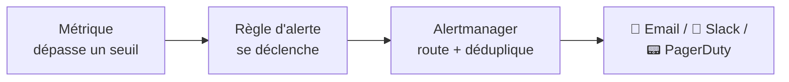
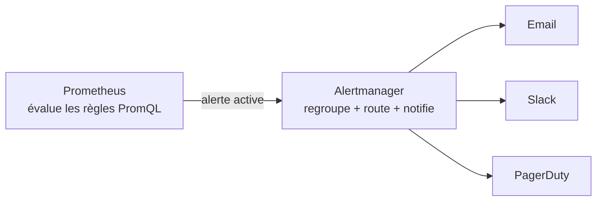
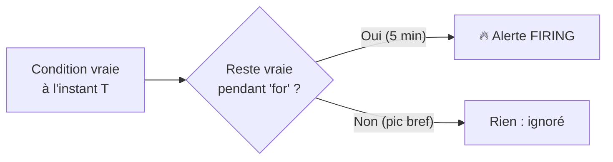
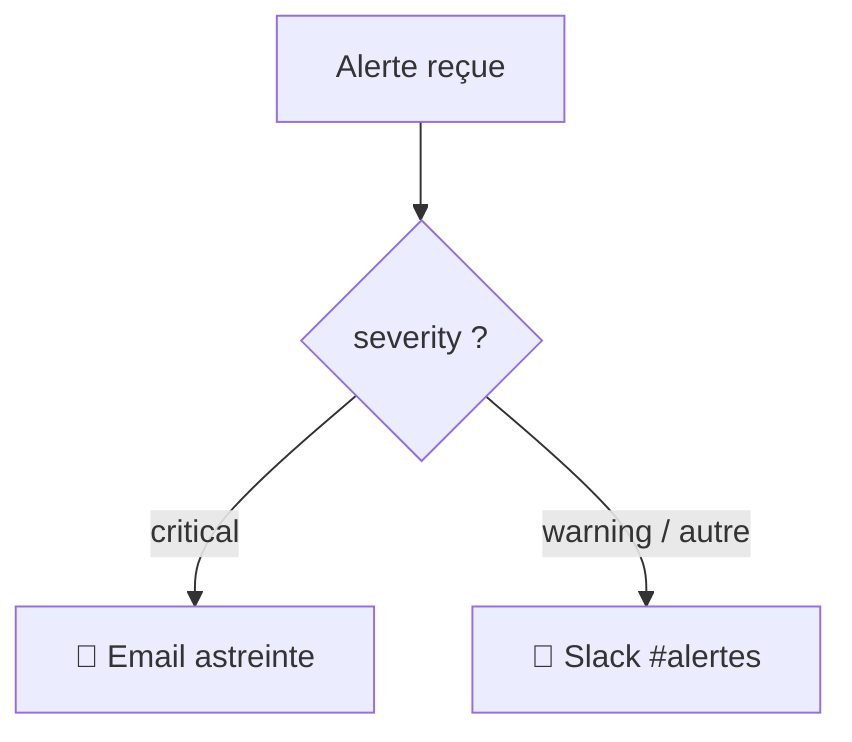
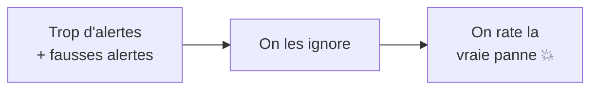
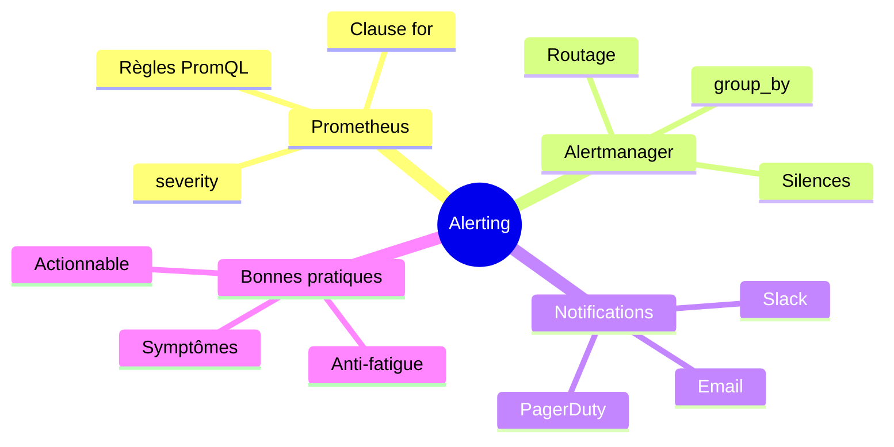

<a id="top"></a>

# 04 — Alertes avec Alertmanager

## Table des matières

| # | Section |
|---|---|
| 1 | [Pourquoi alerter ?](#section-1) |
| 2 | [La chaîne d'alerte : Prometheus + Alertmanager](#section-2) |
| 3 | [Écrire des règles d'alerte (PromQL)](#section-3) |
| 4 | [Seuils, durée et sévérité](#section-4) |
| 5 | [Routage et notifications (email, Slack)](#section-5) |
| 6 | [Éviter la fatigue d'alerte](#section-6) |
| 7 | [Quiz — Les alertes](#section-7) |
| 8 | [Pratique — Écrire une règle d'alerte](#section-8) |
| 9 | [Synthèse](#section-9) |

---

<a id="section-1"></a>

<details>
<summary>1 — Pourquoi alerter ?</summary>

<br/>

Collecter des métriques et construire de beaux dashboards ne sert à rien si **personne ne regarde l'écran à 3 h du matin**. Une **alerte** prévient automatiquement la bonne personne quand quelque chose ne va pas.

> _Le but d'une alerte n'est pas de dire « regarde ton dashboard », mais « **un humain doit agir maintenant** ». Une bonne alerte est actionnable : elle indique un problème réel et ce qu'il faut faire._



| Sans alerte | Avec alerte |
|---|---|
| On découvre la panne via les clients | On est prévenu avant les clients |
| Surveillance manuelle 24/7 impossible | La machine surveille en continu |
| Réaction tardive | Réaction immédiate |

</details>

<p align="right"><a href="#top">↑ Retour en haut</a></p>

---

<a id="section-2"></a>

<details>
<summary>2 — La chaîne d'alerte : Prometheus + Alertmanager</summary>

<br/>

L'alerting se fait en **deux composants séparés**, chacun avec son rôle :



| Composant | Rôle |
|---|---|
| **Prometheus** | Évalue les **règles** : *quand* une condition est vraie, il génère une alerte |
| **Alertmanager** | Reçoit les alertes : il les **regroupe**, **déduplique**, **route** et **notifie** |

> _Séparation claire : Prometheus décide **si** une alerte doit exister (la logique métier). Alertmanager décide **à qui** et **comment** la notifier (le routage). Ne mélangez jamais ces deux responsabilités._

### Brancher Alertmanager dans Prometheus

```yaml
# prometheus.yml
alerting:
  alertmanagers:
    - static_configs:
        - targets: ["alertmanager:9093"]

rule_files:
  - "alert_rules.yml"      # le fichier de règles
```

</details>

<p align="right"><a href="#top">↑ Retour en haut</a></p>

---

<a id="section-3"></a>

<details>
<summary>3 — Écrire des règles d'alerte (PromQL)</summary>

<br/>

Une **règle d'alerte** est une expression **PromQL** qui, quand elle renvoie un résultat, déclenche l'alerte. Les règles sont regroupées dans un fichier `alert_rules.yml`.

```yaml
# alert_rules.yml
groups:
  - name: exemples-alertes
    rules:
      - alert: ServiceDown
        expr: up == 0
        for: 1m
        labels:
          severity: critical
        annotations:
          summary: "La cible {{ $labels.instance }} est DOWN"
          description: "{{ $labels.job }} ne répond plus depuis 1 minute."

      - alert: ErreursHTTPElevees
        expr: |
          sum(rate(http_requests_total{status=~"5.."}[5m]))
            / sum(rate(http_requests_total[5m])) > 0.05
        for: 5m
        labels:
          severity: warning
        annotations:
          summary: "Taux d'erreurs 5xx > 5 %"
          description: "Le taux d'erreurs serveur dépasse 5 % depuis 5 minutes."
```

| Champ | Rôle |
|---|---|
| `alert` | Nom de l'alerte |
| `expr` | Condition PromQL ; alerte active si elle renvoie un résultat |
| `for` | Durée pendant laquelle la condition doit rester vraie |
| `labels` | Étiquettes (dont `severity`) pour le routage |
| `annotations` | Messages lisibles (`{{ $labels.x }}` interpole les valeurs) |

```bash
# Valider les règles avant de les charger
promtool check rules alert_rules.yml
```

> _`up == 0` est la règle la plus fondamentale : `up` est une métrique automatique de Prometheus qui vaut 1 si la cible répond, 0 sinon. Cette seule règle détecte n'importe quel service tombé._

**🔧 Mini-exercice —** Écris l'expression `expr` d'une règle qui se déclenche quand l'utilisation CPU d'une instance dépasse 80 % (métrique `instance:cpu_usage:percent`).

<details>
<summary>✅ Voir une solution</summary>

```yaml
expr: instance:cpu_usage:percent > 80
```

</details>

</details>

<p align="right"><a href="#top">↑ Retour en haut</a></p>

---

<a id="section-4"></a>

<details>
<summary>4 — Seuils, durée et sévérité</summary>

<br/>

Une bonne alerte combine **un seuil pertinent**, **une durée** (`for`) et **une sévérité**.

### La clause `for` : éviter les fausses alertes



Sans `for`, un pic momentané (CPU à 95 % pendant 2 secondes) déclencherait une alerte inutile. La clause `for: 5m` exige que la condition reste vraie **pendant 5 minutes** avant de notifier.

### Les niveaux de sévérité

| Sévérité | Signification | Action attendue |
|---|---|---|
| `critical` | Le service est cassé ou va l'être | Réveiller quelqu'un (astreinte) |
| `warning` | Tendance préoccupante | Regarder dans la journée |
| `info` | Information, pas d'action | Pour contexte seulement |

### Choisir un bon seuil

```yaml
# Disque presque plein — alerte AVANT la saturation
- alert: DisquePresquePlein
  expr: |
    (node_filesystem_avail_bytes / node_filesystem_size_bytes) * 100 < 15
  for: 10m
  labels:
    severity: warning
  annotations:
    summary: "Espace disque < 15 % sur {{ $labels.instance }}"
```

> _Alertez sur les **symptômes** (« les utilisateurs reçoivent des erreurs », « le disque va saturer ») plutôt que sur les **causes** (« le CPU est à 80 % »). Un CPU élevé n'est pas un problème s'il sert vraiment à quelque chose._

**🔧 Mini-exercice —** Quelle sévérité (`critical`, `warning` ou `info`) attribuerais-tu à une alerte « certificat TLS expire dans 20 jours » ? Justifie en une phrase.

<details>
<summary>✅ Voir une solution</summary>

`warning` : c'est une tendance préoccupante à traiter dans la journée, pas une panne qui justifie de réveiller quelqu'un.

</details>

</details>

<p align="right"><a href="#top">↑ Retour en haut</a></p>

---

<a id="section-5"></a>

<details>
<summary>5 — Routage et notifications (email, Slack)</summary>

<br/>

Le routage se configure dans **`alertmanager.yml`**. Il décide **quelle alerte** part **vers quel canal** selon ses étiquettes.

```yaml
# alertmanager.yml
route:
  receiver: "equipe-defaut"
  group_by: ["alertname", "service"]
  group_wait: 30s            # attendre 30s pour regrouper les alertes liées
  group_interval: 5m
  repeat_interval: 4h        # ne pas re-notifier avant 4h
  routes:
    - match:
        severity: critical   # les critical vont vers PagerDuty
      receiver: "astreinte-pagerduty"

receivers:
  - name: "equipe-defaut"
    slack_configs:
      - api_url: "https://hooks.slack.com/services/XXX/YYY/ZZZ"
        channel: "#alertes"
        title: "{{ .CommonAnnotations.summary }}"

  - name: "astreinte-pagerduty"
    email_configs:
      - to: "astreinte@entreprise.com"
        from: "alertes@entreprise.com"
        smarthost: "smtp.entreprise.com:587"
```



| Concept | Rôle |
|---|---|
| `route` | Arbre de décision principal |
| `match` | Filtre par étiquette (ex. `severity: critical`) |
| `group_by` | Regroupe les alertes similaires en une seule notification |
| `repeat_interval` | Évite de spammer en re-notifiant trop souvent |
| `receivers` | Les destinations (Slack, email, PagerDuty…) |

> _Le **regroupement** (`group_by`) est essentiel : si 50 serveurs tombent en même temps, on reçoit **une seule** notification groupée, pas 50. C'est ce qui rend Alertmanager indispensable._

**🔧 Mini-exercice —** Ajoute dans `route` une sous-route qui envoie toutes les alertes portant l'étiquette `team: data` vers le receiver `slack-data`.

<details>
<summary>✅ Voir une solution</summary>

```yaml
    - match:
        team: data
      receiver: "slack-data"
```

</details>

</details>

<p align="right"><a href="#top">↑ Retour en haut</a></p>

---

<a id="section-6"></a>

<details>
<summary>6 — Éviter la fatigue d'alerte</summary>

<br/>

La **fatigue d'alerte** (*alert fatigue*) survient quand on reçoit trop d'alertes, surtout des fausses. On finit par toutes les ignorer — y compris la vraie qui compte.



### Les bonnes pratiques

| Pratique | Pourquoi |
|---|---|
| **Alerter sur les symptômes** | Pertinent pour l'utilisateur, pas du bruit technique |
| **Utiliser `for`** | Élimine les pics passagers |
| **Rendre chaque alerte actionnable** | Si rien à faire, ce n'est pas une alerte |
| **Regrouper** (`group_by`) | Une notification au lieu de cent |
| **Mettre en sourdine** (*silence*) | Pendant une maintenance planifiée |
| **Réviser régulièrement** | Supprimer les alertes jamais utiles |

### Mettre une alerte en silence

```bash
# Faire taire les alertes d'un service pendant une maintenance (via amtool)
amtool silence add service="paiement" \
  --duration="2h" --comment="Maintenance planifiée"
```

> _Test simple de qualité : pour chaque alerte, demandez-vous « **si elle se déclenche à 3 h du matin, dois-je me lever ?** ». Si la réponse est non, ce n'est pas une alerte `critical` — passez-la en `warning` ou supprimez-la._

**🔧 Mini-exercice —** Écris la commande `amtool` qui met en silence pendant 1 h les alertes de l'instance `web-01` durant un redémarrage.

<details>
<summary>✅ Voir une solution</summary>

```bash
amtool silence add instance="web-01" --duration="1h" --comment="Redémarrage"
```

</details>

</details>

<p align="right"><a href="#top">↑ Retour en haut</a></p>

---

<a id="section-7"></a>

<details>
<summary>7 — Quiz — Les alertes</summary>

<br/>

**Question 1 :** Quel composant route et notifie les alertes ?

a) Prometheus

b) Grafana

c) Alertmanager

d) node_exporter

<details>
<summary>💡 Voir la solution</summary>

✅ **Réponse : c)** — Prometheus **évalue** les règles et génère les alertes ; **Alertmanager** les regroupe, déduplique, route et notifie (email, Slack, PagerDuty).

</details>

---

**Question 2 :** À quoi sert la clause `for: 5m` dans une règle d'alerte ?

a) À répéter l'alerte toutes les 5 minutes

b) À exiger que la condition reste vraie 5 minutes avant de déclencher

c) À attendre 5 minutes avant de collecter

d) À supprimer l'alerte après 5 minutes

<details>
<summary>💡 Voir la solution</summary>

✅ **Réponse : b)** — `for` impose une durée pendant laquelle la condition doit rester vraie, évitant les fausses alertes dues à des pics brefs.

</details>

---

**Question 3 :** Que détecte la règle `up == 0` ?

a) Un CPU à 0 %

b) Une cible qui ne répond plus (service down)

c) Un disque vide

d) Zéro requête HTTP

<details>
<summary>💡 Voir la solution</summary>

✅ **Réponse : b)** — `up` est une métrique automatique valant 1 si la cible répond et 0 sinon. `up == 0` détecte donc tout service tombé.

</details>

---

**Question 4 :** Pourquoi regrouper les alertes (`group_by`) ?

a) Pour les chiffrer

b) Pour recevoir une seule notification au lieu de cent quand un problème touche beaucoup de cibles

c) Pour les supprimer

d) Pour ralentir Prometheus

<details>
<summary>💡 Voir la solution</summary>

✅ **Réponse : b)** — Le regroupement condense les alertes liées en une notification unique, ce qui réduit le bruit et la fatigue d'alerte.

</details>

---

**Question 5 :** Quelle est la meilleure pratique pour éviter la fatigue d'alerte ?

a) Alerter sur tout, au cas où

b) Alerter sur les symptômes actionnables et utiliser `for`

c) Désactiver toutes les alertes

d) Envoyer chaque alerte à toute l'entreprise

<details>
<summary>💡 Voir la solution</summary>

✅ **Réponse : b)** — Des alertes basées sur les symptômes, actionnables, avec une clause `for`, restent pertinentes. Trop d'alertes mène à les ignorer toutes.

</details>

</details>

<p align="right"><a href="#top">↑ Retour en haut</a></p>

---

<a id="section-8"></a>

<details>
<summary>8 — Pratique — Écrire une règle d'alerte</summary>

<br/>

### Consigne

Écrivez une **règle d'alerte** Prometheus complète qui se déclenche quand l'**utilisation mémoire d'une machine dépasse 90 %** pendant **plus de 10 minutes**, avec une sévérité `warning` et un message clair. Ajoutez l'extrait `alertmanager.yml` pour router cette alerte vers le canal Slack **#infra**.

Les métriques disponibles : `node_memory_MemAvailable_bytes` et `node_memory_MemTotal_bytes`.

---

### Correction

**1. La règle dans `alert_rules.yml` :**

```yaml
groups:
  - name: memoire
    rules:
      - alert: MemoireElevee
        expr: |
          (1 - (node_memory_MemAvailable_bytes / node_memory_MemTotal_bytes)) * 100 > 90
        for: 10m
        labels:
          severity: warning
        annotations:
          summary: "Mémoire > 90 % sur {{ $labels.instance }}"
          description: "L'utilisation mémoire dépasse 90 % depuis 10 minutes."
```

**2. Le routage dans `alertmanager.yml` :**

```yaml
route:
  receiver: "slack-infra"
  routes:
    - match:
        severity: warning
      receiver: "slack-infra"

receivers:
  - name: "slack-infra"
    slack_configs:
      - api_url: "https://hooks.slack.com/services/XXX/YYY/ZZZ"
        channel: "#infra"
        title: "{{ .CommonAnnotations.summary }}"
```

**Résultat attendu :** dès qu'une machine dépasse 90 % de mémoire pendant 10 minutes, une notification arrive dans **#infra** avec le nom de l'instance concernée. Validation :

```bash
promtool check rules alert_rules.yml
```

> _Le calcul `(1 - MemAvailable / MemTotal) * 100` donne le pourcentage **utilisé**. On part de la mémoire disponible (la plus fiable) plutôt que de `MemFree`, qui ignore les caches récupérables._

</details>

<p align="right"><a href="#top">↑ Retour en haut</a></p>

---

<a id="section-9"></a>

<details>
<summary>9 — Synthèse</summary>

<br/>

#### Points à retenir

1. Une alerte doit être **actionnable** : « un humain doit agir maintenant ».
2. **Prometheus évalue** les règles ; **Alertmanager route et notifie**.
3. Une **règle** = une expression PromQL + `for` + `labels` + `annotations`.
4. La clause **`for`** évite les fausses alertes dues aux pics brefs.
5. La **sévérité** (`critical`, `warning`, `info`) guide le routage.
6. Alertmanager **regroupe** et **route** vers email, Slack, PagerDuty.
7. Contre la **fatigue d'alerte** : alerter sur les symptômes, regrouper, réviser.



#### La suite

Ce module clôt le pilier **observabilité** du cours. Vous savez désormais **collecter** (Prometheus), **visualiser** (Grafana), **comprendre** (les 3 piliers) et **réagir** (Alertmanager). Direction le module suivant pour poursuivre votre parcours DevOps.

</details>

<p align="right"><a href="#top">↑ Retour en haut</a></p>

---

<p align="center">
  <em>Tous droits réservés. Toute reproduction, diffusion, utilisation ou adaptation de ce cours, en tout ou en partie, est strictement interdite sans l'autorisation écrite préalable de Dr. Haythem REHOUMA.</em>
</p>

<p align="center">
  <strong>Cours créé par Dr. Haythem REHOUMA — Développement et déploiement de solutions de données</strong>
</p>
