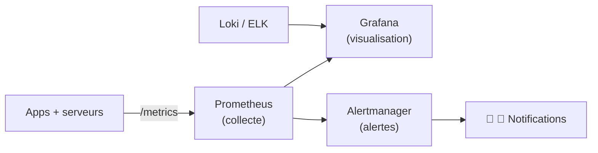

# Module 13 — Monitoring et observabilité

Module dédié à la **surveillance** des systèmes du cours **Développement et déploiement de solutions de données** (420-D30-BB).
Après avoir appris à construire et déployer des applications, on apprend ici à **savoir comment elles se comportent en production** : collecter des métriques, les visualiser, comprendre les logs et les traces, puis être alerté automatiquement quand quelque chose ne va pas.

## Objectifs

À la fin de ce module, vous serez capable de :

- Expliquer le **modèle pull** de **Prometheus** et configurer le **scraping** de cibles.
- Écrire des requêtes **PromQL** de base (`rate`, `sum`, `histogram_quantile`).
- Construire des **dashboards** et des **panels** dans **Grafana** avec des variables.
- Distinguer les **3 piliers de l'observabilité** : logs, métriques, traces.
- Centraliser les logs (**Loki** / **ELK**) et appliquer les méthodes **RED** et **USE**.
- Mettre en place des **alertes** avec **Alertmanager** et éviter la **fatigue d'alerte**.

## Contenu

| # | Leçon | Thèmes |
|---|---|---|
| 01 | [Prometheus](01-prometheus.md) | Modèle pull, séries temporelles, exporters, `prometheus.yml`, PromQL, Kubernetes |
| 02 | [Grafana](02-grafana.md) | Sources de données, dashboards, panels, variables, import/export, partage |
| 03 | [Logs et métriques](03-logs-et-metriques.md) | 3 piliers, logs structurés, Loki/ELK, méthodes RED & USE, traces |
| 04 | [Alertes](04-alertes.md) | Alertmanager, règles PromQL, seuils, routage email/Slack, anti-fatigue |

## Format des leçons

Chaque leçon est autonome et suit la même structure pédagogique :

- une **table des matières** cliquable ;
- des **sections repliables** (`
`) avec diagrammes **Mermaid** ;
- des exemples concrets (YAML `prometheus.yml`, règles d'alerte, requêtes PromQL, bash) ;
- un **quiz** corrigé (solutions repliables) ;
- une **pratique** obligatoire avec correction détaillée ;
- une **synthèse** des points à retenir.

## La pile d'observabilité

---

  <strong>Cours créé par Dr. Haythem REHOUMA — Développement et déploiement de solutions de données</strong>

