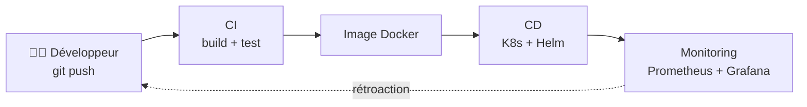
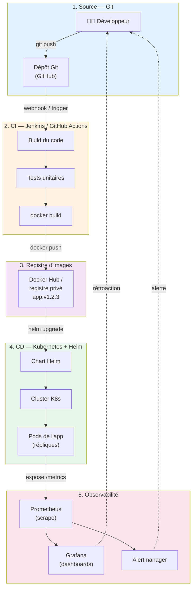
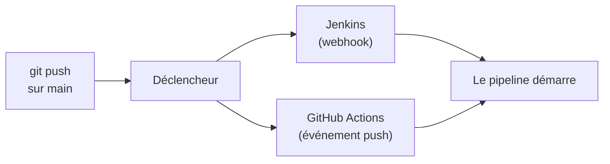
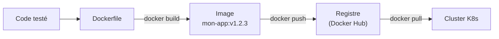
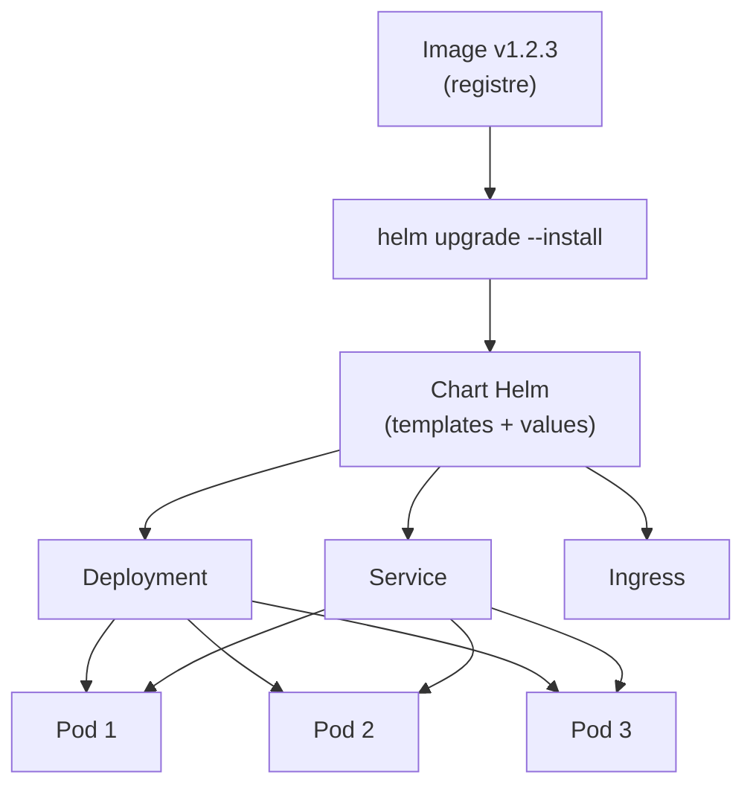
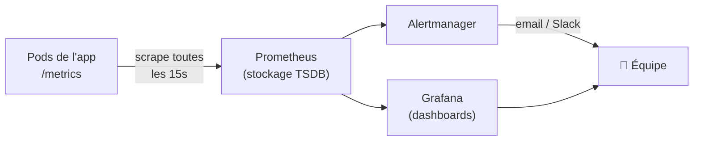
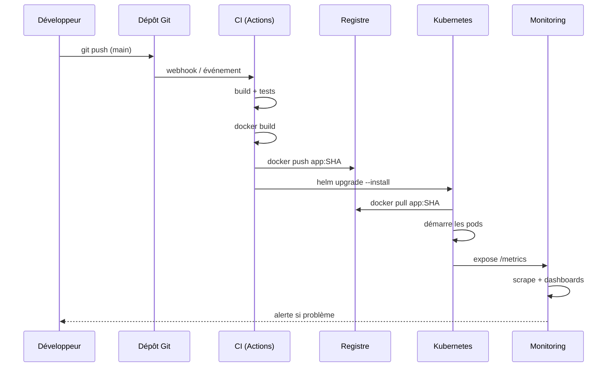
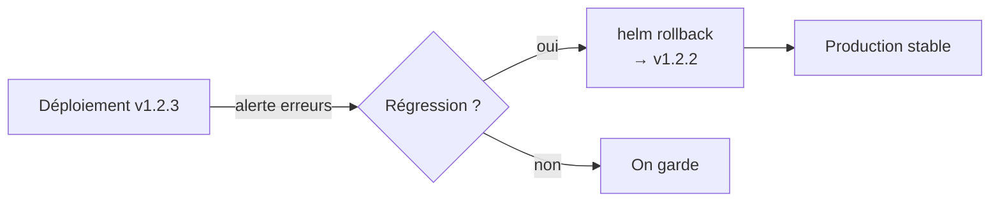
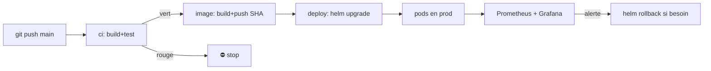
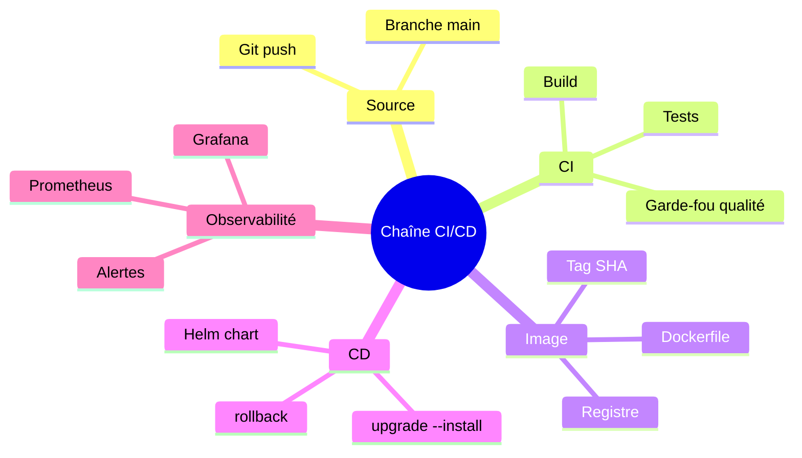

<a id="top"></a>

# 01 — Atelier : assembler une chaîne CI/CD complète de bout en bout

## Table des matières

| # | Section |
|---|---|
| 1 | [De Git au monitoring — la vision d'ensemble](#section-1) |
| 2 | [Le schéma global d'architecture](#section-2) |
| 3 | [Étape A — Déclenchement depuis Git (Jenkins ou GitHub Actions)](#section-3) |
| 4 | [Étape B — Docker : construire et pousser l'image](#section-4) |
| 5 | [Étape C — Kubernetes et Helm : déployer l'application](#section-5) |
| 6 | [Étape D — Monitoring : Prometheus et Grafana](#section-6) |
| 7 | [Relier le tout — le pipeline complet](#section-7) |
| 8 | [Bonnes pratiques et pièges d'intégration](#section-8) |
| 9 | [Quiz — La chaîne CI/CD complète](#section-9) |
| 10 | [Pratique obligatoire — Construire la chaîne de bout en bout](#section-10) |
| 11 | [Synthèse](#section-11) |

---

<a id="section-1"></a>

<details>
<summary>1 — De Git au monitoring — la vision d'ensemble</summary>

<br/>

Cet atelier est le **point de convergence** de tout le cours. Jusqu'ici, vous avez appris chaque outil **séparément** : Git (module 01), Jenkins et GitHub Actions (modules 04-05, 10), Docker (module 06), Kubernetes et Helm (modules 07-09), le monitoring (module 13). L'objectif est maintenant de les **assembler en une seule chaîne automatisée** : un développeur pousse du code, et **quelques minutes plus tard**, la nouvelle version tourne en production et est surveillée — **sans aucune intervention manuelle**.

> _Une chaîne CI/CD complète, c'est comme une chaîne de montage automobile : chaque poste (build, test, image, déploiement) fait son travail et passe le relais au suivant. Si un poste échoue, la chaîne s'arrête et alerte. Le but : transformer un `git push` en une mise en production fiable et reproductible._

**Les quatre maillons de la chaîne :**

| Maillon | Rôle | Outils du cours |
|---|---|---|
| **CI (Intégration continue)** | Détecter le push, compiler, tester | Git → Jenkins / GitHub Actions |
| **Empaquetage** | Construire une image et la stocker | Docker → Docker Hub / registre |
| **CD (Déploiement continu)** | Déployer l'image sur le cluster | Kubernetes + Helm |
| **Observabilité** | Surveiller la santé de l'application | Prometheus + Grafana |



**Le vocabulaire à fixer :**

- **CI** (*Continuous Integration*) : à chaque commit, le code est automatiquement compilé et testé.
- **CD** (*Continuous Delivery / Deployment*) : la version validée est automatiquement préparée puis déployée.
- **Pipeline** : la suite ordonnée d'étapes (*stages*) qui relie le commit à la production.
- **Artefact** : ce que produit le build et qu'on déploie — ici, une **image Docker**.

**🔧 Mini-exercice —** Cite, dans l'ordre, les quatre maillons de la chaîne CI/CD complète.

<details>
<summary>✅ Voir une solution</summary>

CI (build + test) → Empaquetage (image Docker dans un registre) → CD (déploiement K8s + Helm) → Observabilité (Prometheus + Grafana).

</details>

</details>

<p align="right"><a href="#top">↑ Retour en haut</a></p>

---

<a id="section-2"></a>

<details>
<summary>2 — Le schéma global d'architecture</summary>

<br/>

Voici le **schéma global** de la chaîne complète que vous allez construire. Gardez-le sous les yeux pendant tout l'atelier : chaque section suivante détaille un bloc de ce diagramme.



**Lecture du schéma de haut en bas :**

| Bloc | Entrée | Sortie |
|---|---|---|
| **1. Source** | Code du développeur | Un nouveau commit dans le dépôt |
| **2. CI** | Le commit (via webhook) | Une image Docker construite et testée |
| **3. Registre** | L'image construite | Une image versionnée et stockée (`app:v1.2.3`) |
| **4. CD** | L'image du registre | Des pods qui tournent dans le cluster |
| **5. Observabilité** | Les métriques des pods | Tableaux de bord + alertes |

> _Remarquez la boucle de rétroaction (flèches en pointillés) : le monitoring renvoie l'information au développeur. C'est la boucle infinie DevOps vue au module 01, mais cette fois entièrement outillée et automatisée._

**🔧 Mini-exercice —** Dans le schéma, quelle est l'entrée du bloc « 4. CD » et quelle est sa sortie ?

<details>
<summary>✅ Voir une solution</summary>

Entrée : l'image versionnée du registre (`app:v1.2.3`). Sortie : des pods qui tournent dans le cluster Kubernetes.

</details>

</details>

<p align="right"><a href="#top">↑ Retour en haut</a></p>

---

<a id="section-3"></a>

<details>
<summary>3 — Étape A — Déclenchement depuis Git (Jenkins ou GitHub Actions)</summary>

<br/>

Tout commence par un **`git push`**. Le dépôt Git notifie l'outil de CI qu'il y a du nouveau code, et le pipeline démarre **automatiquement**. Vous avez deux options selon les modules précédents.



**Option 1 — Jenkins (via un `Jenkinsfile` à la racine du dépôt) :**

```groovy
// Jenkinsfile — pipeline déclaratif
pipeline {
    agent any

    environment {
        IMAGE  = "monorg/mon-app"
        TAG    = "${env.BUILD_NUMBER}"   // version unique par build
    }

    stages {
        stage('Checkout') {
            steps {
                git branch: 'main', url: 'https://github.com/monorg/mon-app.git'
            }
        }
        stage('Build & Test') {
            steps {
                sh 'npm install'
                sh 'npm test'            // les tests doivent passer
            }
        }
        stage('Build image Docker') {
            steps {
                sh "docker build -t ${IMAGE}:${TAG} ."
            }
        }
    }

    post {
        failure {
            echo 'Le pipeline a échoué — déploiement annulé.'
        }
    }
}
```

**Option 2 — GitHub Actions (fichier `.github/workflows/ci-cd.yml`) :**

```yaml
name: CI-CD
on:
  push:
    branches: [ main ]          # déclenchement sur push vers main

jobs:
  build-test:
    runs-on: ubuntu-latest
    steps:
      - uses: actions/checkout@v4
      - name: Installer les dépendances
        run: npm install
      - name: Lancer les tests
        run: npm test
```

| Critère | Jenkins | GitHub Actions |
|---|---|---|
| Hébergement | Serveur à gérer soi-même | Intégré à GitHub (SaaS) |
| Configuration | `Jenkinsfile` (Groovy) | `.yml` dans `.github/workflows/` |
| Déclenchement | Webhook GitHub → Jenkins | Événement natif `on: push` |
| Idéal pour | Infrastructure interne | Projets déjà sur GitHub |

> _Le principe est identique dans les deux cas : un push déclenche un pipeline qui **compile** puis **teste**. Si les tests échouent, la chaîne s'arrête ici — on ne construit ni ne déploie jamais du code cassé. C'est la première barrière de qualité._

**🔧 Mini-exercice —** Dans un workflow GitHub Actions, écris la clé qui déclenche le pipeline uniquement sur un `push` vers la branche `main`.

<details>
<summary>✅ Voir une solution</summary>

```yaml
on:
  push:
    branches: [ main ]
```

</details>

</details>

<p align="right"><a href="#top">↑ Retour en haut</a></p>

---

<a id="section-4"></a>

<details>
<summary>4 — Étape B — Docker : construire et pousser l'image</summary>

<br/>

Une fois le code testé, on l'**empaquette** dans une image Docker — un colis autonome contenant l'application et toutes ses dépendances. Cette image est ensuite **poussée vers un registre** (Docker Hub ou un registre privé) pour être accessible au cluster.



**Le `Dockerfile` (multi-étapes pour une image légère) :**

```dockerfile
# --- Étape de build ---
FROM node:20-alpine AS build
WORKDIR /app
COPY package*.json ./
RUN npm ci
COPY . .
RUN npm run build

# --- Étape finale (image minimale) ---
FROM node:20-alpine
WORKDIR /app
COPY --from=build /app/dist ./dist
COPY --from=build /app/node_modules ./node_modules
EXPOSE 3000
CMD ["node", "dist/server.js"]
```

**Construire et pousser, ajouté au pipeline (GitHub Actions) :**

```yaml
  build-push-image:
    needs: build-test          # ne s'exécute que si les tests passent
    runs-on: ubuntu-latest
    steps:
      - uses: actions/checkout@v4
      - name: Connexion à Docker Hub
        uses: docker/login-action@v3
        with:
          username: ${{ secrets.DOCKERHUB_USER }}
          password: ${{ secrets.DOCKERHUB_TOKEN }}
      - name: Build et push
        uses: docker/build-push-action@v6
        with:
          context: .
          push: true
          tags: monorg/mon-app:${{ github.sha }}   # tag = SHA du commit
```

> _Pourquoi taguer avec le SHA du commit (ou le numéro de build) plutôt que `latest` ? Pour que chaque image soit **traçable et unique**. On sait exactement quel commit tourne en production, et on peut revenir à n'importe quelle version. `latest` est ambigu — à proscrire en production._

**Règles d'or de cette étape :**

| Règle | Pourquoi |
|---|---|
| Image multi-étapes | Image finale plus petite, plus rapide à télécharger |
| Tag immuable (SHA / version) | Traçabilité et retour arrière possibles |
| Secrets dans le coffre du CI | Ne jamais coder en dur les identifiants du registre |
| Scan de vulnérabilités | Détecter les failles avant le déploiement |

**🔧 Mini-exercice —** Écris la commande `docker build` qui tague l'image `monorg/mon-app` avec le SHA du commit (variable `$GITHUB_SHA`).

<details>
<summary>✅ Voir une solution</summary>

```bash
docker build -t monorg/mon-app:$GITHUB_SHA .
```

</details>

</details>

<p align="right"><a href="#top">↑ Retour en haut</a></p>

---

<a id="section-5"></a>

<details>
<summary>5 — Étape C — Kubernetes et Helm : déployer l'application</summary>

<br/>

L'image est dans le registre. Il faut maintenant la **déployer** sur le cluster Kubernetes. Plutôt que d'appliquer des manifestes YAML un par un avec `kubectl`, on utilise **Helm** : un gestionnaire de paquets qui regroupe tous les manifestes dans un **chart** paramétrable.



**Le manifeste Kubernetes de base (rappel — `Deployment`) :**

```yaml
apiVersion: apps/v1
kind: Deployment
metadata:
  name: mon-app
spec:
  replicas: 3
  selector:
    matchLabels:
      app: mon-app
  template:
    metadata:
      labels:
        app: mon-app
    spec:
      containers:
        - name: mon-app
          image: monorg/mon-app:v1.2.3
          ports:
            - containerPort: 3000
```

**Avec Helm, on remplace les valeurs codées en dur par des variables — `templates/deployment.yaml` :**

```yaml
apiVersion: apps/v1
kind: Deployment
metadata:
  name: {{ .Release.Name }}
spec:
  replicas: {{ .Values.replicaCount }}
  selector:
    matchLabels:
      app: {{ .Release.Name }}
  template:
    metadata:
      labels:
        app: {{ .Release.Name }}
    spec:
      containers:
        - name: {{ .Release.Name }}
          image: "{{ .Values.image.repository }}:{{ .Values.image.tag }}"
          ports:
            - containerPort: {{ .Values.service.port }}
```

**Le fichier `values.yaml` (les paramètres modifiables) :**

```yaml
replicaCount: 3
image:
  repository: monorg/mon-app
  tag: v1.2.3
service:
  port: 3000
```

**Déployer (ou mettre à jour) depuis le pipeline :**

```bash
helm upgrade --install mon-app ./chart \
  --set image.tag=${GITHUB_SHA} \
  --namespace production
```

> _`helm upgrade --install` est idempotent : si la release existe, elle est **mise à jour** ; sinon, elle est **installée**. Une seule commande pour tous les cas. Et `--set image.tag=...` injecte la version exacte construite à l'étape précédente — c'est là que les maillons se relient._

| Concept Helm | Rôle |
|---|---|
| **Chart** | Le paquet (templates + valeurs par défaut) |
| **Values** | Les paramètres qu'on personnalise par environnement |
| **Release** | Une instance installée du chart |
| **`helm rollback`** | Revenir à la version précédente en une commande |

**🔧 Mini-exercice —** Écris la commande Helm qui installe ou met à jour la release `mon-app` en injectant le tag d'image `$GITHUB_SHA` dans le namespace `production`.

<details>
<summary>✅ Voir une solution</summary>

```bash
helm upgrade --install mon-app ./chart \
  --set image.tag=$GITHUB_SHA \
  --namespace production
```

</details>

</details>

<p align="right"><a href="#top">↑ Retour en haut</a></p>

---

<a id="section-6"></a>

<details>
<summary>6 — Étape D — Monitoring : Prometheus et Grafana</summary>

<br/>

L'application tourne. Mais **tourne-t-elle bien ?** Le dernier maillon, l'**observabilité**, répond à cette question. **Prometheus** collecte les métriques exposées par les pods, et **Grafana** les affiche sous forme de tableaux de bord. **Alertmanager** prévient l'équipe en cas de problème.



**Exposer une métrique côté application (Node.js avec `prom-client`) :**

```javascript
const client = require('prom-client');
const express = require('express');
const app = express();

// compteur de requêtes HTTP
const requetes = new client.Counter({
  name: 'http_requetes_total',
  help: 'Nombre total de requêtes HTTP',
});

app.get('/metrics', async (req, res) => {
  res.set('Content-Type', client.register.contentType);
  res.end(await client.register.metrics());   // Prometheus lit ici
});
```

**Configurer Prometheus pour collecter (*scraper*) ces métriques — `prometheus.yml` :**

```yaml
scrape_configs:
  - job_name: 'mon-app'
    scrape_interval: 15s
    static_configs:
      - targets: ['mon-app.production.svc:3000']   # service K8s
```

**Une règle d'alerte (taux d'erreurs trop élevé) :**

```yaml
groups:
  - name: alertes-app
    rules:
      - alert: TauxErreursEleve
        expr: rate(http_requetes_total{statut="500"}[5m]) > 0.05
        for: 2m
        labels:
          severite: critique
        annotations:
          resume: "Plus de 5% d'erreurs 500 sur mon-app"
```

| Outil | Rôle | Analogie |
|---|---|---|
| **Prometheus** | Collecte et stocke les métriques | Le capteur qui mesure en continu |
| **Grafana** | Visualise les métriques | Le tableau de bord de la voiture |
| **Alertmanager** | Notifie en cas d'anomalie | Le voyant rouge + la sonnerie |

> _Sans monitoring, déployer revient à conduire les yeux bandés. Les métriques (latence, taux d'erreurs, CPU, mémoire) sont les yeux de l'équipe DevOps. Et l'alerte ferme la boucle : le problème détecté revient au développeur, qui corrige et repousse — on relance toute la chaîne._

**🔧 Mini-exercice —** Complète le bloc `scrape_configs` de Prometheus pour collecter les métriques du service `mon-app.production.svc:3000` toutes les 15 secondes.

<details>
<summary>✅ Voir une solution</summary>

```yaml
scrape_configs:
  - job_name: 'mon-app'
    scrape_interval: 15s
    static_configs:
      - targets: ['mon-app.production.svc:3000']
```

</details>

</details>

<p align="right"><a href="#top">↑ Retour en haut</a></p>

---

<a id="section-7"></a>

<details>
<summary>7 — Relier le tout — le pipeline complet</summary>

<br/>

Voici comment les quatre étapes s'enchaînent dans **un seul fichier de pipeline**. C'est le cœur de l'atelier : le `git push` qui se transforme en mise en production surveillée.



**Le pipeline GitHub Actions complet, du push au déploiement :**

```yaml
name: CI-CD-complet
on:
  push:
    branches: [ main ]

env:
  IMAGE: monorg/mon-app

jobs:
  # --- 1. CI : build + test ---
  ci:
    runs-on: ubuntu-latest
    steps:
      - uses: actions/checkout@v4
      - run: npm ci
      - run: npm test

  # --- 2. Image : build + push ---
  image:
    needs: ci                  # ne s'exécute que si les tests passent
    runs-on: ubuntu-latest
    steps:
      - uses: actions/checkout@v4
      - uses: docker/login-action@v3
        with:
          username: ${{ secrets.DOCKERHUB_USER }}
          password: ${{ secrets.DOCKERHUB_TOKEN }}
      - uses: docker/build-push-action@v6
        with:
          context: .
          push: true
          tags: ${{ env.IMAGE }}:${{ github.sha }}

  # --- 3. CD : déploiement Helm ---
  deploy:
    needs: image               # ne s'exécute que si l'image est publiée
    runs-on: ubuntu-latest
    steps:
      - uses: actions/checkout@v4
      - name: Configurer kubectl
        run: echo "${{ secrets.KUBECONFIG }}" > $HOME/.kube/config
      - name: Déployer avec Helm
        run: |
          helm upgrade --install mon-app ./chart \
            --set image.repository=${{ env.IMAGE }} \
            --set image.tag=${{ github.sha }} \
            --namespace production
```

> _Notez les `needs:` entre les jobs : `image` attend `ci`, et `deploy` attend `image`. C'est ce qui garantit l'ordre de la chaîne — **rien ne se déploie si les tests échouent ou si l'image ne se construit pas**. Le monitoring, lui, est permanent : il surveille la production en continu, indépendamment des déploiements._

**Tableau récapitulatif — qui fait quoi dans le pipeline :**

| Job | Déclenché par | Produit | Bloque si échec |
|---|---|---|---|
| `ci` | push sur main | Code validé | Oui — tout s'arrête |
| `image` | succès de `ci` | Image `app:SHA` dans le registre | Oui |
| `deploy` | succès de `image` | Pods à jour en production | Oui |
| Monitoring | en continu | Dashboards + alertes | (toujours actif) |

**🔧 Mini-exercice —** Quelle clé ajoute-t-on au job `deploy` pour qu'il ne démarre qu'après le succès du job `image` ?

<details>
<summary>✅ Voir une solution</summary>

`needs: image` — la dépendance garantit qu'on ne déploie jamais une image qui n'a pas été construite et publiée.

</details>

</details>

<p align="right"><a href="#top">↑ Retour en haut</a></p>

---

<a id="section-8"></a>

<details>
<summary>8 — Bonnes pratiques et pièges d'intégration</summary>

<br/>

Assembler la chaîne révèle des problèmes qu'on ne voit pas en testant chaque outil isolément. Voici les pièges les plus fréquents et comment les éviter.

| Piège | Symptôme | Solution |
|---|---|---|
| Tag `latest` partout | On ne sait pas quelle version tourne | Tag immuable (SHA / version sémantique) |
| Secrets en dur dans le pipeline | Fuite d'identifiants | Coffre de secrets (GitHub Secrets, Vault) |
| Pas de retour arrière | Une régression reste en prod | `helm rollback` + versions conservées |
| Déploiement sans health check | Du trafic vers un pod cassé | `readinessProbe` / `livenessProbe` |
| Aucune alerte configurée | Un incident passe inaperçu | Règles Alertmanager dès le départ |

**Les sondes de santé Kubernetes (à ajouter au `Deployment`) :**

```yaml
        livenessProbe:        # le pod est-il vivant ?
          httpGet:
            path: /health
            port: 3000
          initialDelaySeconds: 10
          periodSeconds: 15
        readinessProbe:       # le pod est-il prêt à recevoir du trafic ?
          httpGet:
            path: /ready
            port: 3000
          initialDelaySeconds: 5
          periodSeconds: 10
```

**Le retour arrière en une commande :**

```bash
helm history mon-app                 # voir les versions déployées
helm rollback mon-app 3              # revenir à la révision 3
```



> _La règle d'or de l'intégration : **chaque étape doit pouvoir échouer proprement et chaque déploiement doit pouvoir être annulé**. Une bonne chaîne n'est pas celle qui ne tombe jamais en panne — c'est celle qui se rétablit vite et sans drame._

**🔧 Mini-exercice —** Après un déploiement défectueux, écris les deux commandes Helm pour lister l'historique des révisions de `mon-app` puis revenir à la révision 3.

<details>
<summary>✅ Voir une solution</summary>

```bash
helm history mon-app
helm rollback mon-app 3
```

</details>

</details>

<p align="right"><a href="#top">↑ Retour en haut</a></p>

---

<a id="section-9"></a>

<details>
<summary>9 — Quiz — La chaîne CI/CD complète</summary>

<br/>

**Question 1 :** Quel événement déclenche le démarrage du pipeline CI/CD ?

a) Le redémarrage du cluster Kubernetes

b) Un `git push` sur la branche surveillée (ex. `main`)

c) Une alerte de Prometheus

d) La création d'un tableau de bord Grafana

<details>
<summary>💡 Voir la solution</summary>

✅ **Réponse : b)** — Le pipeline démarre lorsqu'un développeur pousse du code. Le dépôt notifie l'outil de CI (webhook Jenkins ou événement `on: push` GitHub Actions), et la chaîne s'enchaîne automatiquement.

</details>

---

**Question 2 :** Pourquoi taguer l'image Docker avec le SHA du commit plutôt qu'avec `latest` ?

a) Parce que `latest` est interdit par Docker

b) Pour que l'image soit traçable, unique et permette un retour arrière

c) Pour que l'image soit plus petite

d) Cela n'a aucune importance

<details>
<summary>💡 Voir la solution</summary>

✅ **Réponse : b)** — Un tag immuable (SHA ou version) garantit qu'on sait exactement quel commit tourne en production et qu'on peut revenir à n'importe quelle version. `latest` est ambigu et change sans prévenir.

</details>

---

**Question 3 :** Que fait la commande `helm upgrade --install mon-app ./chart` ?

a) Elle supprime l'application

b) Elle installe la release si elle n'existe pas, sinon elle la met à jour (idempotent)

c) Elle construit une image Docker

d) Elle collecte les métriques

<details>
<summary>💡 Voir la solution</summary>

✅ **Réponse : b)** — `helm upgrade --install` est idempotent : une seule commande couvre l'installation initiale et les mises à jour suivantes. C'est pour cela qu'on l'utilise dans les pipelines.

</details>

---

**Question 4 :** Dans le pipeline, à quoi servent les `needs:` entre les jobs ?

a) À installer les dépendances npm

b) À imposer l'ordre d'exécution : un job ne démarre que si le précédent a réussi

c) À configurer le monitoring

d) À pousser l'image vers le registre

<details>
<summary>💡 Voir la solution</summary>

✅ **Réponse : b)** — `needs:` crée une dépendance entre jobs. `deploy` ne s'exécute que si `image` a réussi, qui ne s'exécute que si `ci` a réussi. Résultat : on ne déploie jamais du code non testé.

</details>

---

**Question 5 :** Quel est le rôle du couple Prometheus + Grafana dans la chaîne ?

a) Construire l'image Docker

b) Déployer les pods sur le cluster

c) Collecter les métriques (Prometheus) et les visualiser (Grafana) pour surveiller la production

d) Gérer les branches Git

<details>
<summary>💡 Voir la solution</summary>

✅ **Réponse : c)** — Prometheus *scrape* les métriques exposées par les pods (`/metrics`), Grafana les affiche en tableaux de bord, et Alertmanager prévient l'équipe. C'est le maillon d'observabilité qui ferme la boucle de rétroaction.

</details>

</details>

<p align="right"><a href="#top">↑ Retour en haut</a></p>

---

<a id="section-10"></a>

<details>
<summary>10 — Pratique obligatoire — Construire la chaîne de bout en bout</summary>

<br/>

### Consigne

Vous disposez d'une petite application web (Node.js) avec son `Dockerfile` et un chart Helm de base. **Construisez la chaîne CI/CD complète** qui, à chaque `git push` sur `main` :

1. **compile et teste** le code (CI) ;
2. **construit une image Docker** taguée avec le SHA du commit et la **pousse** vers Docker Hub ;
3. **déploie** la nouvelle image sur le cluster Kubernetes via **Helm** (`helm upgrade --install`) ;
4. est **surveillée** par Prometheus + Grafana (l'app expose déjà `/metrics`).

Livrez : le fichier de pipeline (`.github/workflows/ci-cd.yml`), le `values.yaml` du chart, la config de scrape Prometheus, et **expliquez l'ordre** des étapes et les garde-fous (ce qui bloque un mauvais déploiement).

---

### Correction détaillée — étape par étape

**Étape 1 — Le pipeline complet `.github/workflows/ci-cd.yml` :**

```yaml
name: CI-CD-complet
on:
  push:
    branches: [ main ]

env:
  IMAGE: monorg/mon-app

jobs:
  ci:                                    # 1) build + test
    runs-on: ubuntu-latest
    steps:
      - uses: actions/checkout@v4
      - run: npm ci
      - run: npm test                    # garde-fou n°1 : tests

  image:                                 # 2) build + push image
    needs: ci                            # ne démarre que si ci réussit
    runs-on: ubuntu-latest
    steps:
      - uses: actions/checkout@v4
      - uses: docker/login-action@v3
        with:
          username: ${{ secrets.DOCKERHUB_USER }}
          password: ${{ secrets.DOCKERHUB_TOKEN }}
      - uses: docker/build-push-action@v6
        with:
          context: .
          push: true
          tags: ${{ env.IMAGE }}:${{ github.sha }}   # tag immuable

  deploy:                                # 3) déploiement Helm
    needs: image                         # ne démarre que si image réussit
    runs-on: ubuntu-latest
    steps:
      - uses: actions/checkout@v4
      - run: echo "${{ secrets.KUBECONFIG }}" > $HOME/.kube/config
      - run: |
          helm upgrade --install mon-app ./chart \
            --set image.repository=${{ env.IMAGE }} \
            --set image.tag=${{ github.sha }} \
            --namespace production
```

**Étape 2 — Le `values.yaml` du chart, avec sondes de santé :**

```yaml
replicaCount: 3
image:
  repository: monorg/mon-app
  tag: latest          # surchargé par --set image.tag=<SHA> dans le pipeline
service:
  port: 3000
probes:
  liveness:  /health
  readiness: /ready
```

**Étape 3 — La config de scrape Prometheus `prometheus.yml` :**

```yaml
scrape_configs:
  - job_name: 'mon-app'
    scrape_interval: 15s
    static_configs:
      - targets: ['mon-app.production.svc:3000']
```

**Étape 4 — Explication de l'ordre et des garde-fous :**

| Étape | Ce qui se passe | Garde-fou (ce qui bloque un mauvais déploiement) |
|---|---|---|
| `ci` | `npm ci` puis `npm test` | Si un test échoue → la chaîne s'arrête, rien n'est construit |
| `image` | `docker build` + `docker push app:SHA` | `needs: ci` → ne s'exécute jamais sans tests verts |
| `deploy` | `helm upgrade --install` avec le SHA | `needs: image` → déploie uniquement une image réellement publiée |
| Monitoring | Prometheus scrape `/metrics`, Grafana affiche | Alerte si erreurs → on peut `helm rollback` |

**Étape 5 — La boucle complète, illustrée :**



> _Le point essentiel à comprendre : la chaîne **fait barrière**. Chaque maillon vérifie le précédent (`needs:`), et le monitoring offre un filet de sécurité après le déploiement. Un développeur ne peut pas, même par erreur, mettre du code cassé en production sans que la chaîne s'arrête ou alerte. C'est tout le DevOps réuni en une seule mécanique._

</details>

<p align="right"><a href="#top">↑ Retour en haut</a></p>

---

<a id="section-11"></a>

<details>
<summary>11 — Synthèse</summary>

<br/>

#### Points à retenir

1. **La chaîne CI/CD relie tous les modules** : Git → CI → Docker → registre → Kubernetes/Helm → monitoring.
2. **Tout part d'un `git push`** : le pipeline démarre automatiquement (webhook Jenkins ou événement GitHub Actions).
3. **L'image Docker est l'artefact** qui circule dans la chaîne, taguée de façon **immuable** (SHA / version).
4. **Helm déploie** avec `helm upgrade --install` (idempotent) et permet le **retour arrière** (`helm rollback`).
5. **Prometheus + Grafana** surveillent la production et **ferment la boucle** de rétroaction.
6. **Les `needs:` et les sondes de santé** font barrière : on ne déploie jamais du code non testé.



#### La suite

Vous maîtrisez désormais la chaîne complète, de bout en bout. Place au **module 15 — Projet de session** : vous appliquerez tout ce que vous avez appris en construisant **votre propre chaîne CI/CD** sur une application réelle, du dépôt Git jusqu'aux tableaux de bord de monitoring. C'est l'aboutissement du cours.

</details>

<p align="right"><a href="#top">↑ Retour en haut</a></p>

---

<p align="center">
  <em>Tous droits réservés. Toute reproduction, diffusion, utilisation ou adaptation de ce cours, en tout ou en partie, est strictement interdite sans l'autorisation écrite préalable de Dr. Haythem REHOUMA.</em>
</p>

<p align="center">
  <strong>Cours créé par Dr. Haythem REHOUMA — Développement et déploiement de solutions de données</strong>
</p>
