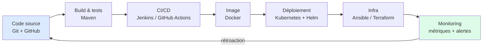
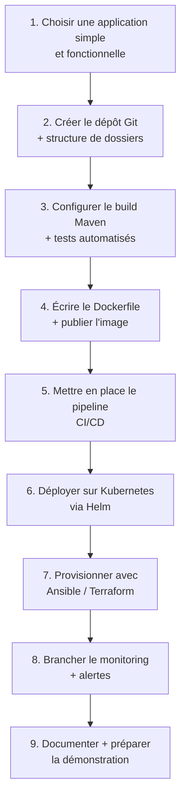
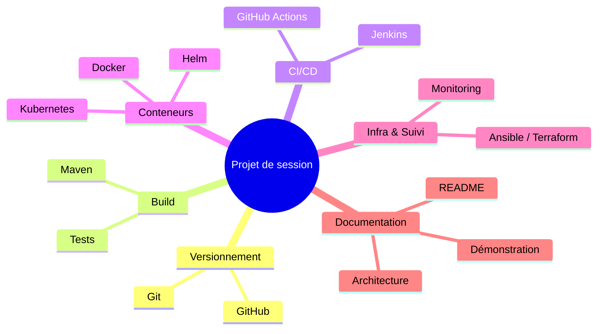

# 01 — Consignes du projet de session

## Table des matières

| # | Section |
|---|---|
| 1 | [Objectif du projet](#section-1) |
| 2 | [Portée et périmètre technique](#section-2) |
| 3 | [Contraintes à respecter](#section-3) |
| 4 | [Modalités — individuel ou en équipe](#section-4) |
| 5 | [Échéancier de la session](#section-5) |
| 6 | [Étapes recommandées de réalisation](#section-6) |
| 7 | [Quiz — Comprendre les consignes](#section-7) |
| 8 | [Pratique — Rédiger la portée de ton projet](#section-8) |
| 9 | [Synthèse](#section-9) |

---

1 — Objectif du projet

 

Le projet de session est l'**aboutissement du cours**. Vous devez concevoir et livrer une **chaîne DevOps complète, de bout en bout**, qui réutilise et assemble **tout ce que vous avez appris** durant les 14 modules précédents.

Concrètement, vous partez d'une application (votre choix : une petite application de données, une API, un service web) et vous construisez autour d'elle l'**usine logicielle** qui permet de la versionner, la construire, la tester, la conteneuriser, la déployer, la provisionner et la surveiller — **automatiquement et de façon reproductible**.

> _Le critère de succès n'est pas la complexité de l'application elle-même, mais la **qualité de la chaîne d'automatisation** qui l'entoure. Une application simple avec un pipeline impeccable vaut mieux qu'une application ambitieuse déployée à la main._

**🔧 Mini-exercice —** En une phrase, formule l'objectif central de TON projet de session.

✅ Voir une solution

Exemple : « Construire une chaîne DevOps complète et reproductible autour d'une petite API REST, du `git push` jusqu'au tableau de bord de monitoring. » L'accent doit porter sur la chaîne d'automatisation, pas sur l'application.

<a href="#top">↑ Retour en haut</a>

---

2 — Portée et périmètre technique

 

Votre projet doit **réutiliser les outils du cours**. Voici les composantes attendues et le module de référence pour chacune.

| Composante | Outils attendus | Module |
|---|---|---|
| **Versionnement** | Git + dépôt GitHub structuré, branches, commits clairs | 01–02 |
| **Build** | Maven (ou équivalent justifié) avec tests automatisés | 03 |
| **Intégration / livraison continue** | Jenkins **ou** GitHub Actions (pipeline déclenché par push) | 04–05, 10 |
| **Conteneurisation** | Dockerfile optimisé + image publiée dans un registre | 06 |
| **Orchestration** | Manifestes Kubernetes **et** un chart Helm | 07–09 |
| **Infrastructure as Code** | Ansible **ou** Terraform pour provisionner/configurer | 11–12 |
| **Monitoring & observabilité** | Collecte de métriques, tableau de bord, au moins une alerte | 13 |
| **Documentation** | README clair + schéma d'architecture + procédure de déploiement | tous |

### Ce qui est dans la portée

- L'automatisation **complète** du chemin « commit → production ».
- La **reproductibilité** : tout se recrée à partir du dépôt.

### Ce qui est hors portée

- Développer une application métier complexe (front-end élaboré, multiples microservices…). Une application **minimale mais fonctionnelle** suffit.
- Acheter des services cloud payants : un cluster local (Minikube/k3s/Kind) est accepté.

> _En cas de doute sur le périmètre, posez-vous la question : « Est-ce que ça démontre une compétence DevOps du cours ? » Si oui, c'est dans la portée._

**🔧 Mini-exercice —** Pour chacune des 7 composantes techniques attendues, note l'outil exact que tu comptes utiliser dans ton projet.

✅ Voir une solution

Exemple : Versionnement → Git/GitHub ; Build → Maven ; CI/CD → GitHub Actions ; Conteneur → Docker ; Orchestration → Kubernetes + Helm ; IaC → Terraform ; Monitoring → Prometheus + Grafana.

<a href="#top">↑ Retour en haut</a>

---

3 — Contraintes à respecter

 

| # | Contrainte | Pourquoi |
|---|---|---|
| 1 | **Tout doit être versionné** dans un dépôt Git unique | Reproductibilité, traçabilité |
| 2 | **Aucune étape manuelle cachée** : le pipeline fait le travail | C'est le cœur du DevOps |
| 3 | **Les secrets ne sont jamais commités** (mots de passe, clés) | Sécurité de base |
| 4 | Le déploiement doit pouvoir être **recréé à partir de zéro** | « Ça marche sur ma machine » est interdit |
| 5 | Le pipeline CI/CD se déclenche **automatiquement** sur `push` | Automatisation réelle |
| 6 | La documentation permet à un tiers de **tout relancer** | Lisibilité, professionnalisme |

> _Astuce : pour vérifier la contrainte n°4, demandez à un camarade de cloner votre dépôt et de tenter le déploiement en suivant uniquement votre README. S'il y arrive, vous avez gagné._

**🔧 Mini-exercice —** Parmi les 6 contraintes, laquelle risque le plus de te poser problème ? Note une action concrète pour t'y conformer dès maintenant.

✅ Voir une solution

Exemple : la contrainte n°3 (secrets jamais commités) → action : créer un `.gitignore` et déplacer tous les identifiants dans les secrets du pipeline (GitHub Secrets) dès le premier commit.

<a href="#top">↑ Retour en haut</a>

---

4 — Modalités — individuel ou en équipe

 

Le projet peut être réalisé **individuellement** ou **en équipe de 2 à 3 personnes**.

| Modalité | Avantages | Attentes ajustées |
|---|---|---|
| **Individuel** | Maîtrise complète de toute la chaîne | Périmètre standard |
| **Équipe (2–3)** | Collaboration réelle via Git, répartition des composantes | Pipeline plus abouti + preuve de collaboration (branches, *pull requests*, revues) |

### Si vous travaillez en équipe

- Utilisez **GitHub** comme outil de collaboration (branches par personne, *pull requests*, revues croisées).
- L'historique Git doit montrer une **contribution équilibrée** de chaque membre.
- Désignez un **schéma de répartition** clair (qui fait quoi) à inscrire dans le README.

> _En équipe, la collaboration Git est elle-même évaluée : un dépôt où une seule personne a tout commité ne démontre pas le travail d'équipe attendu._

<a href="#top">↑ Retour en haut</a>

---

5 — Échéancier de la session

 

Le projet se construit **progressivement** : à mesure que les modules avancent, vous ajoutez la brique correspondante. Ne laissez pas tout pour la fin.

```mermaid
gantt
    title Échéancier indicatif du projet de session
    dateFormat  X
    axisFormat  S%s
    section Préparation
    Choix de l'application et cadrage        :a1, 0, 1
    Dépôt Git + structure de base            :a2, 1, 1
    section Build & CI/CD
    Build Maven + tests                      :b1, 2, 1
    Pipeline CI/CD (Jenkins/Actions)         :b2, 3, 1
    section Conteneurs
    Dockerfile + image publiée               :c1, 4, 1
    Kubernetes + Helm                        :c2, 5, 2
    section Infra & Monitoring
    Ansible / Terraform                      :d1, 7, 1
    Monitoring + alertes                     :d2, 8, 1
    section Finalisation
    Documentation + démonstration            :e1, 9, 2
```

| Jalon | À livrer | Moment conseillé |
|---|---|---|
| **J1** | Choix de l'app + dépôt initialisé | Après le module 03 |
| **J2** | Pipeline CI/CD fonctionnel | Après le module 05 / 10 |
| **J3** | Conteneurisation + orchestration | Après le module 09 |
| **J4** | IaC + monitoring | Après le module 13 |
| **J5** | Documentation + démonstration finale | Module 15 |

> _Le travail régulier est la clé : chaque module vous donne exactement la brique à intégrer dans le projet. Intégrez-la **tout de suite**, pendant que c'est frais._

**🔧 Mini-exercice —** Associe chacun des jalons J1 à J5 à une date concrète de ta session.

✅ Voir une solution

Exemple : J1 (semaine 3) → 20 sept ; J2 (semaine 5) → 4 oct ; J3 (semaine 9) → 1 nov ; J4 (semaine 13) → 29 nov ; J5 (semaine 15) → 13 déc. Inscris ces dates dans ton agenda.

<a href="#top">↑ Retour en haut</a>

---

6 — Étapes recommandées de réalisation

 

1. **Choisir l'application** — petite, mais qui démarre vraiment (ex. une API REST renvoyant des données).
2. **Initialiser le dépôt** — `git init`, `.gitignore`, README minimal, structure claire.
3. **Build + tests** — Maven compile et exécute au moins quelques tests.
4. **Conteneuriser** — un Dockerfile propre, image construite et poussée.
5. **CI/CD** — pipeline qui, à chaque `push`, construit, teste et publie.
6. **Orchestrer** — déploiement Kubernetes + chart Helm paramétrable.
7. **IaC** — Ansible/Terraform pour rendre l'infra reproductible.
8. **Monitoring** — métriques exposées, tableau de bord, alerte.
9. **Documenter et démontrer** — README complet + démonstration de bout en bout.

> _N'essayez pas de tout faire parfait du premier coup. Faites d'abord une **version qui marche de bout en bout**, même minimale, puis améliorez chaque brique. Un pipeline complet « moyen » bat une brique « parfaite » isolée._

<a href="#top">↑ Retour en haut</a>

---

7 — Quiz — Comprendre les consignes

 

**Question 1 :** Quel est le critère de succès principal du projet ?

a) La complexité de l'application développée

b) La qualité et la complétude de la chaîne d'automatisation DevOps

c) Le nombre de lignes de code écrites

d) L'utilisation de services cloud payants

💡 Voir la solution

✅ **Réponse : b)** — On évalue la **chaîne DevOps** (versionnement → build → CI/CD → conteneurs → orchestration → IaC → monitoring), pas la sophistication de l'application.

---

**Question 2 :** Quelle contrainte est **interdite** dans le projet ?

a) Utiliser un cluster Kubernetes local

b) Réaliser le projet en équipe

c) Laisser une étape de déploiement manuelle cachée hors du pipeline

d) Documenter l'architecture

💡 Voir la solution

✅ **Réponse : c)** — Aucune étape manuelle cachée : le pipeline doit faire le travail. La reproductibilité est obligatoire.

---

**Question 3 :** En équipe, qu'est-ce qui est aussi évalué en plus de la chaîne technique ?

a) La taille de l'équipe

b) La collaboration Git (branches, *pull requests*, contributions équilibrées)

c) Le choix de l'éditeur de code

d) La marque de l'ordinateur utilisé

💡 Voir la solution

✅ **Réponse : b)** — L'historique Git doit prouver une vraie collaboration : branches, revues, contributions de chacun.

---

**Question 4 :** Quelle est la meilleure stratégie de réalisation ?

a) Tout laisser pour la dernière semaine

b) Construire une version complète de bout en bout, puis améliorer chaque brique

c) Perfectionner une seule brique avant de passer à la suivante

d) Déployer manuellement pour aller plus vite

💡 Voir la solution

✅ **Réponse : b)** — Obtenir d'abord un flux complet qui fonctionne, même minimal, puis itérer. C'est l'esprit DevOps : livrer tôt, améliorer en continu.

<a href="#top">↑ Retour en haut</a>

---

8 — Pratique — Rédiger la portée de ton projet

 

### Consigne

Rédige la **portée de TON projet de session** (une demi-page). Ton texte doit répondre clairement à :

1. Quelle **application** vas-tu utiliser ? (en une phrase)
2. Quels **outils** utiliseras-tu pour chaque composante (versionnement, build, CI/CD, conteneur, orchestration, IaC, monitoring) ?
3. Travailles-tu **seul ou en équipe** ? Si en équipe, qui fait quoi ?
4. Quelle est ta **définition de « terminé »** (à quoi reconnaîtras-tu que le projet est fini) ?

---

### Correction — Exemple de portée acceptable

> **Application :** une API REST minimale en Java/Spring Boot qui renvoie une liste de produits depuis une base en mémoire.
>
> **Outils par composante :**

| Composante | Outil choisi |
|---|---|
| Versionnement | Git + GitHub (branches `main` / `dev`) |
| Build & tests | Maven + JUnit |
| CI/CD | GitHub Actions (workflow sur `push`) |
| Conteneurisation | Dockerfile multi-étapes + image sur GHCR |
| Orchestration | Kubernetes (Minikube) + chart Helm |
| IaC | Terraform pour provisionner le namespace + ressources |
| Monitoring | Prometheus + Grafana + 1 alerte sur le taux d'erreurs |

> **Modalité :** équipe de 2 — Alex gère build/CI-CD/conteneur ; Sam gère orchestration/IaC/monitoring ; documentation partagée.
>
> **Définition de « terminé » :** un `git push` déclenche le pipeline, qui teste, construit l'image, la publie, et le déploiement Helm met à jour l'application sur le cluster ; le tableau de bord Grafana affiche les métriques en direct ; le README permet à un tiers de tout recréer.

> _Une bonne portée est **précise et réaliste**. Si tu ne sais pas encore quel outil choisir entre Jenkins et GitHub Actions, note-le et tranche avant le jalon J2._

<a href="#top">↑ Retour en haut</a>

---

9 — Synthèse

 

#### Points à retenir

1. Le projet = une **chaîne DevOps complète de bout en bout**, pas une application complexe.
2. Il faut **réutiliser tous les outils du cours** : Git, Maven, CI/CD, Docker, Kubernetes, Helm, IaC, monitoring.
3. **Reproductibilité** et **automatisation totale** sont les contraintes non négociables.
4. Le projet se fait **seul ou en équipe (2–3)** ; en équipe, la collaboration Git est évaluée.
5. **Construire progressivement**, module après module, vaut mieux que tout faire à la fin.

#### La suite

Leçon suivante : **02 — Livrables attendus**, pour savoir exactement quoi remettre et sous quel format.

<a href="#top">↑ Retour en haut</a>

---

  <em>Tous droits réservés. Toute reproduction, diffusion, utilisation ou adaptation de ce cours, en tout ou en partie, est strictement interdite sans l'autorisation écrite préalable de Dr. Haythem REHOUMA.</em>

  <strong>Cours créé par Dr. Haythem REHOUMA — Développement et déploiement de solutions de données</strong>

