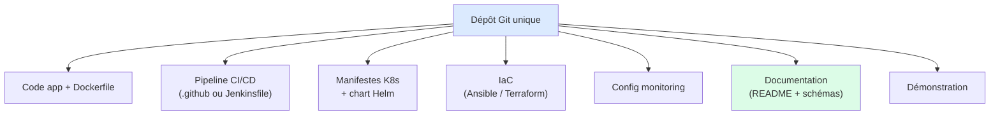
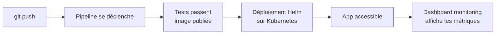
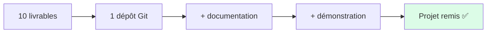

<a id="top"></a>

# 02 — Livrables attendus

## Table des matières

| # | Section |
|---|---|
| 1 | [Vue d'ensemble des livrables](#section-1) |
| 2 | [Le dépôt Git structuré](#section-2) |
| 3 | [Les livrables techniques en détail](#section-3) |
| 4 | [Documentation et démonstration](#section-4) |
| 5 | [Format et modalités de remise](#section-5) |
| 6 | [Quiz — Maîtriser les livrables](#section-6) |
| 7 | [Pratique — Lister tes livrables](#section-7) |
| 8 | [Synthèse](#section-8) |

---

<a id="section-1"></a>

<details>
<summary>1 — Vue d'ensemble des livrables</summary>

<br/>

Tous vos livrables tiennent dans **un seul dépôt Git**. Chaque brique du cours correspond à un artefact concret et vérifiable.



> _Règle d'or : **si ce n'est pas dans le dépôt, ça n'existe pas**. La démonstration est la seule exception (vidéo ou présentation en direct)._

**🔧 Mini-exercice —** Liste les 3 livrables que tu juges les plus importants pour ton projet.

<details>
<summary>✅ Voir une solution</summary>

Réponse personnelle. Exemple courant : (1) le pipeline CI/CD, (2) le chart Helm de déploiement, (3) le README permettant la reproductibilité — car ce sont les composantes les plus lourdes au barème.

</details>

</details>

<p align="right"><a href="#top">↑ Retour en haut</a></p>

---

<a id="section-2"></a>

<details>
<summary>2 — Le dépôt Git structuré</summary>

<br/>

Votre dépôt doit avoir une **structure lisible et professionnelle**. Voici une organisation type :

```text
mon-projet-devops/
├── README.md                  # Documentation principale
├── .gitignore
├── src/                       # Code de l'application
├── pom.xml                    # Build Maven
├── Dockerfile                 # Conteneurisation
├── .github/workflows/ci.yml   # Pipeline (ou Jenkinsfile à la racine)
├── k8s/                       # Manifestes Kubernetes bruts
│   ├── deployment.yaml
│   └── service.yaml
├── helm/mon-app/              # Chart Helm
│   ├── Chart.yaml
│   ├── values.yaml
│   └── templates/
├── infra/                     # IaC (Terraform ou Ansible)
│   └── main.tf  (ou playbook.yml)
├── monitoring/                # Config Prometheus/Grafana
│   └── dashboard.json
└── docs/                      # Schémas, procédures
    └── architecture.png
```

| Attendu | Critère de qualité |
|---|---|
| **Historique Git** | Commits réguliers, messages clairs, branches utilisées |
| **Arborescence** | Chaque composante dans son dossier dédié |
| **`.gitignore`** | Aucun secret, aucun artefact de build commité |

> _Un dépôt bien rangé est le premier signe d'un travail soigné. Le correcteur s'y repère en quelques secondes._

**🔧 Mini-exercice —** Dans quel dossier de l'arborescence type rangerais-tu ton chart Helm et ta config Prometheus ?

<details>
<summary>✅ Voir une solution</summary>

Le chart Helm dans `helm/mon-app/` (avec `Chart.yaml`, `values.yaml`, `templates/`) et la config de monitoring dans `monitoring/`.

</details>

</details>

<p align="right"><a href="#top">↑ Retour en haut</a></p>

---

<a id="section-3"></a>

<details>
<summary>3 — Les livrables techniques en détail</summary>

<br/>

Le tableau ci-dessous liste **chaque livrable**, sa description et le **format attendu**.

| # | Livrable | Description | Format attendu |
|---|---|---|---|
| 1 | **Dépôt Git** | Code + tous les artefacts, historique propre | URL GitHub publique ou accès donné au correcteur |
| 2 | **Code application + build** | Application minimale fonctionnelle, build Maven, tests | `src/`, `pom.xml`, tests JUnit |
| 3 | **Dockerfile** | Image construite, idéalement multi-étapes, légère | Fichier `Dockerfile` + image publiée sur un registre |
| 4 | **Pipeline CI/CD** | Build + tests + publication déclenchés sur `push` | `.github/workflows/*.yml` **ou** `Jenkinsfile` |
| 5 | **Manifestes Kubernetes** | Déploiement + service de l'application | Fichiers `.yaml` dans `k8s/` |
| 6 | **Chart Helm** | Déploiement paramétrable via `values.yaml` | Dossier `helm/<app>/` valide (`helm lint` OK) |
| 7 | **Infrastructure as Code** | Provisionnement/configuration reproductible | Terraform (`.tf`) **ou** playbook Ansible (`.yml`) |
| 8 | **Configuration monitoring** | Métriques + tableau de bord + ≥ 1 alerte | Config Prometheus + dashboard Grafana exporté |
| 9 | **README / documentation** | Présentation, architecture, procédure de déploiement | `README.md` + schéma dans `docs/` |
| 10 | **Démonstration** | Preuve que la chaîne fonctionne de bout en bout | Vidéo (3–8 min) **ou** présentation en direct |

> _Chaque ligne du tableau est un point évalué (voir la leçon 03 — Critères d'évaluation). Cochez-les une par une._

**🔧 Mini-exercice —** Parcours les 10 livrables et note ceux qui ne sont PAS encore commencés dans ton projet.

<details>
<summary>✅ Voir une solution</summary>

Réponse personnelle. L'objectif est d'obtenir une liste « à faire » claire — par exemple : chart Helm, IaC et configuration monitoring restent à démarrer.

</details>

</details>

<p align="right"><a href="#top">↑ Retour en haut</a></p>

---

<a id="section-4"></a>

<details>
<summary>4 — Documentation et démonstration</summary>

<br/>

### Le README doit contenir

1. **Présentation** : que fait l'application, en deux phrases.
2. **Schéma d'architecture** : un diagramme montrant le flux du code au monitoring.
3. **Prérequis** : outils à installer pour reproduire.
4. **Procédure de déploiement** : les commandes, dans l'ordre, pour tout recréer.
5. **Répartition des tâches** (si équipe).

### La démonstration doit montrer



- Un `push` qui **déclenche réellement** le pipeline.
- Le déploiement qui **se met à jour** sur le cluster.
- Le **tableau de bord** affichant des métriques en direct.

> _Conseil pour la démo : préparez un scénario court et répété d'avance. Modifiez une ligne, poussez, et laissez la chaîne dérouler toute seule devant le correcteur. C'est l'effet « wow » du DevOps._

**🔧 Mini-exercice —** Rédige en 3 étapes le scénario de ta démonstration de bout en bout.

<details>
<summary>✅ Voir une solution</summary>

Exemple : (1) modifier une ligne de code et `git push` ; (2) montrer le pipeline qui teste, construit et publie l'image ; (3) montrer le déploiement Helm mis à jour et le dashboard Grafana affichant les métriques en direct.

</details>

</details>

<p align="right"><a href="#top">↑ Retour en haut</a></p>

---

<a id="section-5"></a>

<details>
<summary>5 — Format et modalités de remise</summary>

<br/>

| Élément | Modalité de remise |
|---|---|
| **Dépôt Git** | Lien GitHub remis dans la plateforme du cours |
| **Démonstration** | Lien vidéo **ou** créneau de présentation en direct |
| **Documentation** | Incluse dans le dépôt (`README.md` + `docs/`) |
| **Noms des membres** | Indiqués dans le README (si équipe) |

### Avant de remettre — la checklist

- [ ] Le dépôt est **accessible** au correcteur.
- [ ] Le pipeline CI/CD **passe au vert**.
- [ ] Le déploiement **fonctionne** sur un cluster propre.
- [ ] Le monitoring **affiche** des données.
- [ ] Le README permet de **tout recréer** sans aide.
- [ ] **Aucun secret** n'est commité.

> _Faites le test ultime : clonez votre dépôt dans un dossier neuf et suivez votre propre README, sans rien improviser. Si ça marche, vous êtes prêt._

</details>

<p align="right"><a href="#top">↑ Retour en haut</a></p>

---

<a id="section-6"></a>

<details>
<summary>6 — Quiz — Maîtriser les livrables</summary>

<br/>

**Question 1 :** Où doivent se trouver tous les artefacts du projet ?

a) Dans des courriels envoyés au professeur

b) Dans un seul dépôt Git structuré

c) Sur le bureau de votre ordinateur

d) Répartis sur plusieurs clés USB

<details>
<summary>💡 Voir la solution</summary>

✅ **Réponse : b)** — Tout tient dans un dépôt Git unique et organisé. « Si ce n'est pas dans le dépôt, ça n'existe pas. »

</details>

---

**Question 2 :** Quel est le format attendu pour le pipeline CI/CD ?

a) Un document Word décrivant les étapes

b) Une capture d'écran du résultat

c) Un fichier `.github/workflows/*.yml` ou un `Jenkinsfile`

d) Une description orale pendant la démo

<details>
<summary>💡 Voir la solution</summary>

✅ **Réponse : c)** — Le pipeline est du **code** versionné, pas une description. Il doit se déclencher réellement sur `push`.

</details>

---

**Question 3 :** Que doit absolument montrer la démonstration ?

a) Le code source ligne par ligne

b) Un `push` qui déclenche le pipeline jusqu'au déploiement et au monitoring

c) L'installation des outils sur la machine

d) Le diaporama du cours

<details>
<summary>💡 Voir la solution</summary>

✅ **Réponse : b)** — La démo prouve que la **chaîne fonctionne de bout en bout** : commit → pipeline → déploiement → métriques.

</details>

---

**Question 4 :** Quelle vérification finale garantit la reproductibilité ?

a) Relire le code une dernière fois

b) Cloner le dépôt dans un dossier neuf et suivre uniquement le README

c) Demander une bonne note

d) Supprimer les fichiers inutiles

<details>
<summary>💡 Voir la solution</summary>

✅ **Réponse : b)** — Recréer le projet à partir du seul dépôt + README est la preuve ultime de reproductibilité.

</details>

</details>

<p align="right"><a href="#top">↑ Retour en haut</a></p>

---

<a id="section-7"></a>

<details>
<summary>7 — Pratique — Lister tes livrables</summary>

<br/>

### Consigne

Dresse la **liste de TES livrables** sous forme de tableau, en indiquant pour chacun : son **état** (à faire / en cours / fait) et **où il se trouve** dans ton dépôt. Couvre les 10 livrables de la section 3.

---

### Correction — Exemple de liste de livrables

| # | Livrable | État | Emplacement dans le dépôt |
|---|---|---|---|
| 1 | Dépôt Git | Fait | `github.com/moi/mon-projet-devops` |
| 2 | Code + build Maven | Fait | `src/`, `pom.xml` |
| 3 | Dockerfile | Fait | `./Dockerfile` (image sur GHCR) |
| 4 | Pipeline CI/CD | En cours | `.github/workflows/ci.yml` |
| 5 | Manifestes K8s | Fait | `k8s/deployment.yaml`, `k8s/service.yaml` |
| 6 | Chart Helm | À faire | `helm/mon-app/` |
| 7 | IaC | À faire | `infra/main.tf` |
| 8 | Monitoring | À faire | `monitoring/dashboard.json` |
| 9 | README + archi | En cours | `README.md`, `docs/architecture.png` |
| 10 | Démonstration | À faire | lien vidéo à ajouter |

> _Garde ce tableau à jour dans ton README pendant tout le projet : il te sert de feuille de route ET de preuve d'avancement pour le correcteur._

</details>

<p align="right"><a href="#top">↑ Retour en haut</a></p>

---

<a id="section-8"></a>

<details>
<summary>8 — Synthèse</summary>

<br/>

#### Points à retenir

1. **Tout dans un dépôt Git** structuré ; la démo est la seule exception.
2. Les livrables techniques sont du **code versionné** : Dockerfile, pipeline, manifestes, chart, IaC, config monitoring.
3. La **documentation** (README + schéma + procédure) doit permettre de tout recréer.
4. La **démonstration** prouve la chaîne de bout en bout : commit → déploiement → métriques.
5. **Vérifiez la reproductibilité** en clonant à neuf avant de remettre.



#### La suite

Leçon suivante : **03 — Critères d'évaluation**, pour découvrir la grille précise et savoir comment maximiser votre note.

</details>

<p align="right"><a href="#top">↑ Retour en haut</a></p>

---

<p align="center">
  <em>Tous droits réservés. Toute reproduction, diffusion, utilisation ou adaptation de ce cours, en tout ou en partie, est strictement interdite sans l'autorisation écrite préalable de Dr. Haythem REHOUMA.</em>
</p>

<p align="center">
  <strong>Cours créé par Dr. Haythem REHOUMA — Développement et déploiement de solutions de données</strong>
</p>
