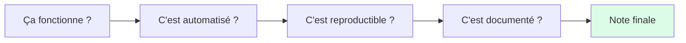
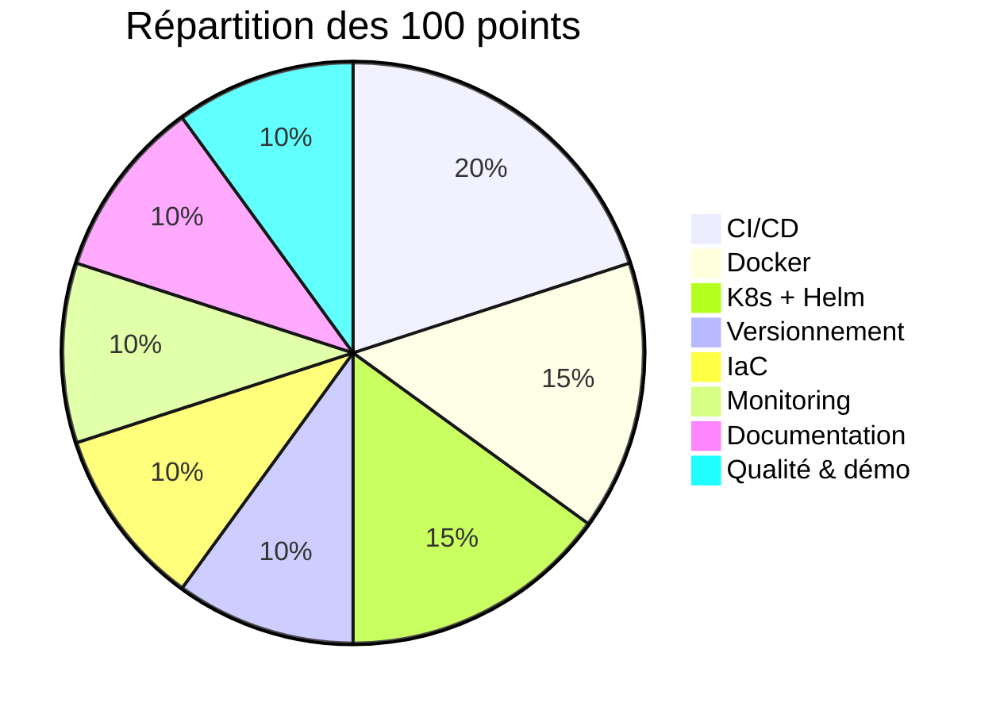
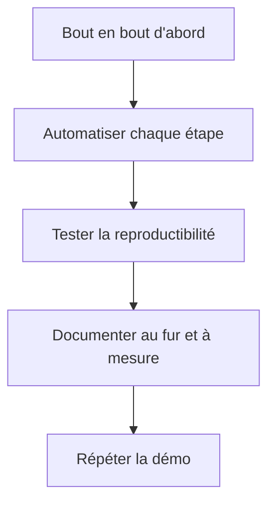
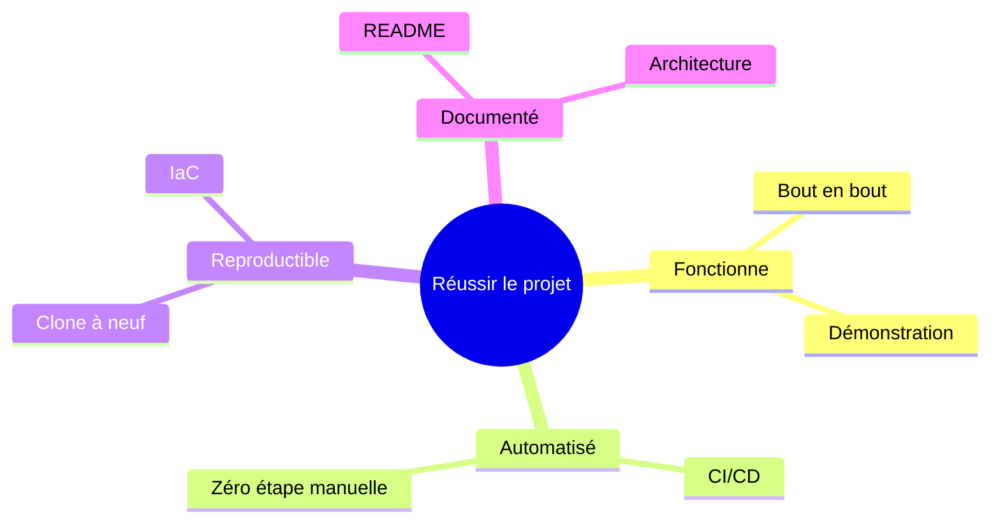

# 03 — Critères d'évaluation

## Table des matières

| # | Section |
|---|---|
| 1 | [Philosophie de l'évaluation](#section-1) |
| 2 | [La grille détaillée (barème)](#section-2) |
| 3 | [Les niveaux de réussite](#section-3) |
| 4 | [Conseils pour réussir](#section-4) |
| 5 | [Pièges qui coûtent des points](#section-5) |
| 6 | [Quiz — Comprendre les critères](#section-6) |
| 7 | [Pratique — Auto-évaluer un projet exemple](#section-7) |
| 8 | [Synthèse — et conclusion du cours](#section-8) |

---

1 — Philosophie de l'évaluation

 

L'évaluation récompense une **chaîne DevOps qui fonctionne réellement, de bout en bout, et qui est reproductible**. Chaque composante du cours pèse dans la note. On valorise autant le **fonctionnement** que la **qualité** et la **documentation**.

> _Un projet noté haut, c'est un projet qu'un inconnu peut cloner, déployer en suivant le README, et voir tourner — sans vous appeler à l'aide._

**🔧 Mini-exercice —** Cite les quatre questions, dans l'ordre, que se pose le correcteur pour situer ta note.

✅ Voir une solution

1. Ça fonctionne ? 2. C'est automatisé ? 3. C'est reproductible ? 4. C'est documenté ?

<a href="#top">↑ Retour en haut</a>

---

2 — La grille détaillée (barème)

 

La note totale est sur **100 points**, répartis par composante.

| # | Composante | Points | Ce qui est évalué |
|---|---|---:|---|
| 1 | **Versionnement (Git/GitHub)** | 10 | Historique propre, commits clairs, branches, collaboration |
| 2 | **CI/CD (pipeline)** | 20 | Déclenchement automatique, build + tests + publication |
| 3 | **Conteneurisation (Docker)** | 15 | Dockerfile correct, image fonctionnelle et légère, publiée |
| 4 | **Orchestration (K8s + Helm)** | 15 | Déploiement K8s + chart Helm paramétrable et valide |
| 5 | **Infrastructure as Code** | 10 | Ansible/Terraform reproductible et idempotent |
| 6 | **Monitoring & observabilité** | 10 | Métriques, tableau de bord, au moins une alerte |
| 7 | **Documentation** | 10 | README clair, schéma d'architecture, procédure de déploiement |
| 8 | **Qualité globale & démonstration** | 10 | Cohérence, reproductibilité prouvée, démonstration convaincante |
| | **Total** | **100** | |

> _Le **CI/CD** pèse le plus lourd (20 pts) : c'est le cœur de l'automatisation DevOps. Ne le négligez surtout pas._

**🔧 Mini-exercice —** Estime le poids combiné, en points, des composantes Conteneurisation et Orchestration (Docker + K8s/Helm).

✅ Voir une solution

Docker (15) + K8s/Helm (15) = **30 points**, soit le bloc le plus lourd du barème après le CI/CD.

<a href="#top">↑ Retour en haut</a>

---

3 — Les niveaux de réussite

 

Pour **chaque composante**, le correcteur situe votre travail sur quatre niveaux.

| Niveau | % des points | Description |
|---|---|---|
| **Insuffisant** | 0–40 % | Absent ou non fonctionnel |
| **Acceptable** | 50–60 % | Présent et fonctionne, mais minimal ou fragile |
| **Bien** | 70–80 % | Fonctionne bien, propre, quelques points perfectibles |
| **Excellent** | 90–100 % | Fonctionne, automatisé, reproductible et bien documenté |

### Exemple appliqué au CI/CD (20 points)

| Niveau | Points | Situation |
|---|---:|---|
| Insuffisant | 0–8 | Pas de pipeline, ou il échoue toujours |
| Acceptable | 10–12 | Pipeline qui construit, mais sans tests ni publication |
| Bien | 14–16 | Build + tests + publication, déclenché sur `push` |
| Excellent | 18–20 | Idem + déploiement automatique + pipeline lisible et robuste |

> _La frontière entre « Bien » et « Excellent » se joue presque toujours sur la **reproductibilité** et la **documentation**, pas sur la complexité technique._

**🔧 Mini-exercice —** Auto-positionne ton CI/CD actuel sur les quatre niveaux (Insuffisant / Acceptable / Bien / Excellent) et justifie en une ligne.

✅ Voir une solution

Réponse personnelle. Exemple : « Acceptable » — le pipeline construit sur `push` mais ne publie pas encore l'image ni ne déploie ; il faut ajouter ces deux étapes pour viser « Bien » puis « Excellent ».

<a href="#top">↑ Retour en haut</a>

---

4 — Conseils pour réussir

 

1. **Visez le bout en bout avant la perfection.** Un flux complet « Bien » bat des briques isolées « Excellent ».
2. **Automatisez tout ce qui se répète.** Chaque clic manuel est un point perdu en CI/CD et en reproductibilité.
3. **Testez la reproductibilité tôt.** Clonez à neuf, suivez votre README, corrigez ce qui bloque.
4. **Documentez en continu**, pas la veille de la remise.
5. **Soignez l'historique Git** : commits réguliers et messages parlants se voient immédiatement.
6. **Préparez et répétez la démonstration** : c'est elle qui prouve que tout marche.

> _Le meilleur retour sur investissement : 30 minutes à rendre votre README parfait peuvent faire gagner des points sur **plusieurs** composantes à la fois (documentation, qualité, reproductibilité)._

<a href="#top">↑ Retour en haut</a>

---

5 — Pièges qui coûtent des points

 

| Piège | Composante touchée | Comment l'éviter |
|---|---|---|
| Secrets commités dans le dépôt | Versionnement, Qualité | `.gitignore` + variables/secrets du pipeline |
| Étape de déploiement faite « à la main » | CI/CD, Qualité | Tout passer par le pipeline |
| Chart Helm qui ne passe pas `helm lint` | Orchestration | Valider avant de remettre |
| README qui suppose des étapes implicites | Documentation | Test « clone à neuf » par un tiers |
| Monitoring qui n'affiche rien de réel | Monitoring | Vérifier que des métriques arrivent |
| Un seul auteur dans l'historique (équipe) | Versionnement | Contributions équilibrées, *pull requests* |

> _La plupart de ces pièges ne coûtent rien à éviter — ils coûtent seulement de la **rigueur**. C'est exactement la qualité qu'on évalue._

**🔧 Mini-exercice —** Choisis deux pièges du tableau et note, pour chacun, l'action préventive que tu mettras en place.

✅ Voir une solution

Exemple : (1) Secrets commités → ajouter `.gitignore` + GitHub Secrets ; (2) Chart qui échoue → lancer `helm lint helm/mon-app/` avant chaque remise.

<a href="#top">↑ Retour en haut</a>

---

6 — Quiz — Comprendre les critères

 

**Question 1 :** Quelle composante pèse le plus lourd dans le barème ?

a) La documentation (10 pts)

b) Le CI/CD (20 pts)

c) Le monitoring (10 pts)

d) Le versionnement (10 pts)

💡 Voir la solution

✅ **Réponse : b)** — Le CI/CD vaut 20 points : c'est le cœur de l'automatisation DevOps.

---

**Question 2 :** Qu'est-ce qui distingue le plus souvent un niveau « Excellent » d'un niveau « Bien » ?

a) La complexité de l'application

b) Le nombre d'outils utilisés

c) La reproductibilité et la documentation

d) La longueur du code

💡 Voir la solution

✅ **Réponse : c)** — La reproductibilité prouvée et une bonne documentation font basculer une composante de « Bien » à « Excellent ».

---

**Question 3 :** Un déploiement réalisé manuellement en dehors du pipeline impacte surtout…

a) Le versionnement uniquement

b) Le CI/CD et la qualité globale

c) Le monitoring

d) Rien, c'est accepté

💡 Voir la solution

✅ **Réponse : b)** — Toute étape manuelle cachée pénalise le CI/CD (automatisation) et la qualité (reproductibilité).

---

**Question 4 :** Sur les 100 points, combien valent ensemble Docker et Kubernetes + Helm ?

a) 15 points

b) 20 points

c) 30 points

d) 50 points

💡 Voir la solution

✅ **Réponse : c)** — Conteneurisation (15) + Orchestration K8s/Helm (15) = 30 points.

<a href="#top">↑ Retour en haut</a>

---

7 — Pratique — Auto-évaluer un projet exemple

 

### Consigne

Voici la description d'un **projet exemple**. Applique la grille de la section 2 et **attribue un score sur 100**, composante par composante, en justifiant brièvement chaque note.

> **Projet « API Météo »** : dépôt GitHub avec historique correct (un seul auteur). Build Maven + 2 tests JUnit. Pipeline GitHub Actions qui construit et teste sur `push`, **mais ne publie pas l'image**. Dockerfile simple fonctionnel, image **non publiée**. Manifestes K8s présents et fonctionnels, **pas de chart Helm**. Terraform qui crée le namespace, idempotent. Prometheus configuré, **aucune alerte**. README correct mais sans schéma d'architecture. Démonstration vidéo claire du déploiement.

---

### Correction — Auto-évaluation proposée

| Composante | /Max | Note | Justification |
|---|---:|---:|---|
| Versionnement | 10 | 7 | Historique propre mais un seul auteur |
| CI/CD | 20 | 13 | Build + tests OK, mais pas de publication ni déploiement |
| Docker | 15 | 9 | Dockerfile fonctionnel mais image non publiée |
| K8s + Helm | 15 | 8 | Manifestes OK, **chart Helm manquant** (gros manque) |
| IaC | 10 | 9 | Terraform idempotent et propre |
| Monitoring | 10 | 6 | Métriques OK mais **aucune alerte** |
| Documentation | 10 | 7 | README correct mais **sans schéma d'architecture** |
| Qualité & démo | 10 | 8 | Bonne démo, mais reproductibilité partielle |
| **Total** | **100** | **67** | Projet « Bien » à consolider |

> _Pistes d'amélioration prioritaires pour ce projet : publier l'image + déclencher le déploiement (CI/CD), **ajouter le chart Helm** (le plus gros manque), créer une alerte et ajouter le schéma d'architecture. Ces quatre actions feraient passer la note de 67 à ~85._

<a href="#top">↑ Retour en haut</a>

---

8 — Synthèse — et conclusion du cours

 

#### Points à retenir

1. La note (sur **100**) récompense une **chaîne complète, automatisée, reproductible et documentée**.
2. Le **CI/CD (20 pts)** et le duo **Docker + K8s/Helm (30 pts)** pèsent le plus lourd.
3. Chaque composante est jugée sur 4 niveaux : la **reproductibilité** fait la différence.
4. Les **pièges** (secrets commités, étapes manuelles, README implicite) coûtent cher pour rien.
5. **Documenter et répéter la démo** rapporte des points sur plusieurs composantes à la fois.

#### La suite — conclusion du cours

Félicitations : vous arrivez au terme du cours **Développement et déploiement de solutions de données**. Vous êtes parti d'un poste de travail vide et vous savez désormais **versionner, construire, tester, conteneuriser, déployer, provisionner et surveiller** une application — automatiquement et de bout en bout.

Le projet de session est votre **preuve de compétence** : un dépôt que vous pouvez montrer fièrement, qui démontre une vraie maîtrise de la culture et des outils DevOps. Gardez-le, faites-le évoluer, et ajoutez-le à votre portfolio professionnel. C'est exactement ce qu'un employeur veut voir.

Bonne réalisation, et bon déploiement.

<a href="#top">↑ Retour en haut</a>

---

  <em>Tous droits réservés. Toute reproduction, diffusion, utilisation ou adaptation de ce cours, en tout ou en partie, est strictement interdite sans l'autorisation écrite préalable de Dr. Haythem REHOUMA.</em>

  <strong>Cours créé par Dr. Haythem REHOUMA — Développement et déploiement de solutions de données</strong>

