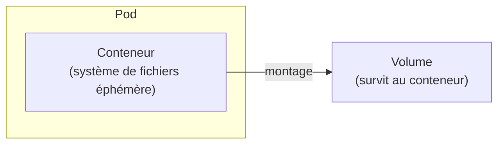
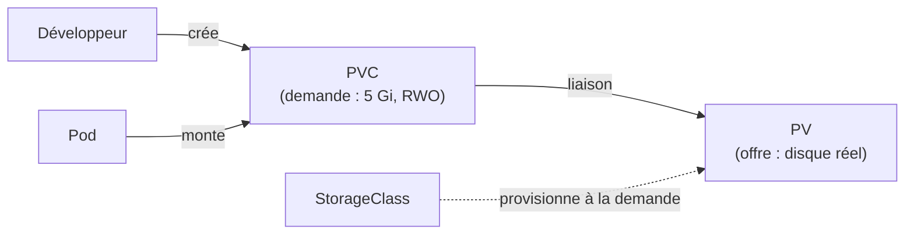
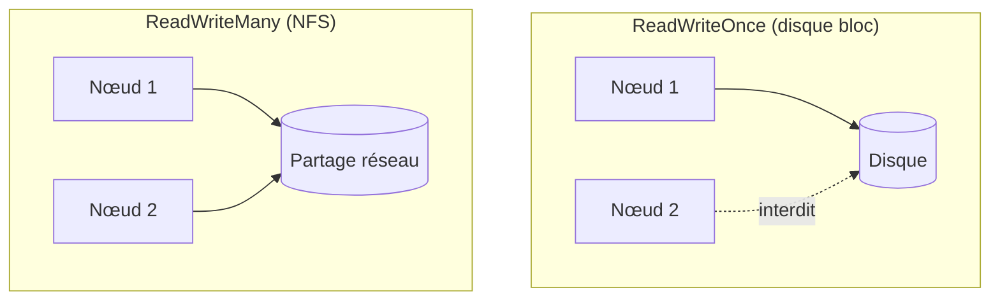
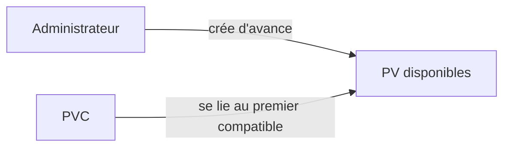
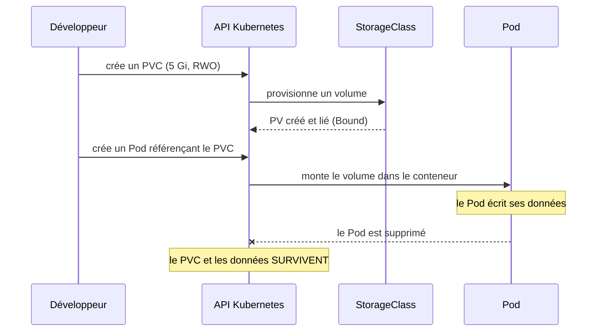

<a id="top"></a>

# 01 — Volumes et stockage persistant

> **Module [18 — Kubernetes : suite de la théorie (partie 3)](README.md)** · Leçon 1 sur 4

## Table des matières

- [1. Le problème : un conteneur ne retient rien](#1-le-probleme--un-conteneur-ne-retient-rien)
- [2. Les volumes éphémères](#2-les-volumes-ephemeres)
- [3. Le trio PV / PVC / StorageClass](#3-le-trio-pv--pvc--storageclass)
- [4. Les modes d'accès](#4-les-modes-dacces)
- [5. Les politiques de récupération](#5-les-politiques-de-recuperation)
- [6. Provisionnement statique et dynamique](#6-provisionnement-statique-et-dynamique)
- [7. Utiliser un PVC dans un Pod](#7-utiliser-un-pvc-dans-un-pod)
- [8. Cycle de vie complet](#8-cycle-de-vie-complet)
- [Quiz](#quiz)
- [Pratique](#pratique)
- [Synthèse](#synthese)

---

## 1. Le problème : un conteneur ne retient rien

Le système de fichiers d'un conteneur est **éphémère**. Si le conteneur redémarre (plantage, mise à jour, déplacement sur un autre nœud), **tout ce qui y a été écrit disparaît**.

C'est acceptable pour une application **sans état** (un serveur web qui ne fait que répondre), mais inacceptable pour :

- une **base de données** ;
- un espace de **téléversement** de fichiers ;
- un **cache** que l'on veut conserver ;
- des **journaux** à archiver.

Kubernetes répond avec la notion de **volume** : un espace de stockage **monté** dans le conteneur, dont la durée de vie est **découplée** de celle du conteneur.



---

## 2. Les volumes éphémères

Tous les volumes ne sont pas persistants. Certains vivent **le temps du Pod** : ils survivent au redémarrage d'un **conteneur**, mais pas à la suppression du **Pod**.

| Type | Durée de vie | Usage typique |
|---|---|---|
| **`emptyDir`** | Le temps du Pod | Espace de travail temporaire, cache, échange entre conteneurs d'un même Pod |
| **`configMap`** | Le temps du Pod | Injecter des fichiers de configuration |
| **`secret`** | Le temps du Pod | Injecter des certificats, mots de passe |
| **`downwardAPI`** | Le temps du Pod | Exposer des métadonnées du Pod sous forme de fichiers |

Exemple d'`emptyDir` partagé entre deux conteneurs du même Pod :

```yaml
apiVersion: v1
kind: Pod
metadata:
  name: partage
spec:
  volumes:
    - name: travail
      emptyDir: {}
  containers:
    - name: producteur
      image: busybox:1.36
      command: ["sh", "-c", "echo bonjour > /data/message.txt && sleep 3600"]
      volumeMounts:
        - name: travail
          mountPath: /data
    - name: consommateur
      image: busybox:1.36
      command: ["sh", "-c", "sleep 5 && cat /data/message.txt && sleep 3600"]
      volumeMounts:
        - name: travail
          mountPath: /data
```

> **À retenir :** `emptyDir` est **vide au démarrage** du Pod et **supprimé** avec lui. Ce n'est **pas** du stockage persistant.

---

## 3. Le trio PV / PVC / StorageClass

Pour du stockage **qui survit au Pod**, Kubernetes sépare clairement **l'offre** et **la demande** :

| Objet | Qui le crée | Rôle |
|---|---|---|
| **PersistentVolume (PV)** | L'administrateur (ou le provisionneur) | **L'offre** : un morceau de stockage réel (disque cloud, NFS, disque local…) |
| **PersistentVolumeClaim (PVC)** | Le développeur | **La demande** : « je veux 5 Gi en lecture/écriture » |
| **StorageClass (SC)** | L'administrateur | **Le catalogue** : le « type » de stockage (rapide/lent, SSD/HDD) et **comment le créer automatiquement** |



**L'intérêt de cette séparation :** le développeur écrit un PVC **sans savoir** si le stockage est un disque AWS EBS, un NFS ou un disque local. Le même manifeste fonctionne partout — c'est la **portabilité**.

### Exemple de PVC

```yaml
apiVersion: v1
kind: PersistentVolumeClaim
metadata:
  name: donnees-app
spec:
  accessModes:
    - ReadWriteOnce          # voir §4
  resources:
    requests:
      storage: 5Gi           # la taille demandée
  storageClassName: standard # le "type" de stockage (optionnel)
```

### Exemple de PV (provisionnement statique)

```yaml
apiVersion: v1
kind: PersistentVolume
metadata:
  name: pv-manuel
spec:
  capacity:
    storage: 5Gi
  accessModes:
    - ReadWriteOnce
  persistentVolumeReclaimPolicy: Retain   # voir §5
  storageClassName: standard
  hostPath:                                # ATTENTION : uniquement pour un cluster local de test
    path: /mnt/donnees
```

> `hostPath` écrit sur le disque du **nœud** : pratique en local (Docker Desktop), **à proscrire en production** (le Pod perd ses données s'il change de nœud).

---

## 4. Les modes d'accès

Le mode d'accès décrit **comment** le volume peut être monté. C'est une contrainte **du système de stockage**, pas un simple souhait.

| Mode | Abréviation | Signification |
|---|---|---|
| **ReadWriteOnce** | RWO | Monté en lecture/écriture par **un seul nœud** à la fois |
| **ReadOnlyMany** | ROX | Monté en **lecture seule** par **plusieurs nœuds** |
| **ReadWriteMany** | RWX | Monté en lecture/écriture par **plusieurs nœuds** simultanément |
| **ReadWriteOncePod** | RWOP | Monté en lecture/écriture par **un seul Pod** (verrou strict) |

**Piège fréquent :** la plupart des **disques blocs** du cloud (AWS EBS, GCP PD, Azure Disk) ne supportent que **RWO**. Pour du **RWX**, il faut un système de fichiers **partagé** (NFS, CephFS, Azure Files, EFS).



> Un PVC ne peut se lier qu'à un PV dont la **capacité est suffisante** **et** dont les **modes d'accès** couvrent ceux demandés.

---

## 5. Les politiques de récupération

Que devient le stockage **quand on supprime le PVC** ? C'est le champ `persistentVolumeReclaimPolicy` du PV.

| Politique | Effet à la suppression du PVC |
|---|---|
| **`Delete`** (défaut en dynamique) | Le PV **et le disque réel** sont supprimés — **les données sont perdues** |
| **`Retain`** | Le PV est conservé (état `Released`), **les données restent** ; réutilisation **manuelle** par l'administrateur |
| **`Recycle`** *(obsolète)* | Effaçait le contenu puis remettait le PV disponible |

> **Conseil de production :** pour une base de données, utilisez **`Retain`**. Une suppression accidentelle de PVC ne doit **jamais** détruire les données.

---

## 6. Provisionnement statique et dynamique

### Statique

L'administrateur crée **à l'avance** des PV. Les PVC se **lient** à ceux qui correspondent.



Inconvénient : il faut **anticiper** les besoins, et l'on gaspille (un PVC de 1 Gi lié à un PV de 100 Gi consomme tout le PV).

### Dynamique (le mode moderne)

La **StorageClass** contient un **provisionneur** : quand un PVC arrive, le PV est **créé automatiquement**, à la bonne taille.

```yaml
apiVersion: storage.k8s.io/v1
kind: StorageClass
metadata:
  name: rapide
provisioner: kubernetes.io/aws-ebs     # dépend du fournisseur
parameters:
  type: gp3
reclaimPolicy: Delete
allowVolumeExpansion: true             # autorise l'agrandissement du volume
volumeBindingMode: WaitForFirstConsumer
```

Deux champs importants :

- **`allowVolumeExpansion: true`** : on pourra **agrandir** le volume plus tard (en augmentant la taille dans le PVC).
- **`volumeBindingMode: WaitForFirstConsumer`** : le volume n'est créé **qu'au moment** où un Pod l'utilise, donc **dans la bonne zone** de disponibilité que celle du Pod. Sans cela, le disque peut être créé dans une zone où le Pod ne peut pas démarrer.

> Sur un cluster local (Docker Desktop), une StorageClass par défaut existe déjà : un PVC sans `storageClassName` sera provisionné automatiquement.

---

## 7. Utiliser un PVC dans un Pod

Le Pod ne connaît **que le PVC** — jamais le disque réel.

```yaml
apiVersion: v1
kind: Pod
metadata:
  name: app-avec-donnees
spec:
  volumes:
    - name: stockage
      persistentVolumeClaim:
        claimName: donnees-app        # le nom du PVC
  containers:
    - name: app
      image: busybox:1.36
      command: ["sh", "-c", "echo test >> /donnees/journal.txt && sleep 3600"]
      volumeMounts:
        - name: stockage
          mountPath: /donnees          # où le volume apparaît dans le conteneur
```

Deux blocs à ne pas confondre :

- **`spec.volumes`** : *quel* stockage rendre disponible **au Pod** ;
- **`containers[].volumeMounts`** : *où* le monter **dans le conteneur**.

> Astuce : `subPath` permet de monter **un sous-dossier** du volume, pour éviter d'écraser tout le contenu d'un répertoire du conteneur.

---

## 8. Cycle de vie complet



**États d'un PV :** `Available` (libre) → `Bound` (lié à un PVC) → `Released` (PVC supprimé, données encore là si `Retain`) → `Failed`.

Commandes utiles :

```bash
kubectl get pv                       # les volumes réels
kubectl get pvc                      # les demandes
kubectl get storageclass             # les catalogues disponibles
kubectl describe pvc donnees-app     # pourquoi un PVC reste-t-il en Pending ?
```

---

## Quiz

**1.** Quelle est la durée de vie d'un volume `emptyDir` ?

<details><summary>Réponse</summary>

Celle du **Pod**. Il survit au redémarrage d'un conteneur, mais il est **supprimé avec le Pod**. Ce n'est pas du stockage persistant.
</details>

**2.** Qui écrit le PVC, et qui écrit le PV ?

<details><summary>Réponse</summary>

Le **développeur** écrit le **PVC** (la demande). Le **PV** (l'offre) est créé par l'**administrateur** (provisionnement statique) ou **automatiquement** par la StorageClass (provisionnement dynamique).
</details>

**3.** Un PVC demande `ReadWriteMany` sur un cluster où le stockage est un disque bloc cloud. Que se passe-t-il ?

<details><summary>Réponse</summary>

Le PVC reste en **`Pending`** : aucun PV compatible ne peut être fourni, car les disques blocs ne supportent que **RWO**. Il faut un stockage **partagé** (NFS, EFS, Azure Files) pour du **RWX**.
</details>

**4.** Vous supprimez un PVC dont le PV a la politique `Delete`. Que deviennent les données ?

<details><summary>Réponse</summary>

Elles sont **définitivement perdues** : le PV et le disque sous-jacent sont supprimés. Pour les conserver, il fallait `Retain`.
</details>

**5.** À quoi sert `volumeBindingMode: WaitForFirstConsumer` ?

<details><summary>Réponse</summary>

À **retarder** la création du volume jusqu'à ce qu'un Pod l'utilise, afin de le créer dans la **même zone de disponibilité** que le Pod. Sans cela, le disque peut être créé dans une zone où le Pod ne pourra pas être planifié.
</details>

**6.** Quelle est la différence entre `volumes` et `volumeMounts` ?

<details><summary>Réponse</summary>

`spec.volumes` déclare **quel** stockage est disponible pour le **Pod** ; `containers[].volumeMounts` indique **où** ce stockage est monté **dans un conteneur** (`mountPath`).
</details>

---

## Pratique

**Énoncé :** créez un PVC de 1 Gi, un Pod qui y écrit un fichier, supprimez le Pod, puis recréez-le et **prouvez** que les données sont toujours là.

<details>
<summary><strong>Correction détaillée</strong></summary>

**1) Le PVC** (`pvc.yaml`) — sans `storageClassName`, la classe par défaut du cluster local est utilisée :

```yaml
apiVersion: v1
kind: PersistentVolumeClaim
metadata:
  name: demo-donnees
spec:
  accessModes: [ReadWriteOnce]
  resources:
    requests:
      storage: 1Gi
```

**2) Le Pod écrivain** (`pod-ecriture.yaml`) :

```yaml
apiVersion: v1
kind: Pod
metadata:
  name: ecrivain
spec:
  volumes:
    - name: stockage
      persistentVolumeClaim:
        claimName: demo-donnees
  containers:
    - name: app
      image: busybox:1.36
      command: ["sh", "-c", "date >> /donnees/journal.txt && sleep 3600"]
      volumeMounts:
        - name: stockage
          mountPath: /donnees
```

**3) Application et vérification :**

```bash
kubectl apply -f pvc.yaml
kubectl get pvc                       # doit passer à Bound
kubectl apply -f pod-ecriture.yaml
kubectl exec ecrivain -- cat /donnees/journal.txt   # une ligne de date
```

**4) La preuve de persistance :**

```bash
kubectl delete pod ecrivain           # on supprime le Pod (pas le PVC !)
kubectl apply -f pod-ecriture.yaml    # on le recrée
kubectl exec ecrivain -- cat /donnees/journal.txt
```

**Résultat attendu :** le fichier contient **deux** lignes de date — la première écrite par le Pod supprimé, la seconde par le nouveau. Les données ont **survécu** au Pod.

**5) Nettoyage :**

```bash
kubectl delete pod ecrivain
kubectl delete pvc demo-donnees       # selon la politique, le PV est supprimé ou conservé
```
</details>

---

## Synthèse

- Le système de fichiers d'un conteneur est **éphémère** ; un **volume** découple les données de la vie du conteneur.
- `emptyDir`, `configMap`, `secret` sont des volumes **éphémères** (durée de vie = le Pod).
- Le stockage persistant repose sur trois objets : **PV** (l'offre), **PVC** (la demande), **StorageClass** (le catalogue et le provisionnement automatique).
- Les **modes d'accès** (RWO, ROX, RWX, RWOP) sont une contrainte du **système de stockage** sous-jacent.
- La **politique de récupération** décide du sort des données : **`Delete`** (perte) ou **`Retain`** (conservation) — choisissez `Retain` pour les données critiques.
- Le **provisionnement dynamique** (StorageClass) est le mode moderne ; `WaitForFirstConsumer` évite les erreurs de zone.
- Le Pod ne référence **jamais** un disque : il monte un **PVC**, ce qui rend les manifestes **portables**.

---

> Leçon suivante : **[02 — StatefulSet : les applications avec état](02-statefulset.md)**.

---

<p align="center">
  <strong>Cours créé par Dr. Haythem REHOUMA — Développement et déploiement de solutions de données</strong>
</p>
