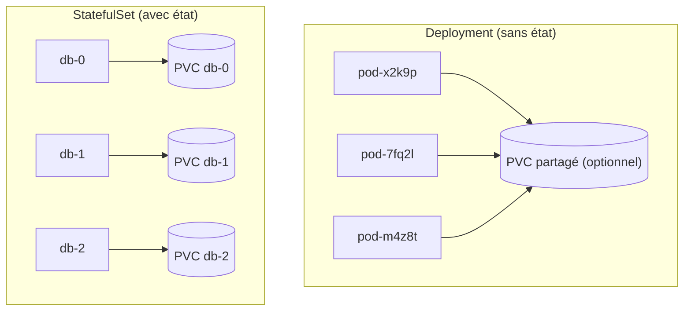
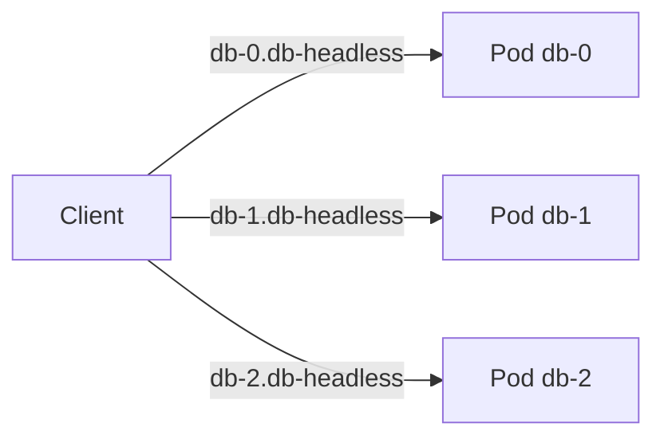
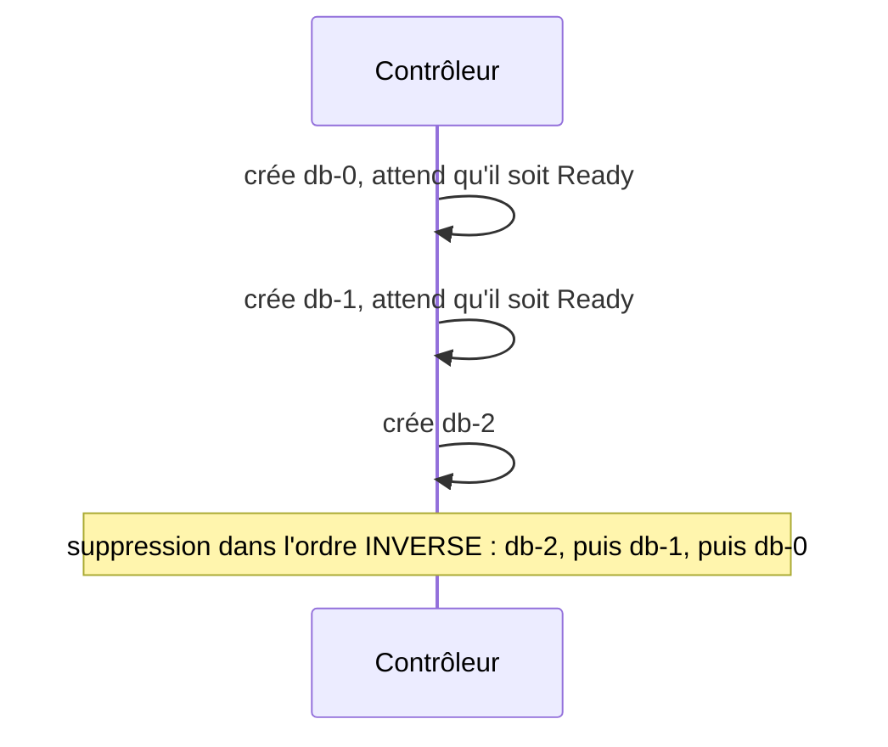

<a id="top"></a>

# 02 — StatefulSet : les applications avec état

> **Module [18 — Kubernetes : suite de la théorie (partie 3)](README.md)** · Leçon 2 sur 4

## Table des matières

- [1. Pourquoi le Deployment ne suffit pas](#1-pourquoi-le-deployment-ne-suffit-pas)
- [2. Les trois garanties du StatefulSet](#2-les-trois-garanties-du-statefulset)
- [3. L'identité réseau stable et le Service headless](#3-lidentite-reseau-stable-et-le-service-headless)
- [4. Le stockage par réplique : volumeClaimTemplates](#4-le-stockage-par-replique--volumeclaimtemplates)
- [5. Manifeste complet commenté](#5-manifeste-complet-commente)
- [6. Ordre de démarrage, d'arrêt et mises à jour](#6-ordre-de-demarrage-darret-et-mises-a-jour)
- [7. Deployment vs StatefulSet](#7-deployment-vs-statefulset)
- [8. Pièges classiques](#8-pieges-classiques)
- [Quiz](#quiz)
- [Pratique](#pratique)
- [Synthèse](#synthese)

---

## 1. Pourquoi le Deployment ne suffit pas

Un **Deployment** traite ses Pods comme des **copies interchangeables** (« du bétail, pas des animaux de compagnie ») :

- leurs **noms sont aléatoires** (`demo-web-7d9f8b6c5-x2k9p`) ;
- ils sont créés et supprimés **dans n'importe quel ordre** ;
- ils **partagent** le même PVC s'il y en a un.

Or une **base de données répliquée** (PostgreSQL, MongoDB, Cassandra, Kafka…) a des besoins opposés :

- chaque instance doit avoir une **identité stable** (le nœud `db-0` est le primaire, `db-1` et `db-2` sont les réplicas) ;
- chaque instance a **ses propres données** (pas de disque partagé) ;
- l'ordre de **démarrage** compte (le primaire d'abord).

Le **StatefulSet** est le contrôleur conçu pour ces cas.



---

## 2. Les trois garanties du StatefulSet

| Garantie | Concrètement |
|---|---|
| **Identité stable** | Les Pods s'appellent `<nom>-0`, `<nom>-1`, `<nom>-2`… et **gardent ce nom** après un redémarrage |
| **Stockage dédié et persistant** | Chaque Pod obtient **son propre** PVC, qui lui est **réattribué** après recréation |
| **Ordre garanti** | Création **0 → 1 → 2**, suppression **2 → 1 → 0**, chaque étape attendant que la précédente soit prête |

> C'est la **combinaison** des trois qui fait le StatefulSet. Si votre application n'a besoin d'aucune des trois, utilisez un **Deployment** — il est plus simple et plus souple.

---

## 3. L'identité réseau stable et le Service headless

Un StatefulSet exige un **Service headless** (`clusterIP: None`, voir le [projet 11](../07-kubernetes-bases/projet11-kubernetes-services/03-TYPES-DE-SERVICES-EXHAUSTIF.md)). Grâce à lui, **chaque Pod** reçoit son **propre nom DNS** :

```
<nom-du-pod>.<service-headless>.<namespace>.svc.cluster.local
```

Par exemple :

```
db-0.db-headless.default.svc.cluster.local
db-1.db-headless.default.svc.cluster.local
db-2.db-headless.default.svc.cluster.local
```



**Pourquoi c'est capital :** un réplica doit pouvoir dire « je me synchronise avec **db-0** ». Avec un Deployment, c'est impossible : les noms changent à chaque recréation.

Le Service headless :

```yaml
apiVersion: v1
kind: Service
metadata:
  name: db-headless
spec:
  clusterIP: None              # headless : pas d'IP virtuelle
  selector:
    app: db
  ports:
    - port: 5432
      name: postgres
```

> On ajoute souvent **un second Service normal** (ClusterIP) pour les clients qui veulent juste « une instance quelconque » (typiquement, la lecture).

---

## 4. Le stockage par réplique : volumeClaimTemplates

C'est **la** différence structurelle avec un Deployment. Au lieu de référencer un PVC existant, le StatefulSet contient un **modèle de PVC** : Kubernetes en **fabrique un par réplique**.

```yaml
  volumeClaimTemplates:
    - metadata:
        name: donnees
      spec:
        accessModes: [ReadWriteOnce]
        resources:
          requests:
            storage: 2Gi
```

Les PVC créés sont nommés `<nom-du-template>-<nom-du-pod>` :

```
donnees-db-0
donnees-db-1
donnees-db-2
```

**Comportement clé :** si le Pod `db-1` est supprimé, il est recréé **avec le même nom** et **rebranché sur `donnees-db-1`** — il retrouve **ses** données.

> **Attention :** supprimer le StatefulSet **ne supprime pas** les PVC. C'est volontaire (protection des données), mais cela signifie qu'il faut les nettoyer **manuellement** : `kubectl delete pvc -l app=db`.

---

## 5. Manifeste complet commenté

```yaml
apiVersion: apps/v1
kind: StatefulSet
metadata:
  name: db
spec:
  serviceName: db-headless        # OBLIGATOIRE : le Service headless associé
  replicas: 3
  selector:
    matchLabels:
      app: db
  template:
    metadata:
      labels:
        app: db
    spec:
      terminationGracePeriodSeconds: 30
      containers:
        - name: postgres
          image: postgres:16
          ports:
            - containerPort: 5432
              name: postgres
          env:
            - name: POSTGRES_PASSWORD
              valueFrom:
                secretKeyRef:      # jamais de mot de passe en clair
                  name: db-secret
                  key: password
            - name: PGDATA
              value: /var/lib/postgresql/data/pgdata
          volumeMounts:
            - name: donnees        # correspond au volumeClaimTemplate
              mountPath: /var/lib/postgresql/data
          readinessProbe:
            exec:
              command: ["pg_isready", "-U", "postgres"]
            initialDelaySeconds: 10
            periodSeconds: 5
  volumeClaimTemplates:            # un PVC PAR réplique
    - metadata:
        name: donnees
      spec:
        accessModes: [ReadWriteOnce]
        resources:
          requests:
            storage: 2Gi
```

Points à noter :

- **`serviceName`** doit pointer vers le Service **headless** : c'est ce qui donne les noms DNS individuels.
- La **`readinessProbe`** est cruciale : l'ordre de démarrage attend que chaque Pod soit **Ready** avant de passer au suivant.
- Le mot de passe vient d'un **Secret** (module 08), jamais du YAML en clair.

---

## 6. Ordre de démarrage, d'arrêt et mises à jour

### Ordre de création et de suppression



### Stratégies de mise à jour

| `updateStrategy` | Comportement |
|---|---|
| **`RollingUpdate`** (défaut) | Met à jour les Pods **du plus grand index au plus petit** (2 → 1 → 0), un par un |
| **`OnDelete`** | Ne met **rien** à jour automatiquement : chaque Pod est recréé (avec la nouvelle version) **seulement quand vous le supprimez** |

Le champ **`partition`** permet un déploiement **progressif** (canari) : seuls les Pods d'index **≥ partition** sont mis à jour.

```yaml
spec:
  updateStrategy:
    type: RollingUpdate
    rollingUpdate:
      partition: 2        # seul db-2 est mis à jour ; db-0 et db-1 restent en ancienne version
```

### Démarrage parallèle

Par défaut `podManagementPolicy: OrderedReady`. Si l'ordre n'a pas d'importance (démarrage plus rapide), on peut mettre `Parallel` — les Pods sont alors créés **tous en même temps**, tout en gardant noms et volumes stables.

---

## 7. Deployment vs StatefulSet

| Critère | **Deployment** | **StatefulSet** |
|---|---|---|
| Nom des Pods | Aléatoire (`app-7d9f-x2k9p`) | **Ordinal stable** (`db-0`, `db-1`) |
| Identité DNS par Pod | Non | **Oui** (via Service headless) |
| Stockage | Partagé ou aucun | **Un PVC par réplique** |
| Ordre création/suppression | Quelconque, en parallèle | **Séquentiel et garanti** |
| Mise à l'échelle | Instantanée, sans ordre | Séquentielle |
| Suppression du contrôleur | Supprime tout | **Conserve les PVC** |
| Cas d'usage | API, frontend, workers sans état | Bases de données, Kafka, ZooKeeper, Elasticsearch |

> **Règle simple :** si vos répliques sont **interchangeables**, prenez un **Deployment**. Si chacune a une **identité** et **ses** données, prenez un **StatefulSet**.

---

## 8. Pièges classiques

| Piège | Explication | Solution |
|---|---|---|
| Oublier le Service headless | Sans lui, pas de nom DNS par Pod | Créer le Service avec `clusterIP: None` et le référencer dans `serviceName` |
| Croire que supprimer le StatefulSet supprime les données | Les PVC **survivent** volontairement | Nettoyer avec `kubectl delete pvc -l <label>` |
| Réduire les répliques pour « libérer » l'espace | Les PVC des Pods supprimés **restent** | Les supprimer explicitement si c'est voulu |
| Utiliser un StatefulSet « au cas où » | Complexité inutile, mises à l'échelle plus lentes | Deployment si l'application est sans état |
| Absence de readinessProbe | L'ordre de démarrage ne veut plus rien dire | Toujours définir une sonde pertinente |
| Vouloir un stockage RWX partagé entre répliques | Contraire au principe (un PVC par Pod) | Utiliser un volume partagé séparé si réellement nécessaire |

---

## Quiz

**1.** Quelles sont les trois garanties d'un StatefulSet ?

<details><summary>Réponse</summary>

**Identité stable** (noms ordinaux `-0`, `-1`, …), **stockage dédié et persistant** par réplique (`volumeClaimTemplates`), et **ordre garanti** de création/suppression/mise à jour.
</details>

**2.** Pourquoi un StatefulSet a-t-il besoin d'un Service **headless** ?

<details><summary>Réponse</summary>

Parce qu'un Service headless (`clusterIP: None`) fait résoudre le DNS vers **chaque Pod individuellement**, ce qui donne à chaque réplique un **nom DNS stable** (`db-0.db-headless…`). Avec un ClusterIP classique, on n'obtiendrait qu'une seule IP virtuelle, sans moyen de viser un Pod précis.
</details>

**3.** Le Pod `db-1` est supprimé. Que se passe-t-il ?

<details><summary>Réponse</summary>

Il est recréé **avec le même nom** `db-1`, **le même nom DNS**, et **rebranché sur son PVC** `donnees-db-1` : il retrouve donc **ses** données.
</details>

**4.** Vous supprimez le StatefulSet. Les données sont-elles perdues ?

<details><summary>Réponse</summary>

**Non.** Les PVC créés par `volumeClaimTemplates` **ne sont pas supprimés** automatiquement — c'est une protection volontaire. Il faut les supprimer manuellement pour libérer le stockage.
</details>

**5.** À quoi sert le champ `partition` dans la stratégie de mise à jour ?

<details><summary>Réponse</summary>

À faire un déploiement **progressif (canari)** : seuls les Pods dont l'index est **supérieur ou égal** à `partition` sont mis à jour. On valide sur quelques répliques avant de généraliser en abaissant la valeur.
</details>

**6.** Dans quel ordre les Pods sont-ils supprimés lors d'une réduction d'échelle ?

<details><summary>Réponse</summary>

Dans l'ordre **inverse** de leur création : de l'index **le plus grand vers le plus petit** (`db-2`, puis `db-1`, puis `db-0`).
</details>

---

## Pratique

**Énoncé :** déployez un StatefulSet de 3 répliques d'une application simple, vérifiez les noms des Pods et des PVC, prouvez qu'un Pod supprimé retrouve son identité et ses données, puis observez l'ordre de suppression.

<details>
<summary><strong>Correction détaillée</strong></summary>

**1) Le Service headless** (`headless.yaml`) :

```yaml
apiVersion: v1
kind: Service
metadata:
  name: demo-headless
spec:
  clusterIP: None
  selector:
    app: demo-sts
  ports:
    - port: 80
      name: web
```

**2) Le StatefulSet** (`sts.yaml`) — chaque Pod écrit son nom dans son propre volume :

```yaml
apiVersion: apps/v1
kind: StatefulSet
metadata:
  name: demo
spec:
  serviceName: demo-headless
  replicas: 3
  selector:
    matchLabels:
      app: demo-sts
  template:
    metadata:
      labels:
        app: demo-sts
    spec:
      containers:
        - name: app
          image: busybox:1.36
          command:
            - sh
            - -c
            - "echo $(hostname) a demarre le $(date) >> /donnees/histoire.txt && sleep 3600"
          volumeMounts:
            - name: donnees
              mountPath: /donnees
  volumeClaimTemplates:
    - metadata:
        name: donnees
      spec:
        accessModes: [ReadWriteOnce]
        resources:
          requests:
            storage: 1Gi
```

**3) Déploiement et observation des identités :**

```bash
kubectl apply -f headless.yaml -f sts.yaml
kubectl get pods -w              # observez la création SÉQUENTIELLE : demo-0, puis demo-1, puis demo-2
kubectl get pvc                  # donnees-demo-0, donnees-demo-1, donnees-demo-2
```

**4) Preuve de l'identité et de la persistance :**

```bash
kubectl exec demo-1 -- cat /donnees/histoire.txt    # une ligne
kubectl delete pod demo-1                            # on supprime
kubectl get pods -w                                  # il revient avec le MÊME nom demo-1
kubectl exec demo-1 -- cat /donnees/histoire.txt    # DEUX lignes : il a retrouvé son volume
```

**5) Vérification du nom DNS individuel :**

```bash
kubectl run test --rm -it --image=busybox:1.36 -- sh
# dans le Pod :
nslookup demo-0.demo-headless
exit
```

**6) Ordre de suppression :**

```bash
kubectl scale statefulset demo --replicas=1
kubectl get pods -w      # demo-2 disparaît d'abord, puis demo-1
kubectl get pvc          # les PVC des Pods supprimés SONT TOUJOURS LÀ
```

**7) Nettoyage complet** (les PVC ne partent pas tout seuls) :

```bash
kubectl delete statefulset demo
kubectl delete service demo-headless
kubectl delete pvc -l app=demo-sts        # sinon le stockage reste occupé
```

**Ce que la manipulation démontre :** création ordonnée, noms stables, un volume par réplique, réattribution du volume au Pod recréé, suppression en ordre inverse, et survie des PVC.
</details>

---

## Synthèse

- Le **Deployment** convient aux répliques **interchangeables** ; le **StatefulSet** aux répliques ayant une **identité** et **leurs propres données**.
- Trois garanties : **identité ordinale stable**, **un PVC par réplique**, **ordre de création/suppression garanti**.
- Un **Service headless** (`clusterIP: None`) est **obligatoire** : il fournit un **nom DNS par Pod** (`db-0.db-headless…`).
- **`volumeClaimTemplates`** fabrique automatiquement un PVC par réplique, nommé `<template>-<pod>`, **réattribué** au Pod recréé.
- Les PVC **survivent** à la suppression du StatefulSet : nettoyage **manuel** nécessaire.
- Les mises à jour se font **du plus grand index au plus petit** ; `partition` permet un déploiement **canari**.
- Cas d'usage typiques : PostgreSQL, MongoDB, Cassandra, Kafka, ZooKeeper, Elasticsearch.

---

> Leçon précédente : **[01 — Volumes et stockage persistant](01-volumes-et-stockage-persistant.md)** · Leçon suivante : **[03 — DaemonSet, Jobs et CronJobs](03-daemonset-jobs-cronjobs.md)**.

---

<p align="center">
  <strong>Cours créé par Dr. Haythem REHOUMA — Développement et déploiement de solutions de données</strong>
</p>
