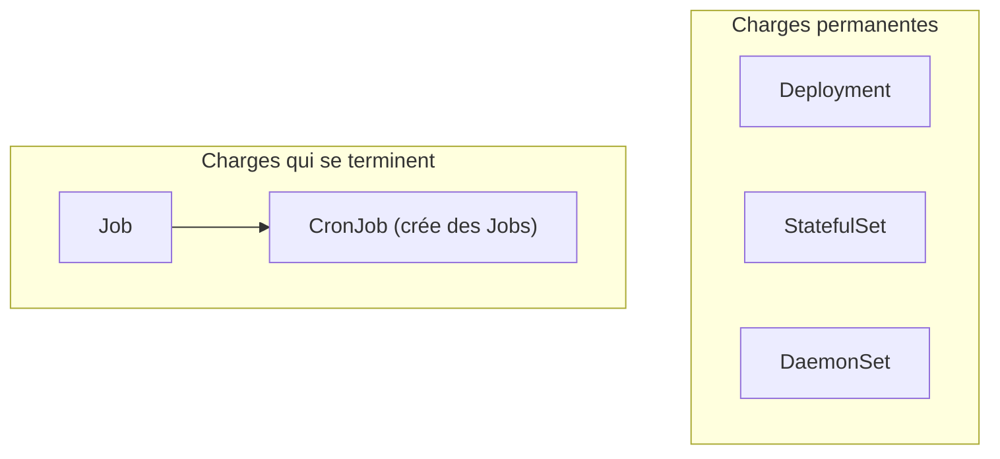
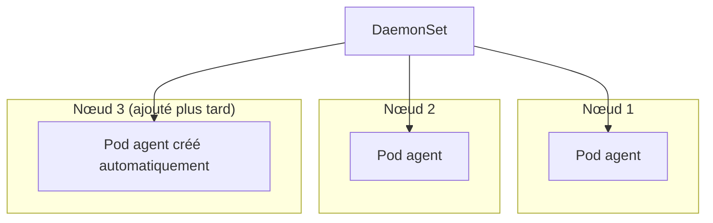
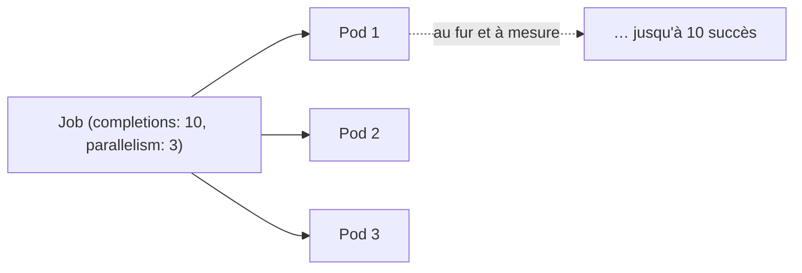
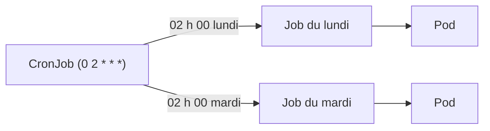

<a id="top"></a>

# 03 — DaemonSet, Jobs et CronJobs

> **Module [18 — Kubernetes : suite de la théorie (partie 3)](README.md)** · Leçon 3 sur 4

## Table des matières

- [1. Une famille de contrôleurs](#1-une-famille-de-controleurs)
- [2. Le DaemonSet : un Pod par nœud](#2-le-daemonset--un-pod-par-noeud)
- [3. Le Job : une tâche qui se termine](#3-le-job--une-tache-qui-se-termine)
- [4. Parallélisme et reprise sur échec](#4-parallelisme-et-reprise-sur-echec)
- [5. Le CronJob : une tâche planifiée](#5-le-cronjob--une-tache-planifiee)
- [6. Gérer les chevauchements et l'historique](#6-gerer-les-chevauchements-et-lhistorique)
- [7. Tableau comparatif](#7-tableau-comparatif)
- [Quiz](#quiz)
- [Pratique](#pratique)
- [Synthèse](#synthese)

---

## 1. Une famille de contrôleurs

Le **Deployment** n'est qu'un contrôleur parmi d'autres. Chacun répond à une question différente : **« combien de Pods, où, et pendant combien de temps ? »**

| Contrôleur | Question à laquelle il répond | Les Pods s'arrêtent-ils ? |
|---|---|---|
| **Deployment** | « N répliques identiques, n'importe où » | Non (service permanent) |
| **StatefulSet** | « N répliques avec identité et stockage propres » | Non |
| **DaemonSet** | « **Un** Pod sur **chaque** nœud » | Non |
| **Job** | « Cette tâche, **une fois**, jusqu'au succès » | **Oui** (à la fin) |
| **CronJob** | « Cette tâche, **régulièrement** » | **Oui** (à chaque exécution) |



---

## 2. Le DaemonSet : un Pod par nœud

Un **DaemonSet** garantit qu'**exactement un** Pod tourne sur **chaque nœud** du cluster (ou sur un sous-ensemble choisi). Vous ne précisez **pas** de `replicas` : le nombre s'ajuste **automatiquement** au nombre de nœuds.

**Cas d'usage typiques — des agents d'infrastructure :**

- **collecte de journaux** (Fluent Bit, Filebeat) : il faut lire les logs **de chaque nœud** ;
- **métriques** (node-exporter de Prometheus) : mesurer **chaque machine** ;
- **réseau** (agents CNI comme Calico) et **stockage** ;
- **sécurité** (agents de détection).



### Manifeste

```yaml
apiVersion: apps/v1
kind: DaemonSet
metadata:
  name: collecteur-logs
spec:
  selector:
    matchLabels:
      app: collecteur
  template:
    metadata:
      labels:
        app: collecteur
    spec:
      tolerations:                 # pour tourner AUSSI sur les nœuds du control plane
        - key: node-role.kubernetes.io/control-plane
          operator: Exists
          effect: NoSchedule
      containers:
        - name: agent
          image: busybox:1.36
          command: ["sh", "-c", "while true; do echo collecte sur $(hostname); sleep 30; done"]
          volumeMounts:
            - name: journaux
              mountPath: /var/log
              readOnly: true
      volumes:
        - name: journaux
          hostPath:                 # lit les journaux DU NŒUD
            path: /var/log
```

**Deux éléments propres au DaemonSet :**

- **`tolerations`** : par défaut, les nœuds du *control plane* sont « marqués » (taint) pour repousser les Pods. Un agent d'infrastructure doit souvent y tourner quand même (voir module 19).
- **`hostPath`** : légitime ici, car l'agent doit justement accéder au système de fichiers **du nœud**.

> On peut restreindre un DaemonSet à certains nœuds avec un **`nodeSelector`** (ex. seulement les nœuds `disque=ssd`). Le DaemonSet placera alors un Pod sur **chaque nœud correspondant**.

---

## 3. Le Job : une tâche qui se termine

Un **Job** exécute un ou plusieurs Pods **jusqu'à leur bonne fin**. Contrairement à un Deployment, un Pod de Job qui se termine avec le code **0** est un **succès** — il ne doit **pas** être redémarré.

**Cas d'usage :** migration de base de données, traitement par lot, calcul, sauvegarde, envoi massif de courriels, import/export de données.

```yaml
apiVersion: batch/v1
kind: Job
metadata:
  name: migration-bd
spec:
  backoffLimit: 4              # nombre de tentatives avant de déclarer l'échec
  activeDeadlineSeconds: 600   # délai maximal global (10 min), sinon arrêt forcé
  ttlSecondsAfterFinished: 300 # suppression automatique 5 min après la fin
  template:
    spec:
      restartPolicy: OnFailure # OBLIGATOIRE : OnFailure ou Never (jamais Always)
      containers:
        - name: migration
          image: busybox:1.36
          command: ["sh", "-c", "echo migration en cours && sleep 10 && echo terminee"]
```

**Champs essentiels :**

| Champ | Rôle |
|---|---|
| **`restartPolicy`** | Doit être `OnFailure` ou `Never`. `Always` est **interdit** (une tâche doit pouvoir se terminer) |
| **`backoffLimit`** | Nombre de **nouvelles tentatives** en cas d'échec (6 par défaut), avec délai croissant |
| **`activeDeadlineSeconds`** | **Durée maximale** ; au-delà, le Job est arrêté et marqué en échec |
| **`ttlSecondsAfterFinished`** | **Nettoyage automatique** du Job (et de ses Pods) après la fin |

> Sans `ttlSecondsAfterFinished`, les Jobs terminés **s'accumulent** dans le cluster. C'est un grand classique des clusters encombrés.

---

## 4. Parallélisme et reprise sur échec

Deux champs contrôlent **combien** de Pods s'exécutent et **combien** doivent réussir :

| Champ | Signification |
|---|---|
| **`completions`** | Nombre de terminaisons **réussies** requises pour que le Job soit un succès |
| **`parallelism`** | Nombre de Pods pouvant tourner **en même temps** |

### Trois motifs courants

```yaml
# 1. Tâche unique (défaut) : completions=1, parallelism=1
# 2. File de travail à N éléments :
spec:
  completions: 10     # 10 unités de travail à traiter
  parallelism: 3      # 3 à la fois

# 3. File partagée (les Pods se coordonnent via une file externe) :
spec:
  parallelism: 5      # completions non défini : le Job finit quand un Pod réussit et que la file est vide
```



### En cas d'échec

Si un Pod échoue (code de sortie ≠ 0), le Job en **recrée** un, jusqu'à `backoffLimit`. Le délai entre tentatives **croît exponentiellement** (10 s, 20 s, 40 s…) pour éviter de marteler un service en panne.

> **Important :** votre tâche doit être **idempotente**. Une même unité de travail peut être exécutée **plus d'une fois** (relance après un échec réseau, par exemple).

---

## 5. Le CronJob : une tâche planifiée

Un **CronJob** crée un **Job** selon une **planification** de type cron. C'est le `cron` de Kubernetes.

```yaml
apiVersion: batch/v1
kind: CronJob
metadata:
  name: sauvegarde-nocturne
spec:
  schedule: "0 2 * * *"          # tous les jours à 02 h 00
  timeZone: "America/Toronto"     # fuseau horaire explicite (recommandé)
  concurrencyPolicy: Forbid       # voir §6
  startingDeadlineSeconds: 300    # tolérance si le cluster était indisponible
  successfulJobsHistoryLimit: 3   # garder les 3 derniers succès
  failedJobsHistoryLimit: 1       # garder le dernier échec
  jobTemplate:
    spec:
      backoffLimit: 2
      template:
        spec:
          restartPolicy: OnFailure
          containers:
            - name: sauvegarde
              image: busybox:1.36
              command: ["sh", "-c", "echo sauvegarde du $(date) && sleep 5"]
```

### Lire une expression cron

```
┌───────────── minute (0-59)
│ ┌─────────── heure (0-23)
│ │ ┌───────── jour du mois (1-31)
│ │ │ ┌─────── mois (1-12)
│ │ │ │ ┌───── jour de la semaine (0-6, dimanche = 0)
│ │ │ │ │
* * * * *
```

| Expression | Signification |
|---|---|
| `*/5 * * * *` | Toutes les **5 minutes** |
| `0 * * * *` | Au début de **chaque heure** |
| `0 2 * * *` | Tous les jours à **02 h 00** |
| `0 3 * * 0` | Chaque **dimanche** à 03 h 00 |
| `0 0 1 * *` | Le **1er** de chaque mois à minuit |



> **`timeZone`** évite un piège classique : sans lui, la planification suit le fuseau du cluster (souvent **UTC**), et « 2 h du matin » ne tombe pas à l'heure attendue.

---

## 6. Gérer les chevauchements et l'historique

### `concurrencyPolicy`

Que faire si l'exécution précédente **n'est pas terminée** quand la suivante doit démarrer ?

| Valeur | Comportement | Quand l'utiliser |
|---|---|---|
| **`Allow`** (défaut) | Les exécutions **se chevauchent** | Tâches courtes et indépendantes |
| **`Forbid`** | La nouvelle est **ignorée** tant que l'ancienne tourne | **Sauvegardes**, migrations (éviter les conflits) |
| **`Replace`** | L'ancienne est **annulée** et remplacée | Quand seule la donnée **la plus récente** compte |

### Historique et suspension

- `successfulJobsHistoryLimit` / `failedJobsHistoryLimit` : combien de Jobs terminés **conserver** (utile pour consulter les logs *a posteriori*).
- `suspend: true` : **met en pause** la planification sans supprimer le CronJob — idéal pendant une maintenance.

```bash
kubectl patch cronjob sauvegarde-nocturne -p '{"spec":{"suspend":true}}'
kubectl create job --from=cronjob/sauvegarde-nocturne test-manuel   # déclencher à la main
```

---

## 7. Tableau comparatif

| | **DaemonSet** | **Job** | **CronJob** |
|---|---|---|---|
| Nombre de Pods | 1 par nœud (auto) | `completions` / `parallelism` | Selon le Job créé |
| Se termine ? | Non | **Oui** | **Oui**, à chaque occurrence |
| `restartPolicy` | `Always` | `OnFailure` ou `Never` | `OnFailure` ou `Never` |
| Déclencheur | Présence d'un nœud | Création de l'objet | **Planification** cron |
| Exemple | Agent de logs, node-exporter | Migration de base | Sauvegarde nocturne |
| Nettoyage | — | `ttlSecondsAfterFinished` | `*JobsHistoryLimit` |

---

## Quiz

**1.** Pourquoi un DaemonSet n'a-t-il pas de champ `replicas` ?

<details><summary>Réponse</summary>

Parce que le nombre de Pods est **déterminé par le nombre de nœuds** : exactement un par nœud éligible. Si un nœud est ajouté au cluster, un Pod y est créé **automatiquement** ; s'il est retiré, le Pod disparaît avec lui.
</details>

**2.** Pourquoi `restartPolicy: Always` est-il interdit dans un Job ?

<details><summary>Réponse</summary>

Parce qu'`Always` redémarrerait le conteneur **même après un succès** : la tâche ne se terminerait **jamais**. Un Job doit pouvoir aboutir, d'où `OnFailure` (relancer seulement en cas d'échec) ou `Never`.
</details>

**3.** Un Job a `completions: 6` et `parallelism: 2`. Que se passe-t-il ?

<details><summary>Réponse</summary>

Kubernetes exécute **2 Pods à la fois** et en relance au fur et à mesure jusqu'à obtenir **6 terminaisons réussies** au total. Le Job est alors marqué comme complet.
</details>

**4.** Une sauvegarde dure parfois plus longtemps que l'intervalle de planification. Quelle `concurrencyPolicy` choisir ?

<details><summary>Réponse</summary>

**`Forbid`** : la nouvelle exécution est ignorée tant que la précédente tourne, ce qui évite deux sauvegardes simultanées (risque de corruption ou de surcharge).
</details>

**5.** À quoi sert `ttlSecondsAfterFinished` ?

<details><summary>Réponse</summary>

À **supprimer automatiquement** le Job et ses Pods un certain temps après leur fin. Sans lui, les objets terminés **s'accumulent** et encombrent le cluster.
</details>

**6.** Pourquoi une tâche de Job doit-elle être idempotente ?

<details><summary>Réponse</summary>

Parce qu'un Pod peut être **relancé** (échec, éviction, problème réseau). La même unité de travail peut donc s'exécuter **plusieurs fois** : le résultat doit rester correct.
</details>

---

## Pratique

**Énoncé :** créez (1) un Job qui traite 6 unités de travail 2 par 2, (2) un CronJob qui s'exécute chaque minute et ne conserve que 3 succès, puis déclenchez-le manuellement une fois.

<details>
<summary><strong>Correction détaillée</strong></summary>

**1) Le Job parallèle** (`job.yaml`) :

```yaml
apiVersion: batch/v1
kind: Job
metadata:
  name: traitement-lot
spec:
  completions: 6            # 6 unités à traiter
  parallelism: 2            # 2 en même temps
  backoffLimit: 3
  ttlSecondsAfterFinished: 120
  template:
    spec:
      restartPolicy: OnFailure
      containers:
        - name: worker
          image: busybox:1.36
          command: ["sh", "-c", "echo traitement par $(hostname) && sleep 5"]
```

```bash
kubectl apply -f job.yaml
kubectl get pods -w            # 2 Pods à la fois, jusqu'à 6 terminés
kubectl get job traitement-lot # COMPLETIONS doit afficher 6/6
kubectl logs -l job-name=traitement-lot --tail=20
```

**2) Le CronJob** (`cronjob.yaml`) :

```yaml
apiVersion: batch/v1
kind: CronJob
metadata:
  name: rapport-minute
spec:
  schedule: "* * * * *"           # chaque minute (pour la démonstration)
  timeZone: "America/Toronto"
  concurrencyPolicy: Forbid
  successfulJobsHistoryLimit: 3
  failedJobsHistoryLimit: 1
  jobTemplate:
    spec:
      template:
        spec:
          restartPolicy: OnFailure
          containers:
            - name: rapport
              image: busybox:1.36
              command: ["sh", "-c", "echo rapport genere le $(date)"]
```

```bash
kubectl apply -f cronjob.yaml
kubectl get cronjob                    # colonne LAST SCHEDULE
kubectl get jobs -w                    # un nouveau Job par minute
kubectl logs -l job-name=$(kubectl get jobs -o jsonpath='{.items[0].metadata.name}')
```

**3) Déclenchement manuel** (sans attendre l'heure) :

```bash
kubectl create job --from=cronjob/rapport-minute essai-manuel
kubectl logs job/essai-manuel
```

**4) Vérifier la limite d'historique :** après 4–5 minutes, `kubectl get jobs` ne doit conserver que **3** Jobs réussis — les plus anciens sont supprimés automatiquement.

**5) Mise en pause et nettoyage :**

```bash
kubectl patch cronjob rapport-minute -p '{"spec":{"suspend":true}}'
kubectl delete cronjob rapport-minute
kubectl delete job traitement-lot essai-manuel --ignore-not-found
```
</details>

---

## Synthèse

- Le **DaemonSet** place **un Pod par nœud**, sans `replicas` : idéal pour les **agents d'infrastructure** (logs, métriques, réseau). Il a souvent besoin de **tolerations** et d'accès `hostPath`.
- Le **Job** exécute une tâche **jusqu'au succès** ; `restartPolicy` doit être `OnFailure` ou `Never`.
- **`completions`** = combien de succès requis ; **`parallelism`** = combien en parallèle ; **`backoffLimit`** = nombre de tentatives ; **`ttlSecondsAfterFinished`** = nettoyage automatique.
- Les tâches doivent être **idempotentes** : un Pod peut être relancé.
- Le **CronJob** crée des Jobs selon une **planification cron** ; précisez **`timeZone`**.
- **`concurrencyPolicy`** gère les chevauchements : `Allow`, **`Forbid`** (sauvegardes) ou `Replace`.
- On peut **suspendre** un CronJob (`suspend: true`) et le **déclencher manuellement** (`kubectl create job --from=cronjob/...`).

---

> Leçon précédente : **[02 — StatefulSet](02-statefulset.md)** · Leçon suivante : **[04 — Namespaces, quotas et limites](04-namespaces-quotas-et-limites.md)**.

---

<p align="center">
  <strong>Cours créé par Dr. Haythem REHOUMA — Développement et déploiement de solutions de données</strong>
</p>
