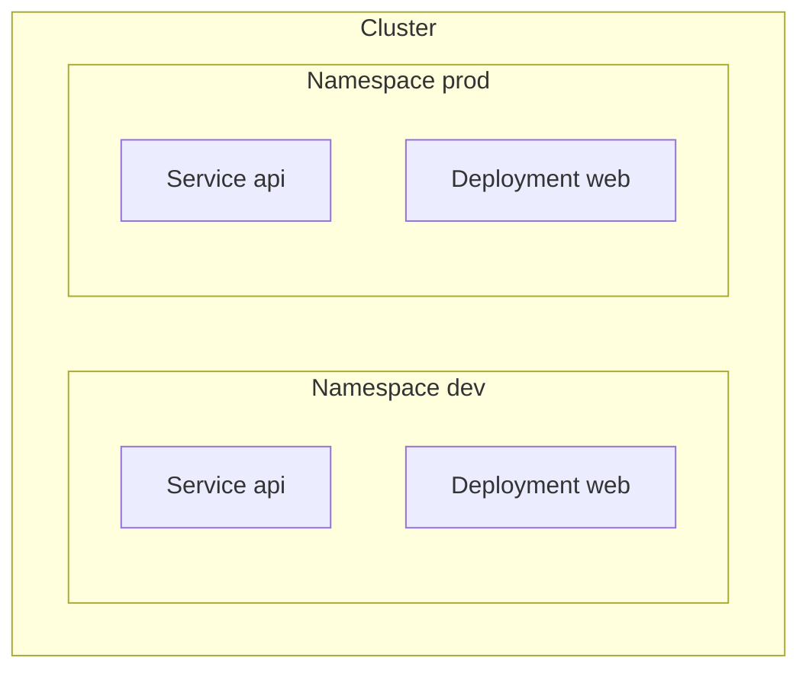
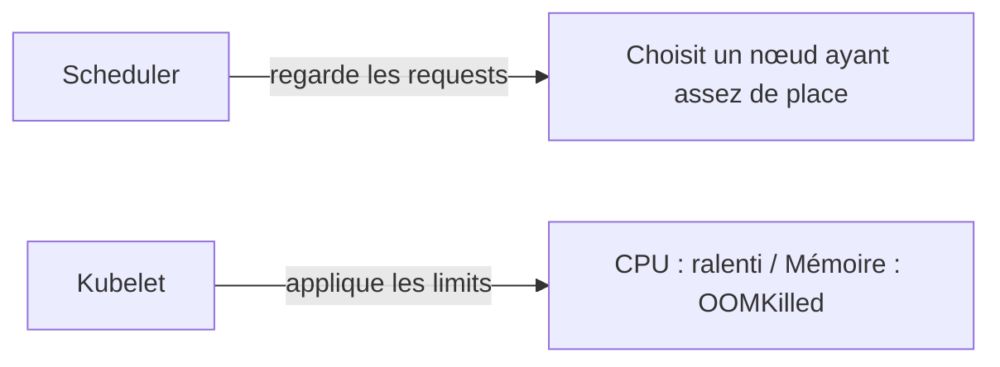
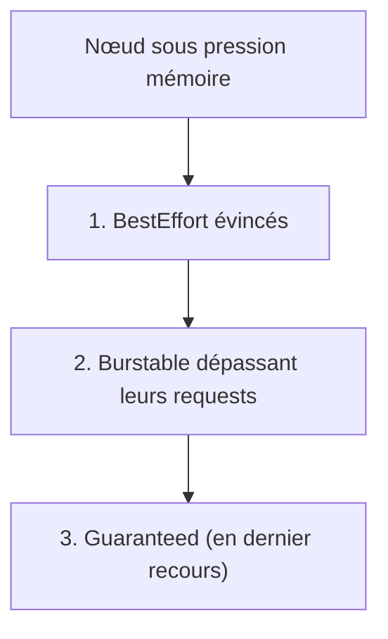
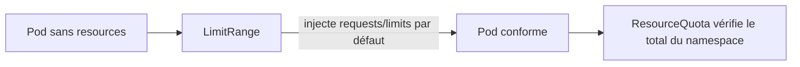

<a id="top"></a>

# 04 — Namespaces, quotas et limites

> **Module [18 — Kubernetes : suite de la théorie (partie 3)](README.md)** · Leçon 4 sur 4

## Table des matières

- [1. Les Namespaces : cloisonner un cluster](#1-les-namespaces--cloisonner-un-cluster)
- [2. Ce qui est cloisonné… et ce qui ne l'est pas](#2-ce-qui-est-cloisonne-et-ce-qui-ne-lest-pas)
- [3. Travailler avec les namespaces](#3-travailler-avec-les-namespaces)
- [4. requests et limits](#4-requests-et-limits)
- [5. Les classes de QoS et l'éviction](#5-les-classes-de-qos-et-leviction)
- [6. ResourceQuota : plafonner un namespace](#6-resourcequota--plafonner-un-namespace)
- [7. LimitRange : encadrer chaque conteneur](#7-limitrange--encadrer-chaque-conteneur)
- [8. Une stratégie cohérente](#8-une-strategie-coherente)
- [Quiz](#quiz)
- [Pratique](#pratique)
- [Synthèse](#synthese)

---

## 1. Les Namespaces : cloisonner un cluster

Un **Namespace** est une **division logique** du cluster : une façon de regrouper des objets et d'éviter qu'ils se marchent dessus.

**À quoi cela sert concrètement :**

- séparer les **environnements** (`dev`, `staging`, `prod`) ;
- séparer les **équipes** ou les **projets** ;
- **réutiliser les mêmes noms** (un Service `api` peut exister dans `dev` **et** dans `prod`) ;
- appliquer des **quotas**, des **droits** (RBAC) et des **politiques réseau** par périmètre.



**Les namespaces créés d'office :**

| Namespace | Contenu |
|---|---|
| **`default`** | Où atterrissent vos objets si vous ne précisez rien |
| **`kube-system`** | Les composants de Kubernetes (CoreDNS, kube-proxy…) — **ne rien y déployer** |
| **`kube-public`** | Ressources lisibles par tous (rarement utilisé) |
| **`kube-node-lease`** | Signaux de vie (*heartbeats*) des nœuds |

> Un Namespace **n'est pas une frontière de sécurité** en soi : sans **RBAC** ni **NetworkPolicy** (module 19), un Pod de `dev` peut toujours joindre un Pod de `prod` sur le réseau.

---

## 2. Ce qui est cloisonné… et ce qui ne l'est pas

Toutes les ressources ne vivent pas dans un namespace.

| Ressources **avec** namespace | Ressources **globales** (cluster) |
|---|---|
| Pod, Deployment, StatefulSet, DaemonSet | Node |
| Service, Ingress | PersistentVolume (PV) |
| ConfigMap, Secret | StorageClass |
| PersistentVolumeClaim (PVC) | ClusterRole, ClusterRoleBinding |
| Job, CronJob | Namespace lui-même |
| Role, RoleBinding, ServiceAccount | CustomResourceDefinition |

Pour trancher :

```bash
kubectl api-resources --namespaced=true     # ce qui est cloisonné
kubectl api-resources --namespaced=false    # ce qui est global
```

> Notez la subtilité : le **PVC** appartient à un namespace, mais le **PV** est **global**. Un PVC de `dev` peut donc se lier à un PV du cluster, mais un Pod de `prod` ne peut pas utiliser le PVC de `dev`.

**Le DNS reflète le cloisonnement** (voir la leçon sur les Services) :

```
api                      # le Service "api" du MÊME namespace
api.prod                 # le Service "api" du namespace prod
api.prod.svc.cluster.local
```

---

## 3. Travailler avec les namespaces

```bash
# Créer
kubectl create namespace dev

# Lister
kubectl get namespaces

# Agir dans un namespace précis
kubectl get pods -n dev
kubectl apply -f app.yaml -n dev

# Voir TOUS les namespaces
kubectl get pods --all-namespaces        # ou -A

# Changer le namespace par défaut du contexte (évite de taper -n à chaque fois)
kubectl config set-context --current --namespace=dev
```

En YAML, on précise le namespace dans les métadonnées :

```yaml
apiVersion: v1
kind: Namespace
metadata:
  name: dev
  labels:
    environnement: developpement
---
apiVersion: apps/v1
kind: Deployment
metadata:
  name: web
  namespace: dev        # cet objet vivra dans "dev"
spec:
  # ...
```

> **Bonne pratique :** ne pas coder le namespace en dur dans les manifestes applicatifs. Laissez-le vide et choisissez-le au déploiement (`-n`), ou gérez-le avec Helm (module 09). Le même manifeste sert alors pour `dev` et `prod`.

**Attention à la suppression :** `kubectl delete namespace dev` supprime **tout** ce qu'il contient (Deployments, Services, PVC…). C'est efficace pour nettoyer, mais **irréversible**.

---

## 4. requests et limits

Chaque conteneur peut déclarer deux valeurs par ressource (CPU, mémoire) :

| Champ | Signification | Utilisé par |
|---|---|---|
| **`requests`** | Ce dont le conteneur a **besoin au minimum** — **réservé** pour lui | Le **scheduler**, pour choisir un nœud |
| **`limits`** | Ce qu'il ne doit **jamais dépasser** | Le **kubelet**, pour brider ou tuer |

```yaml
resources:
  requests:
    cpu: "100m"        # 100 millicores = 0,1 cœur
    memory: "128Mi"
  limits:
    cpu: "500m"        # 0,5 cœur
    memory: "256Mi"
```

### Les unités

- **CPU** : `1` = un cœur ; `500m` = 0,5 cœur ; `100m` = 0,1 cœur. Le CPU est **compressible**.
- **Mémoire** : `Mi` (mébioctet, 1024²) et `Gi` (gibioctet). La mémoire est **incompressible**.

### La différence de traitement, essentielle

| Ressource | Dépassement de la limite | Conséquence |
|---|---|---|
| **CPU** | Le conteneur est **ralenti** (*throttling*) | L'application devient lente, mais **survit** |
| **Mémoire** | Le conteneur est **tué** (**OOMKilled**) | Redémarrage du conteneur |



> **Piège classique :** un Pod reste en **`Pending`** parce que ses `requests` dépassent ce qui reste sur **tous** les nœuds. Le message de `kubectl describe pod` est alors « Insufficient cpu/memory ».

---

## 5. Les classes de QoS et l'éviction

Kubernetes classe automatiquement chaque Pod selon ses `requests`/`limits`. Cette **classe de QoS** détermine **qui est sacrifié en premier** quand un nœud manque de mémoire.

| Classe | Condition | Risque d'éviction |
|---|---|---|
| **Guaranteed** | `limits` = `requests` pour **toutes** les ressources de **tous** les conteneurs | **Le plus faible** |
| **Burstable** | Au moins une `request` définie, mais pas d'égalité stricte | Moyen |
| **BestEffort** | **Aucune** `request` ni `limit` | **Évincé en premier** |



Vérifier la classe d'un Pod :

```bash
kubectl get pod mon-pod -o jsonpath='{.status.qosClass}'
```

> **Recommandation :** pour une application critique (base de données), visez **Guaranteed** (`limits` = `requests`). Pour des charges élastiques, **Burstable** convient. **BestEffort** n'a sa place que pour des tâches sacrifiables.

---

## 6. ResourceQuota : plafonner un namespace

Un **ResourceQuota** limite la consommation **totale** d'un namespace. C'est l'outil du **partage équitable** entre équipes.

```yaml
apiVersion: v1
kind: ResourceQuota
metadata:
  name: quota-dev
  namespace: dev
spec:
  hard:
    requests.cpu: "4"              # somme des requests CPU du namespace
    requests.memory: 8Gi
    limits.cpu: "8"                # somme des limits
    limits.memory: 16Gi
    persistentvolumeclaims: "10"   # nombre max de PVC
    requests.storage: 100Gi        # stockage total demandé
    pods: "50"                     # nombre max de Pods
    services: "10"
    services.loadbalancers: "2"    # limite les LB coûteux
    count/deployments.apps: "20"
```

**Effet immédiat et souvent surprenant :** dès qu'un quota portant sur `requests.cpu`/`memory` existe dans un namespace, **tout conteneur créé doit déclarer** ces valeurs. Sinon la création est **refusée** :

```
Error: failed quota: quota-dev: must specify requests.cpu, requests.memory
```

C'est précisément le rôle du **LimitRange** de fournir des valeurs par défaut (§7).

```bash
kubectl get resourcequota -n dev
kubectl describe resourcequota quota-dev -n dev   # colonnes Used / Hard
```

---

## 7. LimitRange : encadrer chaque conteneur

Là où le ResourceQuota plafonne **le namespace entier**, le **LimitRange** agit sur **chaque conteneur individuellement** : il fixe des **valeurs par défaut** et des **bornes**.

```yaml
apiVersion: v1
kind: LimitRange
metadata:
  name: limites-dev
  namespace: dev
spec:
  limits:
    - type: Container
      default:                 # limits appliquées si non précisées
        cpu: "500m"
        memory: "512Mi"
      defaultRequest:          # requests appliquées si non précisées
        cpu: "100m"
        memory: "128Mi"
      min:                     # plancher autorisé
        cpu: "50m"
        memory: "64Mi"
      max:                     # plafond autorisé par conteneur
        cpu: "2"
        memory: "2Gi"
    - type: PersistentVolumeClaim
      min:
        storage: 1Gi
      max:
        storage: 50Gi
```

| Champ | Effet |
|---|---|
| **`defaultRequest`** | `requests` injectées automatiquement si le conteneur n'en déclare pas |
| **`default`** | `limits` injectées automatiquement |
| **`min` / `max`** | **Refus** de création si le conteneur sort de ces bornes |



**La combinaison gagnante :** `LimitRange` garantit que **chaque** conteneur a des valeurs (donc pas de BestEffort involontaire), et `ResourceQuota` garantit que **la somme** reste sous contrôle.

---

## 8. Une stratégie cohérente

Un modèle simple et robuste pour un cluster partagé :

1. **Un namespace par environnement et/ou par équipe** (`dev`, `staging`, `prod`).
2. Un **LimitRange** dans chacun → aucun conteneur sans `requests`/`limits`.
3. Un **ResourceQuota** dimensionné selon l'importance de l'environnement (`prod` > `dev`).
4. Des **droits RBAC** par namespace (module 19) → chacun n'agit que chez lui.
5. Des **NetworkPolicy** (module 19) → cloisonnement **réseau** réel.

| Environnement | requests.cpu | requests.memory | Pods | LoadBalancers |
|---|---|---|---|---|
| `dev` | 4 | 8Gi | 50 | 0 |
| `staging` | 8 | 16Gi | 80 | 1 |
| `prod` | 32 | 64Gi | 300 | 5 |

> **À retenir :** les quotas ne sont pas qu'une contrainte administrative. Ils **protègent** le cluster : sans eux, une application qui fuit en mémoire peut faire tomber les Pods des **autres** équipes sur le même nœud.

---

## Quiz

**1.** Deux Services nommés `api` peuvent-ils coexister dans le cluster ?

<details><summary>Réponse</summary>

**Oui**, à condition qu'ils soient dans des **namespaces différents**. L'unicité d'un nom est garantie **par namespace**, pas au niveau du cluster. On les distingue par leur DNS : `api.dev` et `api.prod`.
</details>

**2.** Quelle est la différence fondamentale entre `requests` et `limits` ?

<details><summary>Réponse</summary>

Les **`requests`** servent au **scheduler** : elles réservent une place et déterminent **sur quel nœud** le Pod peut être placé. Les **`limits`** servent au **kubelet** : elles définissent le plafond à l'exécution (CPU **ralenti**, mémoire **OOMKilled**).
</details>

**3.** Un conteneur dépasse sa limite mémoire. Que se passe-t-il ? Et pour le CPU ?

<details><summary>Réponse</summary>

Pour la **mémoire** (incompressible), le conteneur est **tué** (`OOMKilled`) puis redémarré. Pour le **CPU** (compressible), il est simplement **ralenti** (*throttling*) : l'application devient lente, mais n'est pas tuée.
</details>

**4.** Quel Pod est évincé en premier quand un nœud manque de mémoire ?

<details><summary>Réponse</summary>

Un Pod **BestEffort** (aucune `request` ni `limit`). Viennent ensuite les **Burstable** qui dépassent leurs `requests`, et enfin, en dernier recours, les **Guaranteed** (`limits` = `requests`).
</details>

**5.** Après avoir créé un ResourceQuota sur `requests.cpu`, les nouveaux Pods sont refusés. Pourquoi ?

<details><summary>Réponse</summary>

Parce qu'un quota sur les ressources **oblige** chaque conteneur à déclarer ses `requests`/`limits`. Ceux qui n'en ont pas sont rejetés. La solution est d'ajouter un **LimitRange** qui fournit des valeurs **par défaut**.
</details>

**6.** Quelle est la différence de portée entre ResourceQuota et LimitRange ?

<details><summary>Réponse</summary>

Le **ResourceQuota** plafonne la consommation **totale du namespace** (somme de tous les objets). Le **LimitRange** agit sur **chaque conteneur (ou PVC) individuellement** : valeurs par défaut et bornes min/max.
</details>

---

## Pratique

**Énoncé :** créez un namespace `atelier` avec un LimitRange et un ResourceQuota. Démontrez (1) qu'un Pod sans `resources` reçoit des valeurs par défaut, (2) qu'un Pod trop gourmand est refusé, (3) que le quota bloque au-delà du plafond.

<details>
<summary><strong>Correction détaillée</strong></summary>

**1) Le namespace, le LimitRange et le quota** (`atelier.yaml`) :

```yaml
apiVersion: v1
kind: Namespace
metadata:
  name: atelier
---
apiVersion: v1
kind: LimitRange
metadata:
  name: limites
  namespace: atelier
spec:
  limits:
    - type: Container
      defaultRequest:
        cpu: "100m"
        memory: "128Mi"
      default:
        cpu: "200m"
        memory: "256Mi"
      max:
        cpu: "500m"
        memory: "512Mi"
---
apiVersion: v1
kind: ResourceQuota
metadata:
  name: quota
  namespace: atelier
spec:
  hard:
    requests.cpu: "500m"
    requests.memory: 640Mi
    pods: "5"
```

```bash
kubectl apply -f atelier.yaml
kubectl describe resourcequota quota -n atelier
```

**2) Preuve des valeurs par défaut** — un Pod qui ne déclare **rien** :

```bash
kubectl run sans-resources --image=busybox:1.36 -n atelier -- sleep 3600
kubectl get pod sans-resources -n atelier -o jsonpath='{.spec.containers[0].resources}'
```

**Résultat attendu :** `{"limits":{"cpu":"200m","memory":"256Mi"},"requests":{"cpu":"100m","memory":"128Mi"}}` — les valeurs viennent du **LimitRange**, alors qu'aucune n'a été demandée.

Vérifiez aussi la classe de QoS :

```bash
kubectl get pod sans-resources -n atelier -o jsonpath='{.status.qosClass}'   # Burstable
```

**3) Preuve du refus par le LimitRange** (`trop-gros.yaml`) :

```yaml
apiVersion: v1
kind: Pod
metadata:
  name: trop-gros
  namespace: atelier
spec:
  containers:
    - name: app
      image: busybox:1.36
      command: ["sleep", "3600"]
      resources:
        requests: { cpu: "100m", memory: "128Mi" }
        limits:   { cpu: "2", memory: "2Gi" }     # au-dessus du max autorisé
```

```bash
kubectl apply -f trop-gros.yaml
```

**Résultat attendu :** création **refusée**, avec un message du type
`maximum cpu usage per Container is 500m, but limit is 2`.

**4) Preuve du plafond de quota :** lancez des Pods jusqu'à saturation (le quota autorise `500m` de `requests.cpu`, soit 5 Pods à `100m`) :

```bash
for i in 1 2 3 4 5 6; do kubectl run charge$i --image=busybox:1.36 -n atelier -- sleep 3600; done
kubectl describe resourcequota quota -n atelier    # Used ≈ Hard
```

Le Pod excédentaire est refusé avec `exceeded quota: quota, requested: ..., used: ..., limited: ...`.

**5) Nettoyage :**

```bash
kubectl delete namespace atelier      # supprime TOUT le contenu du namespace
```
</details>

---

## Synthèse

- Un **Namespace** est une **division logique** : il permet de réutiliser les mêmes noms, de séparer environnements et équipes, et sert de périmètre aux **quotas**, au **RBAC** et aux **NetworkPolicy**.
- Certaines ressources sont **globales** (Node, PV, StorageClass, ClusterRole) et **ne peuvent pas** être cloisonnées.
- **`requests`** guide le **scheduler** (réservation) ; **`limits`** est appliquée par le **kubelet** (plafond).
- Dépassement : **CPU → ralentissement**, **mémoire → OOMKilled**. La mémoire est **incompressible**.
- Les **classes de QoS** (`Guaranteed`, `Burstable`, `BestEffort`) déterminent l'**ordre d'éviction** sous pression.
- **ResourceQuota** plafonne le **total du namespace** ; **LimitRange** fixe **valeurs par défaut et bornes** par conteneur.
- Les deux sont **complémentaires** : sans LimitRange, un quota sur les ressources fait **échouer** les Pods qui ne déclarent rien.

---

> Leçon précédente : **[03 — DaemonSet, Jobs et CronJobs](03-daemonset-jobs-cronjobs.md)** · Module suivant : **[19 — Kubernetes : suite de la théorie (partie 4)](../19-kubernetes-suite-theorie-partie-4/README.md)**.

---

<p align="center">
  <strong>Cours créé par Dr. Haythem REHOUMA — Développement et déploiement de solutions de données</strong>
</p>
