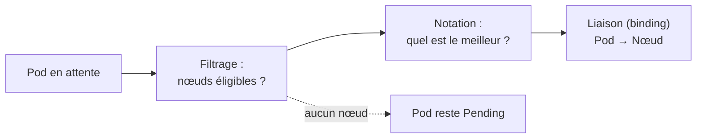
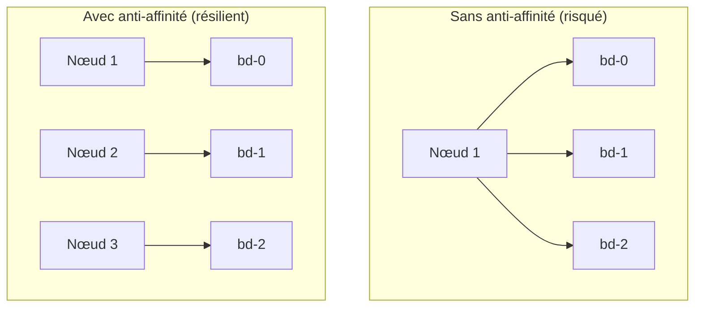
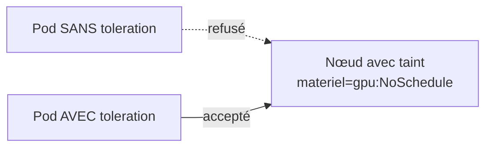
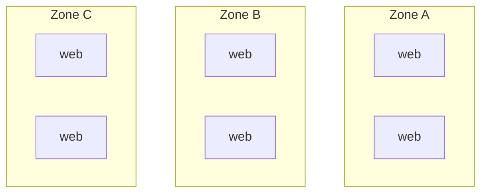

<a id="top"></a>

# 01 — Placement des Pods et scheduling

> **Module [19 — Kubernetes : suite de la théorie (partie 4)](README.md)** · Leçon 1 sur 4

## Table des matières

- [1. Comment le scheduler choisit un nœud](#1-comment-le-scheduler-choisit-un-noeud)
- [2. nodeSelector : le filtrage simple](#2-nodeselector--le-filtrage-simple)
- [3. L'affinité de nœud (nodeAffinity)](#3-laffinite-de-noeud-nodeaffinity)
- [4. Affinité et anti-affinité entre Pods](#4-affinite-et-anti-affinite-entre-pods)
- [5. Taints et tolerations : repousser les Pods](#5-taints-et-tolerations--repousser-les-pods)
- [6. Répartition topologique](#6-repartition-topologique)
- [7. Priorités et préemption](#7-priorites-et-preemption)
- [8. Diagnostiquer un Pod qui ne démarre pas](#8-diagnostiquer-un-pod-qui-ne-demarre-pas)
- [Quiz](#quiz)
- [Pratique](#pratique)
- [Synthèse](#synthese)

---

## 1. Comment le scheduler choisit un nœud

Quand vous créez un Pod, il n'est d'abord affecté à **aucun nœud** (`nodeName` vide). Le **kube-scheduler** entre alors en jeu, en deux temps :

1. **Filtrage** (*filtering*) — il élimine les nœuds **impossibles** : ressources insuffisantes, taints non tolérés, contraintes de sélecteur non satisfaites, ports déjà pris, volume indisponible dans la zone…
2. **Notation** (*scoring*) — parmi les nœuds restants, il attribue un **score** (place disponible, affinités souhaitées, répartition de l'image déjà présente…) et retient **le meilleur**.



**À retenir :** un Pod `Pending` signifie presque toujours qu'**aucun nœud n'a passé le filtrage**. La cause exacte est dans les **événements** (`kubectl describe pod`).

Les outils que nous allons voir agissent à ces deux étapes : certains **filtrent** (contraintes dures), d'autres **notent** (préférences souples).

---

## 2. nodeSelector : le filtrage simple

Le mécanisme le plus élémentaire : « place ce Pod uniquement sur un nœud portant ce **label** ».

```bash
kubectl label node mon-noeud disque=ssd
kubectl get nodes --show-labels
```

```yaml
apiVersion: v1
kind: Pod
metadata:
  name: app-rapide
spec:
  nodeSelector:
    disque: ssd            # tous les labels listés doivent correspondre (ET logique)
  containers:
    - name: app
      image: nginx:alpine
```

**Limites :** pas de « OU », pas de « différent de », pas de préférence. Si aucun nœud ne porte le label, le Pod reste **`Pending`** indéfiniment. Pour plus de souplesse, on utilise l'**affinité**.

> Les nœuds portent déjà des labels standards utiles : `kubernetes.io/os`, `kubernetes.io/arch`, `topology.kubernetes.io/zone`, `node.kubernetes.io/instance-type`.

---

## 3. L'affinité de nœud (nodeAffinity)

L'affinité de nœud est un `nodeSelector` **enrichi**, avec deux niveaux d'exigence :

| Règle | Nature | Si aucun nœud ne correspond |
|---|---|---|
| **`requiredDuringSchedulingIgnoredDuringExecution`** | **Obligatoire** (filtrage) | Le Pod reste **`Pending`** |
| **`preferredDuringSchedulingIgnoredDuringExecution`** | **Préférence** (notation, avec un poids) | Le Pod est placé **ailleurs** |

```yaml
spec:
  affinity:
    nodeAffinity:
      requiredDuringSchedulingIgnoredDuringExecution:
        nodeSelectorTerms:
          - matchExpressions:
              - key: kubernetes.io/os
                operator: In
                values: ["linux"]
      preferredDuringSchedulingIgnoredDuringExecution:
        - weight: 80                      # de 1 à 100
          preference:
            matchExpressions:
              - key: disque
                operator: In
                values: ["ssd"]
        - weight: 20
          preference:
            matchExpressions:
              - key: topology.kubernetes.io/zone
                operator: In
                values: ["ca-central-1a"]
```

**Opérateurs disponibles :** `In`, `NotIn`, `Exists`, `DoesNotExist`, `Gt`, `Lt`.

> Le suffixe **`IgnoredDuringExecution`** est important : la règle s'applique **au moment du placement**. Si les labels du nœud changent **après**, le Pod déjà en cours **n'est pas déplacé**.

---

## 4. Affinité et anti-affinité entre Pods

Ici, on ne raisonne plus par rapport aux **nœuds**, mais par rapport aux **autres Pods** déjà placés.

| Mécanisme | Objectif | Exemple |
|---|---|---|
| **`podAffinity`** | **Rapprocher** des Pods | Mettre le cache Redis sur le même nœud que l'application (latence) |
| **`podAntiAffinity`** | **Éloigner** des Pods | Répartir les 3 répliques d'une base sur 3 nœuds différents (**haute disponibilité**) |

Le champ **`topologyKey`** définit ce que signifie « au même endroit » : même **nœud** (`kubernetes.io/hostname`), même **zone** (`topology.kubernetes.io/zone`), même **région**.

### Anti-affinité : l'usage le plus fréquent

```yaml
spec:
  affinity:
    podAntiAffinity:
      requiredDuringSchedulingIgnoredDuringExecution:
        - labelSelector:
            matchLabels:
              app: bd
          topologyKey: kubernetes.io/hostname   # jamais deux "bd" sur le même nœud
```



**Pourquoi c'est capital :** sans anti-affinité, rien n'empêche le scheduler de placer **les trois répliques sur le même nœud**. La panne de ce nœud emporte alors **tout le service**, malgré les « 3 répliques ».

> Utilisez `preferred` plutôt que `required` si votre cluster peut avoir **moins de nœuds que de répliques** — sinon les Pods excédentaires resteront `Pending`.

---

## 5. Taints et tolerations : repousser les Pods

C'est le mécanisme **inverse** de l'affinité. Ici, c'est **le nœud qui repousse** les Pods.

- Un **taint** (marque) est posé **sur un nœud** : « je n'accepte pas n'importe qui ».
- Une **toleration** est déclarée **sur un Pod** : « j'ai le droit d'aller là malgré la marque ».

```bash
# Poser un taint
kubectl taint nodes noeud-gpu materiel=gpu:NoSchedule

# Le retirer (noter le tiret final)
kubectl taint nodes noeud-gpu materiel=gpu:NoSchedule-
```

```yaml
spec:
  tolerations:
    - key: "materiel"
      operator: "Equal"
      value: "gpu"
      effect: "NoSchedule"
```

### Les trois effets

| Effet | Conséquence |
|---|---|
| **`NoSchedule`** | Aucun **nouveau** Pod sans toleration ne sera placé |
| **`PreferNoSchedule`** | Le scheduler **évite** ce nœud, mais peut l'utiliser en dernier recours |
| **`NoExecute`** | En plus du filtrage, les Pods **déjà présents** sans toleration sont **expulsés** |



**Usages classiques :**

- réserver des nœuds **coûteux** (GPU, mémoire élevée) à certaines charges ;
- protéger les nœuds du **control plane** (taint posé automatiquement) ;
- **vider** un nœud avant maintenance (`kubectl drain` pose un taint `NoExecute`) ;
- Kubernetes pose lui-même des taints en cas de problème : `node.kubernetes.io/not-ready`, `disk-pressure`, `memory-pressure`.

> **Attention :** une toleration **n'attire pas** un Pod vers un nœud, elle l'**autorise** seulement. Pour à la fois autoriser **et** attirer, combinez **toleration** (passer la barrière) et **nodeAffinity** (viser le nœud).

---

## 6. Répartition topologique

L'anti-affinité est un outil binaire (« ensemble » ou « séparés »). Les **`topologySpreadConstraints`** permettent une répartition **équilibrée et mesurée**.

```yaml
spec:
  topologySpreadConstraints:
    - maxSkew: 1                                   # écart maximal toléré entre zones
      topologyKey: topology.kubernetes.io/zone
      whenUnsatisfiable: DoNotSchedule             # ou ScheduleAnyway
      labelSelector:
        matchLabels:
          app: web
```

- **`maxSkew`** : différence maximale du nombre de Pods entre le domaine le plus chargé et le moins chargé.
- **`whenUnsatisfiable`** : `DoNotSchedule` (contrainte **dure**) ou `ScheduleAnyway` (simple **préférence**).

Avec `maxSkew: 1` sur 3 zones et 6 répliques, on obtient une répartition **2/2/2** (et jamais 4/1/1).



---

## 7. Priorités et préemption

Quand le cluster est **plein**, quels Pods doivent passer en premier ? C'est le rôle des **PriorityClass**.

```yaml
apiVersion: scheduling.k8s.io/v1
kind: PriorityClass
metadata:
  name: critique
value: 1000000              # plus la valeur est haute, plus la priorité est grande
globalDefault: false
description: "Charges critiques de production"
preemptionPolicy: PreemptLowerPriority
```

```yaml
spec:
  priorityClassName: critique
```

**La préemption :** si un Pod de haute priorité ne trouve pas de place, le scheduler peut **expulser** des Pods de priorité **inférieure** pour lui en faire.

> À manier avec précaution : mal réglées, les priorités provoquent des **expulsions en cascade**. Réservez les valeurs élevées à ce qui est réellement critique.

---

## 8. Diagnostiquer un Pod qui ne démarre pas

```bash
kubectl get pods -o wide                 # sur quel nœud ? quel statut ?
kubectl describe pod <nom>               # section Events : la raison exacte
kubectl get events --sort-by=.lastTimestamp
kubectl get nodes --show-labels
kubectl describe node <nom> | Select-String -Pattern "Taints|Allocated"
```

| Message dans les événements | Cause | Solution |
|---|---|---|
| `0/3 nodes are available: Insufficient cpu` | `requests` trop élevées | Réduire les `requests` ou ajouter un nœud |
| `node(s) had taint {...}, that the pod didn't tolerate` | Taint non toléré | Ajouter une **toleration** ou retirer le taint |
| `node(s) didn't match Pod's node affinity/selector` | Label absent | Étiqueter le nœud ou assouplir la règle |
| `node(s) didn't match pod anti-affinity rules` | Pas assez de nœuds distincts | Passer en `preferred` ou ajouter des nœuds |
| `node(s) had volume node affinity conflict` | Volume dans une autre zone | `WaitForFirstConsumer` sur la StorageClass |

---

## Quiz

**1.** Quelles sont les deux grandes étapes du scheduling ?

<details><summary>Réponse</summary>

Le **filtrage** (éliminer les nœuds impossibles) puis la **notation** (attribuer un score aux nœuds restants et choisir le meilleur). Si le filtrage ne laisse aucun nœud, le Pod reste **`Pending`**.
</details>

**2.** Quelle différence entre `required...` et `preferred...` dans une affinité ?

<details><summary>Réponse</summary>

`required` est une contrainte **dure** : si aucun nœud ne correspond, le Pod reste `Pending`. `preferred` est une **préférence pondérée** : le scheduler essaie de la respecter, mais place le Pod ailleurs si nécessaire.
</details>

**3.** Vous avez 3 répliques d'une base de données. Quel mécanisme garantit qu'elles ne seront pas sur le même nœud ?

<details><summary>Réponse</summary>

La **`podAntiAffinity`** avec `topologyKey: kubernetes.io/hostname`, en mode `required`. Sans elle, le scheduler peut parfaitement placer les trois répliques sur un seul nœud — et la panne de ce nœud emporterait tout le service.
</details>

**4.** Une toleration suffit-elle à attirer un Pod vers un nœud marqué ?

<details><summary>Réponse</summary>

**Non.** Une toleration **autorise** seulement le Pod à être placé malgré le taint ; elle ne l'**attire** pas. Pour cibler réellement ce nœud, il faut y ajouter une **`nodeAffinity`** (ou un `nodeSelector`).
</details>

**5.** Que fait l'effet `NoExecute` de plus que `NoSchedule` ?

<details><summary>Réponse</summary>

`NoSchedule` empêche seulement l'arrivée de **nouveaux** Pods. `NoExecute` **expulse en plus** les Pods **déjà en cours d'exécution** qui ne tolèrent pas le taint.
</details>

**6.** À quoi sert `maxSkew` dans une contrainte de répartition topologique ?

<details><summary>Réponse</summary>

À définir l'**écart maximal** de nombre de Pods entre le domaine (zone, nœud) le plus chargé et le moins chargé. Avec `maxSkew: 1` et 6 répliques sur 3 zones, on obtient 2/2/2 plutôt que 4/1/1.
</details>

---

## Pratique

**Énoncé :** étiquetez un nœud, forcez-y un Pod, posez un taint et observez le rejet, puis appliquez une anti-affinité à un Deployment de 3 répliques.

<details>
<summary><strong>Correction détaillée</strong></summary>

> Sur un cluster **à un seul nœud** (Docker Desktop), les effets d'anti-affinité `required` se traduisent par des Pods `Pending` : c'est justement **la démonstration** attendue.

**1) Étiqueter le nœud et cibler ce label :**

```bash
kubectl get nodes
kubectl label node docker-desktop disque=ssd
kubectl get nodes --show-labels
```

```yaml
# pod-selector.yaml
apiVersion: v1
kind: Pod
metadata:
  name: cible-ssd
spec:
  nodeSelector:
    disque: ssd
  containers:
    - name: app
      image: nginx:alpine
```

```bash
kubectl apply -f pod-selector.yaml
kubectl get pod cible-ssd -o wide      # placé sur le nœud étiqueté
```

**2) Démontrer un `Pending` par sélecteur impossible :**

```bash
kubectl run introuvable --image=nginx:alpine --overrides='{"spec":{"nodeSelector":{"disque":"disquette"}}}'
kubectl describe pod introuvable | Select-String -Pattern "didn't match"
```

**Résultat attendu :** `node(s) didn't match Pod's node affinity/selector` et un Pod bloqué en `Pending`.

**3) Poser un taint et observer le rejet :**

```bash
kubectl taint nodes docker-desktop maintenance=vrai:NoSchedule
kubectl run refuse --image=nginx:alpine
kubectl describe pod refuse | Select-String -Pattern "taint"
```

Puis créer un Pod **qui tolère** :

```yaml
# pod-tolere.yaml
apiVersion: v1
kind: Pod
metadata:
  name: accepte
spec:
  tolerations:
    - key: "maintenance"
      operator: "Equal"
      value: "vrai"
      effect: "NoSchedule"
  containers:
    - name: app
      image: nginx:alpine
```

```bash
kubectl apply -f pod-tolere.yaml
kubectl get pods                        # "accepte" démarre, "refuse" reste Pending
kubectl taint nodes docker-desktop maintenance=vrai:NoSchedule-   # retirer le taint
```

**4) Anti-affinité sur 3 répliques :**

```yaml
# deploy-anti.yaml
apiVersion: apps/v1
kind: Deployment
metadata:
  name: reparti
spec:
  replicas: 3
  selector:
    matchLabels:
      app: reparti
  template:
    metadata:
      labels:
        app: reparti
    spec:
      affinity:
        podAntiAffinity:
          requiredDuringSchedulingIgnoredDuringExecution:
            - labelSelector:
                matchLabels:
                  app: reparti
              topologyKey: kubernetes.io/hostname
      containers:
        - name: app
          image: nginx:alpine
```

```bash
kubectl apply -f deploy-anti.yaml
kubectl get pods -o wide
kubectl describe pod <un-pod-pending> | Select-String -Pattern "anti-affinity"
```

**Résultat sur un cluster mono-nœud :** **1 seul** Pod démarre, les 2 autres restent `Pending` avec `didn't match pod anti-affinity rules`. C'est la preuve que la règle fonctionne. En remplaçant `required` par `preferred`, les 3 Pods démarrent malgré tout.

**5) Nettoyage :**

```bash
kubectl delete pod cible-ssd introuvable refuse accepte --ignore-not-found
kubectl delete deployment reparti --ignore-not-found
kubectl label node docker-desktop disque-
```
</details>

---

## Synthèse

- Le scheduler procède en deux temps : **filtrage** (nœuds possibles) puis **notation** (meilleur nœud). Un Pod `Pending` = **aucun nœud n'a passé le filtrage**.
- **`nodeSelector`** est le filtrage le plus simple ; la **`nodeAffinity`** ajoute des opérateurs et des **préférences pondérées**.
- La **`podAntiAffinity`** est essentielle à la **haute disponibilité** : elle empêche toutes les répliques d'atterrir sur le même nœud.
- **`topologyKey`** définit le périmètre : même nœud, même zone, même région.
- Les **taints** (sur les nœuds) **repoussent** ; les **tolerations** (sur les Pods) **autorisent** — mais n'attirent pas.
- Effets : `NoSchedule`, `PreferNoSchedule`, **`NoExecute`** (expulse aussi l'existant).
- **`topologySpreadConstraints`** répartit de façon **équilibrée** grâce à `maxSkew`.
- Les **PriorityClass** décident qui passe en premier lorsque le cluster est plein, avec **préemption** possible.

---

> Leçon suivante : **[02 — Mise à l'échelle automatique](02-autoscaling.md)**.

---

<p align="center">
  <strong>Cours créé par Dr. Haythem REHOUMA — Développement et déploiement de solutions de données</strong>
</p>
