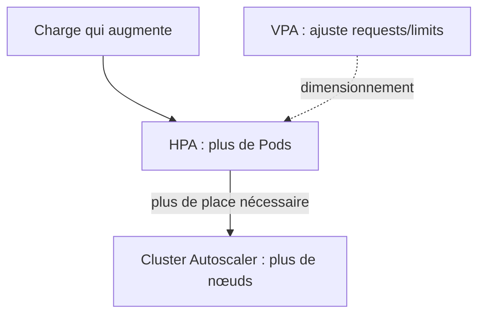
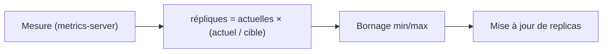
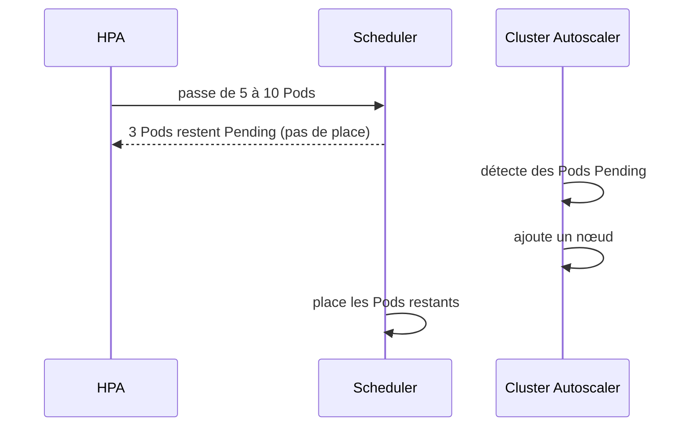

<a id="top"></a>

# 02 — Mise à l'échelle automatique

> **Module [19 — Kubernetes : suite de la théorie (partie 4)](README.md)** · Leçon 2 sur 4

## Table des matières

- [1. Trois dimensions de mise à l'échelle](#1-trois-dimensions-de-mise-a-lechelle)
- [2. Le metrics-server : la source des mesures](#2-le-metrics-server--la-source-des-mesures)
- [3. Le HorizontalPodAutoscaler (HPA)](#3-le-horizontalpodautoscaler-hpa)
- [4. La formule de calcul](#4-la-formule-de-calcul)
- [5. Maîtriser le comportement (behavior)](#5-maitriser-le-comportement-behavior)
- [6. Métriques mémoire, personnalisées et externes](#6-metriques-memoire-personnalisees-et-externes)
- [7. Le VerticalPodAutoscaler (VPA)](#7-le-verticalpodautoscaler-vpa)
- [8. Le Cluster Autoscaler](#8-le-cluster-autoscaler)
- [9. PodDisruptionBudget : protéger la disponibilité](#9-poddisruptionbudget--proteger-la-disponibilite)
- [Quiz](#quiz)
- [Pratique](#pratique)
- [Synthèse](#synthese)

---

## 1. Trois dimensions de mise à l'échelle

| Mécanisme | Ce qu'il ajuste | Analogie |
|---|---|---|
| **HPA** (horizontal) | Le **nombre de Pods** | Ouvrir plus de caisses au supermarché |
| **VPA** (vertical) | Les **ressources** (`requests`/`limits`) de chaque Pod | Agrandir chaque caisse |
| **Cluster Autoscaler** | Le **nombre de nœuds** | Agrandir le magasin |



Ils sont **complémentaires**, mais **HPA et VPA sur les mêmes métriques se contredisent** : le VPA augmente les ressources (donc l'usage CPU relatif baisse), pendant que le HPA compte sur ce ratio pour décider. On évite de les combiner sur le **CPU**.

---

## 2. Le metrics-server : la source des mesures

Le HPA ne peut pas décider sans **mesures**. Celles-ci proviennent du **metrics-server**, un composant qui collecte l'usage CPU/mémoire des Pods auprès des kubelets.

```bash
kubectl top nodes       # échoue si le metrics-server est absent
kubectl top pods
```

Installation (si absent) :

```bash
kubectl apply -f https://github.com/kubernetes-sigs/metrics-server/releases/latest/download/components.yaml
```

> Sur un cluster **local** (Docker Desktop, kind), le metrics-server nécessite souvent l'option `--kubelet-insecure-tls`, car les certificats des kubelets sont auto-signés. Sans metrics-server, le HPA affiche `<unknown>` dans la colonne des cibles et **ne fait rien**.

**Point crucial :** le HPA raisonne en **pourcentage des `requests`**. Un conteneur **sans `requests.cpu`** ne peut donc **pas** être mis à l'échelle sur le CPU — le calcul est impossible.

---

## 3. Le HorizontalPodAutoscaler (HPA)

Le HPA ajuste automatiquement le champ `replicas` d'un Deployment (ou StatefulSet) selon des métriques observées.

```yaml
apiVersion: autoscaling/v2
kind: HorizontalPodAutoscaler
metadata:
  name: web-hpa
spec:
  scaleTargetRef:              # QUI mettre à l'échelle
    apiVersion: apps/v1
    kind: Deployment
    name: web
  minReplicas: 2
  maxReplicas: 10
  metrics:
    - type: Resource
      resource:
        name: cpu
        target:
          type: Utilization
          averageUtilization: 60     # viser 60 % des requests CPU
```

Le Deployment ciblé **doit** déclarer ses `requests` :

```yaml
resources:
  requests:
    cpu: "100m"        # indispensable au calcul du HPA
    memory: "128Mi"
  limits:
    cpu: "500m"
    memory: "256Mi"
```

Commandes :

```bash
kubectl get hpa
kubectl describe hpa web-hpa       # events : décisions de montée/descente
kubectl autoscale deployment web --cpu-percent=60 --min=2 --max=10   # création rapide
```

---

## 4. La formule de calcul

Le HPA applique une formule simple, réévaluée toutes les **15 secondes** environ :

```
répliques souhaitées = plafond( répliques actuelles × ( métrique actuelle / métrique cible ) )
```

**Exemple :** 3 Pods, utilisation moyenne **90 %**, cible **60 %** :

```
3 × (90 / 60) = 4,5  →  arrondi supérieur  →  5 répliques
```

**Exemple inverse :** 5 Pods à **20 %**, cible **60 %** :

```
5 × (20 / 60) = 1,67  →  2 répliques
```

Le résultat est ensuite **borné** par `minReplicas` et `maxReplicas`.



**Zone de tolérance :** aucune action n'est déclenchée si l'écart est **inférieur à 10 %**. Cela évite les oscillations permanentes autour de la cible.

---

## 5. Maîtriser le comportement (behavior)

Sans réglage, la descente est **volontairement lente** (fenêtre de stabilisation de **5 minutes**) pour éviter le *flapping* : monter puis descendre sans arrêt. Le champ `behavior` permet d'ajuster finement.

```yaml
spec:
  behavior:
    scaleUp:
      stabilizationWindowSeconds: 0     # réagir immédiatement à la hausse
      policies:
        - type: Percent
          value: 100                    # au maximum : doubler
          periodSeconds: 15
        - type: Pods
          value: 4                      # ou ajouter 4 Pods
          periodSeconds: 15
      selectPolicy: Max                 # prendre la politique la plus généreuse
    scaleDown:
      stabilizationWindowSeconds: 300   # attendre 5 min de calme avant de réduire
      policies:
        - type: Percent
          value: 10                     # retirer au plus 10 % des Pods
          periodSeconds: 60
```

| Réglage | Effet |
|---|---|
| `stabilizationWindowSeconds` | Durée d'observation avant d'agir (amortisseur) |
| `policies` (`Pods` / `Percent`) | Vitesse maximale de variation |
| `selectPolicy` | `Max` (la plus rapide), `Min` (la plus prudente), `Disabled` (interdire ce sens) |

> **Bonne pratique :** monter **vite** (protéger l'expérience utilisateur) et descendre **lentement** (éviter de retirer des Pods juste avant un nouveau pic).

---

## 6. Métriques mémoire, personnalisées et externes

### Mémoire

```yaml
  metrics:
    - type: Resource
      resource:
        name: memory
        target:
          type: Utilization
          averageUtilization: 70
```

> La mise à l'échelle sur la **mémoire** est souvent trompeuse : beaucoup d'applications (JVM, Node.js) **conservent** la mémoire allouée. L'usage ne redescend pas, donc les Pods ne sont jamais retirés.

### Métriques personnalisées et externes

Avec un adaptateur (Prometheus Adapter, KEDA), on peut viser des métriques **métier**, bien plus pertinentes :

```yaml
    - type: Pods
      pods:
        metric:
          name: requetes_par_seconde
        target:
          type: AverageValue
          averageValue: "100"          # 100 req/s par Pod

    - type: External
      external:
        metric:
          name: longueur_file_messages
        target:
          type: Value
          value: "50"                  # dimensionner selon une file d'attente
```

| Type | Source | Exemple |
|---|---|---|
| `Resource` | metrics-server | CPU, mémoire |
| `Pods` | Adaptateur | Requêtes/s par Pod |
| `Object` | Adaptateur | Métrique d'un Ingress |
| `External` | Adaptateur | Longueur d'une file SQS/Kafka |

---

## 7. Le VerticalPodAutoscaler (VPA)

Le VPA n'ajuste pas le **nombre** de Pods, mais leurs **ressources**. Il observe la consommation réelle et **recommande** (ou applique) des `requests`/`limits` adaptées.

```yaml
apiVersion: autoscaling.k8s.io/v1
kind: VerticalPodAutoscaler
metadata:
  name: web-vpa
spec:
  targetRef:
    apiVersion: apps/v1
    kind: Deployment
    name: web
  updatePolicy:
    updateMode: "Off"        # Off | Initial | Auto
```

| Mode | Comportement |
|---|---|
| **`Off`** | **Recommande** seulement (aucune modification) — idéal pour **dimensionner** correctement |
| **`Initial`** | Applique les valeurs à la **création** des Pods |
| **`Auto`** | **Recrée** les Pods pour appliquer les nouvelles valeurs (donc **redémarrages**) |

> Le VPA n'est **pas** installé par défaut. Le mode **`Off`** est extrêmement utile : il répond à la question « quelles `requests` devrais-je vraiment mettre ? » sans rien perturber.

---

## 8. Le Cluster Autoscaler

Le HPA crée des Pods… encore faut-il de la **place**. Si des Pods restent `Pending` faute de ressources, le **Cluster Autoscaler** ajoute des **nœuds** (et en retire quand ils sont sous-utilisés).



**Conditions pour retirer un nœud :** utilisation faible et prolongée, et **tous** ses Pods peuvent être replacés ailleurs. Un Pod sans contrôleur, ou protégé par un **PodDisruptionBudget** trop strict, peut **empêcher** la réduction.

> Le Cluster Autoscaler dépend du **fournisseur cloud** (groupes d'instances). Il n'a pas de sens sur un cluster local à un seul nœud.

---

## 9. PodDisruptionBudget : protéger la disponibilité

Un **PDB** définit combien de Pods peuvent être indisponibles **simultanément** lors des perturbations **volontaires** : `kubectl drain`, mise à jour de nœuds, réduction par l'autoscaler.

```yaml
apiVersion: policy/v1
kind: PodDisruptionBudget
metadata:
  name: web-pdb
spec:
  minAvailable: 2          # ou maxUnavailable: 1
  selector:
    matchLabels:
      app: web
```

| Champ | Signification |
|---|---|
| `minAvailable` | Nombre (ou %) de Pods devant **rester disponibles** |
| `maxUnavailable` | Nombre (ou %) de Pods pouvant être **indisponibles** |

```bash
kubectl get pdb
kubectl drain <noeud> --ignore-daemonsets    # respecte le PDB : bloque si nécessaire
```

> **Attention au blocage :** un PDB avec `minAvailable: 3` sur un Deployment de **3** répliques rend toute éviction **impossible** — le `drain` reste bloqué indéfiniment. Gardez toujours une marge.

**Perturbations volontaires** (couvertes par le PDB) vs **involontaires** (panne matérielle, OOM) : le PDB ne protège **que** des premières.

---

## Quiz

**1.** Pourquoi un Deployment sans `requests.cpu` ne peut-il pas être géré par un HPA sur le CPU ?

<details><summary>Réponse</summary>

Parce que le HPA raisonne en **pourcentage des `requests`**. Sans valeur de référence, le calcul `utilisation / cible` est impossible : le HPA affiche `<unknown>` et n'agit pas.
</details>

**2.** 4 Pods, utilisation moyenne 80 %, cible 40 %. Combien de répliques ?

<details><summary>Réponse</summary>

`4 × (80 / 40) = 8` répliques (dans la limite de `maxReplicas`).
</details>

**3.** Pourquoi la descente est-elle plus lente que la montée par défaut ?

<details><summary>Réponse</summary>

Pour éviter le *flapping* (oscillations). Une fenêtre de stabilisation de **5 minutes** garantit que la baisse de charge est réelle et durable avant de retirer des Pods, ce qui évite d'être pris de court par un nouveau pic.
</details>

**4.** Quelle est la différence entre HPA, VPA et Cluster Autoscaler ?

<details><summary>Réponse</summary>

Le **HPA** change le **nombre de Pods**, le **VPA** change les **ressources** de chaque Pod (`requests`/`limits`), et le **Cluster Autoscaler** change le **nombre de nœuds**. Le premier et le troisième se complètent naturellement.
</details>

**5.** Pourquoi éviter de combiner HPA et VPA sur la même métrique CPU ?

<details><summary>Réponse</summary>

Parce qu'ils se **contredisent** : le VPA augmente les `requests`, ce qui fait mécaniquement **baisser** le pourcentage d'utilisation sur lequel le HPA s'appuie. Les deux prennent alors des décisions incohérentes.
</details>

**6.** Un `kubectl drain` reste bloqué. Quelle cause liée à cette leçon ?

<details><summary>Réponse</summary>

Un **PodDisruptionBudget** trop strict (par exemple `minAvailable: 3` avec seulement 3 répliques) : aucune éviction n'est autorisée, donc le drain ne peut pas progresser.
</details>

---

## Pratique

**Énoncé :** déployez une application avec `requests`, créez un HPA visant 50 % de CPU, générez de la charge et observez la montée puis la descente. Ajoutez ensuite un PDB.

<details>
<summary><strong>Correction détaillée</strong></summary>

**0) Vérifier le metrics-server :**

```bash
kubectl top nodes
# Si erreur : installer le metrics-server (voir §2), avec --kubelet-insecure-tls en local
```

**1) L'application** (`app.yaml`) — image officielle conçue pour consommer du CPU :

```yaml
apiVersion: apps/v1
kind: Deployment
metadata:
  name: charge
spec:
  replicas: 1
  selector:
    matchLabels:
      app: charge
  template:
    metadata:
      labels:
        app: charge
    spec:
      containers:
        - name: php
          image: registry.k8s.io/hpa-example
          ports:
            - containerPort: 80
          resources:
            requests:
              cpu: "100m"        # INDISPENSABLE pour le HPA
              memory: "64Mi"
            limits:
              cpu: "500m"
              memory: "128Mi"
---
apiVersion: v1
kind: Service
metadata:
  name: charge
spec:
  selector:
    app: charge
  ports:
    - port: 80
```

**2) Le HPA** (`hpa.yaml`) :

```yaml
apiVersion: autoscaling/v2
kind: HorizontalPodAutoscaler
metadata:
  name: charge-hpa
spec:
  scaleTargetRef:
    apiVersion: apps/v1
    kind: Deployment
    name: charge
  minReplicas: 1
  maxReplicas: 10
  metrics:
    - type: Resource
      resource:
        name: cpu
        target:
          type: Utilization
          averageUtilization: 50
  behavior:
    scaleUp:
      stabilizationWindowSeconds: 0
    scaleDown:
      stabilizationWindowSeconds: 60      # descente accélérée pour la démonstration
```

```bash
kubectl apply -f app.yaml -f hpa.yaml
kubectl get hpa charge-hpa -w      # TARGETS doit afficher un pourcentage, pas <unknown>
```

**3) Générer la charge** (dans un second terminal) :

```bash
kubectl run generateur --rm -it --image=busybox:1.36 -- sh -c "while true; do wget -q -O- http://charge; done"
```

**4) Observer la montée :**

```bash
kubectl get hpa charge-hpa -w      # TARGETS grimpe bien au-delà de 50 %
kubectl get pods -w                # le nombre de Pods augmente
kubectl describe hpa charge-hpa    # section Events : "New size: 4; reason: cpu resource utilization above target"
```

**5) Observer la descente :** arrêtez le générateur (`Ctrl+C` puis `exit`). Après la fenêtre de stabilisation (60 s ici), le nombre de Pods **redescend** progressivement jusqu'à `minReplicas`.

**6) Ajouter un PodDisruptionBudget :**

```yaml
apiVersion: policy/v1
kind: PodDisruptionBudget
metadata:
  name: charge-pdb
spec:
  minAvailable: 1
  selector:
    matchLabels:
      app: charge
```

```bash
kubectl apply -f pdb.yaml
kubectl get pdb charge-pdb        # colonnes ALLOWED DISRUPTIONS
```

**7) Nettoyage :**

```bash
kubectl delete hpa charge-hpa
kubectl delete pdb charge-pdb
kubectl delete deployment charge
kubectl delete service charge
```
</details>

---

## Synthèse

- **HPA** = nombre de **Pods**, **VPA** = **ressources** par Pod, **Cluster Autoscaler** = nombre de **nœuds**.
- Le HPA exige le **metrics-server** et des **`requests`** déclarées : sans elles, aucune mise à l'échelle CPU possible.
- Formule : `répliques = actuelles × (métrique actuelle / cible)`, bornée par `min`/`maxReplicas`, avec une **tolérance de 10 %**.
- Le champ **`behavior`** règle la vitesse : monter **vite**, descendre **lentement** (fenêtre de stabilisation de 5 min par défaut).
- La mise à l'échelle sur la **mémoire** est trompeuse ; les **métriques personnalisées/externes** (requêtes/s, taille de file) sont souvent plus pertinentes.
- Le **VPA en mode `Off`** est un excellent outil de **dimensionnement** (recommandations sans perturbation).
- Un **PodDisruptionBudget** protège la disponibilité pendant les perturbations **volontaires** — mais, trop strict, il **bloque** les `drain` et les mises à jour.

---

> Leçon précédente : **[01 — Placement des Pods et scheduling](01-scheduling-et-placement.md)** · Leçon suivante : **[03 — Sécurité : RBAC et comptes de service](03-securite-rbac.md)**.

---

<p align="center">
  <strong>Cours créé par Dr. Haythem REHOUMA — Développement et déploiement de solutions de données</strong>
</p>
