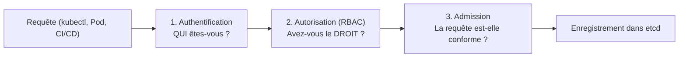
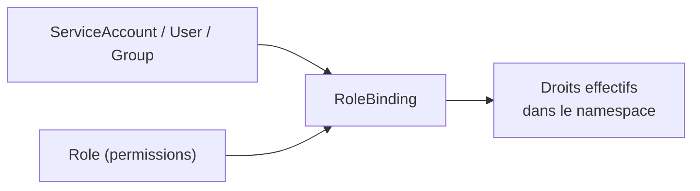
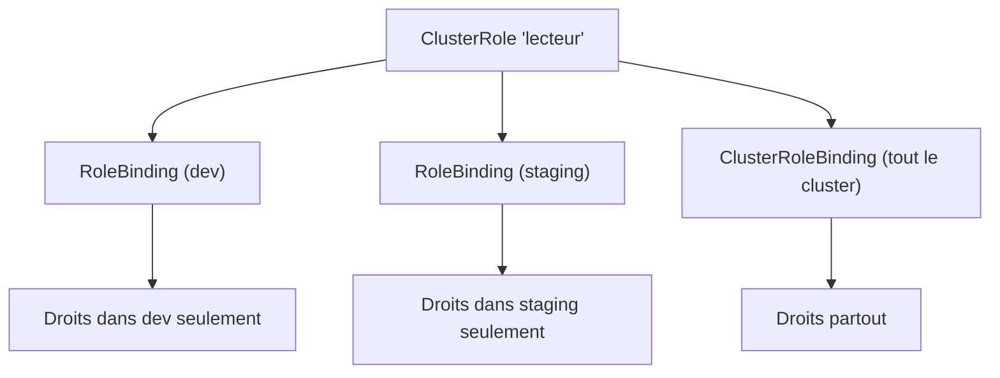

<a id="top"></a>

# 03 — Sécurité : RBAC et comptes de service

> **Module [19 — Kubernetes : suite de la théorie (partie 4)](README.md)** · Leçon 3 sur 4

## Table des matières

- [1. Authentification, autorisation, admission](#1-authentification-autorisation-admission)
- [2. Les deux sortes d'identités](#2-les-deux-sortes-didentites)
- [3. Role et ClusterRole : ce qui est permis](#3-role-et-clusterrole--ce-qui-est-permis)
- [4. RoleBinding et ClusterRoleBinding : à qui](#4-rolebinding-et-clusterrolebinding--a-qui)
- [5. Les quatre combinaisons possibles](#5-les-quatre-combinaisons-possibles)
- [6. Les ServiceAccounts](#6-les-serviceaccounts)
- [7. Vérifier et déboguer les droits](#7-verifier-et-deboguer-les-droits)
- [8. Durcir les Pods avec securityContext](#8-durcir-les-pods-avec-securitycontext)
- [9. Bonnes pratiques](#9-bonnes-pratiques)
- [Quiz](#quiz)
- [Pratique](#pratique)
- [Synthèse](#synthese)

---

## 1. Authentification, autorisation, admission

Toute requête vers l'API Kubernetes traverse **trois portes** successives :



| Étape | Question | Mécanismes |
|---|---|---|
| **Authentification** | *Qui* êtes-vous ? | Certificats clients, jetons de ServiceAccount, OIDC |
| **Autorisation** | Avez-vous le **droit** de faire cette action ? | **RBAC** (le sujet de cette leçon), ABAC, Node, Webhook |
| **Admission** | La ressource est-elle **valide/conforme** ? | LimitRange, ResourceQuota, webhooks de validation/mutation |

Le **RBAC** (*Role-Based Access Control*) répond à la deuxième question. Son principe : **tout est interdit par défaut**, et l'on **accorde** explicitement des permissions. Il n'existe **pas** de règle de refus — seulement des autorisations qui **s'additionnent**.

---

## 2. Les deux sortes d'identités

| Identité | Pour qui | Gérée par Kubernetes ? |
|---|---|---|
| **User / Group** | Un **humain** (ou un système externe) | **Non** : Kubernetes n'a pas d'objet « utilisateur ». L'identité vient d'un certificat ou d'un fournisseur externe |
| **ServiceAccount** | Un **processus dans un Pod** | **Oui** : c'est un objet Kubernetes, cloisonné par namespace |

C'est une source de confusion fréquente : `kubectl create user` **n'existe pas**. Les humains sont authentifiés par des certificats X.509 ou un fournisseur d'identité (OIDC) ; seuls les **ServiceAccounts** sont créés dans le cluster.

---

## 3. Role et ClusterRole : ce qui est permis

Un **Role** (ou **ClusterRole**) est une **liste de permissions**. Il ne désigne **personne** : il décrit seulement *ce qui est autorisé*.

```yaml
apiVersion: rbac.authorization.k8s.io/v1
kind: Role
metadata:
  namespace: dev            # un Role est limité à UN namespace
  name: lecteur-pods
rules:
  - apiGroups: [""]                     # "" = groupe principal (core) : pods, services...
    resources: ["pods", "pods/log"]
    verbs: ["get", "list", "watch"]
  - apiGroups: ["apps"]                 # groupe apps : deployments, statefulsets...
    resources: ["deployments"]
    verbs: ["get", "list"]
```

### Les trois composants d'une règle

| Champ | Signification | Exemples |
|---|---|---|
| **`apiGroups`** | Le groupe d'API | `""` (core), `"apps"`, `"batch"`, `"networking.k8s.io"` |
| **`resources`** | Le type d'objet | `pods`, `services`, `deployments`, `pods/log`, `pods/exec` |
| **`verbs`** | L'action permise | `get`, `list`, `watch`, `create`, `update`, `patch`, `delete`, `deletecollection` |

> Les **sous-ressources** comptent : pouvoir lire un Pod (`pods`) ne donne **pas** le droit de lire ses journaux (`pods/log`) ni d'y ouvrir un shell (`pods/exec`). C'est un point de sécurité majeur : `pods/exec` équivaut souvent à un accès complet au conteneur.

On peut restreindre à des objets **nommés** :

```yaml
  - apiGroups: [""]
    resources: ["configmaps"]
    resourceNames: ["config-app"]      # UNIQUEMENT cette ConfigMap
    verbs: ["get", "update"]
```

### ClusterRole

Identique, mais **sans namespace**. Il sert à trois choses :

1. donner des droits sur des ressources **globales** (nodes, persistentvolumes, namespaces) ;
2. donner des droits sur **tous les namespaces** à la fois ;
3. être **réutilisé** dans plusieurs namespaces via des RoleBinding distincts.

Kubernetes fournit des ClusterRoles **prédéfinis** :

| ClusterRole | Droits |
|---|---|
| **`view`** | Lecture seule (sans les Secrets) |
| **`edit`** | Lecture/écriture des ressources courantes (sans le RBAC) |
| **`admin`** | Tout dans un namespace, y compris gérer les droits |
| **`cluster-admin`** | **Tout**, partout — à réserver aux administrateurs |

---

## 4. RoleBinding et ClusterRoleBinding : à qui

Le **binding** fait le lien entre un **rôle** (les permissions) et un **sujet** (l'identité).

```yaml
apiVersion: rbac.authorization.k8s.io/v1
kind: RoleBinding
metadata:
  name: lecture-pods-dev
  namespace: dev
subjects:
  - kind: ServiceAccount
    name: mon-app
    namespace: dev
  - kind: User
    name: alice@exemple.com
  - kind: Group
    name: equipe-dev
roleRef:
  kind: Role                 # ou ClusterRole
  name: lecteur-pods
  apiGroup: rbac.authorization.k8s.io
```



> **`roleRef` est immuable** : on ne peut pas changer le rôle référencé après création. Il faut supprimer le binding et le recréer.

---

## 5. Les quatre combinaisons possibles

| Combinaison | Portée des droits | Cas d'usage |
|---|---|---|
| **Role + RoleBinding** | Le namespace du Role | Cas standard : une équipe dans son namespace |
| **ClusterRole + RoleBinding** | **Le namespace du binding** | Réutiliser un rôle générique (`view`) dans un namespace précis |
| **ClusterRole + ClusterRoleBinding** | **Tout le cluster** | Administrateur, contrôleur, agent de supervision |
| Role + ClusterRoleBinding | **Impossible** | — |

La deuxième ligne est la plus subtile et la **plus utile** : elle permet de définir **un seul** ClusterRole (par exemple « lecteur ») et de l'accorder **namespace par namespace**, sans dupliquer les règles.



---

## 6. Les ServiceAccounts

Chaque Pod s'exécute **avec une identité** : un **ServiceAccount**. Si vous n'en précisez pas, c'est le ServiceAccount **`default`** du namespace qui est utilisé.

```yaml
apiVersion: v1
kind: ServiceAccount
metadata:
  name: mon-app
  namespace: dev
automountServiceAccountToken: false   # ne pas injecter le jeton si le Pod n'appelle pas l'API
---
apiVersion: v1
kind: Pod
metadata:
  name: app
  namespace: dev
spec:
  serviceAccountName: mon-app          # identité du Pod
  containers:
    - name: app
      image: nginx:alpine
```

**Le jeton** est monté dans le conteneur, à l'emplacement :

```
/var/run/secrets/kubernetes.io/serviceaccount/token
```

> **Bonne pratique de sécurité :** la grande majorité des applications **n'appellent jamais** l'API Kubernetes. Pour celles-là, mettez **`automountServiceAccountToken: false`** : si le conteneur est compromis, l'attaquant ne récupère aucun jeton exploitable.

**Ne donnez jamais de droits au ServiceAccount `default`** : tous les Pods qui n'en précisent pas l'héritent automatiquement, ce qui accorderait ces droits à tout le namespace.

---

## 7. Vérifier et déboguer les droits

L'outil central est **`kubectl auth can-i`** :

```bash
# Pour moi-même
kubectl auth can-i create deployments -n dev
kubectl auth can-i delete nodes

# En se faisant passer pour quelqu'un d'autre (nécessite des droits d'impersonation)
kubectl auth can-i list pods -n dev --as=system:serviceaccount:dev:mon-app
kubectl auth can-i --list -n dev --as=system:serviceaccount:dev:mon-app

# Inspecter les objets RBAC
kubectl get roles,rolebindings -n dev
kubectl get clusterroles,clusterrolebindings
kubectl describe clusterrole view
```

**Erreur typique** lorsqu'un droit manque :

```
Error from server (Forbidden): pods is forbidden:
User "system:serviceaccount:dev:mon-app" cannot list resource "pods"
in API group "" in the namespace "dev"
```

Ce message se lit directement : **qui** (`system:serviceaccount:dev:mon-app`), **quel verbe** (`list`), **quelle ressource** (`pods`), **quel groupe d'API** (`""`), **quel namespace** (`dev`). Il donne exactement la règle à écrire.

---

## 8. Durcir les Pods avec securityContext

Le RBAC protège **l'API**. Le **`securityContext`** protège **l'exécution** du conteneur.

```yaml
apiVersion: v1
kind: Pod
metadata:
  name: durci
spec:
  securityContext:                 # niveau POD
    runAsNonRoot: true
    runAsUser: 10001
    fsGroup: 10001
    seccompProfile:
      type: RuntimeDefault
  containers:
    - name: app
      image: nginx:alpine
      securityContext:             # niveau CONTENEUR (prioritaire)
        allowPrivilegeEscalation: false
        readOnlyRootFilesystem: true
        privileged: false
        capabilities:
          drop: ["ALL"]            # retirer toutes les capacités Linux
```

| Réglage | Protection apportée |
|---|---|
| **`runAsNonRoot: true`** | Refuse de démarrer si l'image tourne en **root** |
| **`allowPrivilegeEscalation: false`** | Empêche d'obtenir plus de droits que le processus parent (`setuid`) |
| **`readOnlyRootFilesystem: true`** | Système de fichiers **en lecture seule** (l'attaquant ne peut rien déposer) |
| **`capabilities.drop: ["ALL"]`** | Retire toutes les capacités Linux, puis on rajoute le strict nécessaire |
| **`privileged: false`** | Interdit l'accès quasi total à l'hôte |

> Avec `readOnlyRootFilesystem: true`, montez un `emptyDir` sur les répertoires où l'application **doit** écrire (`/tmp`, caches).

Les **Pod Security Standards** (`privileged`, `baseline`, `restricted`) permettent d'imposer ces règles à l'échelle d'un namespace :

```bash
kubectl label namespace prod pod-security.kubernetes.io/enforce=restricted
```

---

## 9. Bonnes pratiques

1. **Moindre privilège** : accordez le minimum, ressource par ressource, verbe par verbe.
2. **Jamais `cluster-admin`** pour une application ou un pipeline CI/CD.
3. **Un ServiceAccount par application**, jamais le `default`.
4. **`automountServiceAccountToken: false`** si le Pod n'appelle pas l'API.
5. Préférez les verbes de **lecture** (`get`, `list`, `watch`) quand c'est suffisant.
6. Méfiez-vous des **jokers** : `resources: ["*"]` et `verbs: ["*"]` sont à proscrire.
7. Surveillez `pods/exec`, `pods/portforward` et l'accès aux **`secrets`** : très sensibles.
8. Auditez régulièrement avec `kubectl auth can-i --list --as=...`.
9. Combinez RBAC (**API**), securityContext (**exécution**) et NetworkPolicy (**réseau**, leçon suivante).

---

## Quiz

**1.** Quelle est la différence entre authentification et autorisation ?

<details><summary>Réponse</summary>

L'**authentification** établit **qui** vous êtes (certificat, jeton). L'**autorisation** (RBAC) détermine si cette identité a le **droit** d'effectuer l'action demandée. Une troisième étape, l'**admission**, vérifie ensuite la conformité de la requête.
</details>

**2.** Peut-on créer un objet « utilisateur » dans Kubernetes ?

<details><summary>Réponse</summary>

**Non.** Il n'existe pas d'objet `User`. Les humains sont authentifiés par des **certificats X.509** ou un fournisseur externe (OIDC). Seuls les **ServiceAccounts** (identités des Pods) sont des objets Kubernetes.
</details>

**3.** Que donne la combinaison ClusterRole + RoleBinding ?

<details><summary>Réponse</summary>

Les permissions du ClusterRole, mais **limitées au namespace du RoleBinding**. C'est très utile pour réutiliser un rôle générique (comme `view`) namespace par namespace, sans dupliquer les règles.
</details>

**4.** Un ServiceAccount peut lire les Pods mais reçoit une erreur en consultant les journaux. Pourquoi ?

<details><summary>Réponse</summary>

Parce que les journaux sont une **sous-ressource distincte** : il faut ajouter **`pods/log`** dans les `resources` du Role. Le droit sur `pods` seul ne suffit pas.
</details>

**5.** Pourquoi ne faut-il pas accorder de droits au ServiceAccount `default` ?

<details><summary>Réponse</summary>

Parce que **tous** les Pods qui ne précisent pas de `serviceAccountName` l'utilisent automatiquement. Lui donner des droits revient à les accorder à **l'ensemble** des Pods du namespace.
</details>

**6.** Que fait `readOnlyRootFilesystem: true` et quelle précaution prendre ?

<details><summary>Réponse</summary>

Il rend le système de fichiers du conteneur **non modifiable**, empêchant un attaquant d'y déposer des fichiers. Précaution : monter un volume `emptyDir` sur les répertoires où l'application **doit** écrire (par exemple `/tmp`).
</details>

---

## Pratique

**Énoncé :** créez un ServiceAccount limité à la lecture des Pods d'un namespace, prouvez qu'il peut lister les Pods mais pas les supprimer ni voir un autre namespace, puis durcissez un Pod avec un `securityContext`.

<details>
<summary><strong>Correction détaillée</strong></summary>

**1) Le namespace, le ServiceAccount, le Role et le binding** (`rbac.yaml`) :

```yaml
apiVersion: v1
kind: Namespace
metadata:
  name: demo-rbac
---
apiVersion: v1
kind: ServiceAccount
metadata:
  name: observateur
  namespace: demo-rbac
---
apiVersion: rbac.authorization.k8s.io/v1
kind: Role
metadata:
  namespace: demo-rbac
  name: lecteur-pods
rules:
  - apiGroups: [""]
    resources: ["pods", "pods/log"]
    verbs: ["get", "list", "watch"]
---
apiVersion: rbac.authorization.k8s.io/v1
kind: RoleBinding
metadata:
  name: observateur-lecture
  namespace: demo-rbac
subjects:
  - kind: ServiceAccount
    name: observateur
    namespace: demo-rbac
roleRef:
  kind: Role
  name: lecteur-pods
  apiGroup: rbac.authorization.k8s.io
```

```bash
kubectl apply -f rbac.yaml
```

**2) Vérifier les droits par impersonation :**

```bash
kubectl auth can-i list pods -n demo-rbac --as=system:serviceaccount:demo-rbac:observateur
# yes

kubectl auth can-i delete pods -n demo-rbac --as=system:serviceaccount:demo-rbac:observateur
# no

kubectl auth can-i list pods -n default --as=system:serviceaccount:demo-rbac:observateur
# no  (le Role est limité à demo-rbac)

kubectl auth can-i list secrets -n demo-rbac --as=system:serviceaccount:demo-rbac:observateur
# no

kubectl auth can-i --list -n demo-rbac --as=system:serviceaccount:demo-rbac:observateur
```

**3) Preuve « en conditions réelles »** — un Pod qui utilise cette identité et interroge l'API :

```yaml
# pod-test.yaml
apiVersion: v1
kind: Pod
metadata:
  name: testeur
  namespace: demo-rbac
spec:
  serviceAccountName: observateur
  containers:
    - name: cli
      image: bitnami/kubectl:latest
      command: ["sleep", "3600"]
```

```bash
kubectl apply -f pod-test.yaml
kubectl exec -n demo-rbac testeur -- kubectl get pods           # fonctionne
kubectl exec -n demo-rbac testeur -- kubectl delete pod testeur # Forbidden
```

Le message d'erreur indique précisément le verbe et la ressource manquants.

**4) Le Pod durci** (`pod-durci.yaml`) :

```yaml
apiVersion: v1
kind: Pod
metadata:
  name: durci
  namespace: demo-rbac
spec:
  automountServiceAccountToken: false
  securityContext:
    runAsNonRoot: true
    runAsUser: 10001
  containers:
    - name: app
      image: busybox:1.36
      command: ["sh", "-c", "sleep 3600"]
      securityContext:
        allowPrivilegeEscalation: false
        readOnlyRootFilesystem: true
        capabilities:
          drop: ["ALL"]
      volumeMounts:
        - name: tmp
          mountPath: /tmp
  volumes:
    - name: tmp
      emptyDir: {}
```

```bash
kubectl apply -f pod-durci.yaml
kubectl exec -n demo-rbac durci -- id                       # uid=10001, pas root
kubectl exec -n demo-rbac durci -- touch /essai             # échec : lecture seule
kubectl exec -n demo-rbac durci -- touch /tmp/essai         # réussit (volume dédié)
kubectl exec -n demo-rbac durci -- ls /var/run/secrets/kubernetes.io/    # absent : pas de jeton
```

**5) Nettoyage :**

```bash
kubectl delete namespace demo-rbac
```
</details>

---

## Synthèse

- Toute requête traverse **authentification** → **autorisation (RBAC)** → **admission**.
- Le RBAC est **permissif uniquement** : tout est interdit par défaut, et les autorisations **s'additionnent** (aucune règle de refus).
- **Role/ClusterRole** = les **permissions** (`apiGroups`, `resources`, `verbs`) ; **RoleBinding/ClusterRoleBinding** = **à qui** on les accorde.
- La combinaison **ClusterRole + RoleBinding** applique un rôle générique **dans un namespace donné** — très pratique.
- Les **sous-ressources** (`pods/log`, `pods/exec`) sont des permissions **distinctes** et sensibles.
- Chaque Pod a une identité : son **ServiceAccount**. Un par application, **jamais** de droits sur `default`, et **`automountServiceAccountToken: false`** si l'API n'est pas utilisée.
- **`kubectl auth can-i --list --as=...`** est l'outil de vérification et d'audit.
- Le **`securityContext`** complète le RBAC en durcissant l'exécution : `runAsNonRoot`, `allowPrivilegeEscalation: false`, `readOnlyRootFilesystem`, `capabilities.drop: ["ALL"]`.

---

> Leçon précédente : **[02 — Mise à l'échelle automatique](02-autoscaling.md)** · Leçon suivante : **[04 — Politiques réseau (NetworkPolicy)](04-network-policies.md)**.

---

<p align="center">
  <strong>Cours créé par Dr. Haythem REHOUMA — Développement et déploiement de solutions de données</strong>
</p>
