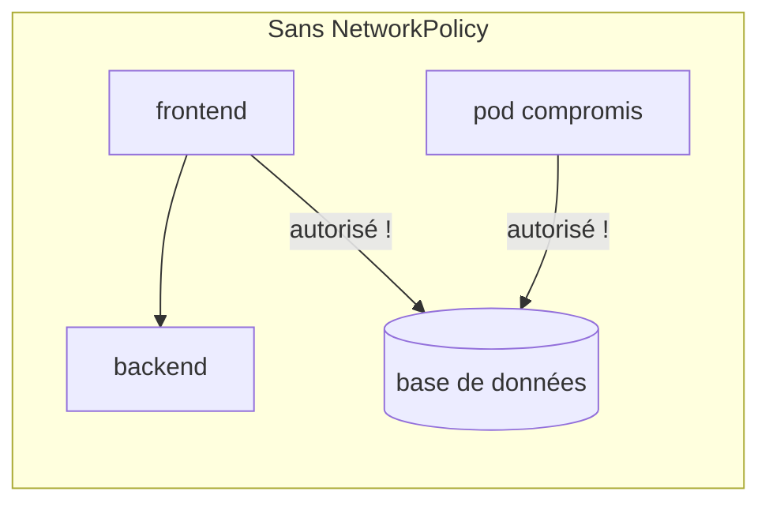
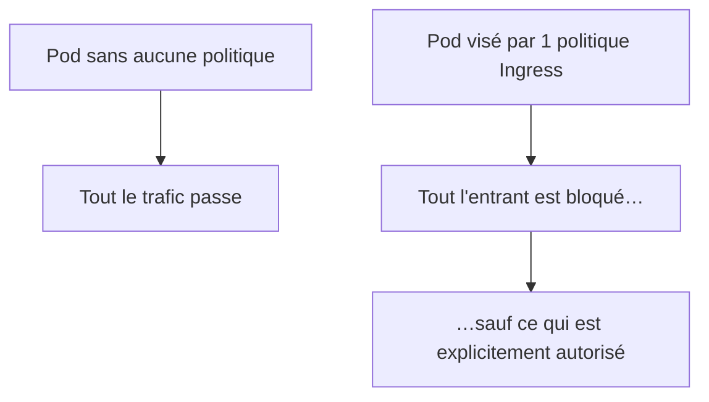
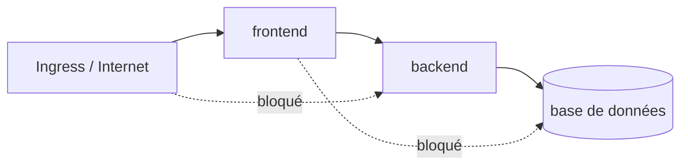

<a id="top"></a>

# 04 — Politiques réseau (NetworkPolicy)

> **Module [19 — Kubernetes : suite de la théorie (partie 4)](README.md)** · Leçon 4 sur 4

## Table des matières

- [1. Le modèle réseau de Kubernetes : tout est ouvert](#1-le-modele-reseau-de-kubernetes--tout-est-ouvert)
- [2. Le rôle du CNI](#2-le-role-du-cni)
- [3. Anatomie d'une NetworkPolicy](#3-anatomie-dune-networkpolicy)
- [4. La règle d'or : isolation dès la première politique](#4-la-regle-dor--isolation-des-la-premiere-politique)
- [5. Les sélecteurs disponibles](#5-les-selecteurs-disponibles)
- [6. Modèles courants](#6-modeles-courants)
- [7. Le trafic sortant (egress) et le DNS](#7-le-trafic-sortant-egress-et-le-dns)
- [8. Pièges classiques](#8-pieges-classiques)
- [Quiz](#quiz)
- [Pratique](#pratique)
- [Synthèse](#synthese)

---

## 1. Le modèle réseau de Kubernetes : tout est ouvert

Par défaut, le réseau Kubernetes est **plat et totalement permissif** :

- **chaque Pod a sa propre IP** ;
- **tout Pod peut joindre tout autre Pod**, dans **n'importe quel namespace**, sans NAT.

C'est simple et pratique… mais dangereux. Concrètement, cela signifie qu'un Pod du namespace `dev` peut se connecter **directement à la base de données de `prod`**, et qu'un conteneur compromis peut **balayer** tout le cluster.



> Rappelons-le : un **Namespace** est un cloisonnement **logique**, pas un cloisonnement **réseau**. Sans NetworkPolicy, les namespaces ne bloquent **aucun** trafic.

Une **NetworkPolicy** est un **pare-feu au niveau des Pods**, exprimé avec des **labels** plutôt qu'avec des adresses IP.

---

## 2. Le rôle du CNI

Point **essentiel** : Kubernetes définit la NetworkPolicy comme un objet, mais **ne l'applique pas lui-même**. C'est le plugin réseau (**CNI**) qui doit la mettre en œuvre.

| CNI | Applique les NetworkPolicy ? |
|---|---|
| **Calico** | Oui (et des extensions plus riches) |
| **Cilium** | Oui (jusqu'à la couche 7) |
| **Weave Net**, **Antrea**, **Kube-router** | Oui |
| **Flannel** (seul) | **Non** |
| **Docker Desktop** (par défaut) | **Non** |

**Conséquence redoutable :** sur un CNI qui ne les prend pas en charge, vos NetworkPolicy sont acceptées par l'API **sans erreur**… et **totalement ignorées**. Vous croyez être protégé alors que rien ne filtre.

```bash
kubectl get pods -n kube-system     # identifier le CNI (calico-node, cilium, ...)
```

> Pour pratiquer réellement, utilisez **kind avec Calico**, **minikube avec Cilium**, ou un cluster cloud (GKE/EKS/AKS avec la politique réseau activée).

---

## 3. Anatomie d'une NetworkPolicy

```yaml
apiVersion: networking.k8s.io/v1
kind: NetworkPolicy
metadata:
  name: backend-restreint
  namespace: prod
spec:
  podSelector:                  # À QUI s'applique cette politique
    matchLabels:
      app: backend
  policyTypes:                  # QUELS SENS sont concernés
    - Ingress
    - Egress
  ingress:                      # trafic ENTRANT autorisé
    - from:
        - podSelector:
            matchLabels:
              app: frontend
      ports:
        - protocol: TCP
          port: 5000
  egress:                       # trafic SORTANT autorisé
    - to:
        - podSelector:
            matchLabels:
              app: base
      ports:
        - protocol: TCP
          port: 5432
```

| Champ | Rôle |
|---|---|
| **`podSelector`** | Les Pods **protégés** par cette politique (`{}` = **tous** les Pods du namespace) |
| **`policyTypes`** | `Ingress` (entrant), `Egress` (sortant), ou les deux |
| **`ingress.from`** | **Sources** autorisées à entrer |
| **`egress.to`** | **Destinations** autorisées en sortie |
| **`ports`** | Ports et protocoles concernés |

**Sens de lecture :** « pour les Pods portant le label `app: backend` dans le namespace `prod`, autoriser **en entrée** uniquement le trafic venant des Pods `app: frontend` sur le port 5000, et **en sortie** uniquement vers `app: base` sur le port 5432 ».

Une politique est toujours **appliquée au Pod de destination** (pour `Ingress`) ou **d'origine** (pour `Egress`) — jamais « entre » les deux.

---

## 4. La règle d'or : isolation dès la première politique

C'est **le** mécanisme à comprendre, et la source de la plupart des erreurs :

> Tant qu'**aucune** NetworkPolicy ne sélectionne un Pod, **tout est autorisé**.
> Dès qu'**au moins une** politique le sélectionne pour un sens donné, **tout est refusé dans ce sens**, sauf ce que les politiques autorisent **explicitement**.



Autres propriétés importantes :

- Les politiques sont **additives** : si plusieurs s'appliquent, leurs autorisations **s'additionnent** (union).
- Il n'existe **aucune règle de refus** : on ne peut pas écrire « interdire X ». On restreint en **n'autorisant pas**.
- Les sens **Ingress** et **Egress** sont **indépendants** : une politique qui ne définit que `Ingress` **ne bloque pas** le trafic sortant.
- Les politiques sont **cloisonnées par namespace**.

### Le point de départ recommandé : tout refuser

```yaml
apiVersion: networking.k8s.io/v1
kind: NetworkPolicy
metadata:
  name: refus-par-defaut
  namespace: prod
spec:
  podSelector: {}            # TOUS les Pods du namespace
  policyTypes:
    - Ingress
    - Egress
  # aucune règle : donc tout est bloqué dans les deux sens
```

On part de ce socle, puis on **ouvre** au cas par cas. C'est le principe de **liste blanche**.

---

## 5. Les sélecteurs disponibles

Trois façons de désigner une source ou une destination :

```yaml
  ingress:
    - from:
        # 1. Des Pods du MÊME namespace
        - podSelector:
            matchLabels:
              app: frontend

        # 2. Tous les Pods d'un AUTRE namespace (identifié par ses labels)
        - namespaceSelector:
            matchLabels:
              environnement: production

        # 3. Une plage d'adresses IP (services externes)
        - ipBlock:
            cidr: 10.0.0.0/16
            except:
              - 10.0.5.0/24
```

### Le piège du ET / OU

La différence tient à **un seul tiret** :

```yaml
# OU logique : Pods "frontend" du même namespace, OU N'IMPORTE QUEL Pod du namespace "monitoring"
  - from:
      - podSelector:
          matchLabels: { app: frontend }
      - namespaceSelector:
          matchLabels: { equipe: monitoring }

# ET logique : UNIQUEMENT les Pods "frontend" SITUÉS DANS le namespace "monitoring"
  - from:
      - podSelector:
          matchLabels: { app: frontend }
        namespaceSelector:
          matchLabels: { equipe: monitoring }
```

Deux entrées de liste (deux tirets) = **OU**. Deux sélecteurs dans **la même** entrée = **ET**. C'est l'erreur la plus fréquente en NetworkPolicy : on croit avoir restreint alors qu'on a élargi.

> Les namespaces portent automatiquement le label `kubernetes.io/metadata.name`, ce qui permet de viser un namespace par son nom sans l'étiqueter soi-même.

---

## 6. Modèles courants

### a) Isoler un namespace du reste du cluster

```yaml
spec:
  podSelector: {}
  policyTypes: [Ingress]
  ingress:
    - from:
        - podSelector: {}      # seuls les Pods du MÊME namespace sont autorisés
```

### b) Architecture en trois étages



```yaml
# La base n'accepte QUE le backend
apiVersion: networking.k8s.io/v1
kind: NetworkPolicy
metadata:
  name: base-depuis-backend
spec:
  podSelector:
    matchLabels:
      tier: base
  policyTypes: [Ingress]
  ingress:
    - from:
        - podSelector:
            matchLabels:
              tier: backend
      ports:
        - protocol: TCP
          port: 5432
```

### c) Autoriser l'outil de supervision

```yaml
  ingress:
    - from:
        - namespaceSelector:
            matchLabels:
              kubernetes.io/metadata.name: monitoring
      ports:
        - protocol: TCP
          port: 9090
```

### d) Autoriser l'Ingress Controller

```yaml
  ingress:
    - from:
        - namespaceSelector:
            matchLabels:
              kubernetes.io/metadata.name: ingress-nginx
      ports:
        - protocol: TCP
          port: 8080
```

---

## 7. Le trafic sortant (egress) et le DNS

Dès que vous activez `Egress` sur un Pod, **le DNS cesse de fonctionner** si vous ne l'autorisez pas explicitement. Le Pod ne peut plus résoudre le moindre nom de Service : les erreurs ressemblent à des pannes applicatives aléatoires.

**Il faut donc toujours ouvrir le port 53 vers CoreDNS :**

```yaml
apiVersion: networking.k8s.io/v1
kind: NetworkPolicy
metadata:
  name: autoriser-dns
spec:
  podSelector: {}
  policyTypes: [Egress]
  egress:
    - to:
        - namespaceSelector:
            matchLabels:
              kubernetes.io/metadata.name: kube-system
          podSelector:
            matchLabels:
              k8s-app: kube-dns
      ports:
        - protocol: UDP
          port: 53
        - protocol: TCP
          port: 53
```

Limiter les sorties vers l'extérieur (utile contre l'exfiltration de données) :

```yaml
  egress:
    - to:
        - ipBlock:
            cidr: 0.0.0.0/0
            except:
              - 10.0.0.0/8         # interdire les réseaux internes
              - 169.254.169.254/32 # bloquer les métadonnées cloud (vol de jetons)
      ports:
        - protocol: TCP
          port: 443
```

> Bloquer `169.254.169.254` est une protection classique : ce point d'accès expose les **identifiants d'instance** du fournisseur cloud.

---

## 8. Pièges classiques

| Piège | Conséquence | Solution |
|---|---|---|
| CNI ne supportant pas les NetworkPolicy | Politiques **ignorées silencieusement** | Vérifier le CNI (Calico, Cilium…) |
| Oublier le DNS en `Egress` | L'application ne résout plus aucun nom | Autoriser UDP/TCP **53** vers `kube-dns` |
| Confondre ET et OU (tirets) | Règle beaucoup **trop permissive** | Deux tirets = OU ; même entrée = ET |
| Croire qu'un namespace isole | Aucun blocage réseau | Ajouter des NetworkPolicy |
| Ne définir que `Ingress` | Le **sortant** reste totalement ouvert | Déclarer aussi `Egress` si nécessaire |
| Politique dans le mauvais namespace | Aucun effet | Une politique n'agit que dans **son** namespace |
| Oublier les sondes du kubelet | Les *probes* peuvent être bloquées | Autoriser le trafic depuis le nœud |
| Filtrer par IP de Pod | Les IP **changent** en permanence | Toujours raisonner en **labels** |

Diagnostic :

```bash
kubectl get networkpolicy -A
kubectl describe networkpolicy <nom> -n <namespace>
# Test réel depuis un Pod :
kubectl run test --rm -it --image=busybox:1.36 -- sh
#   wget -qO- --timeout=3 http://backend:5000
#   nslookup backend
```

---

## Quiz

**1.** Que peut joindre un Pod par défaut, sans aucune NetworkPolicy ?

<details><summary>Réponse</summary>

**Tous les autres Pods du cluster**, dans **tous** les namespaces. Le réseau Kubernetes est plat et entièrement permissif par défaut ; un namespace n'apporte **aucun** cloisonnement réseau.
</details>

**2.** Vous appliquez une NetworkPolicy et rien ne change. Quelle est la cause la plus probable ?

<details><summary>Réponse</summary>

Le **CNI** installé ne prend pas en charge les NetworkPolicy (Flannel seul, Docker Desktop par défaut). L'objet est accepté par l'API **sans erreur**, mais **jamais appliqué**. Il faut un CNI comme **Calico** ou **Cilium**.
</details>

**3.** Que se passe-t-il dès qu'une politique `Ingress` sélectionne un Pod ?

<details><summary>Réponse</summary>

Tout le trafic **entrant** vers ce Pod devient **refusé par défaut**, sauf ce qui est **explicitement autorisé** par les règles. Le trafic **sortant** reste inchangé tant qu'aucune politique `Egress` ne le vise.
</details>

**4.** Quelle différence entre ces deux écritures ?

```yaml
# A
- podSelector: {matchLabels: {app: web}}
- namespaceSelector: {matchLabels: {env: prod}}
# B
- podSelector: {matchLabels: {app: web}}
  namespaceSelector: {matchLabels: {env: prod}}
```

<details><summary>Réponse</summary>

**A** = **OU** : les Pods `app: web` du même namespace **ou** n'importe quel Pod d'un namespace `env: prod`. **B** = **ET** : uniquement les Pods `app: web` **situés dans** un namespace `env: prod`. B est bien plus restrictif.
</details>

**5.** Après avoir activé `Egress`, l'application ne joint plus rien par son nom. Pourquoi ?

<details><summary>Réponse</summary>

Le **DNS est bloqué**. Il faut autoriser explicitement le trafic sortant vers **CoreDNS** (`kube-system`, `k8s-app: kube-dns`) sur le port **53** en **UDP et TCP**.
</details>

**6.** Comment obtenir un « tout refuser » dans un namespace ?

<details><summary>Réponse</summary>

Une politique avec `podSelector: {}` (tous les Pods), `policyTypes: [Ingress, Egress]` et **aucune** règle `ingress`/`egress`. On ouvre ensuite au cas par cas, selon le principe de **liste blanche**.
</details>

---

## Pratique

**Énoncé :** dans un namespace, déployez un `frontend`, un `backend` et un Pod `intrus`. Appliquez un refus par défaut, puis autorisez **uniquement** `frontend → backend`, et prouvez que l'`intrus` est bloqué.

<details>
<summary><strong>Correction détaillée</strong></summary>

> **Prérequis :** un cluster dont le CNI applique les NetworkPolicy (kind + Calico, minikube + Cilium, ou cloud). Sur Docker Desktop par défaut, les politiques seront **ignorées** — dans ce cas, la manipulation sert à écrire les manifestes, pas à observer le blocage.

**1) L'environnement** (`app.yaml`) :

```yaml
apiVersion: v1
kind: Namespace
metadata:
  name: demo-net
---
apiVersion: apps/v1
kind: Deployment
metadata:
  name: backend
  namespace: demo-net
spec:
  replicas: 1
  selector:
    matchLabels: { app: backend }
  template:
    metadata:
      labels: { app: backend }
    spec:
      containers:
        - name: web
          image: nginx:alpine
          ports: [{ containerPort: 80 }]
---
apiVersion: v1
kind: Service
metadata:
  name: backend
  namespace: demo-net
spec:
  selector: { app: backend }
  ports: [{ port: 80 }]
---
apiVersion: v1
kind: Pod
metadata:
  name: frontend
  namespace: demo-net
  labels: { app: frontend }
spec:
  containers:
    - name: cli
      image: busybox:1.36
      command: ["sleep", "3600"]
---
apiVersion: v1
kind: Pod
metadata:
  name: intrus
  namespace: demo-net
  labels: { app: intrus }
spec:
  containers:
    - name: cli
      image: busybox:1.36
      command: ["sleep", "3600"]
```

**2) Situation initiale — tout passe :**

```bash
kubectl apply -f app.yaml
kubectl exec -n demo-net frontend -- wget -qO- --timeout=3 http://backend   # OK
kubectl exec -n demo-net intrus   -- wget -qO- --timeout=3 http://backend   # OK aussi !
```

L'intrus accède librement au backend : c'est le problème à corriger.

**3) Refus par défaut** (`refus.yaml`) :

```yaml
apiVersion: networking.k8s.io/v1
kind: NetworkPolicy
metadata:
  name: refus-par-defaut
  namespace: demo-net
spec:
  podSelector: {}
  policyTypes: [Ingress, Egress]
```

```bash
kubectl apply -f refus.yaml
kubectl exec -n demo-net frontend -- wget -qO- --timeout=3 http://backend   # échec (attendu)
```

**4) Autoriser le DNS puis frontend → backend** (`autorisations.yaml`) :

```yaml
apiVersion: networking.k8s.io/v1
kind: NetworkPolicy
metadata:
  name: autoriser-dns
  namespace: demo-net
spec:
  podSelector: {}
  policyTypes: [Egress]
  egress:
    - to:
        - namespaceSelector:
            matchLabels:
              kubernetes.io/metadata.name: kube-system
      ports:
        - { protocol: UDP, port: 53 }
        - { protocol: TCP, port: 53 }
---
apiVersion: networking.k8s.io/v1
kind: NetworkPolicy
metadata:
  name: backend-depuis-frontend
  namespace: demo-net
spec:
  podSelector:
    matchLabels: { app: backend }
  policyTypes: [Ingress]
  ingress:
    - from:
        - podSelector:
            matchLabels: { app: frontend }
      ports:
        - { protocol: TCP, port: 80 }
---
apiVersion: networking.k8s.io/v1
kind: NetworkPolicy
metadata:
  name: frontend-vers-backend
  namespace: demo-net
spec:
  podSelector:
    matchLabels: { app: frontend }
  policyTypes: [Egress]
  egress:
    - to:
        - podSelector:
            matchLabels: { app: backend }
      ports:
        - { protocol: TCP, port: 80 }
```

**5) Vérification finale :**

```bash
kubectl apply -f autorisations.yaml
kubectl exec -n demo-net frontend -- wget -qO- --timeout=3 http://backend   # OK
kubectl exec -n demo-net intrus   -- wget -qO- --timeout=3 http://backend   # BLOQUÉ (timeout)
```

**Résultat attendu :** le `frontend` communique normalement, l'`intrus` est en **timeout**. On a construit une **liste blanche** : seul ce qui est explicitement permis passe.

**6) Nettoyage :**

```bash
kubectl delete namespace demo-net
```
</details>

---

## Synthèse

- Le réseau Kubernetes est **plat et ouvert** : sans NetworkPolicy, **tout Pod joint tout Pod**, y compris entre namespaces.
- Une **NetworkPolicy** est un pare-feu basé sur les **labels**, pas sur les IP (qui changent sans cesse).
- **C'est le CNI qui applique** les politiques : avec un plugin non compatible, elles sont **ignorées silencieusement**.
- **Règle d'or :** aucune politique = tout autorisé ; **dès qu'une** politique sélectionne un Pod dans un sens, **tout est refusé** dans ce sens, sauf autorisation explicite.
- Les politiques sont **additives** et il n'existe **aucune règle de refus** — on procède par **liste blanche**.
- Attention au **ET / OU** : deux tirets = OU, deux sélecteurs dans la même entrée = ET.
- Activer `Egress` **casse le DNS** si l'on n'autorise pas le port **53** vers CoreDNS.
- Modèle recommandé : **refus par défaut** dans le namespace, puis ouverture au cas par cas (frontend → backend → base).

---

> Leçon précédente : **[03 — Sécurité : RBAC et comptes de service](03-securite-rbac.md)** · Retour au **[module 19](README.md)**.

---

<p align="center">
  <strong>Cours créé par Dr. Haythem REHOUMA — Développement et déploiement de solutions de données</strong>
</p>
