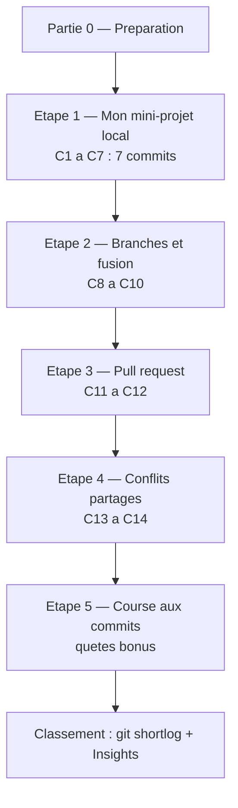

<a id="top"></a>

# TP1 — Git et GitHub · Partie 1 (Concours collaboratif)

> **Travail pratique noté** · Pondération **5 %** · Remise : **dimanche 21 juin 2026** (fin de journée, en ligne) · **Dépôt de classe partagé**
>
> **Deux parties :** **Partie 1 (ce document)** · [Partie 2 — Concours Git avancé](tp-01-git-github-partie-2.md)
>
> **Modules couverts :** [01 — Introduction au DevOps et Git](../../../01-introduction-devops-et-git/README.md), [02 — Git avancé et GitHub](../../../02-git-avance-et-github/README.md)

---

## À lire en premier : autonomie et évaluation

> **Le professeur N'INTERVIENT PAS pendant l'activité.** Personne n'a besoin d'approuver ni de fusionner vos pull requests à votre place : vous gérez **tout vous-mêmes** — créer une branche, vous faire relire **par un camarade**, fusionner, et résoudre les conflits.
>
> **C'est VOTRE responsabilité d'aller jusqu'au bout.** Si vous cassez quelque chose (push rejeté, conflit, mauvaise fusion), c'est **normal et formateur** : lisez le message, faites `git pull`, résolvez, recommencez. Le professeur **voit tout** dans l'historique, mais ne répare **rien** à votre place.

> **Comment le professeur vous évalue :** pas en direct, mais sur **l'historique du dépôt à la date de remise**. Vous n'avez **rien d'autre à remettre** que vos commits. Il s'appuie sur :
>
> - `git shortlog -sn --all` → le **classement des commits** (le champion en haut) ;
> - `git log --author="Prénom Nom"` → **vos** commits (C1 → C14) ;
> - les onglets GitHub **Insights > Contributors** et **Pull requests** ;
> - votre dossier `eleves/prenom-nom/`, le fichier partagé `TRESOR.md` (conflits résolus) et `QUETES.md`.
>
> Le détail des points est dans le **Barème de correction** plus bas.

---

## C'est un concours !

Toute la classe travaille sur **un seul dépôt partagé** : `tp1`. Au-delà de la note, c'est une **compétition amicale** :

- **Le champion** est la personne avec le **plus de commits réels et utiles**.
- Le classement est public et visible par tous (onglet **Insights > Contributors** sur GitHub).
- **Objectif chiffré :** atteindre **au moins 15 commits** avec des messages clairs.

> **Règle anti-triche :** les commits **vides ou artificiels** (juste pour gonfler le score) **ne comptent pas** et seront retirés. On veut des commits **petits, fréquents et significatifs**.



---

## Objectifs

À la fin de cette partie, vous serez capable de :

- Cloner un dépôt partagé et y contribuer en parallèle.
- Créer des commits **propres et atomiques** avec des messages clairs.
- Travailler avec des **branches** et les **fusionner**.
- Ouvrir et fusionner une **pull request** revue par un pair.
- **Provoquer et résoudre un conflit** de fusion manuellement.

---

## Étape 0 — Préparation (une seule fois)

1. **Acceptez l'invitation** de collaborateur (courriel ou cloche de notifications GitHub).
2. **Clonez** le dépôt (URL donnée en classe) :

```bash
git clone https://github.com/haythem-rehouma/tp1.git
cd tp1
```

3. **Configurez votre identité** (elle apparaît dans le classement) :

```bash
git config --global user.name "Prénom Nom"
git config --global user.email "votre.courriel@exemple.com"
```

4. **Créez votre dossier personnel** (remplacez `prenom-nom`, sans accent ni espace) :

```bash
mkdir -p eleves/prenom-nom
cd eleves/prenom-nom
```

> **Réflexe d'or, à chaque fois :** `git status` avant `git add`, et `git pull` avant `git push`.

---

## Étape 1 — Mon mini-projet local (7 commits : C1 → C7)

Vous construisez un petit « carnet de bord » dans **votre dossier**. Faites **un commit par étape** (chaque commit compte au classement !).

### C1 — Le README

Créez `README.md` dans votre dossier :

```markdown
# Carnet de bord — Prénom Nom

Projet du TP1 : Git et GitHub.
```

Puis :

```bash
git add README.md
git commit -m "C1 - Ajouter le README du carnet de bord"
```

### C2 — Le fichier .gitignore

Créez `.gitignore` (au moins une entrée) :

```text
.env
*.log
.DS_Store
```

```bash
git add .gitignore
git commit -m "C2 - Ajouter un .gitignore"
```

### C3 — Ma fiche profil

Créez `profil.md` :

```markdown
# Profil

- Programme : ...
- Objectif du cours : ...
- Emoji du jour : 🚀
```

```bash
git add profil.md
git commit -m "C3 - Ajouter ma fiche profil"
```

### C4 — Une liste de tâches

Créez `taches.md` :

```markdown
# Mes tâches DevOps

- [ ] Apprendre les branches
- [ ] Réussir une pull request
- [ ] Résoudre un conflit
```

```bash
git add taches.md
git commit -m "C4 - Ajouter ma liste de tâches"
```

### C5 — Compléter le README

Ajoutez une section à la fin de `README.md` :

```markdown

## Contenu

- `profil.md` : ma fiche
- `taches.md` : mes objectifs
```

```bash
git add README.md
git commit -m "C5 - Documenter le contenu dans le README"
```

### C6 — Cocher une tâche

Dans `taches.md`, cochez une case (`- [x] ...`) :

```bash
git add taches.md
git commit -m "C6 - Cocher la première tâche réalisée"
```

### C7 — Publier sur GitHub

Envoyez tout votre travail sur le dépôt partagé :

```bash
cd ../..          # revenir à la racine du dépôt
git status
git pull --rebase
git push
```

> Vérifiez sur GitHub que votre dossier `eleves/prenom-nom/` apparaît bien.

**Vérification :** `git log --oneline` montre C1 à C6, et votre dossier est visible sur GitHub.

---

## Étape 2 — Branches et fusion (3 commits : C8 → C10)

### C8 — Créer une branche et y travailler

```bash
git switch -c feature/prenom-nom-bonus
```

Dans votre dossier, créez `eleves/prenom-nom/bonus.md` :

```markdown
# Section bonus

Ajoutée depuis une branche dédiée.
```

```bash
git add eleves/prenom-nom/bonus.md
git commit -m "C8 - Ajouter une section bonus sur une branche"
```

### C9 — Un second commit sur la branche

Ajoutez une ligne à `bonus.md`, puis :

```bash
git add eleves/prenom-nom/bonus.md
git commit -m "C9 - Compléter la section bonus"
```

### C10 — Fusionner dans `main`

```bash
git switch main
git pull
git merge feature/prenom-nom-bonus
git push
git branch -d feature/prenom-nom-bonus
```

**Vérification :** la branche est fusionnée dans `main` et supprimée localement.

---

## Étape 3 — Pull request (2 commits : C11 → C12)

### C11 — Préparer une branche d'indice

```bash
git switch -c indice/prenom-nom
```

Créez `indices/prenom-nom.md` (créez le dossier `indices/` s'il n'existe pas) :

```markdown
# Indice de Prénom Nom

> « Le trésor se cache là où les commits sont les plus nombreux. »
```

```bash
git add indices/prenom-nom.md
git commit -m "C11 - Ajouter mon indice"
git push -u origin indice/prenom-nom
```

### C12 — Ouvrir et fusionner la pull request

Sur GitHub :
1. Ouvrez une **Pull Request** de `indice/prenom-nom` vers `main`.
2. Rédigez un **titre** et une **description**.
3. Demandez à **un camarade** de la relire (« Reviewers ») et de l'approuver.
4. **Fusionnez** la PR (« Merge pull request »), puis supprimez la branche distante.

Variante en ligne de commande (optionnel) :

```bash
gh pr create --base main --head indice/prenom-nom --title "Indice de Prénom Nom" --body "Mon indice vers le trésor."
```

**Vérification :** votre PR est **ouverte, relue et fusionnée**.

---

## Étape 4 — Conflits partagés (2 commits : C13 → C14)

> Ici tout le monde modifie **la même ligne** du **même fichier** `TRESOR.md` : les conflits sont **garantis et voulus**.

### C13 — Tenter de publier votre part du code

```bash
git switch main
git pull
```

Modifiez la ligne `CODE = "..."` dans `TRESOR.md` avec votre prénom et un chiffre :

```markdown
CODE = "Prénom-7"
```

```bash
git add TRESOR.md
git commit -m "C13 - Inscrire ma part du code secret"
git push
```

### C14 — Résoudre le conflit

Si quelqu'un a poussé avant vous, le `push` est **rejeté** (`rejected — fetch first`). C'est normal :

```bash
git pull
```

Git signale un **conflit** dans `TRESOR.md` (marqueurs `<<<<<<<`, `=======`, `>>>>>>>`). Ouvrez le fichier, **gardez les deux contributions** (par exemple les deux prénoms sur la même ligne), puis :

```bash
git add TRESOR.md
git commit -m "C14 - Résoudre le conflit du code secret"
git push
```

> Il est **normal** de répéter `git pull` → résoudre → `git push` plusieurs fois si plusieurs personnes poussent en même temps.

**Vérification :** vous avez résolu **au moins un conflit** et votre contribution est dans `TRESOR.md`.

---

## Étape 5 — Course aux commits (le concours, illimité)

Le fichier `QUETES.md` contient des **micro-quêtes optionnelles**. Réclamez-en une (inscrivez votre prénom), réalisez-la, committez. **Chaque quête = un ou plusieurs commits** qui font grimper votre score.

> Plus vous réalisez de quêtes utiles, plus vous montez au classement. Restez **honnête** : commits réels et significatifs uniquement.

> **Pour aller plus loin :** une fois cette partie terminée, enchaînez avec la [Partie 2 — Concours Git avancé](tp-01-git-github-partie-2.md) : rebase, squash, stash, cherry-pick, tags et reflog.

---

## Tableau du concours (classement)

| Récompense | Comment elle est attribuée |
|---|---|
| 🥇 **Champion des commits** | Le plus grand nombre de commits réels (`git shortlog -sn --all`) |
| 🧩 **Roi des quêtes** | Le plus de quêtes de `QUETES.md` réalisées |
| 🤝 **Meilleur relecteur** | Le plus de pull requests relues/approuvées |

> Le classement officiel se lit en un clic : onglet GitHub **Insights > Contributors**.

---

## Récapitulatif des commits attendus

| Commit | Description | Étape |
|---|---|---|
| C1 | Ajouter le README | 1 |
| C2 | Ajouter un `.gitignore` | 1 |
| C3 | Ajouter la fiche profil | 1 |
| C4 | Ajouter la liste de tâches | 1 |
| C5 | Documenter le contenu | 1 |
| C6 | Cocher une tâche | 1 |
| C7 | Pousser sur GitHub | 1 |
| C8 | Section bonus (branche) | 2 |
| C9 | Compléter la section bonus | 2 |
| C10 | Fusionner la branche | 2 |
| C11 | Ajouter mon indice | 3 |
| C12 | Ouvrir et fusionner la PR | 3 |
| C13 | Inscrire ma part du code | 4 |
| C14 | Résoudre le conflit | 4 |
| Bonus | Quêtes de `QUETES.md` | 5 |

---

## Barème de correction (sur 5 %)

| Critère | Pondération |
|---|---|
| Étape 1 réalisée (mini-projet, C1 → C7) + `.gitignore` correct | 1,5 % |
| Qualité et clarté des messages de commit | 1 % |
| Branche créée et fusionnée (C8 → C10) | 1 % |
| Pull request ouverte et fusionnée (C11 → C12) | 1 % |
| Conflit provoqué et **résolu** (C13 → C14) | 0,5 % |

> **Bonus concours :** point(s) bonus à la discrétion de l'enseignant pour le champion des commits et le roi des quêtes.

---

## Conseils

> _Faites `git status` avant chaque `git add`, et `git pull` avant chaque `git push`._
>
> _En cas de `rejected` ou `conflict` : ne supprimez rien, ne paniquez pas. Lisez le message, faites `git pull`, résolvez, puis `git push`._

---

## Annexe enseignant (mise en place du dépôt en 2 minutes)

> Créez le dépôt `tp1`, ajoutez les étudiants comme collaborateurs (**Settings > Collaborators**), puis collez les fichiers ci-dessous à la racine.

### Arborescence de départ

```text
tp1/
├── README.md
├── TRESOR.md
├── QUETES.md
├── .gitignore
├── eleves/
│   └── .gitkeep
└── indices/
    └── .gitkeep
```

### `README.md`

```markdown
# Dépôt de classe — TP1 (Git et GitHub)

Bienvenue ! Suivez l'énoncé du TP1 étape par étape.

- `eleves/prenom-nom/` : votre dossier de travail personnel.
- `indices/` : vos indices via pull request.
- `TRESOR.md` : le coffre partagé (zone de conflits).
- `QUETES.md` : les micro-quêtes bonus.
```

### `TRESOR.md`

```markdown
# Le coffre partagé

Toute la classe modifie la **même ligne** ci-dessous. Les conflits sont normaux : résolvez-les en gardant toutes les contributions.

## Le code secret du coffre

CODE = "_____"
```

### `QUETES.md`

```markdown
# Coffre de quêtes (bonus)

Réclamez une quête en inscrivant votre prénom dans « Pris par », puis réalisez-la.

| # | Quête | Pris par |
|---|---|---|
| 1 | Corriger une coquille dans le README | |
| 2 | Ajouter un fait amusant dans `faits.md` | |
| 3 | Dessiner un art ASCII dans `art.md` | |
| 4 | Ajouter une ligne au journal `journal.md` | |
| 5 | Proposer une nouvelle quête à cette liste | |
```

### `.gitignore`

```text
.env
.DS_Store
node_modules/
*.log
```

### Désigner le champion — sans effort

- **Classement (qui a le plus de commits) :**

```bash
git pull
git shortlog -sn --all
```

- **Historique d'un étudiant précis :**

```bash
git log --oneline --author="Prénom Nom"
```

- **Vue graphique :** onglet GitHub **Insights > Contributors**, ou en local :

```bash
git log --oneline --graph --all
```

> `git shortlog -sn --all` affiche chaque auteur avec son nombre de commits, trié du plus grand au plus petit : le **champion est en haut**.

---

<p align="center">
  <em>Tous droits réservés. Toute reproduction, diffusion, utilisation ou adaptation de ce cours, en tout ou en partie, est strictement interdite sans l'autorisation écrite préalable de Dr. Haythem REHOUMA.</em>
</p>

<p align="center">
  <strong>Cours créé par Dr. Haythem REHOUMA — Développement et déploiement de solutions de données</strong>
</p>
