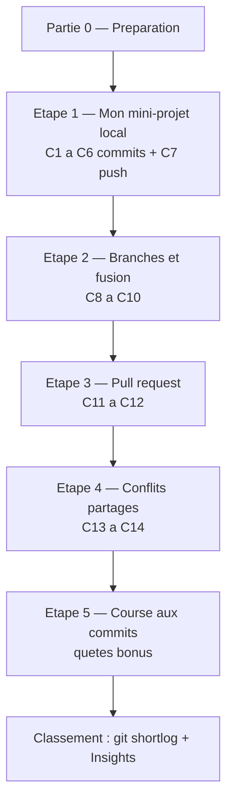

<a id="top"></a>

# TP1 — Git et GitHub · Partie 1 (Concours collaboratif)

> **Travail pratique noté** · Pondération **5 %** · Remise : **dimanche 21 juin 2026** (fin de journée, en ligne) · **Dépôt de classe partagé**
>
> **Deux parties :** **Partie 1 (ce document)** · [Partie 2 — Concours Git avancé](tp-01-git-github-partie-2.md)
>
> **Modules couverts :** [01 — Introduction au DevOps et Git](../../../01-introduction-devops-et-git/README.md), [02 — Git avancé et GitHub](../../../02-git-avance-et-github/README.md)

---

## À lire en premier : autonomie et évaluation

> **Le professeur N'INTERVIENT PAS pendant l'activité.** Personne n'a besoin d'approuver ni de fusionner vos pull requests à votre place : vous gérez **tout vous-mêmes** — créer une branche, vous faire relire **par un camarade**, fusionner, et résoudre les conflits.
>
> **C'est VOTRE responsabilité d'aller jusqu'au bout.** Si vous cassez quelque chose (push rejeté, conflit, mauvaise fusion), c'est **normal et formateur** : lisez le message, faites `git pull`, résolvez, recommencez. Le professeur **voit tout** dans l'historique, mais ne répare **rien** à votre place.

> **Comment le professeur vous évalue :** pas en direct, mais sur **l'historique du dépôt à la date de remise**. Vous n'avez **rien d'autre à remettre** que vos commits. Il s'appuie sur :
>
> - `git shortlog -sn --all` → le **classement des commits** (le champion en haut) ;
> - `git log --author="Prénom Nom"` → **vos** commits (C1 → C14) ;
> - les onglets GitHub **Insights > Contributors** et **Pull requests** ;
> - votre dossier `eleves/prenom-nom/`, le fichier partagé `TRESOR.md` (conflits résolus) et `QUETES.md`.
>
> Le détail des points est dans le **Barème de correction** plus bas.

---

## C'est un concours !

Toute la classe travaille sur **un seul dépôt partagé** : `tp1`. Au-delà de la note, c'est une **compétition amicale** :

- **Le champion** est la personne avec le **plus de commits réels et utiles**.
- Le classement est public et visible par tous (onglet **Insights > Contributors** sur GitHub).
- **Objectif chiffré :** atteindre **au moins 15 commits** avec des messages clairs.

> **Règle anti-triche :** les commits **vides ou artificiels** (juste pour gonfler le score) **ne comptent pas** et seront retirés. On veut des commits **petits, fréquents et significatifs**.



---

## Objectifs

À la fin de cette partie, vous serez capable de :

- Cloner un dépôt partagé et y contribuer en parallèle.
- Créer des commits **propres et atomiques** avec des messages clairs.
- Travailler avec des **branches** et les **fusionner**.
- Ouvrir et fusionner une **pull request** revue par un pair.
- **Provoquer et résoudre un conflit** de fusion manuellement.

---

## Étape 0 — Préparation (une seule fois)

1. **Acceptez l'invitation** de collaborateur (courriel ou cloche de notifications GitHub).
2. **Clonez** le dépôt (URL donnée en classe) :

```bash
git clone https://github.com/haythem-rehouma/tp1.git
cd tp1
```

3. **Configurez votre identité** (elle apparaît dans le classement) :

```bash
git config --global user.name "Prénom Nom"
git config --global user.email "votre.courriel@exemple.com"
```

4. **Créez votre dossier personnel** (remplacez `prenom-nom`, sans accent ni espace).

Au départ, le dépôt `tp1` ressemble à ceci :

```text
tp1/                      <- la racine du depot (NE PAS y toucher pour l'instant)
├── README.md
├── TRESOR.md
├── QUETES.md
├── .gitignore
├── eleves/               <- le dossier de TOUS les etudiants
└── indices/
```

**Exemple concret :** si votre identifiant est `haythem-rehouma`, vous tapez :

```bash
mkdir -p eleves/haythem-rehouma
cd eleves/haythem-rehouma
```

Vous êtes maintenant **dans votre dossier**, encore **vide** :

```text
tp1/
└── eleves/
    └── haythem-rehouma/   <- VOUS ETES ICI (vide pour l'instant)
```

> **Réflexe d'or, à chaque fois :** `git status` avant `git add`, et `git pull` avant `git push`.

---

## Étape 1 — Mon mini-projet local (6 commits + 1 push : C1 → C7)

Vous construisez un petit « carnet de bord » **uniquement dans votre dossier** `eleves/prenom-nom/` (où vous êtes déjà après l'Étape 0). Faites **un commit par étape** (chaque commit compte au classement !).

> **Important — il n'y a pas de contradiction :** les fichiers que vous créez ici (`carnet.md`, `.gitignore`, `profil.md`, `taches.md`) sont **les vôtres, dans VOTRE dossier**. Ils sont **distincts** des fichiers `README.md`, `.gitignore`, `TRESOR.md` et `QUETES.md` qui existent déjà **à la racine** du dépôt `tp1`. À cette étape, on **ne touche jamais** à ceux de la racine.
>
> Note : **C7 est une publication (`git push`), pas un nouveau commit** — d'où « 6 commits + 1 push ».
>
> Dans tous les schémas ci-dessous, on prend l'exemple `haythem-rehouma`. **Remplacez-le par votre identifiant.**

### C1 — Le carnet de bord

Créez un fichier nommé `carnet.md` **dans votre dossier** `eleves/haythem-rehouma/` et écrivez dedans :

```markdown
# Carnet de bord — Prénom Nom

Projet du TP1 : Git et GitHub.
```

Puis, dans le terminal :

```bash
git add carnet.md
git commit -m "C1 - Ajouter mon carnet de bord"
```

Après C1, votre dossier contient :

```text
eleves/haythem-rehouma/
└── carnet.md            <- NOUVEAU (cree en C1)
```

### C2 — Le fichier .gitignore

Git autorise un `.gitignore` **par dossier**. Créez le vôtre dans `eleves/haythem-rehouma/.gitignore` (il est propre à votre dossier, **différent** de celui de la racine) et écrivez dedans :

```text
.env
*.log
.DS_Store
```

```bash
git add .gitignore
git commit -m "C2 - Ajouter un .gitignore dans mon dossier"
```

Après C2 :

```text
eleves/haythem-rehouma/
├── carnet.md
└── .gitignore           <- NOUVEAU (cree en C2)
```

### C3 — Ma fiche profil

Créez `profil.md` dans le même dossier :

```markdown
# Profil

- Programme : ...
- Objectif du cours : ...
- Emoji du jour : 🚀
```

```bash
git add profil.md
git commit -m "C3 - Ajouter ma fiche profil"
```

Après C3 :

```text
eleves/haythem-rehouma/
├── carnet.md
├── .gitignore
└── profil.md            <- NOUVEAU (cree en C3)
```

### C4 — Une liste de tâches

Créez `taches.md` dans le même dossier :

```markdown
# Mes tâches DevOps

- [ ] Apprendre les branches
- [ ] Réussir une pull request
- [ ] Résoudre un conflit
```

```bash
git add taches.md
git commit -m "C4 - Ajouter ma liste de tâches"
```

Après C4 :

```text
eleves/haythem-rehouma/
├── carnet.md
├── .gitignore
├── profil.md
└── taches.md            <- NOUVEAU (cree en C4)
```

### C5 — Compléter le carnet

Ici, **on ne crée pas** de fichier : on **modifie** un fichier existant. Ouvrez **votre** `carnet.md` et ajoutez cette section à la fin (les fichiers cités existent déjà depuis C3 et C4) :

```markdown

## Contenu

- `profil.md` : ma fiche
- `taches.md` : mes objectifs
```

```bash
git add carnet.md
git commit -m "C5 - Documenter le contenu dans mon carnet"
```

Après C5 (aucun nouveau fichier, `carnet.md` est juste enrichi) :

```text
eleves/haythem-rehouma/
├── carnet.md            <- MODIFIE (section "Contenu" ajoutee)
├── .gitignore
├── profil.md
└── taches.md
```

### C6 — Cocher une tâche

Toujours sans créer de fichier : ouvrez `taches.md` et **cochez une case** (transformez `- [ ]` en `- [x]`) :

```bash
git add taches.md
git commit -m "C6 - Cocher la première tâche réalisée"
```

Après C6 :

```text
eleves/haythem-rehouma/
├── carnet.md
├── .gitignore
├── profil.md
└── taches.md            <- MODIFIE (une case cochee)
```

### C7 — Publier sur GitHub

Vous **quittez votre dossier** pour revenir à la racine du dépôt, puis vous **envoyez** tout votre travail sur GitHub :

```bash
cd ../..          # remonter de eleves/haythem-rehouma vers la racine tp1
git status
git pull --rebase
git push
```

Schéma de ce qui se passe :

```text
Votre PC (local)                         GitHub (en ligne)
eleves/haythem-rehouma/    --- push -->   tp1/eleves/haythem-rehouma/
  carnet.md, .gitignore,                    (vos 6 commits apparaissent
  profil.md, taches.md                       pour toute la classe)
```

> Vérifiez sur GitHub que votre dossier `eleves/haythem-rehouma/` apparaît bien.

**Vérification :** `git log --oneline` montre C1 à C6, et votre dossier est visible sur GitHub.

---

## Étape 2 — Branches et fusion (3 commits : C8 → C10)

Une **branche** est comme une copie de travail séparée. On y bricole sans risque, puis on **fusionne** dans `main`.

```text
main ────●────●────●            <- la branche principale
                    \
                     ●          <- votre branche feature/... (vos commits C8, C9)
```

### C8 — Créer une branche et y travailler

```bash
git switch -c feature/prenom-nom-bonus
```

Créez `bonus.md` dans votre dossier, puis écrivez dedans :

```markdown
# Section bonus

Ajoutée depuis une branche dédiée.
```

```bash
git add eleves/prenom-nom/bonus.md
git commit -m "C8 - Ajouter une section bonus sur une branche"
```

Après C8, votre dossier (sur la branche) :

```text
eleves/haythem-rehouma/
├── carnet.md
├── .gitignore
├── profil.md
├── taches.md
└── bonus.md             <- NOUVEAU (sur la branche feature/...)
```

### C9 — Un second commit sur la branche

Ajoutez une ligne à `bonus.md`, puis :

```bash
git add eleves/prenom-nom/bonus.md
git commit -m "C9 - Compléter la section bonus"
```

### C10 — Fusionner dans `main`

```bash
git switch main
git pull
git merge feature/prenom-nom-bonus
git push
git branch -d feature/prenom-nom-bonus
```

**Vérification :** la branche est fusionnée dans `main` et supprimée localement.

---

## Étape 3 — Pull request (2 commits : C11 → C12)

### C11 — Préparer une branche d'indice

```bash
git switch -c indice/prenom-nom
```

Attention : cette fois le fichier va dans le dossier **`indices/`** à la racine (pas dans votre dossier `eleves/`). Créez `indices/prenom-nom.md` :

```markdown
# Indice de Prénom Nom

> « Le trésor se cache là où les commits sont les plus nombreux. »
```

```bash
git add indices/prenom-nom.md
git commit -m "C11 - Ajouter mon indice"
git push -u origin indice/prenom-nom
```

Après C11 :

```text
tp1/
├── eleves/
│   └── haythem-rehouma/        <- votre travail des etapes 1 et 2
└── indices/
    └── haythem-rehouma.md      <- NOUVEAU (votre indice, sur la branche indice/...)
```

### C12 — Ouvrir et fusionner la pull request

Sur GitHub :
1. Ouvrez une **Pull Request** de `indice/prenom-nom` vers `main`.
2. Rédigez un **titre** et une **description**.
3. Demandez à **un camarade** de la relire (« Reviewers ») et de l'approuver.
4. **Fusionnez** la PR (« Merge pull request »), puis supprimez la branche distante.

Variante en ligne de commande (optionnel) :

```bash
gh pr create --base main --head indice/prenom-nom --title "Indice de Prénom Nom" --body "Mon indice vers le trésor."
```

**Vérification :** votre PR est **ouverte, relue et fusionnée**.

---

## Étape 4 — Conflits partagés (2 commits : C13 → C14)

> Ici tout le monde modifie **la même ligne** du **même fichier** `TRESOR.md` : les conflits sont **garantis et voulus**.

Cette fois, on touche un fichier **partagé par toute la classe**, à la racine :

```text
tp1/
├── TRESOR.md            <- TOUT LE MONDE modifie la meme ligne ici (zone de conflits)
├── eleves/
└── indices/
```

### C13 — Tenter de publier votre part du code

```bash
git switch main
git pull
```

Modifiez la ligne `CODE = "..."` dans `TRESOR.md` avec votre prénom et un chiffre :

```markdown
CODE = "Prénom-7"
```

```bash
git add TRESOR.md
git commit -m "C13 - Inscrire ma part du code secret"
git push
```

 > Ici essayez de communiquer avec un.e collègue pourqu'elle/il fasse un push avant vous pour déclancher le conflit. 

## Option2 (si ce n'est pas possible de communiquer avec un.e collègue)
- Provoquez un conflit inter-branche 

## Proposition de Gilbert pour l'option 2 -  C13 — Conflit simulé avec branches locales

<details> 


<summary> Idée : Créer deux branches locales </summary> 

  Créer deux branches locales qui modifient **la même ligne** de `TRESOR.md`,
  puis fusionner pour provoquer un vrai conflit résolu manuellement (C13 + C14).

  ---

  ## Étapes

  ### 1 — Branche « adversaire » (simule un camarade)

  ```bash
  git switch main
  git switch -c conflit/adversaire
  # Modifier TRESOR.md : CODE = "Haythem-7 + Hassen-7 + Adversaire-9"
  git add TRESOR.md
  git commit -m "Simule un camarade qui pousse avant moi"

  2 — Branche « gilbert » (ma vraie contribution)

  git switch main
  git switch -c conflit/gilbert
  # Modifier TRESOR.md : CODE = "Haythem-7 + Hassen-7 + Gilbert-7"
  git add TRESOR.md
  git commit -m "C13 - Inscrire ma part du code secret"

  3 — Fusionner → conflit garanti

  git switch main
  git merge conflit/adversaire   # passe (premier arrivé)
  git merge conflit/gilbert      # ← CONFLIT sur la ligne CODE

  4 — Résoudre (C14)

  Ouvrir TRESOR.md, garder les deux contributions :

  CODE = "Haythem-7 + Hassen-7 + Adversaire-9 + Gilbert-7"

  git add TRESOR.md
  git commit -m "C14 - Résoudre le conflit du code secret"
  git branch -d conflit/adversaire conflit/gilbert

  ---
  Résultat dans git log

  ┌────────┬────────────────────────────────────┐
  │ Commit │              Message               │
  ├────────┼────────────────────────────────────┤
  │ C14    │ Résoudre le conflit du code secret │
  ├────────┼────────────────────────────────────┤
  │ Merge  │ Merge branch 'conflit/adversaire'  │
  ├────────┼────────────────────────────────────┤
  │ C13    │ Inscrire ma part du code secret    │
  └────────┴────────────────────────────────────┘

  ---
  Avantage
  
  - Conflit 100 % local — aucun push avant résolution
  - Historique propre avec les deux commits exigés (C13 + C14)
  - Démontre la maîtrise des branches et de la résolution de conflits

 </details>


### C14 — Résoudre le conflit

Si quelqu'un a poussé avant vous, le `push` est **rejeté** (`rejected — fetch first`). C'est normal :

```bash
git pull
```

Git signale un **conflit** dans `TRESOR.md` (marqueurs `<<<<<<<`, `=======`, `>>>>>>>`). Ouvrez le fichier, **gardez les deux contributions** (par exemple les deux prénoms sur la même ligne), puis :

```bash
git add TRESOR.md
git commit -m "C14 - Résoudre le conflit du code secret"
git push
```

> Il est **normal** de répéter `git pull` → résoudre → `git push` plusieurs fois si plusieurs personnes poussent en même temps.

**Vérification :** vous avez résolu **au moins un conflit** et votre contribution est dans `TRESOR.md`.

---

## Étape 5 — Course aux commits (le concours, illimité)

Le fichier `QUETES.md` contient des **micro-quêtes optionnelles**. Réclamez-en une (inscrivez votre prénom), réalisez-la, committez. **Chaque quête = un ou plusieurs commits** qui font grimper votre score.

> Plus vous réalisez de quêtes utiles, plus vous montez au classement. Restez **honnête** : commits réels et significatifs uniquement.

> **Pour aller plus loin :** une fois cette partie terminée, enchaînez avec la [Partie 2 — Concours Git avancé](tp-01-git-github-partie-2.md) : rebase, squash, stash, cherry-pick, tags et reflog.

---

## Tableau du concours (classement)

| Récompense | Comment elle est attribuée |
|---|---|
| 🥇 **Champion des commits** | Le plus grand nombre de commits réels (`git shortlog -sn --all`) |
| 🧩 **Roi des quêtes** | Le plus de quêtes de `QUETES.md` réalisées |
| 🤝 **Meilleur relecteur** | Le plus de pull requests relues/approuvées |

> Le classement officiel se lit en un clic : onglet GitHub **Insights > Contributors**.

---

## Récapitulatif des commits attendus

| Commit | Description | Étape |
|---|---|---|
| C1 | Ajouter mon carnet de bord | 1 |
| C2 | Ajouter un `.gitignore` (dans mon dossier) | 1 |
| C3 | Ajouter la fiche profil | 1 |
| C4 | Ajouter la liste de tâches | 1 |
| C5 | Documenter le contenu du carnet | 1 |
| C6 | Cocher une tâche | 1 |
| C7 | Publier sur GitHub (`push`, pas un commit) | 1 |
| C8 | Section bonus (branche) | 2 |
| C9 | Compléter la section bonus | 2 |
| C10 | Fusionner la branche | 2 |
| C11 | Ajouter mon indice | 3 |
| C12 | Ouvrir et fusionner la PR | 3 |
| C13 | Inscrire ma part du code | 4 |
| C14 | Résoudre le conflit | 4 |
| Bonus | Quêtes de `QUETES.md` | 5 |

---

## Barème de correction (sur 5 %)

| Critère | Pondération |
|---|---|
| Étape 1 réalisée (mini-projet, C1 → C7) + `.gitignore` correct | 1,5 % |
| Qualité et clarté des messages de commit | 1 % |
| Branche créée et fusionnée (C8 → C10) | 1 % |
| Pull request ouverte et fusionnée (C11 → C12) | 1 % |
| Conflit provoqué et **résolu** (C13 → C14) | 0,5 % |

> **Bonus concours :** point(s) bonus à la discrétion de l'enseignant pour le champion des commits et le roi des quêtes.

---

## Conseils

> _Faites `git status` avant chaque `git add`, et `git pull` avant chaque `git push`._
>
> _En cas de `rejected` ou `conflict` : ne supprimez rien, ne paniquez pas. Lisez le message, faites `git pull`, résolvez, puis `git push`._

---

## Annexe enseignant (mise en place du dépôt en 2 minutes)

> Créez le dépôt `tp1`, ajoutez les étudiants comme collaborateurs (**Settings > Collaborators**), puis collez les fichiers ci-dessous à la racine.

### Arborescence de départ

```text
tp1/
├── README.md
├── TRESOR.md
├── QUETES.md
├── .gitignore
├── eleves/
│   └── .gitkeep
└── indices/
    └── .gitkeep
```

### `README.md`

```markdown
# Dépôt de classe — TP1 (Git et GitHub)

Bienvenue ! Suivez l'énoncé du TP1 étape par étape.

- `eleves/prenom-nom/` : votre dossier de travail personnel.
- `indices/` : vos indices via pull request.
- `TRESOR.md` : le coffre partagé (zone de conflits).
- `QUETES.md` : les micro-quêtes bonus.
```

### `TRESOR.md`

```markdown
# Le coffre partagé

Toute la classe modifie la **même ligne** ci-dessous. Les conflits sont normaux : résolvez-les en gardant toutes les contributions.

## Le code secret du coffre

CODE = "_____"
```

### `QUETES.md`

```markdown
# Coffre de quêtes (bonus)

Réclamez une quête en inscrivant votre prénom dans « Pris par », puis réalisez-la.

| # | Quête | Pris par |
|---|---|---|
| 1 | Corriger une coquille dans le README | |
| 2 | Ajouter un fait amusant dans `faits.md` | |
| 3 | Dessiner un art ASCII dans `art.md` | |
| 4 | Ajouter une ligne au journal `journal.md` | |
| 5 | Proposer une nouvelle quête à cette liste | |
```

### `.gitignore`

```text
.env
.DS_Store
node_modules/
*.log
```

### Désigner le champion — sans effort

- **Classement (qui a le plus de commits) :**

```bash
git pull
git shortlog -sn --all
```

- **Historique d'un étudiant précis :**

```bash
git log --oneline --author="Prénom Nom"
```

- **Vue graphique :** onglet GitHub **Insights > Contributors**, ou en local :

```bash
git log --oneline --graph --all
```

> `git shortlog -sn --all` affiche chaque auteur avec son nombre de commits, trié du plus grand au plus petit : le **champion est en haut**.

---

<p align="center">
  <em>Tous droits réservés. Toute reproduction, diffusion, utilisation ou adaptation de ce cours, en tout ou en partie, est strictement interdite sans l'autorisation écrite préalable de Dr. Haythem REHOUMA.</em>
</p>

<p align="center">
  <strong>Cours créé par Dr. Haythem REHOUMA — Développement et déploiement de solutions de données</strong>
</p>
