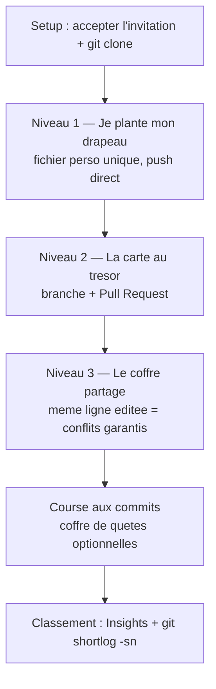

<a id="top"></a>

# TP1 — Chasse au trésor Git (collaborative)

> **Travail pratique noté** · Pondération **5 %** · Remise : **dimanche 21 juin 2026** (fin de journée, en ligne) · **Activité collaborative en classe** (un seul dépôt partagé)
>
> **Modules couverts :** [01 — Introduction au DevOps et Git](../../01-introduction-devops-et-git/README.md), [02 — Git avancé et GitHub](../../02-git-avance-et-github/README.md)

---

## L'histoire

Bienvenue dans la **Chasse au trésor Git** ! Toute la classe travaille sur **un seul et même dépôt** : `tp1`. Vous êtes tous **collaborateurs** (capitaines à bord du même navire).

L'objectif n'est pas le code, mais la **maîtrise du flux de travail Git/GitHub à plusieurs**. Vous allez franchir **3 niveaux progressifs** : au début, tout le monde réussit facilement ; à la fin, les conflits sont garantis et il faudra les résoudre comme des pros.

Et parce qu'il y a un trésor, il y a un **champion** : la personne qui aura fait le **plus de commits utiles** sera couronnée à la fin.



---

## Objectifs

À la fin de ce TP, vous serez capable de :

- Cloner un dépôt partagé et y contribuer en parallèle avec d'autres.
- Créer des commits propres et atomiques avec des messages clairs.
- Travailler avec des branches et ouvrir une **pull request** revue par un pair.
- **Provoquer et résoudre un conflit de fusion** manuellement, sans paniquer.
- Adopter les bons réflexes d'équipe : `git status` avant `git add`, `git pull` avant `git push`.

---

## Setup commun (à faire une seule fois)

1. **Acceptez l'invitation** de collaborateur reçue par courriel (ou via la cloche de notifications sur GitHub).
2. **Clonez** le dépôt partagé (remplacez l'URL par celle donnée en classe) :

```bash
git clone https://github.com/haythem-rehouma/tp1.git
cd tp1
```

3. **Configurez votre identité** (si ce n'est pas déjà fait), car c'est elle qui apparaîtra dans le classement :

```bash
git config --global user.name "Prénom Nom"
git config --global user.email "votre.courriel@exemple.com"
```

> **Réflexe d'or :** avant chaque `git push`, faites toujours `git pull`. Et avant chaque `git add`, faites `git status`. La majorité des problèmes Git viennent d'un oubli de ces deux gestes.

---

## Niveau 1 — « Je plante mon drapeau » (tout le monde réussit)

> But : réussir votre **premier commit et premier push** sur le dépôt partagé. Comme chacun crée **son propre fichier**, il n'y a **aucun conflit** : tout le monde réussit.

1. Mettez-vous à jour, puis créez **votre** fichier dans le dossier `participants/` (utilisez votre prénom-nom, sans accent ni espace dans le nom de fichier) :

```bash
git pull
```

Créez le fichier `participants/prenom-nom.md` avec par exemple :

```markdown
# Prénom Nom

- Programme : ...
- Une chose que j'aime : ...
- Mon emoji du jour : 🚀
```

2. Validez et publiez :

```bash
git status
git add participants/prenom-nom.md
git commit -m "Ajouter le drapeau de Prénom Nom"
git pull --rebase
git push
```

3. Vérifiez sur GitHub que votre fichier apparaît bien dans `participants/`.

**Réussi quand :** votre fichier est visible sur `main` et votre commit apparaît dans l'historique.

---

## Niveau 2 — « La carte au trésor » (branche + Pull Request)

> But : apprendre le flux professionnel **branche → push → pull request → revue → fusion**.

1. Créez **votre branche** d'indice :

```bash
git switch -c indice/prenom-nom
```

2. Ajoutez **votre indice** vers le trésor dans un fichier `indices/prenom-nom.md` (inventez une énigme, une coordonnée, un mot de passe... soyez créatif) :

```markdown
# Indice de Prénom Nom

> « Le trésor se cache là où les commits sont les plus nombreux. »
```

3. Validez et poussez **la branche** :

```bash
git add indices/prenom-nom.md
git commit -m "Ajouter l'indice de Prénom Nom"
git push -u origin indice/prenom-nom
```

4. Sur GitHub, ouvrez une **Pull Request** de votre branche vers `main` :
   - Donnez un **titre** clair et une **description** (que contient votre indice ?).
   - Demandez à **un camarade** de la relire (« Reviewers ») et de laisser un commentaire ou une approbation.
   - Une fois approuvée, **fusionnez** la PR (« Merge pull request »), puis supprimez la branche distante.

Variante en ligne de commande (optionnel, avec GitHub CLI) :

```bash
gh pr create --base main --head indice/prenom-nom --title "Indice de Prénom Nom" --body "Mon indice vers le trésor."
```

**Réussi quand :** votre PR est **ouverte, relue et fusionnée**, et votre indice est sur `main`.

---

## Niveau 3 — « Le coffre partagé » (conflits garantis !)

> But : **provoquer un vrai conflit** parce que tout le monde modifie **la même ligne** du même fichier, puis le **résoudre**.

Le dépôt contient un fichier `TRESOR.md` avec une **ligne unique partagée** par toute la classe, par exemple :

```markdown
## Le code secret du coffre

CODE = "_____"
```

1. Mettez-vous à jour, puis modifiez **cette même ligne** pour y inscrire **votre** contribution (votre prénom et un chiffre de votre choix) :

```bash
git pull
```

Modifiez la ligne `CODE = "..."` dans `TRESOR.md`, par exemple :

```markdown
CODE = "Prénom-7"
```

2. Essayez de publier directement sur `main` :

```bash
git add TRESOR.md
git commit -m "Inscrire ma part du code secret"
git push
```

3. **Surprise attendue :** si quelqu'un a poussé avant vous, votre `push` est **rejeté** (`rejected — fetch first`). C'est normal, c'est le but du niveau ! Récupérez les changements :

```bash
git pull
```

4. Git signale un **conflit** dans `TRESOR.md`. Ouvrez le fichier : vous verrez les marqueurs `<<<<<<<`, `=======`, `>>>>>>>`. **Résolvez-le à la main** en gardant **les deux contributions** (par exemple en mettant les deux prénoms sur la même ligne), puis :

```bash
git add TRESOR.md
git commit -m "Résoudre le conflit du code secret"
git push
```

> Si plusieurs personnes poussent en même temps, il est **normal** de répéter `git pull` → résoudre → `git push` plusieurs fois. C'est exactement ce qui se passe dans une vraie équipe.

**Réussi quand :** vous avez résolu **au moins un conflit** et votre contribution figure dans `TRESOR.md` sur `main`.

---

## Course aux commits — « Le coffre de quêtes »

Le dépôt contient un fichier `QUETES.md` rempli de **micro-quêtes optionnelles** (corriger une coquille, ajouter un fait amusant, dessiner un petit art ASCII, ajouter une ligne au journal de bord...).

- **Réclamez** une quête en cochant votre nom à côté dans `QUETES.md`, puis réalisez-la.
- Chaque quête terminée = **un (ou plusieurs) commit(s)** clairs et atomiques.
- Comme `QUETES.md` est partagé, attendez-vous à de **mini-conflits** : remettez en pratique le réflexe `pull → résoudre → push`.

> **Le champion** est la personne avec le plus de **commits réels et utiles**. Les commits vides ou artificiels (uniquement pour gonfler le score) ne comptent pas et seront ignorés. Privilégiez des commits **petits, fréquents et significatifs**.

---

## Livrables et critères de réussite

| Niveau | Réussi quand... |
|---|---|
| **Setup** | Vous avez accepté l'invitation et cloné le dépôt |
| **Niveau 1** | Votre fichier `participants/prenom-nom.md` est sur `main` |
| **Niveau 2** | Votre PR d'indice est ouverte, relue et **fusionnée** |
| **Niveau 3** | Vous avez **résolu au moins un conflit** dans `TRESOR.md` |
| **Bonus** | Au moins une quête de `QUETES.md` réalisée |

> Aucun rapport séparé à remettre : **votre historique de commits sur le dépôt partagé EST votre livrable.** L'enseignant le consulte directement sur GitHub.

---

## Barème de correction (sur 5 %)

| Critère | Pondération |
|---|---|
| Setup réussi + premier commit/push (Niveau 1) | 1 % |
| Qualité et clarté des messages de commit | 1 % |
| Branche + pull request ouverte et fusionnée (Niveau 2) | 1,5 % |
| Conflit provoqué et **résolu** correctement (Niveau 3) | 1 % |
| Participation à la course aux commits / quêtes | 0,5 % |

---

## Conseils

> _Faites `git status` avant chaque `git add`, et `git pull` avant chaque `git push`._
>
> _En cas de message `rejected` ou `conflict` : ne supprimez rien, ne paniquez pas. Lisez le message, faites `git pull`, résolvez, puis `git push`. C'est le cœur du métier._

---

## Annexe enseignant (mise en place du dépôt en 2 minutes)

> Cette section est destinée à l'enseignant. Créez le dépôt `tp1`, ajoutez les étudiants comme collaborateurs (onglet **Settings > Collaborators**), puis collez les fichiers ci-dessous à la racine.

### Arborescence de départ

```text
tp1/
├── README.md
├── TRESOR.md
├── QUETES.md
├── .gitignore
├── participants/
│   └── .gitkeep
└── indices/
    └── .gitkeep
```

### `README.md`

```markdown
# Chasse au trésor Git — Dépôt de classe (TP1)

Bienvenue à bord ! Suivez les consignes du TP1 et franchissez les 3 niveaux.

- `participants/` : votre fiche personnelle (Niveau 1).
- `indices/` : vos indices via pull request (Niveau 2).
- `TRESOR.md` : le coffre partagé, source des conflits (Niveau 3).
- `QUETES.md` : les micro-quêtes pour la course aux commits.
```

### `TRESOR.md`

```markdown
# Le coffre partagé

Toute la classe modifie la **même ligne** ci-dessous. Les conflits sont normaux : résolvez-les en gardant toutes les contributions.

## Le code secret du coffre

CODE = "_____"
```

### `QUETES.md`

```markdown
# Coffre de quêtes (optionnel)

Réclamez une quête en inscrivant votre prénom dans la colonne « Pris par », puis réalisez-la.

| # | Quête | Pris par |
|---|---|---|
| 1 | Corriger une coquille dans le README | |
| 2 | Ajouter un fait amusant dans `faits.md` | |
| 3 | Dessiner un petit art ASCII dans `art.md` | |
| 4 | Ajouter une ligne au journal de bord `journal.md` | |
| 5 | Ajouter un emoji à votre fiche participant | |
| 6 | Proposer une nouvelle quête à cette liste | |
```

### `.gitignore`

```text
.env
.DS_Store
node_modules/
*.log
```

### Voir le champion (qui a fait le plus de commits) — zéro maintenance

- **Sur GitHub :** onglet **Insights > Contributors** (le classement s'affiche en un clic).
- **En local :**

```bash
git pull
git shortlog -sn --all
git log --oneline --author="Prénom Nom"
```

> `git shortlog -sn --all` affiche directement chaque auteur avec son nombre de commits, trié du plus grand au plus petit.

---

<p align="center">
  <em>Tous droits réservés. Toute reproduction, diffusion, utilisation ou adaptation de ce cours, en tout ou en partie, est strictement interdite sans l'autorisation écrite préalable de Dr. Haythem REHOUMA.</em>
</p>

<p align="center">
  <strong>Cours créé par Dr. Haythem REHOUMA — Développement et déploiement de solutions de données</strong>
</p>
